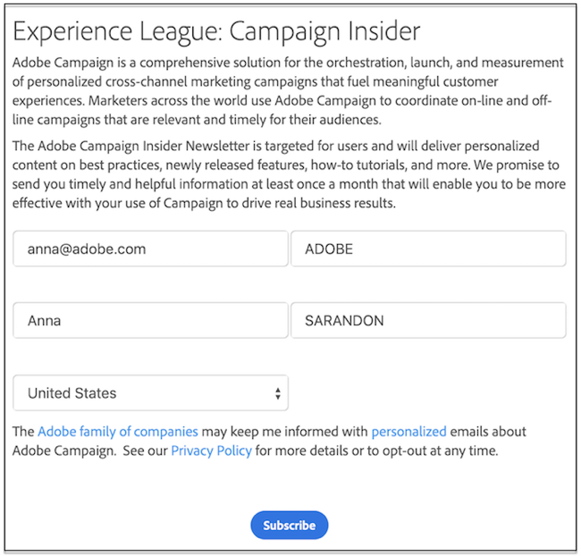

# Introdução a aplicativos web e formulários web{#gs-ac-web}

O Adobe Campaign integra um módulo gráfico para definir e publicar **formulários Web** para criar páginas com campos de entrada e seleção e que podem incluir dados do banco de dados. Isso permite a criação e publicação de páginas da Web onde os usuários podem visualizar ou inserir informações.

Saiba como criar e publicar formulários Web na [documentação do Campaign Classic v7](https://experienceleague.adobe.com/docs/campaign-classic/using/designing-content/web-forms/about-web-forms.html?lang=pt-BR#designing-content){target="_blank"}

O Adobe Campaign também permite criar e publicar **aplicativos web** dinâmicos e interativos com dados do banco de dados e conteúdo adaptado aos direitos do usuário conectado.

É possível criar páginas, como um formulário de edição em uma extranet ou formulários de notificação, incluindo dados do banco de dados com tabelas, gráficos, formulários de entrada, etc. Essa funcionalidade permite criar e publicar páginas da Web em que os usuários podem pesquisar ou inserir informações.

Saiba como criar e publicar aplicativos web na [documentação do Campaign Classic v7](https://experienceleague.adobe.com/docs/campaign-classic/using/designing-content/web-applications/about-web-applications.html?lang=pt-BR#designing-content){target="_blank"}
