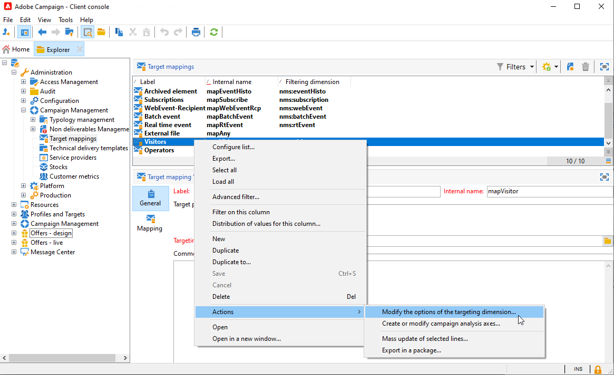

# Trabalhar com ambientes{#work-with-environments}

## Ambientes Live e Design{#live-design-environments}

O Interaction opera com dois tipos de ambientes de oferta:

* Os ambientes de oferta **[!UICONTROL Design]** que incluem ofertas que estão sendo editadas e podem ser alteradas. Essas ofertas não foram feitas pelo ciclo de aprovação e não são entregues aos contatos.
* Os ambientes de oferta **[!UICONTROL Live]** que incluem ofertas aprovadas conforme são apresentadas aos contatos. As ofertas neste ambiente são somente leitura.

Cada ambiente **[!UICONTROL Design]** está vinculado a um ambiente **[!UICONTROL Live]**. Quando uma oferta é concluída, suas regras de conteúdo e elegibilidade estão sujeitas a um ciclo de aprovação. Depois que este ciclo for concluído, a oferta relacionada será implantada automaticamente no ambiente **[!UICONTROL Live]**. A partir deste momento, ele estará disponível para entrega.

Por padrão, o Campaign vem com um ambiente **[!UICONTROL Design]** e um ambiente **[!UICONTROL Live]** vinculado a ele. Ambos os ambientes são pré-configurados para ter como alvo a [tabela interna de destinatários](../dev/datamodel.md#ootb-profiles).

>[!NOTE]
>
>Para direcionar a tabela de recipients, é necessário usar o assistente de target mapping para criar os ambientes. [Saiba mais](#creating-an-offer-environment).

Os gerentes de delivery só podem visualizar o ambiente **[!UICONTROL Live]** e aproveitar as ofertas para entregá-los. Os gerentes de oferta podem visualizar e usar o ambiente **[!UICONTROL Design]** e visualizar o ambiente **[!UICONTROL Live]**. [Saiba mais](interaction-operators.md)

## Criar um ambiente para interações anônimas{#create-an-offer-environment}

Por padrão, o Campaign vem com um ambiente integrado para direcionar a tabela de recipients (ofertas identificadas). Para direcionar outra tabela, como perfis anônimos que visitam o site para interações de entrada, é necessário atualizar a configuração.

Siga as etapas abaixo:

1. Navegue até **[!UICONTROL Administration]** > **[!UICONTROL Campaign management]** > **[!UICONTROL Target mappings]**, clique com o botão direito no target mapping que deseja usar e selecione **[!UICONTROL Actions]** > **[!UICONTROL Modify the options of the targeting dimension]**.

   

1. Clique em **[!UICONTROL Next]**, selecione a opção **[!UICONTROL Generate a storage schema for propositions]** e clique em **[!UICONTROL Save]**.

   

   >[!NOTE]
   >
   >Se a opção já estiver marcada, desmarque-a e, em seguida, marque-a novamente.

1. O Adobe Campaign cria dois ambientes - **[!UICONTROL Design]** e **[!UICONTROL Live]** - com informações de direcionamento do target mapping habilitado anteriormente. O ambiente é pré-configurado com as informações de definição de metas.

Se ativado o mapeamento **[!UICONTROL Visitor]**, a caixa **[!UICONTROL Environment dedicated to incoming anonymous interactions]** é automaticamente marcada na guia **[!UICONTROL General]** do ambiente.

Essa opção permite ativar funções específicas de interação anônima, especialmente quando configurar espaços de oferta de ambiente. Também é possível configurar opções que permitem alternar de um ambiente &quot;identificado&quot; para um ambiente &quot;anônimo&quot;.

Por exemplo, é possível vincular um espaço de oferta de ambiente de destinatário (contato identificado) com um espaço de oferta que corresponda a um ambiente de visitante (contato não identificado). Dessa forma, as diferentes ofertas serão disponibilizadas para o contato, dependendo se ele for identificado ou não. Para obter mais informações, consulte [Criação de espaços de oferta](interaction-offer-spaces.md).

>[!NOTE]
>
>Para obter mais informações sobre interações anônimas em um canal de entrada, consulte [Interações anônimas](anonymous-interactions.md).
