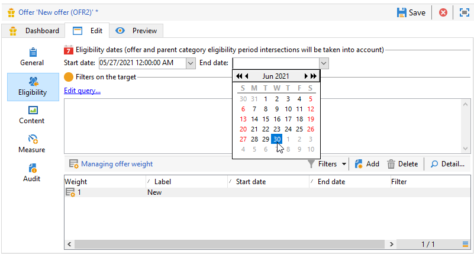

# Criar um catálogo de oferta

Como um **Gerente de ofertas**, você é responsável pela criação do catálogo de ofertas.

Um catálogo de ofertas está associado a um único ambiente pré-existente. As ofertas neste catálogo só podem ser associadas aos espaços especificados neste mesmo ambiente.

Antes de criar suas ofertas, você deve primeiro especificar um [ambiente](interaction-env.md) que contenha todas as características (qualificação, restrições no destino, regras de apresentação) de um conjunto de ofertas, classificadas em categorias, bem como a lista de seus espaços.

## Criar categorias de ofertas{#creating-offer-categories}

As ofertas são organizadas em categorias/subcategorias. As categorias são criadas no ambiente **[!UICONTROL Design]** e implantadas automaticamente no ambiente **[!UICONTROL Live]** (ou seja, são disponibilizadas) quando as ofertas que elas contêm são aprovadas. O ambiente **[!UICONTROL Design]** contém uma categoria padrão para receber todas as ofertas. Subcategorias pode ser criado para adicionar hierarquia às ofertas de catálogo.

Para cada categoria, você pode definir **datas de qualificação**, que é o período durante o qual as ofertas contidas na categoria podem ser apresentadas ao público-alvo. Você também pode ajustar o peso de uma categoria para priorizar a apresentação de ofertas.

Para criar uma nova categoria, siga as etapas abaixo:

1. Navegue até a pasta **[!UICONTROL Offer catalog]**.

   

1. Clique com o botão direito e selecione **[!UICONTROL Create a new "Offer category" folder]** na lista suspensa.

   

1. Renomeie a categoria. É possível editar o rótulo posteriormente usando a guia **[!UICONTROL General]**.

   

   >[!NOTE]
   >
   >Repita essas etapas para criar quantas categorias forem necessárias.

   Logo, conforme necessário:

   * Atribuir datas de elegibilidade pela guia **[!UICONTROL Eligibility]**.

     

   * **[!UICONTROL Edit query]** para aplicar filtros ao destino da oferta.

   * Um resumo das regras de qualificação.Para exibi-las, clique no link **[!UICONTROL Schedule and eligibility rules of the offer]**.

## Adicionar uma categoria substituta

Para garantir que todos os recipients recebam uma apresentação de oferta, é possível adicionar sistematicamente uma ou várias categorias de ofertas nas recomendações.

Essas ofertas de fallback devem ter um peso baixo (mas não nulo), para que sejam consideradas somente se nenhuma oferta de peso mais alto for qualificada.

Além disso, não deve haver uma regra de apresentação aplicada a essas ofertas para garantir que elas estejam sempre incluídas nas recomendações. Isso significa que, durante uma apresentação, se nenhuma oferta de peso mais alto estiver disponível, o recipient receberá pelo menos uma oferta desta categoria.

Para incluir uma categoria de fallback nas recomendações, siga as etapas abaixo:

1. Navegue até o catálogo de ofertas.
1. Clique na guia **[!UICONTROL Eligibility]** e selecione a opção **[!UICONTROL Always include this category in the recommendations]**.
1. Clique em **[!UICONTROL Save]**.

   
