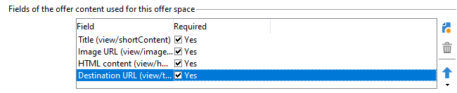

# Criar espaços de oferta{#creating-offer-spaces}

O conteúdo do catálogo de ofertas é configurado em espaços de ofertas. Por padrão, o conteúdo pode incluir os seguintes campos: **[!UICONTROL Title]**, **[!UICONTROL Destination URL]**, **[!UICONTROL Image URL]**, **[!UICONTROL HTML content]** e **[!UICONTROL Text content]**. A sequência de campos é configurada no espaço de oferta.

Como um **administrador técnico**, é possível criar espaços de ofertas no ambiente Design . Você precisa ter acesso à subpasta de espaço de oferta. Depois de criados, esses espaços de oferta são duplicados automaticamente no ambiente Live durante a aprovação da oferta.

A renderização de HTML é criada por meio de uma função de renderização. A seqüência dos campos definidos na função de renderização deve ser idêntica à sequência configurada no conteúdo.


Para criar um novo espaço de oferta, siga as etapas abaixo:

1. Na lista de espaços de oferta, clique em **[!UICONTROL New]**.

   

1. Selecione o canal que deseja usar e altere o rótulo do espaço de oferta.

   

1. Verifique a **[!UICONTROL Enable unitary mode]** opção

1. Vá para a janela **[!UICONTROL Content field]** e clique em **[!UICONTROL Add]**.

   

1. Vá para o nó **[!UICONTROL Content]** e selecione os campos na seguinte ordem: **[!UICONTROL Title]**, **[!UICONTROL Image URL]**, **[!UICONTROL HTML content]** e **[!UICONTROL Destination URL]**.

   

1. Verifique a **[!UICONTROL Required]** para tornar cada campo obrigatório.

   >[!NOTE]
   >
   >Essa opção é usada na pré-visualização e oferece espaços de oferta inválidos ao publicar se um dos campos obrigatórios estiver ausente na oferta. No entanto, se uma oferta já estiver disponível em um espaço de oferta, esses critérios não serão levados em consideração.

   

1. Clique em **[!UICONTROL Edit functions]** para criar uma função de renderização.

   Essas funções são usadas para gerar representações de ofertas em um espaço de oferta. Há vários formatos possíveis: HTML ou texto.

   **Observação** - O formato XML está restrito a interações de entrada que não estão disponíveis nesta versão do produto. [Saiba mais](../start/v7-to-v8.md#gs-unavailable-features)

   _

1. Acesse a guia **[!UICONTROL HTML rendering]** e selecione **[!UICONTROL Overload the HTML rendering function]**.
1. Insira a função de renderização.

   

## Status da apresentação de oferta {#offer-proposition-statuses}

O status da apresentação da oferta varia dependendo das interações com a população direcionada. O módulo Campaign Interaction vem com um conjunto de valores que podem ser aplicados à apresentação de oferta durante todo o ciclo de vida. Você precisa configurar a plataforma para que o status seja alterado quando a apresentação da oferta for criada e aceita.

>[!NOTE]
>
>A atualização de status é uma **assíncrono** processo. Ele é realizado pelo workflow de rastreamento que é acionado a cada hora.

### Lista de status da oferta {#status-list}

Os status da oferta disponível são:

* **[!UICONTROL Accepted]**
* **[!UICONTROL Scheduled]**
* **[!UICONTROL Generated]**
* **[!UICONTROL Interested]**
* **[!UICONTROL Presented]**
* **[!UICONTROL Rejected]**

Esses valores não são aplicados por padrão: eles devem ser configurados.

>[!NOTE]
>
>O status de uma apresentação de oferta será alterado automaticamente para &quot;Presented&quot; se a oferta estiver vinculada a uma delivery com o status &quot;Sent&quot;.

### Status da oferta quando a proposta é criada {#configuring-the-status-when-the-proposition-is-created}

Quando uma apresentação de oferta é **criado**, seu status é atualizado.

No **[!UICONTROL Design]** para cada espaço de oferta, configure o status a ser aplicado quando uma proposta for criada, dependendo das informações que deseja exibir nos relatórios de oferta.

Para fazer isso, siga as etapas abaixo:

1. Vá para a guia **[!UICONTROL Storage]** do espaço desejado.
1. Selecione o status a ser aplicado à proposta quando ela for criada.

   

### Status da oferta quando a proposta é aceita {#configuring-the-status-when-the-proposition-is-accepted}

Uma vez que uma apresentação de oferta foi **aceito**, use um dos valores fornecidos por padrão para configurar o novo status da proposta. A atualização é aplicada quando um recipient clica em um link na oferta.

Para fazer isso, siga as etapas abaixo:

1. Vá para a guia **[!UICONTROL Storage]** do espaço desejado.
1. Selecione o status que deseja aplicar à proposta quando for aceita.

   


**Interação de entrada**

A guia **[!UICONTROL Storage]** permite definir os status somente para propostas de ofertas **proposed** e **accepted**. Para interação de entrada, o status das apresentações de oferta deve ser especificado diretamente na URL para chamar o mecanismo de oferta, em vez da interface. Dessa forma, é possível especificar qual status aplicar em outros casos, por exemplo, se uma apresentação de oferta for rejeitada.

```
<BASE_URL>?a=UpdateStatus&p=<PRIMARY_KEY_OF_THE_PROPOSITION>&st=<NEW_STATUS_OF_THE_PROPOSITION>&r=<REDIRECT_URL>
```

Por exemplo, a proposta (identificador **40004**) que corresponde à oferta **seguro residencial** exibida no site **Neobank** contém a seguinte URL:

```
<BASE_URL>?a=UpdateStatus&p=<40004>&st=<3>&r=<"http://www.neobank.com/insurance/subscribe.html">
```

Assim que um visitante clica na oferta, e portanto na URL, o status **[!UICONTROL Accepted]** (valor **3**) é aplicado à proposta e o visitante é redirecionado para uma nova página do site **Neobank** para apresentar o contrato de seguro.

>[!NOTE]
>
>Se desejar especificar outro status na url (por exemplo, se uma apresentação de oferta for rejeitada), use o valor correspondente ao status desejado. Exemplo: **[!UICONTROL Rejected]** = &quot;5&quot;, **[!UICONTROL Presented]** = &quot;1&quot; e assim por diante.
>
>Os status e seus valores podem ser recuperados no esquema de dados **[!UICONTROL Offer propositions (nms)]**. Para obter mais informações, consulte [esta página](../dev/create-schema.md).

**Interação de saída**

Você pode aplicar automaticamente a variável **[!UICONTROL Interested]** status para uma apresentação de oferta quando o delivery contiver um link. Basta adicionar o valor **_urlType=&quot;11&quot;** ao link:

```
<a _urlType="11" href="<DEST_URL>">Link inserted into the delivery</a>
```

## Visualização de oferta por espaço {#offer-preview-per-space}

No **[!UICONTROL Preview]** , é possível exibir as ofertas para as quais o recipient está qualificado por meio de um método escolhido. No exemplo abaixo, o recipient está qualificado para três propostas de ofertas por e-mail.


Se um recipient não estiver qualificado para ofertas, isso será mostrado na visualização.


A visualização pode ignorar contextos quando eles são restritos a um espaço. Este é o caso quando o schema de interação foi estendido para adicionar campos referenciados em um espaço usando um canal de entrada.

  Para obter mais informações, consulte esta amostra em [Documentação do Campaign Classic v7](https://experienceleague.adobe.com/docs/campaign-classic/using/managing-offers/advanced-parameters/extension-example.html){target=&quot;_blank&quot;}.