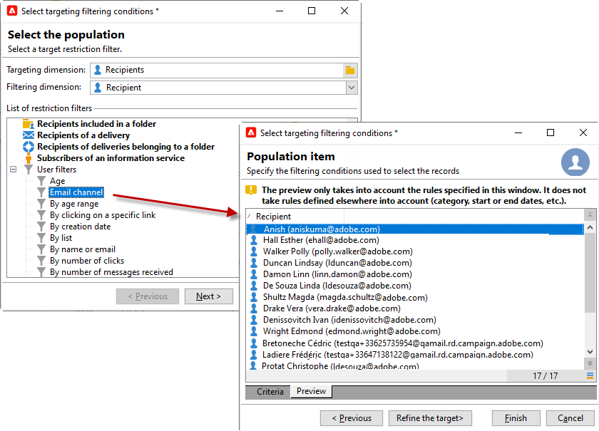

# Criar uma oferta

Para criar uma oferta, siga as etapas abaixo:

1. Navegue até a guia **[!UICONTROL Campaigns]** e clique no link **[!UICONTROL Offers]**.

1. Clique no botão **[!UICONTROL Create]**.

1. Altere o rótulo e selecione a categoria à qual a oferta deve pertencer.

1. Clique em **[!UICONTROL Save]** para criar a oferta.

   A oferta está disponível na plataforma e seu conteúdo pode ser configurado.

## Configurações de qualificação

Agora você pode usar a guia **[!UICONTROL Eligibility]** para definir:

* O período de qualificação da oferta. [Saiba mais](#eligibility-period)
* Filtros no público-alvo da oferta. [Saiba mais](#filters-on-the-target)
* O peso da oferta. [Saiba mais](#offer-weight)

### Período de qualificação da oferta{#eligibility-period}

Na guia **[!UICONTROL Eligibility]** da oferta, defina o período de qualificação da oferta. use as listas suspensas para selecionar uma data de início e uma de término no calendário.


Fora desse período, a oferta não será selecionada. Se também tiver configurado datas de qualificação para a categoria de oferta, o período mais restritivo será aplicado.

### Adicionar filtros no target {#filters-on-the-target}

Na guia **[!UICONTROL Eligibility]** da oferta, aplique filtros ao destino da oferta.

Para fazer isso, clique no link **[!UICONTROL Edit query]** e selecione o filtro que deseja aplicar.


Se os filtros predefinidos já tiverem sido criados, é possível selecioná-los na lista de filtros de usuário. [Saiba mais](interaction-predefined-filters.md)



### Definir o peso da oferta {#offer-weight}

Para permitir que o mecanismo decida entre várias ofertas que o target está qualificado, é necessário atribuir um ou mais pesos à oferta. Também é possível aplicar filtros ao target se necessário ou restringir o espaço de oferta ao qual o peso será aplicado. Uma oferta com um peso mais significativo será preferível sobre uma oferta com menos peso.

É possível configurar vários pesos para a mesma oferta, por exemplo, para distinguir sub-períodos, alvos específicos ou até mesmo um espaço de oferta.

Por exemplo, uma oferta pode ter um peso de A para contatos com idade entre 18 e 25 e um peso de B para contatos acima desse intervalo. Se uma oferta estiver qualificada para o verão todo, ela também poderá ter um peso de A em julho e um peso de B em agosto.

>[!NOTE]
>
>O peso atribuído pode ser modificado temporariamente de acordo com os parâmetros da categoria à qual a oferta pertence. [Saiba mais](interaction-offer-catalog.md#creating-offer-categories)

Para criar um peso em uma oferta, aplique as seguintes etapas:

1. Na guia **[!UICONTROL Eligibility]**, clique em **[!UICONTROL Add]**.

   

1. Altere o rótulo e atribua um peso. O valor padrão é 1.

   

   >[!CAUTION]
   >
   >Se nenhum peso for inserido (0), o target não será considerado qualificado para a oferta.

1. Se desejar que o peso seja aplicado por um determinado período, defina datas de qualificação.

   

1. Se necessário, restrinja o peso a um espaço de oferta específico.

   

1. Aplique um filtro a um target.

   

1. Clique em **[!UICONTROL OK]** para salvar o peso.

   

   >[!NOTE]
   >
   >Se um target for elegível para vários pesos de uma oferta selecionada, o mecanismo manterá o melhor (mais alto) peso. Ao chamar o Mecanismo de oferta, uma oferta é selecionada no máximo uma vez por contato.

### Resumo das regras de qualificação de oferta {#a-summary-of-offer-eligibility-rules}

Quando a configuração for concluída, um resumo das regras de eligibilidade estará disponível no painel de ofertas.

Para fazer isso, clique no link **[!UICONTROL Schedule and eligibility rules]**.


## Criar o conteúdo da oferta {#creating-the-offer-content}

Use a guia **[!UICONTROL Content]** para definir o conteúdo da oferta.


1. Defina os vários parâmetros do conteúdo da oferta.

   * **[!UICONTROL Title]**: especifique o título que quer que apareça em sua oferta. Aviso: não se refere ao rótulo da oferta, que é definido na guia **[!UICONTROL General]**.
   * **[!UICONTROL Destination URL]**: especifique a URL da sua oferta. Deve começar com &quot;http://&quot; ou &quot;https://&quot;.
   * **[!UICONTROL Image URL]**: especifique uma URL ou um caminho de acesso para a imagem da sua oferta.
   * **[!UICONTROL HTML content]** / **[!UICONTROL Text content]**: digite o corpo da oferta na guia desejada. Para gerar o rastreamento, o **[!UICONTROL HTML content]** deve ser composto de elementos HTML que podem ser colocados em um elemento de tipo `<div>`. Por exemplo, o resultado de um elemento `<table>` na página HTML será o seguinte:

   ```
      <div> 
       <table>
        <tr>
         <th>Month</th>
         <th>Savings</th>   
        </tr>   
        <tr>    
         <td>January</td>
         <td>$100</td>   
        </tr> 
       </table> 
      </div>
   ```

   Saiba como definir a URL de aceitação em [esta seção](interaction-offer-spaces.md#configuring-the-status-when-the-proposition-is-accepted).

   

   Para localizar os campos obrigatórios conforme foram definidos durante a configuração do espaço de oferta, clique no link **[!UICONTROL Content definitions]** para exibir a lista. [Saiba mais](interaction-offer-spaces.md)

   

   Neste exemplo, a oferta deve incluir um título, uma imagem, conteúdo HTML e uma URL de destino.

## Pré-visualizar a oferta {#previewing-the-offer}

Após configurar o conteúdo da oferta, é possível pré-visualizar a oferta como ela aparecerá para o recipient.

Para fazer isso:

1. Clique na guia **[!UICONTROL Preview]**.

   

1. Selecione a representação da oferta que deseja visualizar.

   

1. Se tiver personalizado o conteúdo da oferta, selecione o target da oferta para visualizar a personalização.

<!--

## Create a hypothesis on an offer {#creating-a-hypothesis-on-an-offer}

You can create hypotheses on your offer propositions. This lets you determine the impact of your offers on purchases carried out for the product concerned.

>[!NOTE]
>
>These hypotheses are carried out via Response Manager. Please check your license agreement.

Hypotheses carried out on an offer proposition are referenced in their **[!UICONTROL Measure]** tab.

Creating hypotheses is detailed in [this page](../../campaign/using/about-response-manager.md).

-->

## Aprovar e ativar uma oferta{#approve-offers}

Agora você pode aprovar e ativar a oferta para disponibilizá-la no ambiente **Live**.

Para obter mais informações, consulte a [documentação do Campaign Classic v7](https://experienceleague.adobe.com/docs/campaign-classic/using/managing-offers/managing-an-offer-catalog/approving-and-activating-an-offer.html?lang=pt-BR#approving-offer-content){target="_blank"}.

## Gerenciar apresentação de ofertas{#offer-presentation}

O Campaign permite controlar o fluxo de apresentações de oferta usando regras de apresentação. Essas regras, que são específicas à Interação do Campaign, são **regras de tipologia**. Elas permitem excluir ofertas com base no histórico de apresentações já feitas a um destinatário. Eles são referenciados no ambiente.

Para obter mais informações, consulte a [documentação do Campaign Classic v7](https://experienceleague.adobe.com/docs/campaign-classic/using/managing-offers/managing-an-offer-catalog/managing-offer-presentation.html?lang=pt-BR#managing-offers){target="_blank"}.

## Simulação de oferta

O módulo **Simulation** permite testar a distribuição de ofertas pertencentes a uma categoria ou um ambiente antes de enviar sua proposta para os destinatários.

A simulação leva em consideração os contextos e as regras de qualificação aplicadas anteriormente às ofertas e suas regras de apresentação. Isso permite testar e refinar várias versões da apresentação de oferta sem realmente usar uma oferta ou sobrecarregar ou não um destino, já que a simulação não tem impacto nos destinatários de destino.

Para obter mais informações sobre a Simulação de oferta, consulte a [documentação do Campaign Classic v7](https://experienceleague.adobe.com/docs/campaign-classic/using/managing-offers/simulating-offers/about-offers-simulation.html?lang=pt-BR){target="_blank"}.
