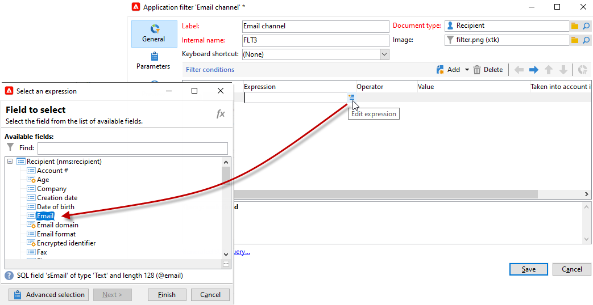

# Criar filtros predefinidos{#creating-pre-defined-filters}

Crie filtros predefinidos para definir regras de qualificação para a população do target que podem ser facilmente reutilizados durante a criação da oferta. Eles são específicos para cada ambiente e consideram os parâmetros de oferta.

Para criar um filtro predefinido, siga as etapas abaixo:

1. Navegue até o **[!UICONTROL Administration]** e selecione **[!UICONTROL Pre-defined offer filters]**.

   

1. Clique em **[!UICONTROL New]**.

   

1. Altere o rótulo para poder identificar o filtro mais tarde.

   

1. Selecione o campo que a condição do filtro abordará.

   

1. Selecione um operador e um valor se necessário, então salve a query.

   

1. Clique em **[!UICONTROL Preview]** para visualizar o resultado do filtro.

   
