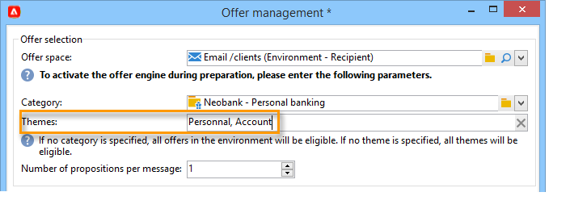
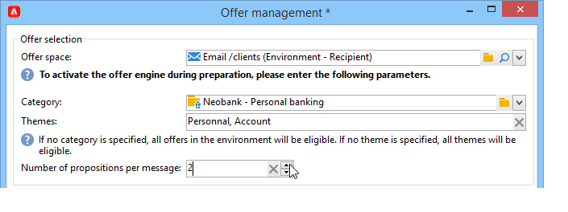
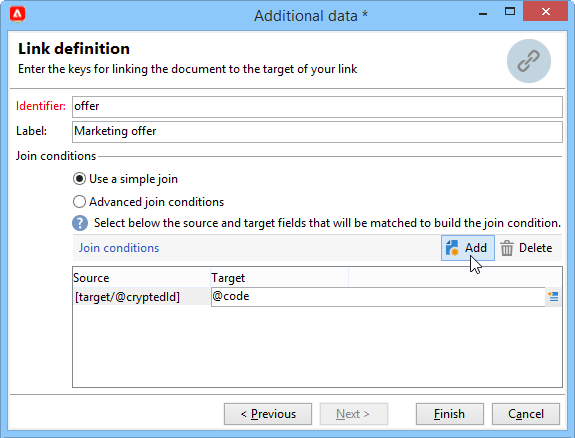
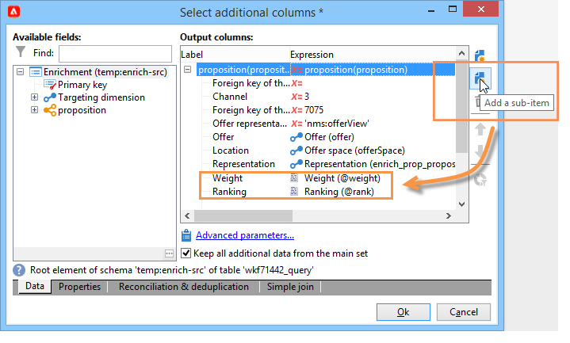
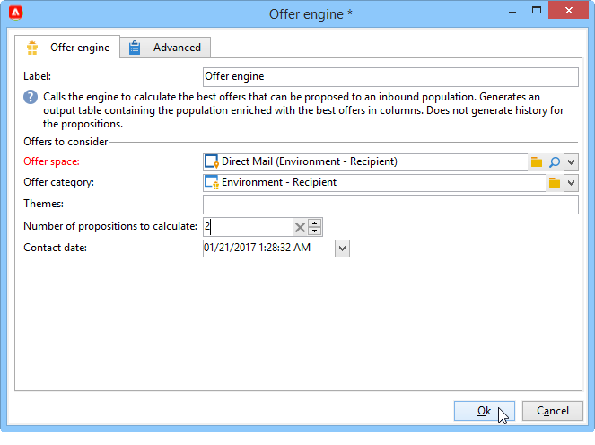

# Enviar uma oferta{#send}

Para que uma oferta seja selecionada pelo mecanismo Offer, ela deve ser aprovada e estar disponível em uma **Ao vivo** ambiente. [Saiba mais](interaction-offer.md#approve-offers)

A apresentação de oferta por meio de um canal de comunicação de saída é realizada por mala direta, email ou deliveries móveis. Também é possível usar o modo unitário com mensagens transacionais (Centro de mensagens).

## Inserir uma oferta em um delivery {#offer-into-a-delivery}

Para inserir apresentações de oferta em um delivery, siga as etapas abaixo:

1. Na janela do delivery, clique em **Ofertas** ícone .

   

1. Selecione o espaço que corresponde ao seu ambiente de oferta.

   

1. Para refinar a opção de ofertas do motor, selecione a categoria da qual a(s) oferta(s) a ser apresentada é uma parte, ou um/vários temas. Recomendamos usar apenas um desses campos de cada vez para evitar sobrecarga de restrições.

   

   

1. Especifique o número de ofertas que deseja inserir no corpo do delivery.

   

1. Selecione a opção **[!UICONTROL Exclude non-eligible recipients]** se necessário. [Saiba mais](#parameters-for-calling-offer-engine)

   

1. Se necessário, selecione o **[!UICONTROL Do not display anything if no offers are selected]** opção. [Saiba mais](#parameters-for-calling-offer-engine)

   

1. Insira as propriedades no conteúdo do delivery usando os campos de mesclagem. O número de apresentações disponíveis depende da forma como a chamada do motor é configurada e sua ordem depende da prioridade das ofertas.

   

1. Finalize o conteúdo, teste e envie o delivery.

   

### Parâmetros do mecanismo Offer {#parameters-for-calling-offer-engine}

* **[!UICONTROL Space]** : espaço do ambiente de oferta que deve ser selecionado para ativar o mecanismo Offer .
* **[!UICONTROL Category]**: pasta específica na qual as ofertas são classificadas. Se nenhuma categoria for especificada, todas as ofertas contidas no ambiente serão consideradas pelo Mecanismo de oferta, a menos que um tema seja selecionado.
* **[!UICONTROL Themes]**: palavras-chave definidas upstream nas categorias. Isso funciona como um filtro e permite refinar o número de ofertas que serão apresentadas ao selecioná-las em um conjunto de categorias.
* **[!UICONTROL Number of propositions]**: número de ofertas retornadas pelo mecanismo que podem ser inseridas no corpo do delivery. Se não forem inseridas na mensagem, as ofertas ainda serão geradas, mas não serão apresentadas.
* **[!UICONTROL Exclude non-eligible recipients]**: essa opção permite ativar ou desativar a exclusão de recipients para os quais não há ofertas elegíveis suficientes. O número de propostas elegíveis pode ser menor do que o número solicitado de apresentações. Se esta caixa estiver marcada, os recipients que não têm apresentações suficientes serão excluídos do delivery. Se você não selecionar essa opção, esses recipients não serão excluídos, mas não terão o número solicitado de apresentações.
* **[!UICONTROL Do not display anything if no offer is selected]**: essa opção permite escolher como a mensagem será processada caso uma das proposições não exista. Quando esta caixa é marcada, a representação da proposta ausente não é exibida e nenhum conteúdo aparecerá na mensagem para essa apresentação. Se a caixa não estiver marcada, a mensagem propriamente dita será cancelada durante o envio e os recipients não receberão mais mensagens.

## Enviar ofertas em fluxos de trabalho{#offer-via-wf}

Várias atividades de workflow permitem definir a forma como as ofertas são apresentadas:

* Enriquecimento
* Mecanismo de oferta
* Ofertas por célula

### Enriquecimento {#enrichment}

O **Enriquecimento** permite adicionar ofertas ou links para ofertas de recipients de delivery.

 Para obter mais informações sobre a atividade Enrichment , consulte [Documentação do Campaign Classic v7](https://experienceleague.adobe.com/docs/campaign-classic/using/automating-with-workflows/targeting-activities/enrichment.html)

Por exemplo, é possível enriquecer os dados de uma query de recipient antes de um delivery.

Há dois métodos para especificar apresentações de oferta.

* Especificação de oferta ou de chamada do mecanismo de oferta.
* Fazendo referência a um link para uma oferta.

#### Especificar uma oferta ou uma chamada para o mecanismo de oferta {#specifying-an-offer-or-a-call-to-the-offer-engine}

Após configurar o **Query** atividade :

1. Adicione e abra um **Enriquecimento** atividade .
1. Na guia **[!UICONTROL Enrichment]**, selecione **[!UICONTROL Add data]**.
1. Selecione **[!UICONTROL An offer proposition]** nos tipos de dados para adicionar.

   

1. Especifique um identificador e um rótulo para a proposta que será adicionada.
1. Especifique a seleção da oferta. Há duas opções possíveis para isso:

   * **[!UICONTROL Search for the best offer in a category]** : marque esta opção e especifique os parâmetros de chamada do mecanismo Offer (espaço de oferta, categoria ou tema(s), data de contato, número de ofertas a serem mantidas). O mecanismo calculará automaticamente as ofertas para adicionar de acordo com esses parâmetros. Recomendamos completar o campo **[!UICONTROL Category]** ou o campo **[!UICONTROL Theme]**, em vez de ambos ao mesmo tempo.

      

   * **[!UICONTROL A pre-defined offer]** : marque esta opção e especifique um espaço de ofertas, uma oferta específica e uma data de contato para configurar diretamente a oferta que deseja adicionar, sem chamar o mecanismo Offer .

      

1. Em seguida, configure uma atividade de delivery que corresponda ao canal escolhido. [Saiba mais](#offer-into-a-delivery)

   >[!NOTE]
   >
   >O número de propostas disponíveis para pré-visualizar depende da configuração executada na atividade de enriquecimento, ao invés de qualquer configuração possível executada diretamente no delivery.

#### Referência a um link para uma oferta {#referencing-a-link-to-an-offer}

Você também pode fazer referência a um link para uma oferta em uma **Enriquecimento** atividade .

Para fazer isso, siga as etapas abaixo:

1. Selecione **[!UICONTROL Add data]** na guia **[!UICONTROL Enrichment]** da atividade.
1. Na janela onde você escolhe o tipo de dados a serem adicionados, selecione **[!UICONTROL A link]**.
1. Selecione o tipo de link que deseja estabelecer, assim como seu target. Nesse caso, o target é o schema de oferta.

   

1. Especifique a ligação entre os dados da tabela de entrada na atividade de enriquecimento (aqui a tabela de recipients) e a tabela de ofertas. Por exemplo, é possível vincular um código de oferta a um recipient.

   

1. Em seguida, configure uma atividade de delivery que corresponda ao canal escolhido. [Saiba mais](#offer-into-a-delivery)

   >[!NOTE]
   >
   >O número de propostas disponíveis para a pré-visualização depende da configuração realizada no delivery.

#### Armazenar classificações e pesos de ofertas {#storing-offer-rankings-and-weights}

Por padrão, quando uma **Enriquecimento** A atividade é usada para fornecer ofertas, suas classificações e seus pesos não são armazenados na tabela de propostas.

>[!NOTE]
>
>A atividade **[!UICONTROL Offer engine]** armazena essas informações por padrão.

No entanto, é possível armazenar essas informações da seguinte maneira:

1. Crie uma chamada para o Offer engine em uma atividade de enriquecimento feita após um query e antes de uma atividade de delivery. [Saiba mais](#specifying-an-offer-or-a-call-to-the-offer-engine)
1. Na janela principal da atividade, selecione **[!UICONTROL Edit additional data...]**.

   

1. Adicione as colunas **[!UICONTROL @rank]** para a classificação e **[!UICONTROL @weight]** para o peso da oferta.

   

1. Confirme sua adição e salve seu workflow.

O delivery armazena automaticamente a classificação e o peso das ofertas. Essas informações estão visíveis na guia **[!UICONTROL Offers]** do delivery.

### Mecanismo de oferta {#offer-engine}

O **[!UICONTROL Offer engine]** A atividade também permite especificar uma chamada para o mecanismo Offer antes do delivery.

 Para obter mais informações sobre o **Mecanismo de oferta** atividade , consulte [Documentação do Campaign Classic v7](https://experienceleague.adobe.com/docs/campaign-classic/using/automating-with-workflows/targeting-activities/offer-engine.html)

Esta atividade funciona de acordo com o mesmo princípio do **Enriquecimento** com uma chamada de mecanismo, enriquecendo os dados da população de entrada com uma oferta calculada pelo mecanismo, antes de um delivery.

Após configurar o **Query** atividade :

1. Adicione e abra uma atividade de **[!UICONTROL Offer engine]**.
1. Preencha os vários campos disponíveis para especificar a chamada para os parâmetros do mecanismo de oferta (espaço de oferta, categoria ou tema(s), data de contato, número de ofertas a serem mantidas). O mecanismo calculará automaticamente as ofertas para adicionar de acordo com esses parâmetros.

   >[!CAUTION]
   >
   >Se usar essa atividade, somente as propostas de oferta usadas no fornecimento serão armazenadas.

   

1. Em seguida, configure uma atividade de delivery que corresponda ao canal escolhido. [Saiba mais](#inserting-an-offer-proposition-into-a-delivery)

### Ofertas por célula {#offers-by-cell}

A atividade **[!UICONTROL Offers by cell]** permite distribuir a população de entrada (de uma consulta, por exemplo) em vários segmentos e especificar uma oferta a ser apresentada para cada um desses segmentos.

 Para obter mais informações sobre o **Oferta por célula** atividade , consulte [Documentação do Campaign Classic v7](https://experienceleague.adobe.com/docs/campaign-classic/using/automating-with-workflows/targeting-activities/offers-by-cell.html)

Para fazer isso, realize o seguinte processo:

1. Adicione a atividade **[!UICONTROL Offers by cell]** após especificar a população do target e, em seguida, a abra.
1. Na guia **[!UICONTROL General]**, selecione o espaço de ofertas no qual deseja apresentar as ofertas.
1. Na guia **[!UICONTROL Cells]**, especifique os diferentes subconjuntos usando o botão **[!UICONTROL Add]**:

   * Especifique a população de subconjunto usando o filtro disponível e as regras de limitação.
   * Em seguida, selecione a oferta que deseja apresentar ao subconjunto. As ofertas disponíveis são aquelas elegíveis no ambiente de oferta que foi selecionado na etapa anterior.

      

1. Em seguida, configure uma atividade de delivery que corresponda ao canal escolhido.

<!--

## Delivering with delivery outlines {#delivering-with-delivery-outlines}

You can also present offers in a delivery using delivery outlines.

For more information on delivery outlines, refer to the Campaign - MRM guide.

1. Create a new campaign or access an existing campaign.
1. Access the delivery outlines via the campaign's **[!UICONTROL Edit]** > **[!UICONTROL Documents]** tab.
1. Add an outline then insert as many offers as you like into it by right-clicking on the outline and selecting **[!UICONTROL New]** > **[!UICONTROL Offer]**, then save the campaign.

1. Create a delivery whose delivery outlines you have access to (for example, a direct mail delivery).
1. When editing the delivery, click **[!UICONTROL Select a delivery outline]**.

   >[!NOTE]
   >
   >Depending on the type of delivery, this option can be found in the **[!UICONTROL Properties]** > **[!UICONTROL Advanced]** menu (for email deliveries for example).

1. Using the **[!UICONTROL Offers]** button, you can then configure the offer space as well as the number of offers to present in the delivery.

1. Add the propositions into the delivery body using the personalization fields (for more on this, refer to the [Inserting an offer proposition into a delivery](#inserting-an-offer-proposition-into-a-delivery) section), or in the case of a direct mail delivery, by editing the extraction file format.

   Propositions will be selected from the offers referenced in the delivery outline.

   >[!NOTE]
   >
   >Information regarding the offer rankings and weights is only saved in the proposition table if the offers are generated directly in the delivery.
-->
