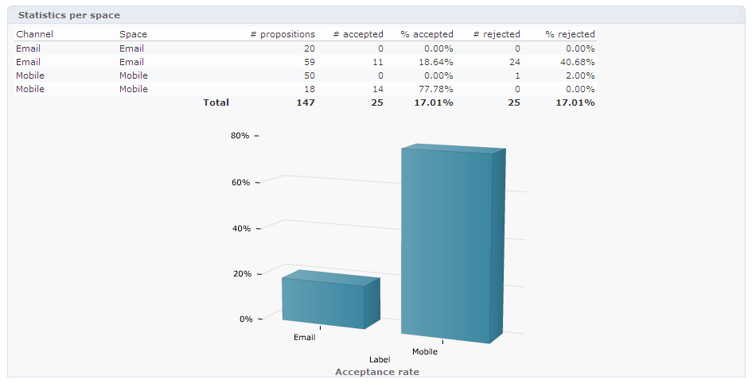

# Histórico e relatórios da interação em tempo real

>[!NOTE]
>
>Estas funcionalidades só são visíveis online e somente para os **Gerentes de entrega**.

## Histórico da apresentação da oferta{#offer-proposition-history}

Depois que as apresentações da oferta são feitas, é possível visualizar o histórico.

* No nível da oferta, clique em **[!UICONTROL Edit]** na guia **[!UICONTROL Propositions]**.

  

* A partir do perfil de um destinatário, clique na guia **[!UICONTROL Propositions]**.

  

* No nível de espaço de oferta, clique na guia **[!UICONTROL Propositions]**.

  

## Relatório da análise da oferta{#offer-analysis-report}

O relatório **[!UICONTROL Offer analysis]** disponibiliza uma visão geral do número de apresentações aceitas ou rejeitadas.

As estatísticas são classificadas com base em três critérios:

* Por data:

  

* Por espaço:

  

* Por entregas:

  

Os dados podem ser filtrados com base em vários critérios disponíveis na seção superior do relatório. Após selecionar os critérios desejados, clique no link **[!UICONTROL Refresh]** para aplicá-los ao relatório.
