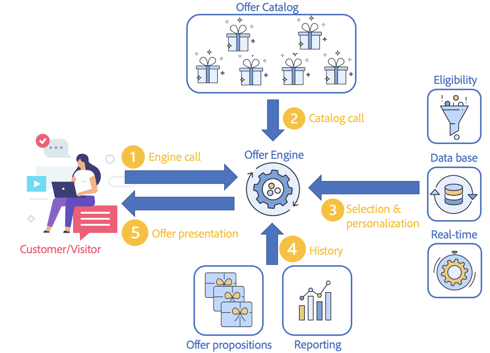

# Gerenciar interações em tempo real

A campanha vem com um **Interação** módulo que permite responder em tempo real durante uma interação com um determinado contato, propondo uma única ou várias ofertas específicas. Essas ofertas podem ser mensagens de comunicação simples, ofertas especiais de um ou vários produtos ou um serviço.

Você pode criar um catálogo de ofertas que faz interface com seus canais de saída (email, correspondência direta, SMS) para selecionar a melhor oferta para enviar a um contato em um determinado contexto. A seleção de melhor oferta para um recipient é baseada em **regras de elegibilidade**. A seleção de uma oferta de um conjunto de ofertas relevantes é determinada usando regras de prioridade. As regras de apresentação de ofertas consideram o histórico do contato e ajudam a evitar que elas recebam a mesma oferta várias vezes.

A interação permite criar e gerenciar um catálogo de ofertas e configurar as regras de elegibilidade e os temas de aplicações vinculados a elas. Dependendo do canal escolhido, o conteúdo da oferta pode ser personalizado graças a várias funções de renderização. Por fim, você pode usar o módulo de simulação para calcular o impacto de uma apresentação de ofertas.

Primeiro, ocorre um contato entre um cliente e uma empresa por meio de um canal de comunicação: pode ser um site (interação de saída), um email, SMS, notificação por push (interações de entrada). [Saiba mais](#interaction-types)

Esse contato resulta em uma chamada para o mecanismo Offer . (1)

Quando a chamada para o mecanismo Offer ocorre, uma ou várias ofertas são selecionadas no Offer catalog, dependendo do número de configurações de ofertas na proposta. (2)

Em seguida, as regras de qualificação são aplicadas: as melhores ofertas são selecionadas com base nas regras de qualificação, datas de início e término das ofertas, dados do perfil e comportamento em tempo real do cliente. (3)

O histórico da apresentação do perfil é atualizado uma vez feita a seleção, para evitar a duplicação das ofertas apresentadas. (4)

Finalmente, a melhor oferta é proposta para o target. (5)

## Introdução a ofertas

As principais etapas para iniciar estão listadas abaixo.

### Configurar sua plataforma

Antes de começar, como uma Campanha **Administrador**, certifique-se de executar as seguintes tarefas em ambientes de design:

1. Crie perfis de usuário. [Saiba mais](interaction-operators.md)
1. (opcional) Crie um ambiente de oferta para cada targeting dimension. [Saiba mais](interaction-env.md)
1. Crie regras de tipologia para cada ambiente. [Saiba mais](interaction-offer.md#offer-presentation)
1. Crie espaços de ofertas para cada ambiente e configure as funções de renderização. [Saiba mais](interaction-offer-spaces.md)
Se o espaço for definido por um canal unitário no modo identificado, você deverá especificar os parâmetros avançados para esse espaço.

   >[!NOTE]
   >
   >Se o espaço for definido por um canal unitário no modo identificado, você deverá especificar os parâmetros avançados para esse espaço.

1. Configure o Offer engine para interações de entrada para apresentar e atualizar uma ou várias ofertas.

   Os vários modos de integração são detalhados em [esta seção](interaction-present-offers.md).

   >[!NOTE]
   >
   >Quando um espaço de oferta é criado no canal de entrada da Web, você deve configurar o site para exibir essa oferta.

### Criar e publicar o catálogo de ofertas {#managing-the-offer-catalog-}

Como um **Gerente de ofertas** você deve:

1. Crie categorias de ofertas em ambientes de design. [Saiba mais](interaction-offer-catalog.md#creating-offer-categories)
1. Crie ofertas em ambientes de design. [Saiba mais](interaction-offer.md)
1. Aprove e publique ofertas em um ou vários espaços para torná-las disponíveis em ambientes dinâmicos para o gerenciador de delivery. [Saiba mais](interaction-offer.md#approve-offers)

### Usar o catálogo de ofertas {#using-the-offer-catalog-}

Como um **Gerente de delivery**  você deve:

1. Crie uma campanha.
1. Faça referência a uma oferta na campanha ou no delivery. [Saiba mais](interaction-send-offers.md).

## Glossário

Descubra termos específicos da oferta e orientações relacionadas antes de começar.

* **Ambiente**: conjunto que inclui um catálogo de oferta e ganchos (espaços de ofertas). Crie um ambiente por targeting dimension. Há dois tipos de ambientes:

   * **Ambiente de design**: o ambiente no qual as ofertas são criadas e/ou regras de tipologia são definidas (regras que determinarão as ofertas para apresentar ou não a uma pessoa alvo). A tabela de indivíduos a serem alvos das ofertas e a tabela para armazenar todas as apresentações de oferta também são definidas aqui. O **[!UICONTROL Design environment]** contém subpastas de espaço de ofertas, filtros predefinidos e categorias de ofertas. Para cada **[!UICONTROL Design environment]** existe um **[!UICONTROL Live environment]** somente leitura correspondente, gerado a partir desse mesmo **[!UICONTROL Design environment]**.
   * **Ambiente dinâmico**: ambiente vinculado a um **[!UICONTROL Design environment]**. Ele contém ofertas somente leitura cujo conteúdo e elegibilidade foram aprovados por meio do **[!UICONTROL Design environment]**. Eles estão disponíveis para serem exibidos em um site ou inseridos em uma mensagem.

* **Espaço de ofertas**: pasta que define o local onde a oferta é exposta. Ao definir um espaço, é possível:
   * selecione o canal
   * escolha se ele pode ser usado no modo unitário (por padrão: somente no modo de lote)
   * crie o conteúdo da oferta usando funções de renderização
   * especifique as ofertas a serem apresentadas

   Um espaço é uma interface entre o canal e o mecanismo de oferta.

   >[!CAUTION]
   >
   >Um espaço de ofertas não é um canal de comunicação, ele coincide com um local específico de exposição no canal. Por exemplo, as ofertas expostas em um site pode ocupar dois espaços na mesma página. Nesse caso, você tem dois espaços para o mesmo canal.
   >
   >Os espaços devem ser definidos nas especificações e não devem ser modificados durante o projeto.

* **Catálogo de oferta**: conjunto de ofertas definido no Adobe Campaign que pode ser selecionado durante uma interação. O catálogo é organizado hierarquicamente com cada nó correspondente a uma categoria.
* **Categoria**: uma pasta vinculada ao catálogo de oferta em um ambiente, que organiza ofertas com base na natureza, na data de elegibilidade e no tema da aplicação. Uma categoria pode conter subcategorias, que herdam todas as características da categoria principal. As regras de elegibilidade podem ser definidas para uma categoria como compartilhada para várias ofertas.
* **Temas da aplicação**: palavras-chave definidas na categoria, que permitem filtrar ofertas quando são apresentadas a um canal de entrada ou saída, restringindo a seleção de ofertas a uma ou duas categorias.

   >[!NOTE]
   >
   >As categorias derivadas herdam os temas identificados na categoria principal.

* **Regras de elegibilidade**: restrições aplicadas a um ambiente, categoria ou oferta sobre o período de validade, target e peso. Eles permitem garantir que uma oferta esteja alinhada com o contato alvo.

   Nos ambientes, as regras de elegibilidade incluem regras de apresentação aplicadas às ofertas e às pessoas a serem públicos-alvo.

   Nas categorias, as regras de elegibilidade permitem: limite a validade da categoria no tempo, defina temas de aplicação e determine as pessoas a serem alvos. Eles também podem receber um peso multiplicador para um determinado tempo. Isso permite compartilhar as regras para ofertas em outras categorias e simplifica sua administração.

   Nas ofertas, as regras de elegibilidade permitem limitar a validade de ofertas no tempo e determinar as pessoas a serem públicos-alvo.

* **Arbitragem**: selecionar ofertas para exibir em um ambiente (ofertas elegíveis). O princípio de arbitragem classifica as ofertas por prioridade de acordo com os critérios definidos nas categorias, ofertas e ofertas de contexto.
* **Contato**: um contato de uma interação de entrada. Durante o processamento de chamadas do motor, o contato é associado a um targeting dimension. Há dois tipos de contatos:

   * **[!UICONTROL Identified contact]** : um contato que foi identificado voluntariamente no canal. Em interações de saída, o contato é identificado automaticamente.
   * **[!UICONTROL Anonymous contact]** : um contato que não tenha assinado voluntariamente por meio do canal, mas pode ser identificado implicitamente por meio de um cookie. Essa terminologia é usada apenas para interações de entrada.

      >[!NOTE]
      >
      >Contatos anônimos e não identificados são atribuídos ao targeting dimension do visitante.

* **Interação de saída**: chame para o mecanismo Offer de uma lista de contatos (usado para delivery de emails, mala direta etc.). As mesmas regras e processos são aplicados a cada contato. Esse tipo de interação geralmente é processado no modo de lote.
* **Interação de entrada**: interação seguindo uma chamada recebida gerada pela ação de um contato no canal. Esse tipo de interação geralmente é processado no modo unitário.
* **Modo de lote**: o modo de lote permite selecionar a melhor oferta para um conjunto de contatos. As regras de elegibilidade/priorização são aplicadas a todos os contatos do conjunto. Esse modo geralmente é aplicado para interações de saída.
* **Modo Unitário**: um único contato é processado de cada vez. Esse modo geralmente é aplicado para interações de entrada e mensagens transacionais.
* **Modo de identificação**: refere-se ao status de um contato:

   * **[!UICONTROL explicit]** : os contatos são identificados pelo logon na interface do canal.
   * **[!UICONTROL implicit]** : são identificados por um cookie (permanente ou de sessão). Ele pode ser processado como um contato anônimo ou identificado.
   * **[!UICONTROL anonymous]** : não é possível identificar contatos.

* **Oferta elegível**: a oferta se encontra com as restrições definidas upstream que podem ser oferecidas de forma consistente a um público-alvo.
* **Regras de apresentação**: regras de tipologia mencionadas no ambiente de oferta, que permitem excluir algumas ofertas levando em conta o histórico de apresentações.
* **Peso**: fórmulas que permitem calcular precisamente a relevância de uma oferta para selecionar a mais relevante. Os pesos são definidos nas ofertas. Ofertas elegíveis são consideradas em ordem decrescente de peso.
* **Função de renderização**: definida no espaço de oferta para construir sua representação de oferta com base nos atributos definidos na oferta. Há três modos diferentes de função de renderização: HTML, XML e texto.
* **Apresentação de oferta**: resultado da ação que consiste em apresentar uma ou várias ofertas a um contato em um determinado espaço (banner em um site, email ou SMS, por exemplo). Esse resultado é armazenado na tabela de apresentações de oferta. No entanto, não é obrigatório salvar as apresentações.
* **Simulação**: módulo que permite testar a apresentação de ofertas nos recipients alvos antes de realmente enviar as ofertas.
* **Pré-visualização**: pré-visualização da oferta como ela é exibida em sua pasta. É acessível a partir da janela de configurações de oferta ou do perfil de contato.
* **filtros predefinidos**: regras de filtragem predefinidas podem considerar os parâmetros de oferta (por exemplo, um código de oferta). Eles podem ser reutilizados após a criação de ofertas.
* **Representação da oferta**: informações usadas pelo canal para exibir a oferta. A representação da oferta pode ser construída a partir da função de renderização do espaço em que a oferta é representada ou inserida diretamente na interface (por exemplo, no bloco HTML). Uma oferta pode ser representada por espaço.
* **Processo de transição**: um processo ativado em um ambiente identificado, responsável por direcionar a chamada a um ambiente anônimo se o contato não tiver sido identificado explicitamente e/ou implicitamente.
