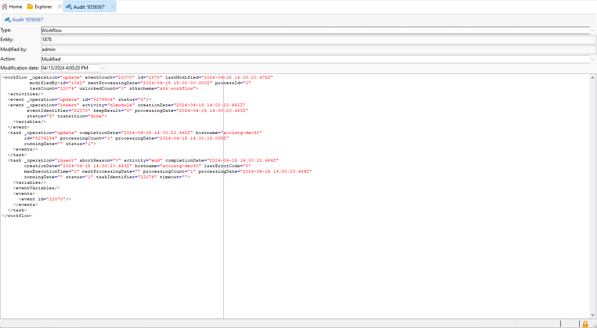

# Trilha de auditoria{#audit-trail}

A variável **[!UICONTROL Audit trail]** A funcionalidade no Adobe Campaign oferece um registro granular de todas as modificações feitas em entidades importantes na instância, normalmente aquelas que afetam significativamente uma operação suave da instância. Funcionando como um registro em tempo real, captura uma lista detalhada de ações e eventos à medida que ocorrem.

>[!NOTE]
>
>O Adobe Campaign não está auditando alterações feitas em direitos de usuário, modelos, personalização ou campanhas.\
>A trilha de auditoria só pode ser gerenciada por administradores da instância.

+++ Saiba mais sobre entidades disponíveis da Trilha de auditoria

* **Trilha de auditoria do esquema**: permite explorar as alterações feitas em seus esquemas, bem como identificar quem fez essas modificações e quando elas ocorreram.

  Para obter informações detalhadas sobre schemas, consulte [página](../dev/schemas.md).

* **Trilha de auditoria do fluxo de trabalho** O rastreia todas as ações relacionadas aos fluxos de trabalho, incluindo:

   * Start
   * Pause
   * Stop
   * Restart
   * Limpeza que é igual ao histórico de Expurgação da ação
   * Simular qual é igual ao Início da ação no modo de simulação
   * Ativar que é igual à ação Executar tarefas pendentes agora
   * Unconditional Stop

  Para obter mais informações sobre fluxos de trabalho, consulte esta [página](../../automation/workflow/about-workflows.md).

  Para obter mais informações sobre como monitorar workflows, consulte o [seção dedicada](../../automation/workflow/monitor-workflow-execution.md).

* **Trilha de auditoria da opção** O permite que você marque as atividades e as últimas modificações feitas em suas opções.

  Para obter mais informações sobre opções, consulte esta [página](https://experienceleague.adobe.com/en/docs/campaign-classic/using/installing-campaign-classic/appendices/configuring-campaign-options).

* **Trilha de auditoria da entrega** permite verificar as atividades e últimas modificações feitas em seus deliveries.

  Para obter mais informações sobre deliveries, consulte este [página](../start/create-message.md).

* **Conta externa** permite verificar modificações feitas em contas externas, usadas por processos técnicos, como workflows técnicos ou workflows da campanha.

  Para obter mais informações sobre contas externas, consulte este [página](../config/external-accounts.md).

* **Mapeamento de entrega** O permite monitorar atividades e modificações recentes feitas nos Mapeamentos de entrega.

  Para obter mais informações sobre mapeamento de delivery, consulte esta [página](../audiences/target-mappings.md).

* **Aplicativo web** permite verificar as modificações feitas nos formulários web no Campaign V8 usados para criar páginas com campos de entrada e seleção e que podem incluir dados do banco de dados.

  Para obter mais informações sobre aplicativos web, consulte esta [página](../dev/webapps.md).

* **Oferta** O permite verificar as atividades e as últimas modificações feitas em suas ofertas.

  Para obter mais informações sobre a oferta, consulte esta [página](../interaction/interaction.md).

* **Operador** O permite monitorar atividades e modificações recentes feitas em seus Operadores.

  Para obter mais informações sobre operadores, consulte esta [página](../interaction/interaction-operators.md).

+++

## Acessando a Trilha de auditoria {#accessing-audit-trail}

Para acessar o da instância **[!UICONTROL Audit trail]**:

1. Acesse o **[!UICONTROL Explorer]** menu da sua instância.

1. No **[!UICONTROL Administration]** selecione **[!UICONTROL Audit]** depois **[!UICONTROL Audit Trail]**.

   

1. A variável **[!UICONTROL Audit trail]** é aberta com a lista das entidades. O Adobe Campaign auditará as ações de criação, edição e exclusão de suas diferentes entidades.

   Selecione uma das entidades para saber mais sobre as últimas modificações.

1. A variável **[!UICONTROL Audit entity]** fornece informações mais detalhadas sobre a entidade escolhida, como:

   * **[!UICONTROL Type]**: Fluxo de trabalho, Opções, Deliveries ou Esquemas.
   * **[!UICONTROL Entity]**: Nome interno das atividades.
   * **[!UICONTROL Modified by]**: Nome de usuário da última pessoa que modificou essa entidade pela última vez.
   * **[!UICONTROL Action]**: Última ação executada nesta entidade, Criada, Modificada ou Excluída.
   * **[!UICONTROL Modification date]**: Data da última ação executada nesta entidade.

   

>[!NOTE]
>
>Por padrão, o período de retenção está definido como 180 dias para **[!UICONTROL Audit logs]**. Esse valor pode ser modificado no assistente de implantação.

## Ativar/desativar trilha de auditoria {#enable-disable-audit-trail}

A trilha de auditoria pode ser facilmente ativada ou desativada para uma atividade específica se, por exemplo, você quiser salvar algum espaço no banco de dados.

Para fazer isso:

1. Acesse o **[!UICONTROL Explorer]** menu da sua instância.

1. No **[!UICONTROL Administration]** selecione **[!UICONTROL Platform]** depois **[!UICONTROL Options]**.

1. Selecione uma das seguintes opções dependendo da entidade que você deseja ativar/desativar:

   * Para Fluxo de trabalho: **[!UICONTROL XtkAudit_Workflows]**
   * Para esquemas: **[!UICONTROL XtkAudit_DataSchema]**
   * Para Opções: **[!UICONTROL XtkAudit_Option]**
   * Para Deliveries: **[!UICONTROL XtkAudit_Delivery]**
   * Para Conta Externa: **[!UICONTROL XtkAudit_ExtAccount]**
   * Para Mapeamento De Delivery: **[!UICONTROL XtkAudit_DeliveryMapping]**
   * Para Aplicativo Web: **[!UICONTROL XtkAudit_WebApp]**
   * Para a oferta: **[!UICONTROL XtkAudit_Offer]**
   * Para Operador: **[!UICONTROL XtkAudit_Operator]**
   * Para cada entidade: **[!UICONTROL XtkAudit_Enable_All]**

   

1. Altere o **[!UICONTROL Value]** para 1 se quiser ativar a entidade ou para 0 se quiser desativá-la.

   

1. Clique em **[!UICONTROL Save]**.
