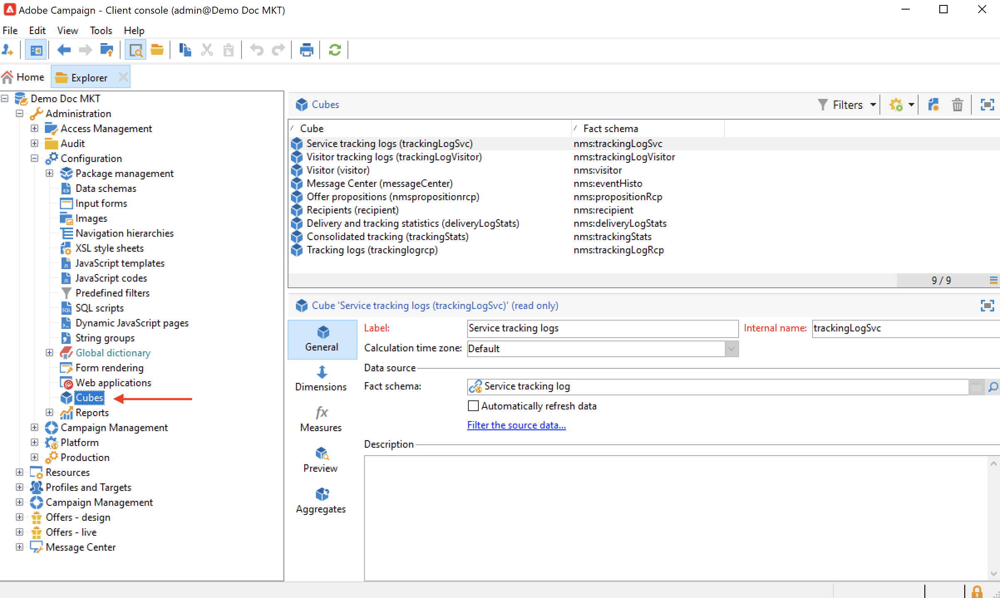

# Criar um cubo{#create-a-cube}

## Espaço de trabalho do cubo {#cube-workspace}

Para acessar cubos, navegue até **[!UICONTROL Administration > Configuration > Cubes]** do explorador do Campaign.

Com cubos, você pode:

* Exportar dados diretamente em um relatório, projetado na variável **[!UICONTROL Reports]** da plataforma Adobe Campaign.

   Para fazer isso, crie um novo relatório e selecione o cubo que deseja usar.

   

   Os cubos aparecem como templates baseados em quais relatórios são criados. Depois de escolher um template, clique em **[!UICONTROL Create]** para configurar e exibir o novo relatório.

   Você pode adaptar medidas, alterar o modo de exibição ou configurar a tabela e exibir o relatório usando o botão principal.

   

* Faça referência a um cubo na **[!UICONTROL Query]** caixa de um relatório para usar seus indicadores, conforme mostrado abaixo:

   

* Insira uma tabela dinâmica com base em um cubo em qualquer página de um relatório. Para fazer isso, faça referência ao cubo a ser usado na guia **[!UICONTROL Data]** da tabela dinâmica na página relacionada.

   

   Para saber mais, consulte [Explorar os dados em um relatório](cube-tables.md#explore-the-data-in-a-report).

>[!CAUTION]
>
>Permissões de administrador são necessárias para criar cubos.

## Criar um cubo{#cube-create}

Antes de começar a criar um relatório de cubo, identifique as dimensões e medidas relevantes e crie-as no cubo.

Para criar um cubo, aplique as seguintes etapas:

1. Selecione a tabela de trabalho. [Saiba mais](#select-the-work-table).
1. Definir dimensões. [Saiba mais](#define-dimensions).
1. Definir medidas. [Saiba mais](#build-indicators).
1. Criar agregados (opcional). [Saiba mais](customize-cubes.md#calculate-and-use-aggregates).

No exemplo abaixo, saiba como criar rapidamente um cubo simples em um relatório para exportar suas medidas.

### Selecionar a tabela de trabalho {#select-the-work-table}

Para criar um cubo, siga as etapas abaixo:

1. Clique no botão **[!UICONTROL New]** acima da lista de cubos.

   

1. Selecione o schema que contém os elementos que você deseja explorar (também conhecido como &quot;schema de fatos&quot;). Neste exemplo, selecione o padrão **Recipient** tabela.
1. Clique em **[!UICONTROL Save]** para criar o cubo: é adicionado à lista de cubos. Agora é possível usar as guias para configurá-la.

1. Clique no botão **[!UICONTROL Filter the source data...]** link para aplicar os cálculos desse cubo aos dados no banco de dados.

   

### Definir dimensões {#define-dimensions}

Depois que o cubo é criado, defina suas dimensões. Dimension são os eixos de análise definidos para cada cubo com base em seu schema de fato relacionado. Essas são as dimensões exploradas na análise, como tempo (ano, mês, data), uma classificação de produtos ou contratos (família, referência, etc.), um segmento de população (por cidade, faixa etária, status, etc.).

Para criar dimensões, siga as etapas abaixo:

1. Navegue até o **[!UICONTROL Dimension]** do cubo e clique na guia **[!UICONTROL Add]** para criar uma nova dimensão.
1. No **[!UICONTROL Expression field]**, clique no botão **[!UICONTROL Edit expression]** ícone para selecionar o campo que contém os dados relacionados.

   

1. Neste exemplo, estamos selecionando o recipient **Idade**. Para esse campo, você pode definir uma compartimentalização para agrupar idades e facilitar a leitura das informações. Recomendamos o uso de compartimentalização quando houver a probabilidade de vários valores separados.

Para fazer isso, marque a opção **[!UICONTROL Enable binning]**. [Saiba mais](customize-cubes.md#data-binning).

1. Adicione uma dimensão do tipo **Data.** Aqui, queremos exibir as datas de criação do perfil de recipient.. Para fazer isso, clique em **[!UICONTROL Add]** e selecione o campo **[!UICONTROL Creation date]** na tabela de recipients.
Você pode personalizar o modo de exibição de data. Para fazer isso, selecione a hierarquia a ser usada e os níveis para gerar:

Em nosso exemplo, queremos apenas exibir anos, meses e dias. Observe que não é possível trabalhar com semanas e semestres/meses ao mesmo tempo: esses níveis não são compatíveis.

1. Crie outra dimensão para analisar dados relativos à cidade do recipient. Para fazer isso, adicione uma nova dimensão e selecione a cidade no nó **[!UICONTROL Location]** do schema do recipient.

Você pode habilitar a compartimentalização para facilitar a leitura das informações e vincular os valores a uma enumeração.

Selecione a enumeração na lista suspensa.. Observe que essa enumeração deve ser definida como **[!UICONTROL Reserved for binning]**.

Somente os valores na enumeração serão exibidos. Os outros serão agrupados pelo rótulo indicado no campo **[!UICONTROL Label of the other values]**.

Para obter mais informações, consulte [esta seção](customize-cubes.md#dynamically-manage-bins).

### Criar indicadores {#build-indicators}

Depois que as dimensões forem definidas, especifique um modo de cálculo para os valores a serem exibidos nas células.

Para fazer isso, crie os indicadores na **[!UICONTROL Measures]** guia . Crie quantas medidas houver colunas para exibir nos relatórios com base neste cubo.

Para criar indicadores, siga as etapas abaixo:

1. Navegue até o **[!UICONTROL Measures]** e clique na guia **[!UICONTROL Add]** botão.
1. Selecione o tipo de medida e a fórmula a ser aplicada. Neste exemplo, estamos contando o número de mulheres entre os recipients. Nossa medida é baseada no schema de fatos e usa o operador **[!UICONTROL Count]**.

   

   Use o **[!UICONTROL Filter the measure data...]** link para selecionar somente mulheres. [Saiba mais](customize-cubes.md#define-measures).

   

1. Insira o rótulo da medida e o salve.

   

1. Salve o cubo.

Agora é possível criar um relatório com base nesse cubo. [Saiba mais](cube-tables.md).