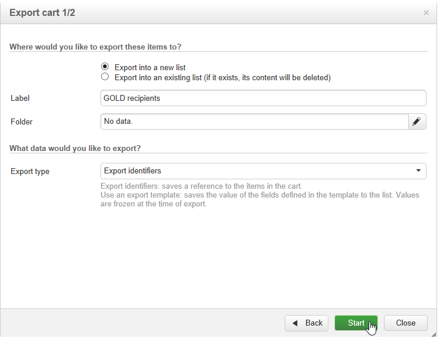

# Usar cubos para explorar dados{#use-cubes-to-create-reports}

Use cubos para criar relatórios e identificar e selecionar dados do banco de dados. Você pode:

* Criar relatórios com base em cubos. [Saiba mais](#explore-the-data-in-a-report).
* Coletar os dados no banco de dados e agrupá-los em listas, por exemplo, para identificar e criar públicos alvos e deliveries. [Saiba mais](#build-a-target-population).
* Insira uma tabela dinâmica em um relatório, faça referência a um cubo existente nele. [Saiba mais](#insert-a-pivot-table-into-a-report).

## Explorar os dados em um relatório {#explore-the-data-in-a-report}

### Etapa 1 - Criar um relatório com base em um cubo {#step-1---create-a-report-based-on-a-cube}

Quando a variável [o cubo está configurado](cube-indicators.md), ele pode ser usado como um template para criar um novo relatório.

Para criar um relatório com base em um cubo existente, siga as etapas abaixo:

1. Clique no botão **[!UICONTROL Create]** da guia **[!UICONTROL Reports]** e selecione o cubo que acabou de criar.

   

1. Clique no botão **[!UICONTROL Create]** para confirmar: isso direcionará a tela para a configuração do relatório e a exibição da página.

   Por padrão, as duas primeiras dimensões disponíveis são oferecidas em linhas e colunas, mas nenhum valor é exibido na tabela. Clique no ícone principal para gerar a tabela:

   

1. É possível alternar os eixos da dimensão, excluí-los, adicionar novas medidas etc. Para fazer isso, use os ícones apropriados:

   

   Essas operações são detalhadas abaixo.

### Etapa 2 - Selecionar linhas e colunas {#step-2---select-lines-and-columns}

A exibição padrão mostra as duas primeiras dimensões do cubo (idade e cidade, neste caso).

Os botões **[!UICONTROL Add]** em cada eixo permitem adicionar dimensões.

1. Selecione as dimensões a serem exibidas nas linhas e colunas da tabela. Para fazer isso, arraste e solte as dimensões disponíveis.
1. Selecione as dimensões que deseja adicionar à tabela na lista:
   

1. Em seguida, selecione os parâmetros dessa dimensão.

   

   Esses parâmetros dependem do tipo de dados da dimensão selecionada.

   Por exemplo, para datas, vários níveis podem estar disponíveis. Para obter mais informações, consulte [Exibir medidas](customize-cubes.md#display-measures).

   Nesse caso, as seguintes opções estão disponíveis:

   

   É possível:

   * Expandir dados durante o carregamento: os valores serão exibidos por padrão sempre que o relatório for atualizado (valor padrão: não).
   * Exibir o total no final da linha: quando os dados são exibidos em colunas, uma opção adicional permite exibir o total no final da linha: uma coluna é adicionada à tabela (valor padrão: sim).
   * Aplicar uma classificação: os valores da coluna podem ser classificados de acordo com o valor, rótulo ou com base em uma medida (valor padrão: por valor).
   * Exibir os valores em ordem crescente (a-z, 0-9) ou decrescente (z-a, 9-0).
   * Alterar o número de colunas a serem exibidas ao carregar (padrão: 200).

1. Clique em **[!UICONTROL Ok]** para confirmar: a dimensão é adicionada às dimensões existentes.

   O banner amarelo acima da tabela mostra que você fez alterações: clique no botão **[!UICONTROL Save]** para salvá-las.

   

### Etapa 3 - Configurar as medidas para exibir {#step-3---configure-the-measures-to-display}

Depois que as linhas e colunas forem definidas, selecione quais medidas deseja exibir. Por padrão, apenas uma medida é exibida.

Para adicionar e configurar medidas, siga as etapas abaixo:

1. Clique no botão **[!UICONTROL Measures]**.

   

1. Com o **[!UICONTROL Use a measure]** selecione uma das medidas existentes.

   

   Escolha as informações a serem exibidas e as opções de formatação. A lista de opções depende do tipo de medida.

   

   A configuração de medida geral também está disponível por meio do ícone **[!UICONTROL Edit the configuration of the pivot table]** no cabeçalho.

   

   Você pode então escolher se exibe ou não os rótulos de medida. [Saiba mais](customize-cubes.md#configure-the-display).

1. Você pode criar novas medidas com base nas existentes. Para fazer isso, clique **[!UICONTROL Create a measure]** e configure-a.

   

   Os seguintes tipos de medidas estão disponíveis:

   * Combinação de medidas: esse tipo de medida permite construir a nova medida utilizando as existentes:

     Os operadores disponíveis são: soma, diferença, multiplicação e taxa.

   * Proporção: esse tipo de medida permite calcular o número de registros medidos para determinada dimensão. Você pode calcular a proporcionalidade com base em uma dimensão ou subdimensão.
   * Variação: essa medida permite calcular a variação em valores de um nível.
   * Desvio padrão: esse tipo de medida permite calcular desvios em cada grupo de células em comparação à média dos valores. Por exemplo, você pode comparar o volume de compra para todos os segmentos existentes.

   Depois de criada, a medida é adicionada ao relatório.

   

   Depois de criar uma medida, você pode editá-la e alterar sua configuração. Para fazer isso, clique no link **[!UICONTROL Measures]** e navegue até a guia da medida a ser editada.

   Em seguida, clique em **[!UICONTROL Edit the dynamic measure]** para acessar o menu de configurações.

## Criar uma população alvo {#build-a-target-population}

A criação de relatórios usando cubos permitem coletar dados da tabela e salvá-los em uma lista.

Para agrupar uma população em uma lista, siga as etapas abaixo:

1. Clique nas células que contêm a população a ser coletada para selecioná-las e depois clique no ícone **[!UICONTROL Add to cart]**.

   

   Faça isso quantas vezes forem necessárias para coletar vários perfis.

1. Clique no botão **[!UICONTROL Show cart]** para exibir seu conteúdo antes de executar a exportação.

   

1. Use o **[!UICONTROL Export]** botão para agrupar os itens do carrinho em uma lista.

   Insira o nome da lista e selecione o tipo de exportação a ser executada.

   

   Clique em **[!UICONTROL Start]** para executar a exportação.

1. Uma vez concluída a exportação, uma mensagem confirma sua execução e o número de registros processados.

   

   Você pode salvar o conteúdo do carrinho ou esvaziá-lo.

   A nova lista está disponível por meio da **[!UICONTROL Profiles and targets]** guia.

   

## Inserir uma tabela dinâmica em um relatório {#insert-a-pivot-table-into-a-report}

Para criar uma tabela e explorar os dados em um cubo, siga as etapas abaixo:

1. Crie um novo relatório com uma única página e insira uma tabela dinâmica.

   

1. Na guia **[!UICONTROL Data]** da página, selecione um cubo para processar as dimensões que ele contém e exibir medidas calculadas.

   

   Isso permite criar o relatório a ser exibido. Para obter mais informações, consulte [Etapa 2 - Selecionar linhas e colunas](#step-2---select-lines-and-columns).
