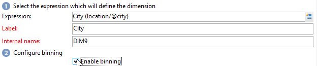

# Personalizar os seus cubos{#cube-custom}

## Compartimentalização de dados {#data-binning}

Use compartimentalização de dados para simplificar a exibição de dados agrupando valores de acordo com os critérios. Dependendo das informações disponíveis, é possível definir faixa etária, agrupar domínios de email, restringir a uma enumeração de valor, restringir explicitamente os dados a serem exibidos e agrupar todos os outros dados em uma linha ou coluna dedicada, etc.

Em geral, três tipos de compartimentalização estão disponíveis:

1. Uso de intervalos de valor definidos manualmente. Por exemplo, a idade, o carrinho de compras médio, o número de deliveries abertos, etc.). Para obter mais informações, consulte [Definição de cada compartimento](#defining-each-bin).
1. Dinamicamente, dependendo dos valores de uma enumeração: apenas exibe os valores contidos na enumeração, todos os outros valores são agrupados em &#39;Outros&#39;. Para obter mais informações, consulte [Gestão dinâmica de compartimentos](#dynamically-managing-bins).
1. Uso de intervalos de valor, todos os outros sendo agrupados. Por exemplo, de 18 a 25 anos, 26 a 59 anos e os outros. Para obter mais informações, consulte [Criação de intervalos de valor](#creating-value-ranges).

Para ativar a compartimentalização, marque a caixa apropriada ao criar a dimensão.

Você pode criar compartimentos manualmente ou vinculá-los a uma enumeração existente.

O Adobe Campaign também fornece um assistente para compartimentalização automática: os valores podem ser divididos em N grupos ou agrupados de acordo com os valores mais frequentes no banco de dados.

### Definir cada compartimento {#define-each-bin}

Para criar cada compartimento individualmente, selecione a opção **[!UICONTROL Define each bin]** e use a tabela para criar os diversos compartimentos.

Clique no botão **[!UICONTROL Add]** para criar um novo compartimento e listar os valores que serão agrupados no compartimento.

No exemplo a seguir, os idiomas são agrupados em três categorias: inglês, alemão e holandês; francês, italiano e espanhol; e outros.

Você pode usar uma máscara SQL para combinar vários valores em um filtro. Para fazer isso, marque **[!UICONTROL Yes]** na coluna **[!UICONTROL Use an SQL mask]** e insira o filtro SQL a ser aplicado na coluna **[!UICONTROL Value or expression]**.

<!--In the example below, all email domains that start with **yahoo** (yahoo.fr, yahoo.com, yahoo.be, etc.), or with **ymail** (ymail.com, ymail.eu, etc.) will be grouped under the label **YAHOO!**, as well as addresses with the **rocketmail.com** domain.-->

### Gerenciar compartimentos dinamicamente {#dynamically-manage-bins}

Os valores podem ser gerenciados dinamicamente por enumerações. Isso significa que somente os valores contidos na enumeração serão exibidos. Quando os valores de enumeração mudam, o conteúdo do Cubo é adaptado automaticamente.

Para criar esse tipo de compartimentalização de valor, siga as etapas abaixo:

1. Crie uma nova dimensão e habilite a compartimentalização.
1. Selecione a opção **[!UICONTROL Dynamically link the values to an enumeration]** e selecione a lista discriminada correspondente.

   

   Sempre que os valores de enumeração forem atualizados, os compartimentos correspondentes serão adaptados automaticamente.

Saiba mais sobre enumerações em [esta página](../../v8/config/ui-settings.md#enumerations).

### Criar intervalos de valor {#create-value-ranges}

Você pode agrupar os valores em intervalos com base em um intervalo desejado.

Para fazer isso, clique em **[!UICONTROL Add]** e selecione **[!UICONTROL Define a range]**.

Em seguida, especifique os limites inferiores e superiores e clique em **[!UICONTROL Ok]** para confirmar.

### Gerar compartimentos automaticamente {#generate-bins-automatically}

Também é possível gerar compartimentos automaticamente. Para fazer isso, clique em **[!UICONTROL Generate bins...]**.

É possível:

* **[!UICONTROL Recover the most frequently used values]**

   Se você gerar 4 compartimentos, os 4 valores usados com mais frequência serão exibidos, enquanto os outros serão contados e agrupados na categoria &quot;Outros&quot;.

* **[!UICONTROL Generate bins in the form of slots]**

   Para a mesma amostra, o Adobe Campaign cria automaticamente quatro slots de valor do mesmo tamanho para exibir os valores no banco de dados.

Nesse caso, o filtro selecionado no schema de fatos é ignorado.

### Enumerações {#enumerations}

Para melhorar a relevância e a legibilidade de um relatório, o Adobe Campaign permite criar enumerações específicas para reagrupar diferentes valores no mesmo compartimento. Essas enumerações, reservadas para compartimentalização, são referenciadas nos cubos e exibidas nos relatórios.

O Adobe Campaign também oferece uma enumeração em domínios que permite exibir uma lista dos domínios de email de todos os contatos do banco de dados, reagrupados pelo ISP, como mostrado no exemplo a seguir:

Ele é criado usando o seguinte template:

Para criar um relatório usando essa lista discriminada, crie um Cubo usando a dimensão **[!UICONTROL Email domain]**. Escolha a opção **[!UICONTROL Enable binning]** e então **[!UICONTROL Dynamically link the values to an enumeration]**. Em seguida, selecione a enumeração de **Domínios** como mostrado acima. Todos os valores que não têm alias especificado serão reagrupados no rótulo **Outros** .

Em seguida, crie um relatório com base neste Cubo para exibir os valores.

Você só precisa modificar a enumeração para atualizar o relatório relacionado. Por exemplo, crie o valor **Adobe** e adicione o alias **adobe.com** e o relatório é atualizado automaticamente com o valor da Adobe no nível de enumeração.

A lista discriminada **[!UICONTROL Domains]** é usada para gerar relatórios internos que exibem a lista de domínios. Para adaptar o conteúdo desses relatórios, você pode editar essa lista.

Você pode criar outras enumerações reservadas para compartimentalização e usá-las em outros Cubos: todos os valores de alias serão reagrupados nas posições especificadas na primeira guia de enumeração.

Saiba mais sobre enumerações em [esta página](../../v8/config/ui-settings.md#enumerations).

## Agregados em cubos {#calculate-and-use-aggregates}

Os maiores volumes de dados podem ser calculados em agregações.

Agregações são úteis ao manipular grandes volumes de dados. Eles são atualizados automaticamente com base nas configurações definidas na caixa de workflow dedicada, para integrar os dados a serem coletados mais recentemente nos indicadores

As agregações são definidas na guia relevante de cada cubo.

>[!NOTE]
>
>O workflow para atualizar cálculos de agregação pode ser configurado na própria agregação ou a agregação pode ser atualizada por meio de um workflow externo vinculado ao cubo relevante.

Para criar uma nova agregação, siga as etapas abaixo:

1. Clique na guia **[!UICONTROL Aggregates]** do cubo, em seguida, clique no botão **[!UICONTROL Add]**.
1. Insira um rótulo para a agregação e adicione as dimensões a serem calculadas.
1. Selecione uma dimensão e um nível. Repita esse processo para cada dimensão e cada nível.
1. Clique na guia **[!UICONTROL Workflow]** para criar fluxo de trabalho de agregação.

   * A atividade **[!UICONTROL Scheduler]** permite definir a frequência das atualizações de cálculo. O programador é detalhado [nesta seção](../../automation/workflow/scheduler.md).
   * A atividade **[!UICONTROL Aggregate update]** permite selecionar o modo de atualização que deseja aplicar: completo ou parcial.

      Por padrão, uma atualização completa é realizada durante cada cálculo. Para habilitar uma atualização parcial, selecione a opção relevante e defina as condições de atualização.

## Definir medidas {#define-measures}

Os tipos de medidas são definidos na guia **[!UICONTROL Measures]** do cubo. É possível calcular somas, médias, desvios, etc.

É possível criar quantas medidas forem necessárias: então selecione a medida que deseja mostrar ou ocultar na tabela. Para obter mais informações, consulte [esta seção](#displaying-measures).

Para definir uma nova medida, siga as etapas abaixo:

1. Clique no botão **[!UICONTROL Add]** acima da lista de medidas e selecione o tipo de medida e a fórmula a ser calculada.

   

1. Se necessário e dependendo do operador, escolha a expressão que a operação aborda.

   O botão **[!UICONTROL Advanced selection]** permite criar fórmulas de cálculo complexas. Para obter mais informações, consulte [esta seção](../../automation/workflow/query.md).

1. O link **[!UICONTROL Filter the measure data...]** permite restringir o campo de cálculo e somente aplicá-lo aos dados específicos no banco de dados.

   

1. Insira o rótulo da medida e adicione uma descrição, em seguida, clique em **[!UICONTROL Finish]** para criar.

## Personalizar medidas {#display-measures}

É possível configurar a exibição de medidas na tabela dependendo das necessidades:

* a sequência de exibição de medidas. [Saiba mais](#display-sequence)
* as informações mostradas/ocultadas no relatório. [Saiba mais](#configuring-the-display)
* e as medidas a serem exibidas: porcentagem, total, número de decimais, etc. [Saiba mais](#changing-the-type-of-measure-displayed)

### Sequência de exibição {#display-sequence}

As medidas calculadas no cubo são configuradas por meio do botão **[!UICONTROL Measures]**.

Mova as linhas para alterar a sequência de exibição. No exemplo a seguir, o dado francês é movido para a parte inferior da lista: isso significa que ele será exibido na última coluna.

### Configurar a exibição {#configuring-the-display}

A configuração de medidas, linhas e colunas pode ser executada individualmente para cada medida ou no geral. Um ícone específico permite acessar a janela de seleção do modo de exibição.

* Clique no ícone **[!UICONTROL Edit the configuration of the pivot table]** para acessar a janela de configuração.

   É possível escolher se exibe ou não os rótulos das medidas, bem como configurar o layout (linhas ou colunas).

As opções de cor permitem realçar valores importantes para facilitar a leitura.

### Alterar o tipo de medida exibida {#changing-the-type-of-measure-displayed}

Em cada medida, é possível definir a unidade e a formatação a serem aplicadas.

## Compartilhar seu relatório {#share-a-report}

Após configurar o relatório, é possível salvá-lo e compartilhá-lo com outros operadores.

Para fazer isso, clique no ícone **[!UICONTROL Show the report properties]** e habilite a opção **[!UICONTROL Share this report]**.

Especifique a categoria à qual o relatório pertence e sua relevância. <!--For more on this, refer in [this page](../../reporting/using/configuring-access-to-the-report.md#report-display-context) to the **Display sequence** and **Defining the filtering options** sections.-->

Para confirmar essas alterações, é preciso salvar o relatório.

## Criar filtros {#create-filters}

É possível criar filtros para visualizar uma seção dos dados.

Para fazer isso:

1. Clique no ícone **[!UICONTROL Add a filter]**.

   

1. Selecione a dimensão que o filtro aborda.

1. Selecione o tipo de filtro e seu nível de precisão.

   

1. Depois de criado, o filtro é exibido acima do relatório.

   Clique no filtro para editá-lo. Clique na cruz para excluí-lo.

   É possível combinar quantos filtros forem necessários: eles serão mostrados nesta área.

   

Cada vez que um filtro é modificado (adicionar, remover, alterar), o relatório deve ser recalculado.

Os filtros também podem ser criados com base em uma seleção. Para fazer isso, selecione as células, linhas e colunas de origem e clique no ícone **[!UICONTROL Add a filter]**.

Para selecionar uma linha, coluna ou célula, clique com o botão esquerdo do mouse nela. Para desmarcar, clique novamente.

O filtro é aplicado automaticamente e adicionado à zona de filtro acima do relatório.

