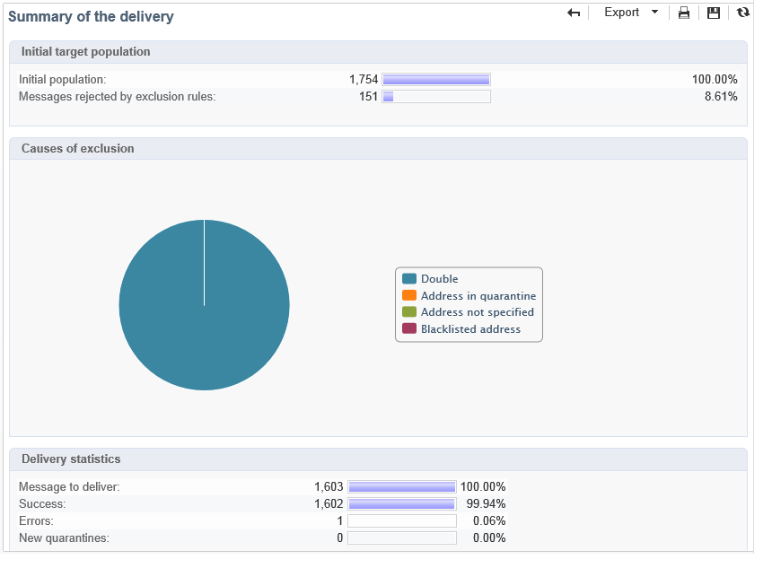

# Relatórios de entrega {#delivery-reports}

Você pode acompanhar a execução de deliveries por meio de vários relatórios acessíveis a partir da visão geral de delivery.

Para acessar os relatórios, siga as etapas abaixo:

1. Navegue até o **[!UICONTROL Campaigns]** e clique na guia **[!UICONTROL Delivery]** para exibir a lista de deliveries.
1. Clique no nome do delivery que os relatórios deseja acessar.
1. Selecione a guia **[!UICONTROL Summary]** e clique em **[!UICONTROL Reports]** para acessar os relatórios específicos do delivery.

   

   Por padrão, os seguintes relatórios estão disponíveis:

   * **[!UICONTROL Delivery throughput]**
   * **[!UICONTROL Sharing to social networks]**
   * **[!UICONTROL Statistics on sharing activities]**
   * **[!UICONTROL Hot clicks]**
   * **[!UICONTROL Tracking statistics]**
   * **[!UICONTROL URLs and click streams]**
   * **[!UICONTROL Tracking indicators]**
   * **[!UICONTROL Non-deliverables and bounces]**
   * **[!UICONTROL User activities]**
   * **[!UICONTROL Delivery summary]**
   * **[!UICONTROL Subscription tracking]**
   * **[!UICONTROL Delivery statistics]**
   * **[!UICONTROL Breakdown of opens]**

## Indicadores de rastreamento {#tracking-indicators}

Este relatório combina os indicadores principais para rastrear o comportamento dos recipients ao receber o delivery. Ele oferece acesso a estatísticas de delivery e recebimento, taxas de abertura e cliques, fluxos de cliques gerados, rastreamento Web e atividades de compartilhamento em redes sociais.

>[!NOTE]
>
>Os valores calculados com base em mensagem são sempre estimativas, devido à margem de erro vinculada aos emails em formato de texto. Os indicadores **[!UICONTROL Distinct opens/Sum of opens for the population reached]** levam em consideração essa margem de erro. [Saiba mais](metrics-calculation.md#tracking-opens-).

**[!UICONTROL 1. Delivery statistics]**

* **[!UICONTROL Messages to deliver]** : Número total de mensagens a serem entregues após a análise de delivery.
* **[!UICONTROL Success]**: Número de mensagens processadas com êxito.

**[!UICONTROL 2. Reception statistics]**

>[!NOTE]
>
>As porcentagens relacionadas são calculadas com base no número de mensagens encaminhadas com êxito.

* **[!UICONTROL Distinct opens for the population reached]** : Estimativa do número de recipients alvos que abriram uma mensagem pelo menos uma vez. Cliques em URLs rastreados são considerados, pois os emails precisam ser abertos para se clicar em um link.
* **[!UICONTROL Sum of opens for the population reached]** : Estimativa do número total de aberturas por recipients alvos.
* **[!UICONTROL Clicks on opt-out link]** : Número de cliques no link unsubscription.
* **[!UICONTROL Clicks on the mirror page link]** : Número de cliques no link para a mirror page. Para ser considerado, o link deve ser definido como tal no assistente do delivery (URLs rastreadas). <!--Refer to this [page](../../delivery/using/about-delivery-monitoring.md).-->
* **[!UICONTROL Estimation of forwards]** : Estimativa do número de emails encaminhados pelos recipients alvos. Esse valor é calculado subtraindo o número de pessoas distintas e o número de recipients distintos que clicaram no email.

   >[!NOTE]
   >
   >Para obter mais informações sobre a diferença entre pessoas distintas e recipients alvos, consulte [Pessoas/recipients direcionados](metrics-calculation.md#targeted-persons---recipients).

**[!UICONTROL 3. Open and click-through rate]**

Esta tabela de valores mostra o detalhamento dos deliveries, aberturas, cliques e reatividade bruta por domínio da Internet. Os seguintes indicadores são usados:

* **[!UICONTROL Sent]**: Número total de mensagens enviadas neste domínio.
* **[!UICONTROL Complaints]**: Número de mensagens deste domínio relatadas como indesejáveis pelo recipient. A taxa é calculada com base no número total de mensagens enviadas neste domínio.
* **[!UICONTROL Opens]**: Número de recipients alvos distintos para este domínio que abriram uma mensagem pelo menos uma vez. A taxa é calculada com base no número total de mensagens enviadas neste domínio.
* **[!UICONTROL Clicks]**: Número de recipients alvos distintos que clicaram no mesmo delivery pelo menos uma vez. A taxa é calculada com base no número total de mensagens enviadas neste domínio
* **[!UICONTROL Raw reactivity]**: Porcentagem do número de recipients que clicaram em um delivery pelo menos uma vez em comparação ao número de recipients que abriram um delivery pelo menos uma vez.

>[!NOTE]
>
>Os nomes de domínio exibidos neste relatório são definidos na lista discriminada usada no nível de cubo. Para alterar, adicionar ou remover domínios padrão, edite a lista discriminada **[!UICONTROL Domains]** e modifique valores e aliases. A categoria **[!UICONTROL Others]** inclui nomes de domínio que não pertencem a nenhum valor da lista discriminada.
>
>Saiba como acessar e configurar suas enumerações em [Documentação do Campaign Classic v7](https://experienceleague.adobe.com/docs/campaign-classic/using/getting-started/administration-basics/managing-enumerations.html){target="_blank"}.

**[!UICONTROL 4. Generated click streams]**

>[!NOTE]
>
>As porcentagens relacionadas são calculadas com base no número de mensagens encaminhadas com êxito.

* **[!UICONTROL Distinct clicks for the population reached]** : Número de pessoas distintas que clicaram em um delivery pelo menos uma vez.
* **[!UICONTROL Cumulated clicks]**: Número total de cliques por recipients alvos, excluindo links de unsubscription e mirror pages.
* **[!UICONTROL Recipient clicks]**: Número de recipients alvos distintos que clicaram no mesmo delivery pelo menos uma vez.
* **[!UICONTROL Estimated recipient reactivity]**: Taxa do número de recipients que clicaram pelo menos uma vez em um delivery em comparação ao número estimado de recipients que abriram um delivery pelo menos uma vez. Os cliques nos links de opt out e mirror pages não são considerados.
<!--
**[!UICONTROL 5. Web tracking]**

* **[!UICONTROL Visited pages]** : Number of web pages visited following message reception.
* **[!UICONTROL Transactions]** : Number of purchases following message reception.
* **[!UICONTROL Total amount]** : Total amount of purchases following message reception. 
* **[!UICONTROL Average transaction amount]** : Average purchase made by distinct delivery recipients. 
* **[!UICONTROL Articles]** : Number of articles purchased by the delivery recipients. 
* **[!UICONTROL Average count of articles per transaction]** : Average number of items per purchase made by distinct recipients.
* **[!UICONTROL Average amount per message]** : Average amount of purchases generated per message.

  >[!NOTE]
  >
  >In order for a visited page, transaction, amount or article to be taken into account, a webtracking tag must be inserted into the matching web page. Webtracking configuration is presented in [this section](../../configuration/using/about-web-tracking.md).

**[!UICONTROL 6. Sharing activities to email and social networks]**

This section shows the number of messages shared on each social network. For more on this, refer to [Sharing to social networks](../../reporting/using/global-reports.md#sharing-to-social-networks).

## URLs and click streams {#urls-and-click-streams}

This report shows the list of pages visited following a delivery. 

You can configure the contents of this report by selecting: the score chart to be displayed, the time filter (since the action launch, over the first 6 hours following launch, etc.) and the data display mode (by label, by URL, by category. Click **[!UICONTROL Refresh]** to confirm your selection.

The following rates are displayed in the upper section of the report:

* **[!UICONTROL Reactivity]** : Ratio of the number of targeted recipients having clicked in a delivery, in relation to the estimated number of targeted recipients having opened a delivery. Clicks on the opt-out link and on the mirror page are not taken into account.

  >[!NOTE]
  >
  >For more information on tracking opens, refer to [this section](metrics-calculation.md#tracking-opens-).

* **[!UICONTROL Distinct clicks]** : Number of distinct people having clicked at least once (excluding unsubscription link and mirror page) in a delivery. The rate displayed is calculated based on the number of messages delivered successfully. 
* **[!UICONTROL Cumulated clicks]** : Total number of clicks by targeted recipients (excluding unsubscription link and mirror page). The rate displayed is calculated based on the number of messages forwarded successfully.

**[!UICONTROL Platform average]** : This average rate, displayed under each rate (reactivity, distinct clicks, and cumulated clicks), is calculated for deliveries sent over the previous six months. Only deliveries with the same typology and on the same channel are taken into account. Proofs are excluded.

The central table provides the following information:

* **[!UICONTROL Clicks]** : Number of cumulated clicks, per link. 
* **[!UICONTROL Clicks (in %)]** : Breakdown of the number of clicks per link, in relation to the total number of cumulated clicks.

**[!UICONTROL Breakdown of clicks in time]**

This chart shows the breakdown of cumulated clicks per day.
-->

## Resumo da entrega {#delivery-summary}

Esse relatório fornece todas as informações principais sobre a entrega.

**[!UICONTROL Target population]**

Essa seção tem dois indicadores:

* **[!UICONTROL Initial population]** : Número total de recipients alvos do delivery.
* **[!UICONTROL Messages rejected by the rule]** : Número de endereços ignorados durante a análise ao aplicar regras de tipologia: endereço em falta, em quarentena, na lista de bloqueios, etc. <!--For more information on typology rules, refer to this [page](../../delivery/using/steps-validating-the-delivery.md#validation-process-with-typologies).-->

**[!UICONTROL Causes of exclusion]**

O gráfico do meio mostra o detalhamento por regra de mensagens rejeitadas durante a análise.

**[!UICONTROL Delivery statistics]**

Esta seção inclui os seguintes indicadores:

* **[!UICONTROL Messages to be delivered]** : Número total de mensagens a serem entregues após a análise de delivery.
* **[!UICONTROL Success]** : Número de mensagens processadas com êxito. A taxa associada é a relação do número de mensagens a serem entregues.
* **[!UICONTROL Errors]**: Número total de erros acumulados durante os deliveries e o processamento automático de reassociação. A taxa associada é a relação do número de mensagens a serem entregues.
* **[!UICONTROL New quarantines]**: Número de endereços colocados em quarentena após um delivery com falha (usuário desconhecido, domínio inválido). A taxa associada é a relação do número de mensagens a serem entregues.

## Hot clicks {#hot-clicks}

Este relatório mostra o conteúdo da mensagem (HTML e/ou texto) com a porcentagem de cliques nos links, em cada link. Links de unsubscription de blocos de personalização, links de mirror pages e links de ofertas são considerados no total de cliques acumulados, mas não são exibidos no relatório.

>[!NOTE]
>
>Se o delivery contiver ofertas (Interaction), uma caixa aparecerá na parte acima do relatório exibindo a porcentagem de cliques nas ofertas.

## Estatísticas de rastreamento {#tracking-statistics}

Este relatório disponibiliza estatísticas sobre aberturas, cliques e transações.

Ele permite rastrear o impacto de marketing do delivery. Você pode configurar como os valores são exibidos alterando a escala de tempo (visualização de 1 hora, 3 horas ou 24 horas, etc.). Clique em **[!UICONTROL Refresh]** para confirmar a seleção.

Esse relatório disponibiliza uma tabela de valores e um gráfico de Pareto que exibe o tempo necessário para o delivery alcançar a eficiência máxima. Os seguintes indicadores são usados:

* **[!UICONTROL Opens]**: Estimativa do tempo necessário para atingir uma porcentagem do número total de mensagens abertas. Os emails em formato de texto não são considerados. [Saiba mais](metrics-calculation.md#tracking-opens-).
* **[!UICONTROL Clicks]**: Estimativa do tempo necessário para atingir uma porcentagem do número total de cliques registrados. Cliques no link de opt out e na mirror page não são considerados.
<!--
* **[!UICONTROL Transactions]** : Time required to achieve a percentage of the total number of transactions following message reception. In order for a transaction to be taken into account, a transaction type webtracking tag must be inserted into the matching web page. Webtracking configuration is presented in [this section](../../configuration/using/about-web-tracking.md).
-->

## Relatórios cumulativos {#cumulated-reports}

Você pode exibir relatórios acumulados sobre deliveries. Para fazer isso, selecione os deliveries a serem comparados para obter a lista de relatórios desses deliveries.

Para selecionar deliveries não adjacentes na lista, mantenha a tecla CTRL pressionada ao fazer a seleção.

Para selecionar deliveries salvos em uma pasta diferente, clique no botão **[!UICONTROL Display sub-levels]** , acessível na barra de ferramentas. Eles serão exibidos na mesma lista.
