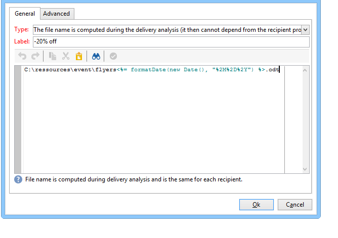

# Anexar arquivos a um email{#attaching-files}

## Sobre anexos de email {#about-email-attachments}

Você pode anexar um ou mais arquivos a uma entrega de email.

>[!NOTE]
>
>Para evitar problemas de desempenho, é recomendável não incluir mais de um anexo por email. O limite recomendado pode ser configurado na lista de opções do Campaign. Consulte a [documentação do Campaign Classic](https://experienceleague.adobe.com/docs/campaign-classic/using/installing-campaign-classic/appendices/configuring-campaign-options.html?lang=pt-BR#delivery).

Há dois casos possíveis:

* Selecione um arquivo para anexar à entrega como está.
* Personalize o conteúdo do anexo para cada destinatário. Nesse caso, você precisa criar um **anexo calculado**: o nome do anexo é computado no momento da entrega de cada mensagem, dependendo do destinatário. O conteúdo também pode ser personalizado e convertido em formato PDF no momento da entrega, se você tiver a opção **Impressão digital de variáveis**.

>[!NOTE]
>
>Esse tipo de configuração é geralmente executada nos templates da entrega. Para obter mais informações, consulte a [documentação do Campaign Classic](https://experienceleague.adobe.com/docs/campaign-classic/using/sending-messages/using-delivery-templates/about-templates.html?lang=pt-BR).

## Medidas de proteção {#attachments-guardrails}

Para evitar problemas de desempenho, as imagens incluídas nos emails não podem exceder 100 KB. Esse limite, definido por padrão, pode ser alterado na opção `NmsDelivery_MaxDownloadedImageSize`. No entanto, a Adobe recomenda fortemente evitar imagens grandes em entregas por email.

A Adobe também recomenda limitar o tamanho e o número de arquivos anexados. Por padrão, só é possível adicionar um arquivo como anexo a um email. Esse limite pode ser configurado na opção `NmsDelivery_MaxRecommendedAttachments`.

Saiba mais na lista de opções do Campaign na [documentação do Campaign Classic](https://experienceleague.adobe.com/docs/campaign-classic/using/installing-campaign-classic/appendices/configuring-campaign-options.html?lang=pt-BR#delivery).

## Anexar um arquivo local {#attaching-a-local-file}

Para anexar um arquivo local a uma entrega, siga as etapas abaixo.

>[!NOTE]
>
>Você pode anexar vários arquivos a uma entrega. Os anexos podem estar em qualquer formato, inclusive no formato zipado.

1. Clique no link **[!UICONTROL Attachments]**.
1. Clique no botão **[!UICONTROL Add]**.
1. Clique em **[!UICONTROL File...]** para selecionar o arquivo a ser anexado à entrega.

   

Você também pode arrastar e soltar o arquivo diretamente no campo **[!UICONTROL Attachments]** da entrega, ou usar o ícone **[!UICONTROL Attach]** na barra de ferramentas do assistente de entrega,

Após selecionar o documento, ele será carregado imediatamente no servidor para estar disponível no momento da entrega. Está listado no campo **[!UICONTROL Attachments]**.

## Criação de anexos calculados {#creating-a-calculated-attachment}

Quando você cria um anexo calculado, o nome do anexo pode ser computado durante a análise ou a entrega de cada mensagem e pode depender do destinatário. Ele também pode ser personalizado e convertido em PDF.

Para criar um anexo personalizado, siga estas etapas:

1. Clique no link **[!UICONTROL Attachments]**.
1. Clique no botão **[!UICONTROL Add]** e selecione **[!UICONTROL Calculated attachment]**.
1. Selecione o tipo de cálculo na lista suspensa **[!UICONTROL Type]**:

As seguintes opções estão disponíveis:

* **O nome do arquivo é especificado ao criar o template da entrega**
* **O conteúdo do arquivo é personalizado e convertido em PDF durante a entrega de cada mensagem**
* **O nome do arquivo é computado durante a análise de entrega (não pode depender do perfil do destinatário)**
* **O nome do arquivo é computado no momento da entrega para cada destinatário (pode depender do destinatário)**

### Anexar um arquivo local {#attach-a-local-file}

Se o anexo for um arquivo local, selecione a opção: **[!UICONTROL File name is specified when creating the delivery template]**. O arquivo é selecionado no local e carregado no servidor. Siga as etapas abaixo:

1. Selecione o arquivo a ser carregado no campo **[!UICONTROL Local file]**.
1. Especifique o rótulo se necessário. O rótulo substitui o nome do arquivo quando visualizado em sistemas de mensagens. Se nada for especificado, o nome do arquivo será usado por padrão.

   

1. Se necessário, selecione **[!UICONTROL Upload file on the server]** e clique em **[!UICONTROL Update on server]** para iniciar a transferência.

   

O arquivo está então disponível no servidor para ser anexado às diferentes entregas criadas com base nesse modelo.

### Anexar uma mensagem personalizada {#attach-a-personalized-message}

A opção **[!UICONTROL The file content is personalized and converted into PDF format at the time of delivery for each message]** permite selecionar um arquivo com campos de personalização, como o sobrenome e o nome do destinatário pretendido.

Para este tipo de anexo, sigas as seguintes etapas de configuração:

1. Selecione o arquivo a ser carregado.
1. Especifique o rótulo se necessário.
1. Selecione **[!UICONTROL Upload file on the server]** e clique em **[!UICONTROL Update on server]** para iniciar a transferência.
1. Você pode exibir uma pré-visualização. Para fazer isso, selecione um destinatário.

   

1. Analise sua entrega e, em seguida, inicie-a.

   Cada destinatário recebe um PDF personalizado anexado à entrega.

   

### Anexar um arquivo calculado {#attach-a-calculated-file}

Você pode calcular o nome do anexo durante a preparação da entrega. Para fazer isso, selecione a opção.**[!UICONTROL The file name is calculated during delivery analysis (it cannot depend on the recipient)]**

>[!NOTE]
>
>Essa opção é usada somente quando a entrega é enviada por um processo externo ou um workflow.

1. Especifique o rótulo que deseja aplicar ao anexo.
1. Especifique o caminho de acesso do arquivo e seu nome exato na janela de definição.

   >[!IMPORTANT]
   >
   >O arquivo deve estar presente no servidor.

   

1. Analise e inicie sua entrega.

   A computação do nome de arquivo pode ser vista no log de análise.

   

### Anexar um arquivo personalizado {#attach-a-personalized-file}

Ao selecionar o anexo, você pode escolher a opção **[!UICONTROL The file name is calculated during delivery for each recipient (it can depend on the recipient)]**. Em seguida, você pode mapear os dados de personalização do destinatário com o nome do arquivo a ser enviado.

>[!NOTE]
>
>Essa opção é usada somente quando a entrega é enviada por um processo externo ou um workflow.

1. Especifique o rótulo que deseja aplicar ao anexo.
1. Especifique o caminho de acesso do arquivo e seu nome exato na janela de definição. Se o nome do arquivo for personalizado, você poderá usar os Campos de personalização para os valores relevantes.

   

   >[!IMPORTANT]
   >
   >O arquivo deve estar presente no servidor.

1. Analise e inicie sua entrega.

   No exemplo abaixo, o arquivo anexado foi escolhido de acordo com seu nome definido nos campos de mesclagem.

   

### Configurações do anexo {#attachment-settings}

Para as duas primeiras opções, escolha **[!UICONTROL Upload file on the server]** ao selecionar a opção apropriada. O link **[!UICONTROL Update the file on the server]** permite iniciar o upload.

Uma mensagem informa que o arquivo foi carregado no servidor:

Para uma alteração de arquivo, uma mensagem de aviso é exibida:

A guia **[!UICONTROL Advanced]** permite definir opções avançadas em arquivos anexados:

* Você pode definir opções de filtro para evitar o envio do arquivo anexado a todos os destinatários. A opção **[!UICONTROL Enable filtering of recipients who will receive the attachment]** ativa um campo de entrada usado para definir um script de seleção de destinatário, que deve ser inserido em JavaScript.
* Você pode criar um script do nome do arquivo para personalizá-lo.

  Insira seu texto na janela e use os campos de personalização disponíveis na lista suspensa. No exemplo a seguir, o nome do arquivo é personalizado para conter a data de hoje e o nome do destinatário.

  
