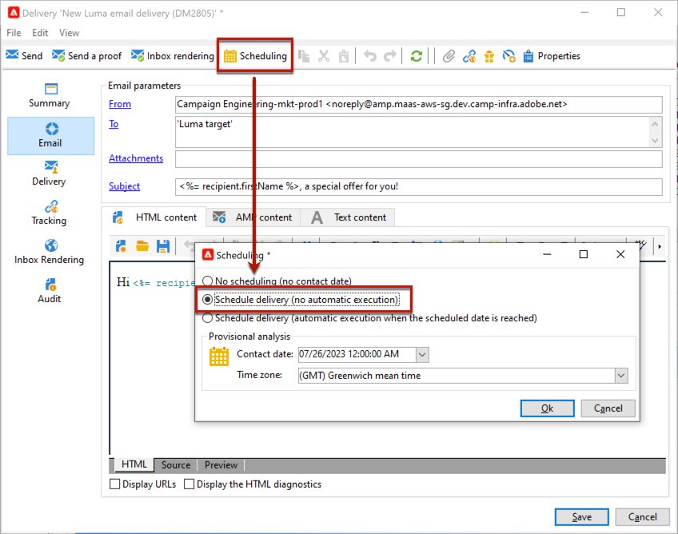

# Configurar e enviar a entrega {#configure-delivery}

Acesse os parâmetros de entrega para ajustar mais configurações e definir como enviar as mensagens. Você pode definir a entrega [prioridade](#delivery-priority), configurar [ondas](#sending-using-multiple-waves) e testar o envio da entrega. Quando esta configuração estiver concluída, você poderá confirmar o envio conforme descrito em [esta seção](#confirm-delivery). As mensagens são enviadas imediatamente ou de acordo com a [programação](#schedule-delivery-sending) de entrega.

## Definir parâmetros adicionais {#delivery-additional-parameters}

Antes de enviar a entrega, você poderá definir os parâmetros de envio nas propriedades da entrega, por meio da guia **[!UICONTROL Delivery]**.

### Prioridade de entrega {#delivery-priority}

Use a opção **[!UICONTROL Delivery priority]** para alterar a ordem de envio dos deliveries, definindo o nível de prioridade (de **[!UICONTROL Very low]** a **[!UICONTROL Very high]**) (o valor padrão é **[!UICONTROL Normal]**).

### Quantidade em lotes {#delivery-batch-quantity}

Use a opção **[!UICONTROL Message batch quantity]** para definir o número de mensagens agrupadas no mesmo pacote de entrega XML. Se o parâmetro for definido como 0, as mensagens serão automaticamente agrupadas. O tamanho do pacote é definido pelo cálculo `<delivery size>/1024`, com no mínimo 8 e no máximo 256 mensagens por pacote.

>[!IMPORTANT]
>
>Quando a entrega é criada duplicando uma existente, esse parâmetro é redefinido.

### Testar o envio do delivery

Use a opção **[!UICONTROL Test SMTP delivery]** para testar o envio via SMTP. A entrega é processada até a conexão com o servidor SMTP, mas não é enviada: para cada destinatário do delivery, o Campaign se conecta ao servidor do provedor SMTP, executa o comando SMTP RCPT TO e encerra a conexão antes do comando SMTP DATA.

>[!NOTE]
>
>* Essa opção não deve ser definida no mid-sourcing.
>
>* Saiba mais sobre a configuração do servidor SMTP na [documentação do Campaign Classic v7](https://experienceleague.adobe.com/docs/campaign-classic/using/installing-campaign-classic/additional-configurations/configure-delivery-settings.html?lang=pt-BR#smtp-relay){target="_blank"}.

## Enviar usando várias ondas {#sending-using-multiple-waves}

Para balancear a carga, você pode dividir entregas em vários lotes. Configure o número de lotes e sua proporção com relação à entrega inteira.

### Ativar ondas {#enable-waves}

Para definir ondas, siga estas etapas:

1. Abra as propriedades de entrega e navegue até a guia **[!UICONTROL Delivery]**.
1. Ative a opção **[!UICONTROL Send using multiple waves]** e clique no link **[!UICONTROL Define waves...]**.

   

### Configurar ondas {#config-waves}

>[!NOTE]
>
>Você só poderá definir o tamanho e o atraso entre duas ondas consecutivas. Os critérios de seleção de destinatário para cada onda não podem ser configurados.

Você pode definir o tamanho de cada onda ou adicioná-las a um calendário.

* **Defina o tamanho para cada onda**. Por exemplo, se você inserir **[!UICONTROL 30%]** no campo correspondente, cada onda representará 30% das mensagens incluídas na entrega, exceto a última, que representará 10% das mensagens.

  No campo **[!UICONTROL Period]**, especifique o atraso entre o início de duas ondas consecutivas. Por exemplo, se você inserir **[!UICONTROL 2d]**, a primeira onda começará imediatamente, a segunda onda começará em dois dias, a terceira onda em quatro dias e assim por diante.

  

* **Defina um calendário para enviar cada onda**.  Por exemplo, a primeira onda representa 25% do número total de mensagens incluídas no delivery e iniciará imediatamente. As próximas duas ondas completam a entrega e são definidas para começar em intervalos de seis horas.

  Na coluna **[!UICONTROL Start]**, especifique o atraso entre o início de duas ondas consecutivas. Na coluna **[!UICONTROL Size]**, insira um número fixo ou uma porcentagem.

  

### Verificação de agendamento de onda {#check-waves}

Uma regra de tipologia específica, **[!UICONTROL Wave scheduling check]**, garante que a última onda seja planejada antes do limite da validade da entrega. As tipologias de campanha e suas regras, configuradas na guia **[!UICONTROL Typology]** das propriedades de entrega, são apresentadas em [esta seção](../../automation/campaign-opt/campaign-typologies.md#typology-rules)<!--ref TBC-->.

>[!IMPORTANT]
>
>* Certifique-se de que as últimas ondas não excedam o prazo da entrega, que é definido na guia **[!UICONTROL Validity]**. Caso contrário, algumas mensagens podem não ser enviadas. Saiba mais sobre o período de validade de uma entrega em [esta seção](delivery-failures.md#valid-period).
>
>* Você também deve definir tempo suficiente para tentativas ao configurar as últimas ondas. Saiba mais sobre tentativas em [esta seção](delivery-failures.md#retries).

### Monitorar ondas {#monitor-waves}

Para monitorar seus envios, navegue até os logs do delivery. Ver [esta página](send.md)

Você pode ver as entregas que já foram enviadas nas ondas processadas (status **[!UICONTROL Sent]**) e as entregas a serem enviadas nas ondas restantes (status **[!UICONTROL Pending]**).

### Amostras de ondas {#samples-waves}

Os dois exemplos abaixo são os casos de uso mais comuns para usar várias ondas.

* **Durante o processo de aumento**

  Quando os emails são enviados usando uma nova plataforma, os provedores de serviços de Internet (ISPs) suspeitam de endereços IP que não são reconhecidos. Se grandes volumes de emails forem enviados repentinamente, os ISPs freqüentemente os marcam como spam.

  Para evitar ser marcado como spam, você poderá aumentar progressivamente o volume enviado usando ondas. Isso deve garantir o desenvolvimento suave da fase de inicialização e permitir que você reduza a taxa geral de endereços inválidos.

  Para fazer isso, use a opção **[!UICONTROL Schedule waves according to a calendar]**. Por exemplo, defina a primeira onda para 10%, a segunda para 15% e assim por diante.

  

* **Campanhas com uma central de atendimento**

  Ao gerenciar uma campanha de fidelidade por telefone, sua organização tem uma capacidade limitada de processamento do número de chamadas para contatar assinantes.

  Usando ondas, você poderá restringir o número de mensagens a 20 por dia, por exemplo, considerando a capacidade diária de processamento de uma central de atendimento.

  Para fazer isso, selecione a opção **[!UICONTROL Schedule multiple waves of the same size]**. Insira **[!UICONTROL 20]** como o tamanho da onda e **[!UICONTROL 1d]** no campo **[!UICONTROL Period]**.

  

## Confirmar o delivery {#confirm-delivery}

Quando o delivery estiver configurado e pronto para ser enviado, certifique-se de executar a análise do delivery antes de confirmar o envio.

Para fazer isso, siga as etapas abaixo.

1. Clique em **[!UICONTROL Send]** e selecione a ação desejada.

   * Para enviar a entrega imediatamente, selecione **[!UICONTROL Deliver as soon as possible]**.
   * Para agendar o envio para uma data posterior, selecione **[!UICONTROL Postpone the delivery]**. [Saiba mais](#schedule-delivery-sending)

1. Clique em **[!UICONTROL Analyze]**. Para obter mais informações, consulte [esta seção](delivery-analysis.md).

   

1. Depois de concluído, clique em **[!UICONTROL Confirm delivery]** para iniciar a entrega de mensagens.

   

1. Você pode fechar o assistente de entrega e controlar a execução da entrega a partir da guia **[!UICONTROL Delivery]**, acessível por meio do detalhe desta entrega ou pela lista de entregas.

   Para obter mais informações, consulte as seções abaixo:

   * [Monitoramento de uma entrega](send.md)
   * [Compreensão de falhas de entrega](delivery-failures.md)

<!--About message tracking-->

## Agendar o envio da entrega {#schedule-delivery-sending}

É possível adiar a entrega de mensagens para agendar a entrega ou gerenciar as regras de pressão e evitar o excesso de solicitações em relação a uma população.

1. Clique no botão **[!UICONTROL Send]** e selecione a opção **[!UICONTROL Postpone delivery]**.

1. Especifique uma data de início no campo **[!UICONTROL Contact date]**.

   

1. Inicie a análise de delivery e confirme o envio do delivery. No entanto, o envio da entrega não será iniciado até a data indicada no campo **[!UICONTROL Contact date]**.

   >[!IMPORTANT]
   >
   >Depois de iniciar a análise, a data de contato que você definiu será corrigida. Se você modificar essa data, será necessário reiniciar a análise para que suas modificações sejam levadas em conta.

   

Na lista de entrega, a entrega será exibida com o status **[!UICONTROL Pending]**.

O agendamento pode ser configurado de forma ascendente através do botão **[!UICONTROL Scheduling]** da entrega.

Isso permite adiar a entrega para uma data posterior ou salvar a entrega no calendário provisional.

* A opção **[!UICONTROL Schedule delivery (no automatic execution)]** permite agendar uma análise provisional da entrega.

  Quando essa configuração é salva, a entrega muda para o status **[!UICONTROL Targeting pending]**. A análise será iniciada na data especificada.

* A opção **[!UICONTROL Schedule delivery (automatic execution on planned date)]** permite especificar a data da entrega.

  Clique em **[!UICONTROL Send]** e selecione **[!UICONTROL Postpone delivery]**, depois inicie a análise e confirme a entrega. Quando a análise for concluída, o destinatário da entrega estará pronto e as mensagens serão automaticamente enviadas na data especificada.

Datas e horas são expressas no fuso horário do operador atual. A lista suspensa **[!UICONTROL Time zone]** localizada abaixo do campo de entrada de data do contato permite converter automaticamente a data e a hora inseridas para o fuso horário selecionado.

Por exemplo, se você agendar uma entrega para que ela seja executada automaticamente às 8h, horário de Londres, a hora será convertida automaticamente para o fuso horário selecionado:

<!--
## Adjust delivery failure management {#delivery-failure-management}

### Configure retries {#configure-retries}

Temporarily undelivered messages due to a **Soft** or **Ignored** error are subject to an automatic retry. The delivery failure types and reasons are presented in this [section](../../delivery/using/understanding-delivery-failures.md#delivery-failure-types-and-reasons).

>[!IMPORTANT]
>
>For hosted or hybrid installations, if you have upgraded to the [Enhanced MTA](../../delivery/using/sending-with-enhanced-mta.md), the retry settings in the delivery are no longer used by Campaign. Soft bounce retries and the length of time between them are determined by the Enhanced MTA based on the type and severity of the bounce responses coming back from the message's email domain.

For on-premise installations and hosted/hybrid installations using the legacy Campaign MTA, the central section of the **[!UICONTROL Delivery]** tab for delivery parameters indicates how many retries should be performed the day after the delivery and the minimum delay between retries.

By default, five retries are scheduled for the first day of the delivery with a minimum interval of one hour spread out over the 24 hours of the day. One retry per day is programmed after that and until the delivery deadline, which is defined in the **[!UICONTROL Validity]** tab (see [Defining validity period](#defining-validity-period)).

### Define the validity period {#define-validity-period}

When the delivery has been launched, the messages (and any retries) can be sent until the delivery deadline. This is indicated in the delivery properties, via the **[!UICONTROL Validity]** tab.

* The **[!UICONTROL Delivery duration]** field lets you enter the limit for global delivery retries. This means that Adobe Campaign sends the messages beginning on the start date, and then, for messages returning an error only, regular, configurable retries are performed until the validity limit is reached.

  You can also choose to specify dates. To do this, select **[!UICONTROL Explicitly set validity dates]**. In this case, the delivery and validity limit dates also let you specify the time. The current time is used by default, but you can modify this directly in the input field.

  >[!IMPORTANT]
  >
  >For hosted or hybrid installations, if you have upgraded to the [Enhanced MTA](../../delivery/using/sending-with-enhanced-mta.md), the **[!UICONTROL Delivery duration]** setting in your Campaign email deliveries will be used only if set to **3.5 days or less**. If you define a value higher than 3.5 days, it will not be taken into account.

* **Validity limit of resources**: The **[!UICONTROL Validity limit]** field is used for uploaded resources, mainly for the mirror page and images. The resources on this page are valid for a limited time (to save disk space).

  The values in this field can be expressed in the units listed in [this section](../../platform/using/adobe-campaign-workspace.md#default-units).
-->
