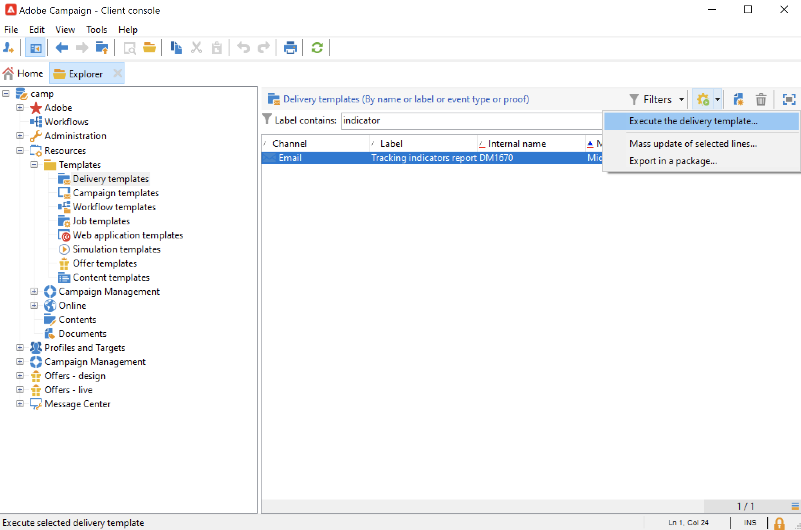

# Trabalho com modelos de entrega{#work-with-delivery-template}

Use modelos de entrega para padronizar a aparência criativa e ter maior rapidez na execução e na inicialização de campanhas.

Um modelo pode incluir:

* Tipologias
* Endereços de remetente e de resposta
* [blocos de personalização](../send/personalization-blocks.md) básicos
* Links para [mirror pages](../send/mirror-page.md) e links para unsubscription
* Conteúdo, logotipo da empresa ou assinatura
* Outras propriedades de entrega, como validade de recurso, parâmetros de nova tentativa ou configurações de quarentena.

 [Conheça este recurso no vídeo](#delivery-template-video)

## Criar um modelo{#create-a-delivery-template}

Para criar um modelo de entrega, você pode duplicar um modelo integrado, converter uma entrega já existente em um modelo ou criar um modelo de entrega do zero.

### Duplicação de um modelo já existente{#copy-an-existing-template}

O Campaign vem com um conjunto de modelos integrados para cada canal: email, push, SMS, correspondência direta e muito mais.

A maneira mais fácil de criar um modelo de entrega é duplicar e personalizar um modelo integrado.

Para duplicar um modelo de entrega, siga as etapas abaixo:

1. Navegue até **[!UICONTROL Resources > Templates > Delivery templates]** no Adobe Campaign Explorer.
1. Selecione um template do delivery incorporado. Os modelos integrados estão em negrito na lista.
1. Clique com o botão direito do mouse e selecione **[!UICONTROL Duplicate]**.

   

1. Defina as configurações do modelo e salve o novo modelo.

   

O modelo será adicionado à lista de modelos de entrega. Agora você pode selecioná-lo ao criar uma nova entrega.

### Conversão de uma entrega já existente em um modelo {#convert-an-existing-delivery}

Um delivery pode ser convertido em um template para novas ações de delivery repetidas.

Para converter uma entrega em um modelo, siga as etapas abaixo:

1. Selecione a entrega na lista de entrega, acessível por meio do nó **[!UICONTROL Campaign management]** do explorador do Campaign.

1. Clique com o botão direito do mouse e selecione **[!UICONTROL Actions > Save as template...]**.

   

1. Edite as propriedades do delivery e selecione a pasta onde o novo modelo deve ser salvo (no campo **[!UICONTROL Folder]**), e a pasta onde os deliveries criados com base nesse modelo devem ser criados (no campo **[!UICONTROL Execution folder]**).

   

### Criação de um novo modelo {#create-a-new-template}

>[!NOTE]
>
>Para evitar erros de configuração, a Adobe recomenda que você [duplique um modelo integrado](#copy-an-existing-template) e personalize suas propriedades ao invés de criar um novo modelo.

Para configurar um modelo de entrega do zero, siga as etapas abaixo:

1. Navegue até a pasta **Recursos** no explorador do Campaign e selecione **Modelos** e depois **Modelos de entrega**.
1. Clique em **New** na barra de ferramentas para criar um novo template de entrega.
1. Defina o **Rótulo** e o **Nome interno** da pasta.
1. Salve seu template e abra-o novamente.
1. No botão **Propriedades**, adapte as configurações.
1. Na guia **General**, confirme ou altere os locais selecionados nos menus suspensos **Execution folder**, **Folder**, e **Routing.**
1. Complete a categoria **Email parameters** com o assunto do email e o público alvo.
1. Adicione seu **conteúdo de HTML** para personalizar seu modelo. Você pode exibir um [link de mirror page](../send/mirror-page.md) e um link de unsubscription.
1. Selecione a guia **Preview.** No menu suspenso **Test personalization**, selecione **Destinatário** para visualizar seu template como o perfil escolhido.
1. Clique em **Save**. Seu template está pronto para ser usado em uma entrega.

## Usar modelos{#use-a-delivery-template}

### Criar uma entrega a partir de um modelo{#create-a-delivery-from-a-template}

Para criar uma entrega com base em um modelo existente, selecione um modelo disponível na lista..

Se não conseguir ver o modelo, clique na pasta **[!UICONTROL Select link]** à direita do campo para procurar pastas do Campaign.

Selecione o diretório desejado no campo **[!UICONTROL Folder]** ou clique no ícone **[!UICONTROL Display sub-levels]** para exibir o conteúdo dos diretórios nas subárvores do diretório atual.

Selecione o template de entrega a ser usado e clique em **[!UICONTROL Ok]**.

### Executar um modelo {#execute-a-template}

Você pode iniciar a execução de um template diretamente da lista de templates sem criar um delivery primeiro.

Para fazer isso, selecione o template a ser executado e clique com o botão direito do mouse. Selecione **[!UICONTROL Actions>Execute the delivery template...]**.

Você também pode usar **[!UICONTROL File>Actions>Execute the delivery template...]**.

Insira os parâmetros de entrega e clique em **[!UICONTROL Send]**.

Essa ação gera um delivery na pasta associada ao template. O nome dessa entrega é o nome do template de entrega do qual foi criado.

## Tutoriais em vídeo {#delivery-template-video}

### Como configurar um template de entrega

O vídeo a seguir mostra como configurar um modelo para uma entrega ad hoc.

>[!VIDEO](https://video.tv.adobe.com/v/342082?quality=12)

### Como configurar propriedades de templates de entrega

O vídeo a seguir mostra como definir as propriedades do template de entrega e explica em detalhes cada propriedade.

>[!VIDEO](https://video.tv.adobe.com/v/338969?quality=12)

### Como implantar um template de entrega ad-hoc

Este vídeo explica como implantar um template de entrega de email ad-hoc, bem como a diferença entre uma entrega de email e um workflow de entrega.

>[!VIDEO](https://video.tv.adobe.com/v/338965?quality=12)

Vídeos extras explicativos do Campaign estão disponíveis [aqui](https://experienceleague.adobe.com/docs/campaign-learn/tutorials/getting-started/introduction-to-adobe-campaign.html){target="_blank"}.
