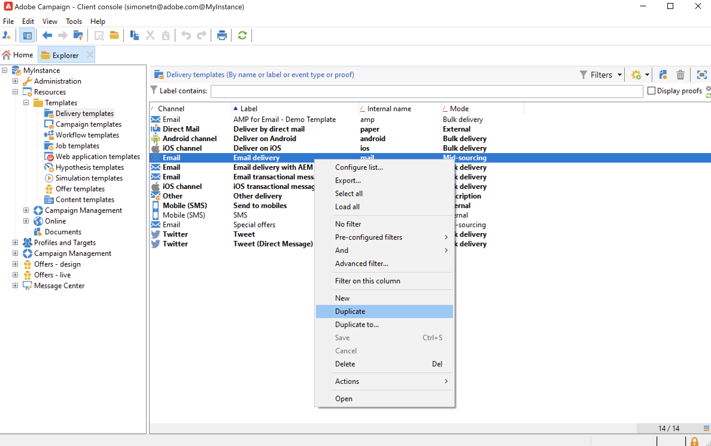
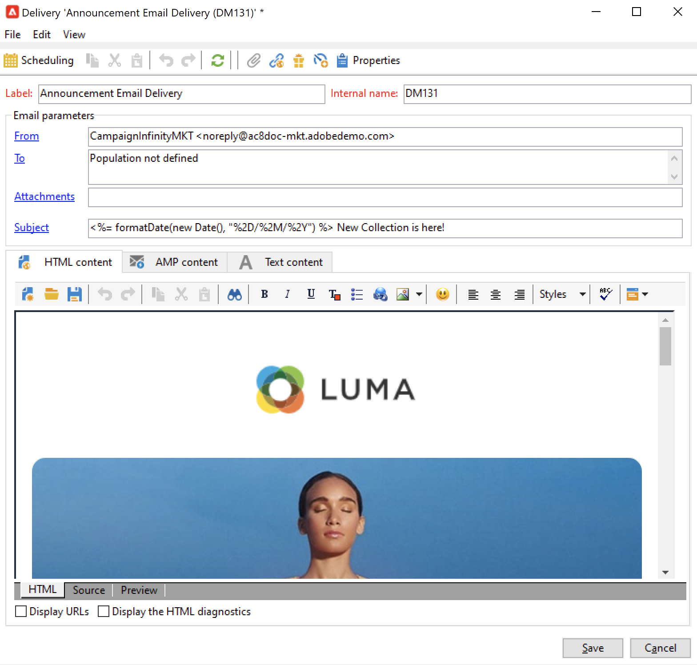
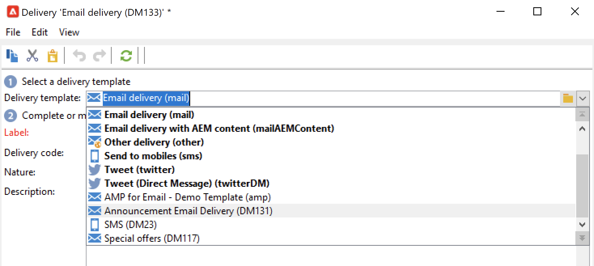
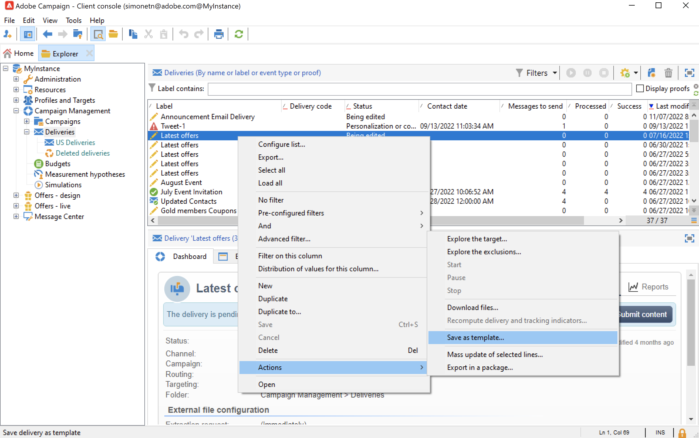
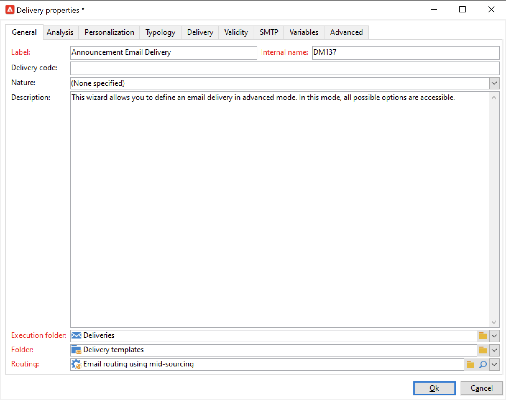
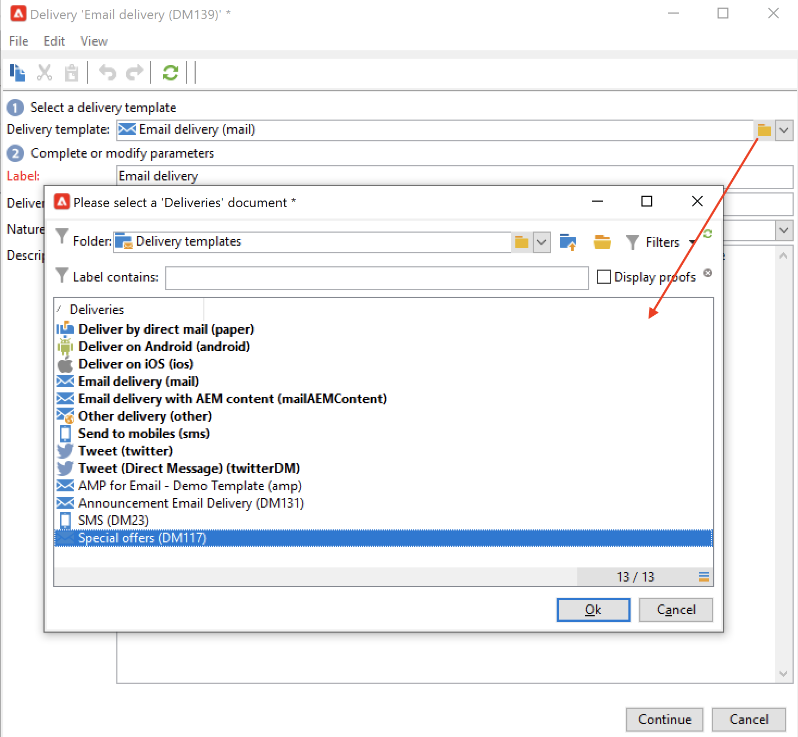
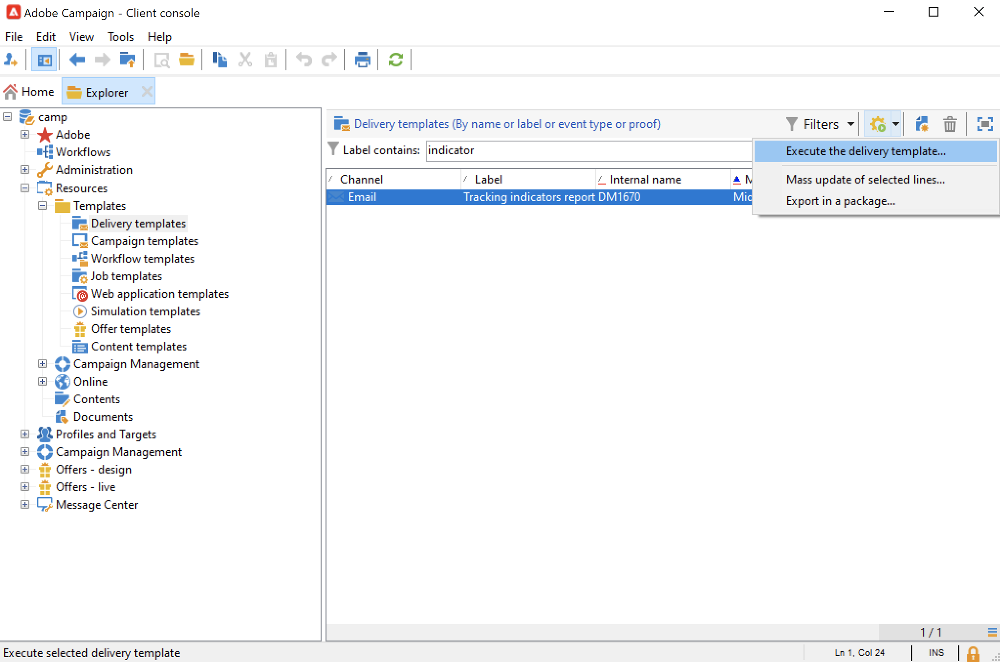

# Trabalho com modelos de entrega {#work-with-delivery-template}

## Introdução a modelos de entrega

Cada delivery é criado com base em um template. Um template é uma configuração que pode ser reutilizada para facilitar e padronizar a implementação. Você pode usar um modelo incorporado ou personalizado.

Um modelo pode incluir definições de configuração parciais ou completas, como:

* [Regras de tipologia](../../automation/campaign-opt/campaign-typologies.md)
* Endereços de remetente e de resposta
* [blocos de personalização](../send/personalization-blocks.md) básicos
* Links para [mirror pages](../send/mirror-page.md) e links para unsubscription
* Conteúdo, logotipo da empresa ou assinatura
* Outras propriedades de entrega, como validade de recurso, parâmetros de nova tentativa ou configurações de quarentena.

 [Conheça este recurso no vídeo](#delivery-template-video)

Os modelos de entrega são armazenados na pasta **[!UICONTROL Resources > Templates > Delivery templates]** do Explorer. No Adobe Campaign, você pode trabalhar com dois tipos de modelos:

1. Modelos de entrega **internos** do Adobe Campaign - Os modelos internos estão disponíveis para cada canal. ELES NÃO DEVEM ser modificados nem excluídos. Eles incluem uma configuração básica para cada canal de delivery. Como Administrador, você pode definir valores padrão ou restringir determinadas funções aos usuários finais, como modificar os parâmetros de rastreamento, endereços de email de remetentes e muito mais. Os modelos incorporados aparecem em negrito na lista de modelos.

1. Modelos de entrega **personalizados** - Como Administrador do Adobe Campaign, você pode criar novos modelos de entrega. A prática recomendada é duplicar e atualizar um modelo incorporado em vez de criar um modelo do zero. Por exemplo, você pode configurar um template de delivery de email e, quando os usuários criam um delivery a partir desse template, eles precisam apenas inserir o texto ou o conteúdo do HTML. Todas as outras configurações já estão definidas.

>[!NOTE]
>
>Os modelos disponíveis dependem dos direitos de acesso, da sua configuração de instância e do contexto. Por exemplo, ao criar um serviço de informações, é possível vincular um template de entrega para mensagens de confirmação: você pode então acessar apenas os modelos cujo target mapping é o mapeamento de subscrição. Outros modelos não estão visíveis neste contexto. Para obter mais informações, consulte [Trabalhar com mapeamentos de destino](../audiences/target-mappings.md) e [Gerenciar assinaturas e cancelar assinaturas](../start/subscriptions.md).

## Criar um modelo {#create-a-delivery-template}

Para criar um template do delivery, você pode duplicar um template incorporado ou converter um delivery existente em um template. Você também pode criar um template do delivery do zero, mas isso não é recomendado. Esses métodos são detalhados abaixo.

### Duplicação de um modelo já existente{#copy-an-existing-template}

O Campaign vem com um conjunto de modelos integrados para cada canal: email, push, SMS, correspondência direta e muito mais.

A maneira mais fácil de criar um modelo de entrega é duplicar e personalizar um modelo integrado.

Para duplicar um modelo de entrega, siga as etapas abaixo:

1. Navegue até **[!UICONTROL Resources > Templates > Delivery templates]** no Adobe Campaign Explorer.
1. Selecione um template do delivery incorporado. Os modelos integrados estão em negrito na lista.
1. Clique com o botão direito do mouse e selecione **[!UICONTROL Duplicate]**.

   

1. Defina as configurações do modelo e salve o novo modelo.

   

O modelo será adicionado à lista de modelos de entrega. Agora você pode selecioná-lo ao criar uma nova entrega.

### Conversão de uma entrega já existente em um modelo {#convert-an-existing-delivery}

Um delivery pode ser convertido em um template para novas ações de delivery repetidas.

Para converter uma entrega em um modelo, siga as etapas abaixo:

1. Selecione a entrega na lista de entrega, acessível por meio do nó **[!UICONTROL Campaign management]** do explorador do Campaign.

1. Clique com o botão direito do mouse e selecione **[!UICONTROL Actions > Save as template...]**.

   

1. Edite as propriedades do delivery e selecione a pasta onde o novo modelo deve ser salvo (no campo **[!UICONTROL Folder]**), e a pasta onde os deliveries criados com base nesse modelo devem ser criados (no campo **[!UICONTROL Execution folder]**).

   

### Criação de um novo modelo {#create-a-new-template}

>[!NOTE]
>
>Para evitar erros de configuração, a Adobe recomenda que você [duplique um modelo integrado](#copy-an-existing-template) e personalize suas propriedades ao invés de criar um novo modelo.

Para configurar um modelo de entrega do zero, siga as etapas abaixo:

1. Navegue até a pasta **Recursos** no explorador do Campaign e selecione **Modelos** e depois **Modelos de entrega**.
1. Clique em **New** na barra de ferramentas para criar um novo modelo de entrega.
1. Defina o **Rótulo** e o **Nome interno** da pasta.
1. Salve seu modelo e abra-o novamente.
1. No botão **Propriedades**, adapte as configurações.
1. Na guia **General**, confirme ou altere os locais selecionados nos menus suspensos **Execution folder**, **Folder**, e **Routing.**
1. Complete a categoria **Email parameters** com o assunto do email e a população de destino.
1. Adicione seu **conteúdo do HTML** para personalizar seu modelo. Você pode exibir um [link de mirror page](../send/mirror-page.md) e um link de unsubscription.
1. Selecione a guia **Preview.** No menu suspenso **Test personalization**, selecione **Destinatário** para visualizar seu modelo como o perfil escolhido.
1. Clique em **Save**. Seu modelo está pronto para ser usado em uma entrega.

## Usar modelos {#use-a-delivery-template}

### Criar uma entrega a partir de um modelo {#create-a-delivery-from-a-template}

Para criar uma entrega com base em um modelo existente, selecione um modelo disponível na lista..

Se não conseguir ver o modelo, clique na pasta **[!UICONTROL Select link]** à direita do campo para procurar pastas do Campaign.

Selecione o diretório desejado no campo **[!UICONTROL Folder]** ou clique no ícone **[!UICONTROL Display sub-levels]** para exibir o conteúdo dos diretórios nas subárvores do diretório atual.

Selecione o modelo de entrega a ser usado e clique em **[!UICONTROL Ok]**.

### Executar um modelo {#execute-a-template}

Você pode iniciar a execução de um modelo diretamente da lista de modelos sem criar uma entrega primeiro. O modelo de entrega pode ser executado manualmente, conforme detalhado abaixo, ou acionado por um evento (executado em um horário definido, quando um arquivo está disponível no servidor, etc.), conforme explicado em [esta seção](https://experienceleague.adobe.com/en/docs/campaign/automation/workflows/wf-activities/action-activities/delivery).

Para executar um template manualmente, siga estas etapas:

1. Selecione o template a ser executado e clique com o botão direito do mouse. Selecione **[!UICONTROL Actions>Execute the delivery template...]**.

   Você também pode usar **[!UICONTROL File>Actions>Execute the delivery template...]**.

   

1. Insira os parâmetros de entrega e clique em **[!UICONTROL Send]**.

Essa ação gera um delivery na pasta associada ao template. O nome dessa entrega é o nome do modelo de entrega do qual foi criado.

## Tutoriais em vídeo {#delivery-template-video}

### Como configurar um modelo de entrega

O vídeo a seguir mostra como configurar um modelo para uma entrega ad hoc.

>[!VIDEO](https://video.tv.adobe.com/v/342082?quality=12)

### Como configurar propriedades de modelos de entrega

O vídeo a seguir mostra como definir as propriedades do modelo de entrega e explica em detalhes cada propriedade.

>[!VIDEO](https://video.tv.adobe.com/v/338969?quality=12)

### Como implantar um modelo de entrega ad-hoc

Este vídeo explica como implantar um modelo de entrega de email ad-hoc, bem como a diferença entre uma entrega de email e um fluxo de trabalho de entrega.

>[!VIDEO](https://video.tv.adobe.com/v/338965?quality=12)

Vídeos extras explicativos do Campaign estão disponíveis [aqui](https://experienceleague.adobe.com/docs/campaign-learn/tutorials/getting-started/introduction-to-adobe-campaign.html){target="_blank"}.
