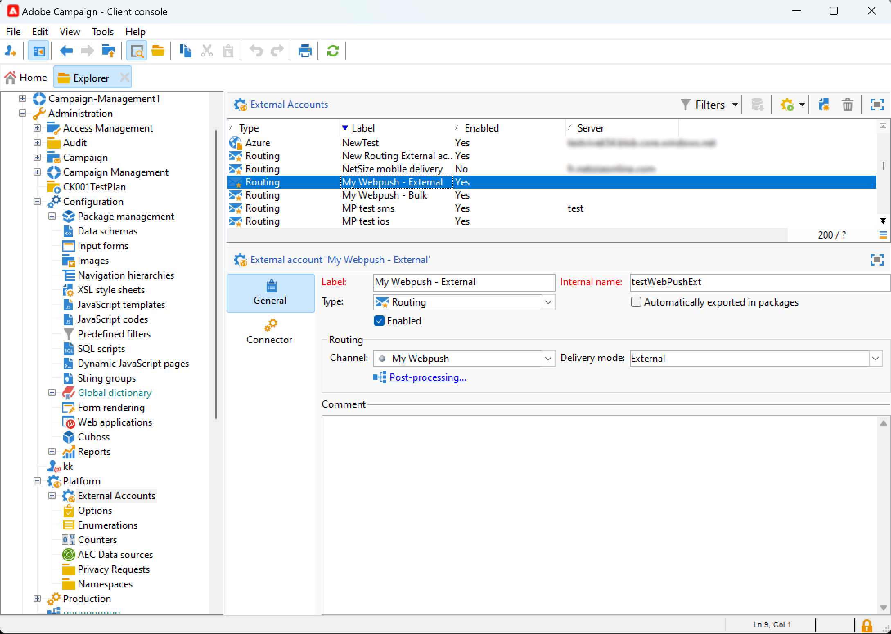

# Introdução a canais personalizados {#gs-custom-channel}

O Adobe Campaign permite criar canais externos ou de API personalizados integrados a terceiros. Em seguida, você pode orquestrar e executar deliveries com base nesses canais.

A criação e o envio do delivery podem ser executados no Console do cliente e na interface do usuário da Web. No entanto, a configuração do canal personalizado só é executada no Console do cliente.

Para saber como criar e enviar uma entrega com base em um canal personalizado, consulte esta [página](https://experienceleague.adobe.com/docs/campaign-web/v8/msg/gs-custom-channel.html){target="_blank"}.

Estas são as etapas para configurar um novo canal personalizado no Console do cliente. Essas etapas são comuns aos canais externos e de API personalizados:

1. Configurar o esquema, [leia mais](#configure-schema)
1. Crie uma nova conta externa, [leia mais](#create-ext-account)
1. Criar um novo modelo de entrega, [leia mais](#create-template)

Os canais de API personalizados exigem configuração adicional. [Leia mais](#api-additional)

## Configurar o esquema{#configure-schema}

Primeiro, é necessário configurar o schema para adicionar o novo canal à lista de canais disponíveis.

1. No Campaign Explorer, selecione **Administração** > **Configuração** > **Esquemas de dados**.

1. Crie uma extensão de esquema para estender a enumeração messageType com o novo canal.

   Por exemplo:

   ```
   <enumeration basetype="byte" default="mail" label="Channel" name="messageType">
   <value desc="My Webpush" img="ncm:channels.png" label="My Webpush" name="webpush"
          value="122"/>
   </enumeration>
   ```

   {zoomable="yes"}

## Criar uma nova conta externa{#create-ext-account}

Em seguida, é necessário criar uma nova conta externa de roteamento.

1. No Campaign Explorer, selecione **Administração** > **Plataforma** > **Contas externas**.

1. Crie uma nova conta externa.

1. Selecione o canal e altere o modo de delivery. Escolha **Externo** para canais externos personalizados e **Em massa** para canais de API personalizados.

   {zoomable="yes"}

## Criar um novo modelo de entrega{#create-template}

Agora, vamos criar o novo modelo associado ao novo canal.

1. No Campaign Explorer, selecione **Recursos** > **Modelos** > **Modelos de entrega**.

1. Crie um novo modelo.

1. Clique em **Propriedades** e selecione a pasta correta e o roteamento.

   {zoomable="yes"}

O novo canal agora está disponível. Você pode criar e executar deliveries com base neste canal.

## Configuração adicional da API personalizada{#api-additional}

Estas são as principais etapas adicionais para configurar canais de API personalizados.

### Estender o esquema{#api-additional-schema}

No Console do Cliente, estenda o esquema **Delivery** com todas as propriedades adicionais necessárias para o canal personalizado.

Para obter mais informações sobre extensão de esquema, consulte esta [página](../dev/extend-schema.md).

### Configurar a definição de tela personalizada{#api-additional-screen}

Na interface do usuário da Web do Campaign, configure a definição de tela personalizada:

1. Abra o esquema **Entrega** e clique em **Edição de tela**.

   {zoomable="yes"}

1. Selecione a guia que corresponde ao canal e defina como os campos serão exibidos na tela de conteúdo do delivery. Para obter mais informações sobre edição de tela, consulte esta [página](https://experienceleague.adobe.com/docs/campaign-web/v8/conf/schemas.html#fields){target="_blank"}.

   {zoomable="yes"}

1. Na seção **Visualizar para simular conteúdo**, selecione o JSPP dedicado. Isso é opcional. Isso ativará a pré-visualização na tela de simulação do delivery. [Leia mais](#api-additional-preview)

### Configurar a visualização{#api-additional-preview}

Essa configuração é opcional. Se você quiser ativar a visualização na interface da Web, na tela de simulação de entrega, será necessário configurar uma JSSP dedicada no Console do cliente.

Ao clicar em **Abrir visualização** na tela de simulação de entrega na interface do usuário da Web, os seguintes parâmetros são passados na URL:

`https://adobe.campaign.adobe.com/cus/webPushMessagePreview.jssp?deliveryId=%40ToPzTurO9aGzQxYcMArBbA%3D%3D&id=%40oF8Fi17txuLmtiOFj4OIjQ%3D%3D`

* `deliveryId`: o identificador de entrega
* `id`: o identificador do perfil

No Console do Cliente, selecione **Administração** > **Configuração** > **Páginas do Dynamic JavaScript** e crie um novo JSSP. Veja um exemplo com os parâmetros que precisam ser recuperados.

```
<%@ page import="xtk:shared/nl.js"
%><%
  NL.require("/nl/core/shared/core.js")
    .require('/nl/core/jsspcontext.js')
    .require('/nl/core/shared/dataTypes.js')
    .require('/nl/core/schema.js');
    
  //response.setContentType("text/plain");
  var parameters = request.parameters;
  var deliveryId = decryptString(parameters.deliveryId);
  var oldUserContext = logonEscalation("neolane")
  
   var delivery = xtk.queryDef.create(<queryDef schema="nms:delivery" operation="getIfExists">
                                         <select>
                                           <node expr="[WebpushParameters/@richMediaOptions]" alias="@richMediaOptions"/>
                                           <node expr="[WebpushParameters/@mediaUrlInfo]" alias="@mediaUrlInfo"/>
                                           <node expr="[WebpushParameters/@WebpushMessageType]"/>
                                         </select>
                                         <where>
                                           <condition expr={"@id = " + NL.XTK.toXTKString(deliveryId)}/>
                                         </where>
                                       </queryDef>).ExecuteQuery();

  // Restore previous context
  logonWithContext(oldUserContext)
%>

<!DOCTYPE html ...
```

### Implementação técnica{#api-additional-technical}

Dependendo do canal personalizado, será necessário configurar outras partes do aplicativo, como: contas externas, target mapping, código JavaScript para API etc.

