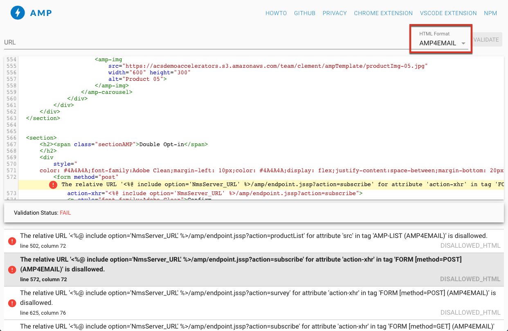

# Definir o conteúdo interativo{#defining-interactive-content}

O Adobe Campaign possibilita utilizar o formato interativo [AMP for Email](https://amp.dev/pt_br/about/email/), que permite o envio de emails dinâmicos, sob determinadas condições.

Com o AMP para Email você pode:
* Testar a entrega de emails do AMP para endereços específicos configurados adequadamente.
* Entregar emails do AMP para endereços do Gmail ou Mail.ru depois de fazer o registro nos provedores correspondentes.

Para obter mais informações sobre teste e envio de emails do AMP, consulte [esta seção](#targeting-amp-email).

Esse recurso está disponível por meio de um pacote dedicado no Adobe Campaign. Dependendo das suas permissões e do modelo de implantação, é possível instalar esse pacote ou entrar em contato com a Adobe para solicitar a instalação.

## Sobre o AMP for Email {#about-amp-for-email}

Use o novo formato do **AMP for Email** para incluir componentes do AMP em suas mensagens e melhorar a experiência de email com um conteúdo relevante e acionável. Com a funcionalidade moderna do aplicativo disponível diretamente nos emails, os destinatários podem interagir dinamicamente com o conteúdo na própria mensagem.

Por exemplo:
* Os emails escritos com o AMP podem conter elementos interativos, como carrosséis de imagens.
* O conteúdo permanece atualizado na mensagem.
* Os destinatários podem responder a um formulário sem sair da caixa de entrada.

O AMP for Email é compatível com emails existentes. A versão do AMP da mensagem é incorporada ao email como uma nova parte MIME, além do HTML e/ou texto simples, garantindo a compatibilidade entre todos os clientes.

Para obter mais informações sobre o formato, a especificação e os requisitos do AMP for Email, consulte a [documentação do desenvolvedor do AMP](https://amp.dev/documentation/guides-and-tutorials/learn/email-spec/amp-email-format/?format=email).

 [Descubra este recurso no vídeo](#amp-email-video)

## As principais etapas para usar o AMP for Email com o Adobe Campaign {#key-steps-to-use-amp}

Para testar e enviar um email do AMP com o Adobe Campaign com sucesso, siga as etapas abaixo:
1. Crie um email e construa seu conteúdo do AMP dentro do Adobe Campaign. Consulte [Criar conteúdo de email do AMP com o Adobe Campaign](#build-amp-email-content).
1. Siga todos os requisitos de entrega dos provedores de email compatíveis com o formato AMP. Consulte [Requisitos de entrega do AMP for Email](#amp-for-email-delivery-requirements).
1. Ao definir seu público alvo, selecione os destinatários que podem exibir o formato AMP. Consulte [Direcionamento de um email do AMP](#targeting-amp-email).

   >[!NOTE]
   >
   >Atualmente, você só pode entregar emails do AMP para [endereços de email específicos](#testing-amp-delivery-for-selected-addresses) (para fins de teste) ou, após o [registro](#delivering-amp-emails-by-registering), para clientes de email compatíveis.

1. Envie o email como faria normalmente. Consulte [Envio de um email do AMP](#sending-amp-email).

## Criar um conteúdo de email do AMP no Adobe Campaign {#build-amp-email-content}

Para criar um email por meio do uso do formato AMP, siga as etapas abaixo.

>[!IMPORTANT]
>
>Siga os requisitos e especificações detalhados do AMP for Email na [Documentação do desenvolvedor do AMP](https://amp.dev/documentation/guides-and-tutorials/learn/email_fundamentals/?format=email). Também é possível consultar as [Práticas recomendadas do AMP for Email](https://amp.dev/documentation/guides-and-tutorials/develop/amp_email_best_practices/?format=email).

1. Ao criar a entrega de email, selecione qualquer template.

   >[!NOTE]
   >
   >Um modelo específico do AMP contém um exemplo dos principais recursos que podem ser usados: lista de produtos, carrossel, aceitação dupla, pesquisa e solicitação de servidor avançado.

1. Clique na guia **[!UICONTROL AMP content]**.

   

1. Edite o conteúdo do AMP de acordo com as necessidades.

   >[!NOTE]
   >
   >Para obter mais informações sobre a criação do primeiro email AMP, consulte a [documentação do desenvolvedor do AMP](https://amp.dev/documentation/guides-and-tutorials/start/create_email/?format=email).

   Por exemplo, é possível usar o componente de lista de produtos do template do AMP e manter uma lista de produtos de um sistema de terceiros ou mesmo dentro do Adobe Campaign. Sempre que você ajusta um preço ou outro elemento, ele é refletido automaticamente quando os destinatários abrem o email na sua caixa de entrada.

1. Personalize o conteúdo do AMP conforme necessário, como faria com o formato HTML no Adobe Campaign, com campos e blocos de personalização.

   

1. Depois de concluir a edição, selecione todo o conteúdo do AMP e copie/cole no [AMP web-based validator](https://validator.ampproject.org) ou em um site semelhante.

   >[!NOTE]
   >
   >Selecione o **AMP4 EMAIL** na lista suspensa na parte superior da tela.

   

   Os erros são sinalizados em linha.

   >[!NOTE]
   >
   >O editor do Adobe Campaign AMP não foi projetado para validação de conteúdo. Use um site externo, como o [Validador web do AMP](https://validator.ampproject.org) para verificar se o conteúdo está correto.

1. Faça as alterações necessárias até que o conteúdo do AMP passe na validação.

   

1. Para pré-visualizar o conteúdo, copie e cole o conteúdo validado no [AMP Playground](https://playground.amp.dev) ou em um site semelhante.

   >[!NOTE]
   >
   >Selecione o **AMP for Email** na lista suspensa na parte superior da tela.

   

   >[!NOTE]
   >
   >Não é possível visualizar o conteúdo do AMP diretamente no Adobe Campaign. Use um site externo, como o [AMP Playground](https://playground.amp.dev).

1. Retorne ao Adobe Campaign e copie/cole o conteúdo validado na guia **[!UICONTROL AMP content]**.

1. Alterne para a guia **[!UICONTROL HTML content]** ou **[!UICONTROL Text content]** e defina o conteúdo para pelo menos um desses dois formatos.

   >[!IMPORTANT]
   >
   >Se o email não contiver uma versão HTML ou de texto sem formatação além do conteúdo do AMP, ele não poderá ser enviado.

## Requisitos de entrega do AMP for Email {#amp-for-email-delivery-requirements}

Ao criar o conteúdo do AMP no Adobe Campaign, para que um email dinâmico seja entregue, é necessário atender às condições que são específicas dos provedores de email dos destinatários.

Atualmente, dois provedores de email são compatíveis com o teste deste formato: Gmail e Mail.ru.

Todas as etapas e especificações necessárias para testar a entrega com o formato AMP em contas do Gmail estão detalhadas nas documentações de desenvolvedor correspondentes do [Gmail](https://developers.google.com/gmail/ampemail?) e do [Mail.ru](https://postmaster.mail.ru/amp).

Em particular, os seguintes requisitos devem ser atendidos:
* Siga os requisitos de segurança específicos do AMP para o [Gmail](https://developers.google.com/gmail/ampemail/security-requirements) e [Mail.ru](https://postmaster.mail.ru/amp/#howto).
* A parte AMP MIME deve conter um [documento AMP válido](https://amp.dev/documentation/guides-and-tutorials/learn/validation-workflow/validate_emails/?format=email).
* A parte AMP MIME deve ter menos que 100KB.

Você também pode consultar a documentação [Dicas e limitações conhecidas do Gmail](https://developers.google.com/gmail/ampemail/tips).

## Direcionamento de um email do AMP {#targeting-amp-email}

Atualmente, você pode experimentar o envio de um email AMP em duas etapas:

1. O Adobe Campaign permite testar a entrega de um email dinâmico alimentado pela AMP para endereços de email selecionados e adequadamente configurados, a fim de verificar o conteúdo e comportamento. Consulte [Teste de entrega de email AMP para endereços selecionados](#testing-amp-delivery-for-selected-addresses).

1. Depois de testado, é possível enviar uma entrega ou uma campanha como parte do programa AMP for Email, registrando-se com os provedores de email relevantes, para que o domínio do remetente seja incluído na lista de permissões. Consulte [Delivery de emails do AMP por meio de registro em um provedor de email](#delivering-amp-emails-by-registering).

### Teste de entrega de email do AMP para endereços selecionados {#testing-amp-delivery-for-selected-addresses}

É possível testar o envio de mensagens dinâmicas do Adobe Campaign para endereços de email selecionados.

>[!NOTE]
>
>Atualmente, apenas o Gmail e o Mail.ru são compatíveis com testes no formato AMP.

Para o Gmail, é necessário adicionar primeiro o(s) endereço(s) do remetente à lista de permissão para utilizar o Adobe Campaign para entregar às contas do Gmail desejadas.

Para fazer isso:
1. Verifique se a opção que permite o email dinâmico está marcada para os provedores de email relevantes.
1. Copie o endereço do remetente exibido no campo **[!UICONTROL From]** da entrega e cole-o na seção apropriada das configurações da conta do provedor de email.

Para mais detalhes, consulte a documentação do desenvolvedor do [Gmail](https://developers.google.com/gmail/ampemail/testing-dynamic-email).

Para testar o envio de um email do AMP para um endereço Mail.ru, siga as etapas da [documentação do desenvolvedor do Mail.ru](https://postmaster.mail.ru/amp/#howto) (seção **Se você for um usuário**).

### Entrega de emails do AMP por meio do registro em um provedor de email {#delivering-amp-emails-by-registering}

Você pode experimentar a entrega de emails dinâmicos registrando-se com os provedores de email aceitos, para que o domínio do remetente seja adicionado à lista de permissões.

>[!NOTE]
>
>Apenas o Gmail e o Mail.ru são compatíveis com o formato AMP.

Depois de testar com alguns endereços, é possível enviar emails do AMP para qualquer endereço do Gmail. Para fazer isso, é necessário fazer o registro no Google e aguardar a resposta. Siga as etapas apresentadas apresentadas na documentação do desenvolvedor do [Gmail](https://developers.google.com/gmail/ampemail/register?hl=pt-br). Após o registro bem-sucedido, você se torna um remetente autorizado.

Para enviar o emails AMP para endereços Mail.ru, siga os requisitos e as etapas listados na [documentação do desenvolvedor do Mail.ru](https://postmaster.mail.ru/amp/#howto) (**Caso seja uma seção de remetente** de email).

## Envio de um email do AMP {#sending-amp-email}

Quando o conteúdo e o fallback do AMP estiverem prontos e um público alvo compatível tiver sido definido, será possível enviar o email normalmente.

Atualmente, somente o Gmail e o Mail.ru são compatíveis com o formato AMP, sob determinadas condições. É possível direcionar os endereços de outros provedores de email, mas eles receberão a versão HTML ou texto simples do email.

>[!IMPORTANT]
>
>Se o email não contiver uma versão HTML ou de texto sem formatação além do conteúdo do AMP, ele não poderá ser enviado.

Os destinatários correspondentes tem a versão AMP do email exibida na caixa de correio.

Por exemplo, se uma lista de produtos é incluída no email, ao editar os preços em um sistema de terceiros, esses dados são automaticamente ajustados sempre que os destinatários abrirem novamente a mensagem na caixa de correio.

>[!NOTE]
>
>Por padrão, a opção **[!UICONTROL AMP inclusion]** está definida como **[!UICONTROL No]**.

## Tutorial em vídeo {#amp-email-video}

O vídeo abaixo explica como ativar o AMP no Adobe Campaign e mostra sua utilização.

>[!VIDEO](https://video.tv.adobe.com/v/29940?quality=12&learn=on)
