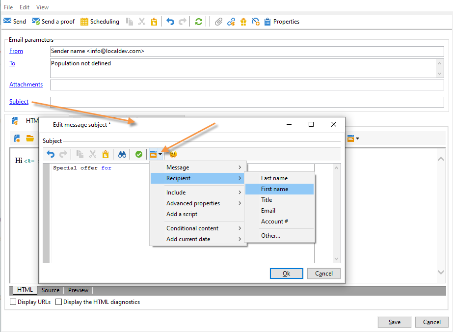
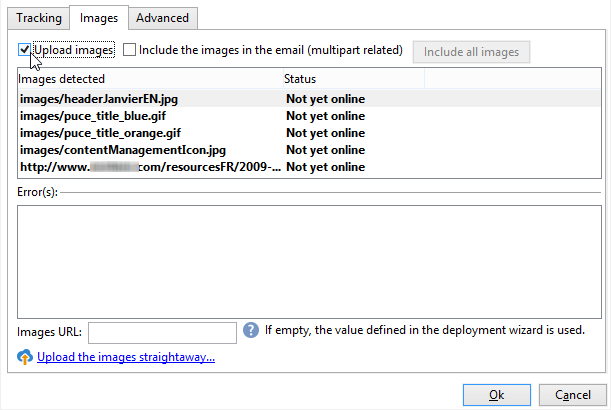
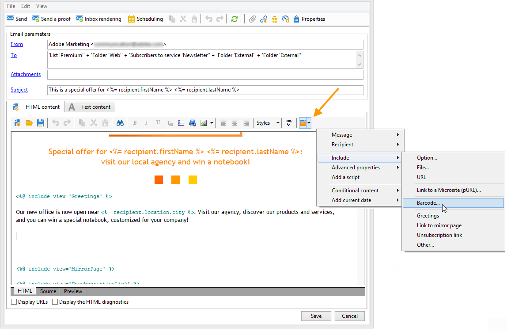
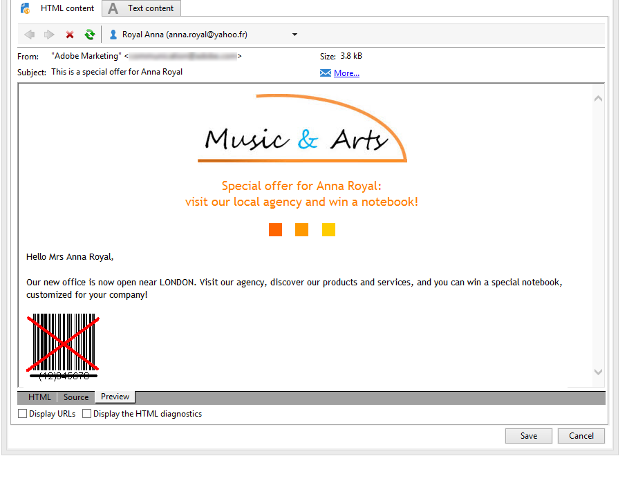

# Definir o conteúdo do email {#defining-the-email-content}

## Remetente {#sender}

Para definir o nome e o endereço do remetente que aparecerá no cabeçalho das mensagens enviadas, clique no link **[!UICONTROL From]**.

Todas as informações necessárias para criação dos cabeçalhos de mensagens de email devem ser inseridas nessa janela. Essas informações podem ser personalizadas. Para fazer isso, use os botões à direita dos campos de entrada para inserir campos de personalização.

Para saber como inserir e usar campos de personalização, consulte [esta seção](personalize.md).

>[!NOTE]
>
>* O endereço do remetente é usado para respostas por padrão.
>* Os parâmetros do cabeçalho não devem ficar vazios. Por padrão, eles contêm a entrada de valores ao configurar o assistente de implantação.
>* O endereço do remetente é obrigatório para possibilitar o envio de um email (padrão RFC).
>* O Adobe Campaign verifica a sintaxe dos endereços de email inseridos.

>[!CAUTION]
>
>Para evitar problemas da capacidade de entrega, as contas de email que correspondem aos endereços especificados para entregas e respostas devem existir e precisam ser monitoradas. Verifique com o administrador do sistema.

## Assunto da mensagem {#message-subject}

O assunto da mensagem é configurado no campo correspondente. Você pode inseri-lo diretamente no campo ou clicar no link **[!UICONTROL Subject]** para inserir um script. O link de personalização permite inserir campos de banco de dados no assunto.

>[!IMPORTANT]
>
>O assunto da mensagem é obrigatório.

O conteúdo do campo será substituído pelo valor no perfil do destinatário quando a mensagem for enviada.

Por exemplo, na mensagem acima, o assunto da mensagem é personalizado para cada destinatário com dados do seu perfil.

>[!NOTE]
>
>O uso de campos de personalização é apresentado em [esta seção](personalize.md).

Também é possível inserir emoticons na linha do assunto com a janela pop-up **[!UICONTROL Insert emoticon]**.

## Conteúdo da mensagem {#message-content}

>[!IMPORTANT]
>
>Por motivos de privacidade, recomendamos usar HTTPS para todos os recursos externos.

O conteúdo da mensagem é definido na seção inferior da janela de configuração de entrega.

As mensagens são enviadas em formato de texto ou HTML por padrão, de acordo com a preferência do destinatário. Recomendamos a criação de conteúdo nos dois formatos para garantir que as mensagens possam ser exibidas corretamente em qualquer sistema de email. Para obter mais informações, consulte [Seleção de formatos de mensagem](email-parameters.md#selecting-message-formats).

* Para importar um conteúdo HTML, clique no botão **[!UICONTROL Open]**. Também é possível colar o código-fonte diretamente na subguia **[!UICONTROL Source]**.

  Se você estiver usando o Editor de Conteúdo Digital (DCE), consulte a [documentação do Campaign Classic](https://experienceleague.adobe.com/docs/campaign-classic/using/designing-content/editing-html-content/use-case-creating-an-email-delivery.html#step-3---selecting-a-content).

  >[!IMPORTANT]
  >
  >O conteúdo HTML deve ser criado antes, e depois importado para o Adobe Campaign. O editor de HTML não foi desenvolvido para criação de conteúdo.

  A subguia **[!UICONTROL Preview]** permite visualizar a renderização de cada conteúdo para um destinatário. Os campos de personalização e os elementos condicionais do conteúdo são substituídos pelas informações correspondentes para o perfil selecionado.

  Os botões da barra de ferramentas fornecem acesso aos parâmetros padrão de ações e formatação da página HTML.

  

  Você pode inserir imagens em mensagens de um arquivo local ou de uma biblioteca de imagens no Adobe Campaign. Para fazer isso, clique no ícone **[!UICONTROL Image]** e selecione a opção apropriada.

  

  As imagens da biblioteca podem ser acessadas através da pasta **[!UICONTROL Resources>Online>Public resources]** na árvore de pastas. Consulte também [Adicionar imagens](#adding-images).

  O último botão na barra de ferramentas permite inserir campos de personalização.

  >[!NOTE]
  >
  >O uso de campos de personalização é apresentado em [esta seção](personalize.md).

  As guias na parte inferior da página permitem exibir o código HTML da página que está sendo criada e exibir a renderização da mensagem com sua personalização. Para iniciar essa exibição, clique em **[!UICONTROL Preview]** e selecione um destinatário usando o botão **[!UICONTROL Test personalization]** na barra de ferramentas. Você pode selecionar um destinatário no(s) target(s) definido(s) ou escolher outro.

  

  Você pode validar a mensagem HTML. Também é possível visualizar o conteúdo do cabeçalho do email.

  

* Para importar um conteúdo de texto, clique no botão **[!UICONTROL Open]** ou na guia **[!UICONTROL Text Content]** para inserir o conteúdo da mensagem quando exibido no formato de texto. Use os botões da barra de ferramentas para acessar ações no conteúdo. O último botão permite inserir campos de personalização.

  

  Já para o formato HTML, clique na guia **[!UICONTROL Preview]** na parte inferior da página para exibir a renderização da mensagem com sua personalização.

  

## Definir o conteúdo interativo {#amp-for-email-format}

O Adobe Campaign possibilita experimentar o novo formato interativo [AMP for email](https://amp.dev/pt_br/about/email/), que permite o envio de emails dinâmicos, sob determinadas condições.

Para obter mais informações, consulte [esta seção](defining-interactive-content.md).

## Usar gestão de conteúdo {#using-content-management}

O conteúdo da entrega pode ser definido nos formulários de gerenciamento de conteúdo, diretamente no assistente de entrega. Para fazer isso, você deve consultar o template de publicação do gerenciamento de conteúdo que será usado na guia **[!UICONTROL Advanced]** das propriedades de entrega.

Uma guia adicional permite inserir conteúdo que será integrado e formatado automaticamente de acordo com as regras de gestão de conteúdo.

>[!NOTE]
>
>Para obter mais informações sobre o gerenciamento de conteúdo no Adobe Campaign, consulte a [documentação do Campaign Classic](https://experienceleague.adobe.com/docs/campaign-classic/using/sending-messages/content-management/about-content-management.html?lang=pt-BR).

## Inserir emoticons {#inserting-emoticons}

É possível inserir emoticons no conteúdo de e-mail.

1. Clique no ícone **[!UICONTROL Insert emoticon]**.
1. Selecione um emoticon na janela pop-up.

   

1. Clique no botão **[!UICONTROL Close]** quando terminar.

Para personalizar a lista de emoticons, consulte a [documentação do Campaign Classic](https://experienceleague.adobe.com/docs/campaign-classic/using/sending-messages/personalizing-deliveries/customizing-emoticon-list.html).

## Adicionar imagens {#adding-images}

As entregas de email em formato HTML podem conter imagens. No assistente de entrega, você pode importar uma página HTML que contenha imagens ou inserir imagens diretamente usando o editor de HTML por meio do ícone **[!UICONTROL Image]**.

### Medidas de proteção {#img-guardrails}

Para evitar problemas de desempenho, as imagens incluídas nos emails não podem exceder 100 KB. Esse limite, definido por padrão, pode ser alterado na opção `NmsDelivery_MaxDownloadedImageSize`. No entanto, a Adobe recomenda fortemente evitar imagens grandes em entregas por email.

Saiba mais sobre a lista de opções do Campaign na [documentação do Campaign Classic](https://experienceleague.adobe.com/docs/campaign-classic/using/installing-campaign-classic/appendices/configuring-campaign-options.html#delivery).

### Tipos de imagens {#img-types}

As imagens podem ser:

* Uma imagem local ou de um servidor
* Uma imagem armazenada na biblioteca de recursos públicos do Adobe Campaign

  Os recursos públicos podem ser acessados por meio do nó **[!UICONTROL Resources > Online]** da hierarquia do Adobe Campaign. Elas são agrupadas em uma biblioteca e podem ser incluídas em mensagens de email, mas também podem ser usadas para campanhas ou tarefas, ou para gestão de conteúdo.

* Um ativo compartilhado com a Adobe Experience Cloud. Consulte a [documentação do Campaign Classic](https://experienceleague.adobe.com/docs/campaign-classic/using/integrating-with-adobe-experience-cloud/asset-sharing/sharing-assets-with-adobe-experience-cloud.html).

### Inserir e gerenciar imagens {#manage-images}

O assistente de entrega permite adicionar imagens locais ou armazenadas na biblioteca ao conteúdo das mensagens. Para fazer isso, clique no botão **[!UICONTROL Image]** na barra de ferramentas do conteúdo HTML.

>[!IMPORTANT]
>
>Para que os destinatários possam exibir as imagens incluídas nas mensagens recebidas, essas mensagens devem estar disponíveis em um servidor acessível externamente.

Para gerenciar imagens por meio do assistente de entrega:

1. Clique no ícone **[!UICONTROL Tracking & Images]** na barra de ferramentas.
   

1. Selecione **[!UICONTROL Upload images]** na guia **[!UICONTROL Images]**.
1. Você pode escolher se deseja incluir as imagens na mensagem de email.
   

* Você pode carregar imagens manualmente sem esperar a fase de análise de entrega. Para fazer isso, clique em **[!UICONTROL Upload the images straightaway...]**.
* Você pode especificar outro caminho para acessar as imagens no servidor de rastreamento. Para fazer isso, insira-o no campo **[!UICONTROL Images URL]**. Este valor substitui o valor definido nos parâmetros do assistente de instalação.

Quando você abre um conteúdo HTML com imagens inclusas no assistente de entrega, aparece uma mensagem com a opção de fazer upload das imagens imediatamente, de acordo com os parâmetros da entrega.

>[!IMPORTANT]
>
> Os URLs das imagens são modificados durante o upload manual ou ao enviar as mensagens.
> 

### Caso de uso: envio de uma mensagem com imagens {#uc-images}

Veja a seguir um exemplo de entrega com quatro imagens:

Essas imagens vêm de um diretório ou site local, como pode ser verificado na guia **[!UICONTROL Source]**.

Clique no ícone **[!UICONTROL Tracking & Images]** e, em seguida, na guia **[!UICONTROL Images]** para iniciar a detecção de imagens na mensagem.

Para cada imagem detectada, você pode ver seu status:

* Se uma imagem for armazenada no local ou localizada em outro servidor, mesmo que esse servidor seja visível externamente (em um site da Internet, por exemplo), ela será detectada como **[!UICONTROL Not yet online]**.
* As imagens são detectadas como **[!UICONTROL Already online]** se tiverem sido carregadas anteriormente durante a criação de outra entrega.
* No assistente de implantação, é possível definir as URLs nas quais a detecção de imagem não está habilitada: o upload dessas imagens será **[!UICONTROL Skipped]**.

>[!NOTE]
>
>As imagens são identificadas pelo seu conteúdo e não pelos caminhos de acesso. Isto significa que uma imagem carregada anteriormente com um nome diferente ou em um diretório diferente será detectada como **[!UICONTROL Already online]**.

Durante a fase de análise, as imagens são carregadas automaticamente no servidor para que sejam acessíveis externamente, exceto para as imagens locais que devem ser carregadas anteriormente.

Você pode trabalhar com antecedência e carregar imagens para que elas possam ser visualizadas por outros operadores do Adobe Campaign. Isso pode ser útil se você trabalhar de forma colaborativa. Para fazer isso, clique em **[!UICONTROL Upload the images straightaway...]** para fazer upload das imagens no servidor.

>[!NOTE]
>
>As URLs das imagens no email, e seus nomes em particular, são então modificadas.

Quando as imagens estiverem online, você poderá exibir as alterações nos nomes e nos caminhos na guia **[!UICONTROL Source]** da mensagem.

Se você selecionar **[!UICONTROL Include the images in the email]**, será possível escolher imagens para incluir na coluna correspondente.

>[!NOTE]
>
>Se imagens locais forem incluídas na mensagem, você deverá confirmar as alterações no código-fonte dela.

## Inserir um código de barras personalizado{#insert-a-barcode}

O módulo de geração de código de barras permite criar vários tipos de códigos de barras que estão em conformidade com muitos padrões comuns, incluindo códigos de barras 2D.

É possível gerar um código de barras de forma dinâmica como um bitmap usando um valor definido por meio de critérios do cliente. Os códigos de barra personalizados podem ser incluídos em campanhas de email. O destinatário pode imprimir a mensagem e mostrá-la à empresa emissora para exame (ao verificar, por exemplo).

Para inserir um código de barras em um email, coloque o cursor no conteúdo onde deseja exibi-lo e clique no botão de personalização. Selecione **[!UICONTROL Include > Barcode...]**.

Em seguida, configure os seguintes elementos para atender às suas necessidades:

1. Selecione o tipo de código de barras.

   * Para o formato 1D, os seguintes tipos estão disponíveis no Adobe Campaign: Codabar, Code 128, GS1-128 (antigo EAN-128), UPC-A, UPC-E, ISBN, EAN-8, Code39, Interleaved 2 de 5, POSTNET e Royal Mail (RM4SCC).

     Exemplo de um código de barras 1D:

     

   * Os tipos DataMatrix e PDF417 correspondem ao formato 2D.

     Exemplo de um código de barras 2D:

     

   * Para inserir um código QR, selecione esse tipo e digite a taxa de correção de erro a ser aplicada. Essa taxa define a quantidade de informações repetidas e a tolerância à deterioração.

     

     Exemplo de código QR:

     

1. Insira o tamanho do código de barras que deseja inserir no email: a configuração da escala permite aumentar ou reduzir o tamanho do código de barras, de x1 a x10.
1. O campo **[!UICONTROL Value]** permite definir o valor do código de barras. Um valor pode corresponder a uma oferta especial e pode ser a função de um critério, ele pode ser o valor de um campo de banco de dados vinculado aos clientes.

   Este exemplo mostra um código de barras do tipo EAN-8, ao qual foi adicionado o número da conta de um destinatário. Para adicionar esse número de conta, clique no botão de personalização à direita do campo **[!UICONTROL Value]** e selecione **[!UICONTROL Recipient > Account number]**.

   

1. O campo **[!UICONTROL Height]** permite configurar a altura do código de barras sem alterar sua largura, alterando a quantidade do espaço entre cada barra.

   Não há controle de entrada restritivo dependendo do tipo de código de barras. Se um valor de código de barras estiver incorreto, ele só será visível no modo de **Pré-visualização**, onde o código de barras estará riscado em vermelho.

   >[!NOTE]
   >
   >O valor atribuído a um código de barras depende do seu tipo. Por exemplo, um tipo EAN-8 deve ter exatamente 8 números.
   >
   >O botão de personalização à direita do campo **[!UICONTROL Value]** também permite adicionar dados, além do valor. Isso enriquece o código de barras, desde que o padrão do código de barras o aceite.
   >
   >Por exemplo, se estiver usando um código de barras do tipo GS1-128 e quiser inserir o número da conta de um destinatário, além do valor, clique no botão de personalização e selecione **[!UICONTROL Recipient > Account number]**. Se o número da conta do destinatário selecionado for inserido corretamente, ele será considerado pelo código de barras.

Após configurar estes elementos, você pode finalizar seu email e enviá-lo. Para evitar erros, sempre verifique se o conteúdo é exibido corretamente antes de executar uma entrega clicando na guia **[!UICONTROL Preview]**.

>[!NOTE]
>
>Se o valor de um código de barras estiver incorreto, seu bitmap é exibido riscado em vermelho.

