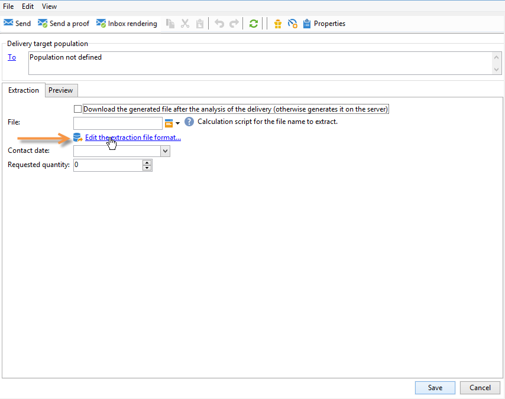

# Criar entregas de correspondência direta

Os deliveries de correspondência direta permitem gerar um arquivo de extração que contém dados sobre a população do target. Você pode compartilhar esse arquivo com o provedor que fornecerá mensagens para as populações do target.

As etapas para gerar o arquivo são:

1. [Criar a entrega](#creating-a-direct-mail-delivery)
1. [Definir o público-alvo](#defining-the-direct-mail-audience)
1. [Definir o conteúdo do arquivo](#defining-the-direct-mail-content)
1. [Validar a entrega](#validating)
1. [Iniciar a entrega](#start-delivery)

## Criar a entrega{#creating-a-direct-mail-delivery}

Crie um delivery de correspondência direta com base no template. Você pode duplicar e configurar o modelo interno **[!UICONTROL Deliver by direct mail (paper)]**.

Para criar uma nova entrega de correspondência direta, siga as etapas abaixo:

>[!NOTE]
>
>Os conceitos globais sobre a criação de entrega são apresentados [nesta seção](../start/create-message.md).

1. Crie uma nova entrega, por exemplo, no painel Entrega.
1. Selecione o modelo da entrega **Entrega por correspondência direta (papel)**.

   

1. Identifique a entrega com um rótulo, código e descrição. Para obter mais informações, consulte [esta seção](../start/create-message.md#create-the-delivery).
1. Clique em **Continuar** para confirmar essas informações e exibir a janela de configuração de mensagem.

## Definir o público-alvo{#defining-the-direct-mail-audience}

Os perfis de destinatários devem conter pelo menos seus nomes e endereços postais.

Os endereços postais são campos calculados. Um endereço pode conter até seis linhas por padrão: a primeira contém o nome e o sobrenome, as próximas linhas contêm o endereço postal (rua etc.), e a última linha contém o CEP/código postal e a cidade. A definição do campo postalAddress calculado padrão pode ser revisada no esquema nms:recipient.

Um endereço será considerado completo se o nome, o CEP/código postal e a cidade não estiverem em branco. Quaisquer destinatários com endereços incompletos serão excluídos das entregas de correspondência direta.

Saiba mais [nesta seção](../start/create-message.md#target-population).

## Definir o conteúdo do arquivo{#defining-the-direct-mail-content}

Use o assistente de extração para definir as informações (colunas) a serem exportadas para o arquivo de saída.

O nome do arquivo que contém os dados extraídos é definido no campo **[!UICONTROL File]**. O botão à direita do campo permite usar campos de personalização para criar o nome do arquivo.

Por padrão, o arquivo de extração é criado e armazenado no servidor. Você pode salvá-lo em seu computador. Para fazer isso, marque a opção **[!UICONTROL Download the generated file after the analysis of the delivery]**. Nesse caso, é necessário indicar o caminho de acesso para o diretório de armazenamento local, bem como o nome do arquivo.

Para uma entrega de correspondência direta, o conteúdo da extração é definido no link **[!UICONTROL Edit the extraction file format...]**.

Este link permite que você acesse o assistente de extração e defina as informações (colunas) a serem exportadas para o arquivo de saída.

Você pode inserir um URL personalizado no arquivo de extração. Para obter mais informações, consulte a [documentação](https://experienceleague.adobe.com/docs/campaign-classic/using/designing-content/web-forms/publishing-a-web-form.html){target="_blank"} do Adobe Campaign Classic.

>[!NOTE]
>
>Este assistente inclui as etapas do assistente de exportação detalhado na [documentação](https://experienceleague.adobe.com/docs/campaign-classic/using/getting-started/importing-and-exporting-data/generic-imports-exports/executing-export-jobs.html){target="_blank"} do Adobe Campaign Classic.

## Validar a entrega{#validating}

Verifique o resultado da análise e o conteúdo do arquivo de output.

No contexto de uma campanha de marketing, na data de extração, o arquivo de extração é criado. Você pode visualizar o conteúdo do arquivo extraído, aprová-lo ou alterar o formato e reiniciar a extração, se necessário. Depois que o arquivo for aprovado, você poderá enviar o e-mail de notificação para o roteador. Saiba mais [nesta página](https://experienceleague.adobe.com/docs/campaign/automation/campaign-orchestration/marketing-campaign-approval.html?lang=pt-BR){target="_blank"}.

Os conceitos globais ao validar uma entrega são apresentados [nesta seção](../start/create-message.md#validate-the-delivery).

O arquivo de output de uma entrega de correspondência direta é gerado durante a análise de entrega. O conteúdo do arquivo depende das colunas de saída selecionadas (consulte este [arquivo de seção](#defining-the-direct-mail-content)).

>[!NOTE]
>
>A fase de análise está detalhada nesta [seção](delivery-analysis.md).

Durante a fase de análise, o arquivo é gerado, mas as informações relativas aos destinatários (ou seja, logs da entrega) não são atualizadas. Assim, você pode cancelar esse trabalho sem correr nenhum risco.

Verifique o resultado da análise e o conteúdo do arquivo de output antes de clicar em **[!UICONTROL Confirm delivery]**. Uma mensagem de confirmação permite iniciar a entrega.

A confirmação do envio inicia a extração dos dados no arquivo especificado.

Então, é possível fechar o assistente e examinar os logs de entrega por meio da guia **[!UICONTROL Delivery]**, acessível pelos detalhes da entrega.

É possível configurar o modo de recuperação de logs na guia **[!UICONTROL Analysis]** das propriedades de entrega.

Há dois modos:

* **[!UICONTROL Messages are considered sent after validation]** (modo padrão): neste modo de função, todos os broadlogs são atualizados quando o operador confirma o envio (seu status passa de &#39;Entrega pendente&#39; para &#39;Enviado&#39;) e o delivery é automaticamente definido como **[!UICONTROL Finished]**.
* **[!UICONTROL A file of results determines the messages that are sent and those that have failed]** : esse modo permite atualizar os logs via um arquivo externo enviado pelo provedor de serviço. Nesse caso, um fluxo de trabalho para processar essas informações precisa ser usado para atualizar o status broadlog.

  >[!NOTE]
  >
  >Nesse caso, o status da entrega também precisa ser alterada para **[!UICONTROL Finished]** pelo usuário assim que os broadlogs forem atualizados.

## Iniciar a entrega{#start-delivery}

Depois de validar o arquivo de extração, clique em **Confirmar entrega**. Uma mensagem de confirmação permitirá iniciar a entrega.

A confirmação inicia a extração de dados no arquivo especificado.

No contexto de uma campanha de marketing, quando todas as aprovações foram concedidas, os arquivos de extração são criados por um workflow especial que, em uma configuração padrão, começa automaticamente quando um delivery de correspondência direta está com extração pendente. Saiba mais [nesta seção](https://experienceleague.adobe.com/docs/campaign/automation/campaign-orchestration/marketing-campaign-deliveries.html?lang=pt-BR){target="_blank"}.
