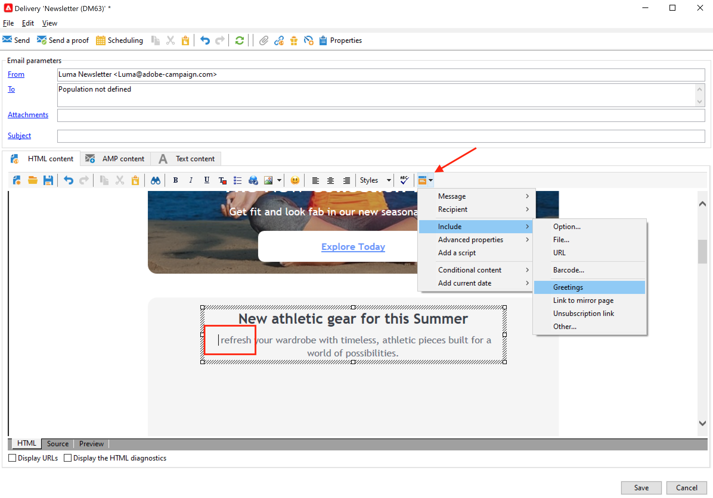

# Criar e enviar emails

Com o Adobe Campaign, crie deliveries de email para enviar emails personalizados para a população do target. [Saiba mais](../send/send.md)

>[!NOTE]
>
>Para criar emails atraentes e personalizados individualmente, navegue até a [interface de usuário da Web](../start/campaign-ui.md#campaign-web-user-interface-ac-web-ui). O Adobe Campaign vem com o Email Designer, uma interface intuitiva de arrastar e soltar, que permite projetar e refinar todo o conteúdo de cada email.

Saiba mais sobre as principais etapas para criar e configurar uma entrega em [esta página](../start/create-message.md).

## Crie uma entrega por email

Crie emails personalizados e contextualmente relevantes que sejam consistentes com o restante da experiência do cliente.

No exemplo a seguir, você aprenderá as etapas para criar um delivery de email no Adobe Campaign que contenha dados personalizados, links para um URL externo e um link para a mirror page.

1. **Criar a entrega**

   Para criar uma nova entrega, navegue até a guia **Campanhas**, clique em **Entregas** e clique no botão **Criar** acima da lista de entregas existentes.

   

1. **Selecione o modelo**

   Selecione um template da entrega e nomeie a entrega. Esse nome só será visível para os usuários do console do Adobe Campaign e não por seus destinatários, no entanto, esse título será exibido na lista de entregas. Clique em **[!UICONTROL Continue]**.

   

1. **Importar seu conteúdo**

   Clique na guia **Source** para colar o conteúdo do HTML.

   

   >[!NOTE]
   >
   >Para evitar problemas de desempenho, as imagens incluídas nos emails não podem exceder 100 KB.

1. **Personalizar sua mensagem**

   * Adicione o nome e o sobrenome dos recipients

     Para inserir o nome e o sobrenome dos perfis direcionados no conteúdo da mensagem, coloque o cursor onde deseja inseri-los, clique no último ícone na barra de ferramentas, clique em **[!UICONTROL Include]** e selecione **[!UICONTROL Greetings]**.

     

     Navegue até a guia de visualização para verificar a personalização selecionando um recipient.

     

     Saiba mais sobre opções de personalização em [esta seção](personalize.md).

   * Inserir um link rastreado

     Para levar os destinatários do delivery para um endereço externo por meio de uma imagem ou texto, selecione-o e clique no ícone **[!UICONTROL Add a link]** na barra de ferramentas.

     Insira a URL do link no campo **URL** usando o seguinte formato **https://www.myURL.com** e, em seguida, confirme.

     

   * Adicionar uma mirror page

     Para permitir que seus destinatários exibam o conteúdo da entrega em um navegador da Web, adicione um link à [mirror page](mirror-page.md) de sua mensagem.

     Coloque o cursor onde deseja inserir este link, clique no último ícone na barra de ferramentas, clique em **[!UICONTROL Include]** e selecione **[!UICONTROL link to mirror page]**.

     Saiba mais sobre como gerenciar a mirror page em [esta seção](mirror-page.md#link-to-mirror-page).

1. Você pode definir parâmetros adicionais para o email, como enviar uma cópia das mensagens para um endereço BBC, alterar o formato da mensagem, definir uma codificação específica etc. Saiba mais [nesta seção](email-parameters.md).

1. Quando o conteúdo estiver pronto, clique em **Salvar**: ele será exibido na lista de entregas, na guia **[!UICONTROL Campaigns > Deliveries]**.

Seu primeiro delivery de email está pronto. Agora é necessário definir o público-alvo, validar o delivery e enviá-lo.

Saiba como criar um fluxo de trabalho para importar um conteúdo de email neste [caso de uso](https://experienceleague.adobe.com/docs/campaign/automation/workflows/use-cases/deliveries/load-delivery-content.html){target="_blank"}.

>[!MORELIKETHIS]
>
>* [Criar uma entrega](../start/create-message.md)
>* [Criar e usar um modelo de email](create-templates.md)
>* [Selecione a audiência do seu email](../audiences/gs-audiences.md)
>* [Validar uma entrega e enviar provas](preview-and-proof.md)
>* [Configurar e enviar a entrega](configure-and-send.md)
>* [Práticas recomendadas de entrega](../start/delivery-best-practices.md)

## Testar e validar seus emails

O Campaign oferece várias maneiras de testar e validar seus emails antes de enviá-los para seus públicos. Saiba como visualizar e testar seu conteúdo de email [nesta seção](../send/preview-and-proof.md).

Você pode:

* [Enviar provas](preview-and-proof.md)
* [Adicionar seed addresses](../audiences/test-profiles.md)
* [Verificar logs de análise de entrega](delivery-analysis.md)

