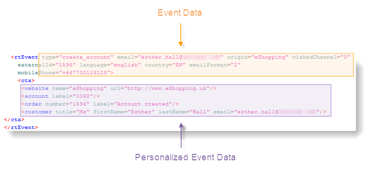

# Processamento de evento {#event-processing}

No contexto de mensagens transacionais, um evento é gerado por um sistema de informações externo e enviado para o Adobe Campaign por meio do **[!UICONTROL PushEvent]** e **[!UICONTROL PushEvents]** métodos. Esses métodos estão descritos na seção [nesta seção](event-description.md).

Esse evento contém dados vinculados ao evento, como:

* seus [type](transactional.md#create-event-types): confirmação de pedido, criação de conta em um site etc.,
* o endereço de e-mail ou o número de telefone,
* quaisquer outras informações para enriquecer e personalizar a mensagem transacional antes do delivery: informações de contato do cliente, idioma da mensagem, formato do email, etc.

Exemplo de dados do evento:

Para processar eventos de mensagens transacionais, as seguintes etapas são aplicadas na(s) instância(s) de execução:

1. [Coleção de eventos](#event-collection)
1. [Transferência de evento para um modelo de mensagem](#routing-towards-a-template)
1. Enriquecimento de evento com dados de personalização
1. [Execução da entrega](delivery-execution.md)
1. [Reciclagem de eventos](#event-recycling) cuja entrega vinculada falhou (por meio de um fluxo de trabalho do Adobe Campaign)

Depois que todas as etapas forem atingidas, cada recipient direcionado receberá uma mensagem personalizada.

## Coletar eventos {#event-collection}

Eventos gerados pelo sistema de informações podem ser coletados usando dois modos:

* Chamadas para métodos SOAP permitem que você envie eventos por push no Adobe Campaign: o método PushEvent permite enviar um evento de cada vez, o método PushEvents permite enviar vários de uma vez. [Saiba mais](event-description.md).

* A criação de um workflow permite recuperar eventos importando arquivos ou por meio de um gateway SQL, com o [Federated Data Access](../connect/fda.md) módulo.

Depois que são coletados, os eventos são divididos por workflows técnicos entre as filas em tempo real e em lote das instâncias de execução enquanto aguardam a vinculação a uma [template de mensagem](transactional-template.md).

>[!NOTE]
>
>Na instância de execução, as pastas **[!UICONTROL Real time events]** ou **[!UICONTROL Batch events]** não devem ser definidas como visualizações, pois isso pode causar problemas de direito de acesso. Para obter mais informações sobre como configurar uma pasta como visualização, consulte [esta seção](../audiences/folders-and-views.md#turn-a-folder-to-a-view).

## Transferir um evento para um modelo {#event-to-template}

Depois que o modelo de mensagem é publicado nas instâncias de execução, dois modelos são gerados automaticamente: um para ser vinculado a um evento em tempo real e outro para ser vinculado a um evento em lote.

A etapa de roteamento consiste em vincular um evento ao modelo de mensagem apropriado, com base:

* O tipo de evento especificado nas propriedades do próprio evento:

  

* O tipo de evento especificado nas propriedades do modelo de mensagem:

  

Por padrão, o roteamento é baseado nas seguintes informações:

* O tipo de evento
* O canal a ser usado (por padrão: email)
* O template da entrega mais recente, com base na data da publicação

## Verificar status do evento {#event-statuses}

Todos os eventos processados são agrupados em uma única visualização, no **Histórico de eventos** ou no Explorer. Eles podem ser categorizados por tipo de evento ou por **status**.

Os possíveis status são:

* **Pending**

   * Um evento pendente pode ser um evento que acabou de ser coletado e que ainda não foi processado. A coluna **[!UICONTROL Number of errors]** mostra o valor 0. O modelo de email ainda não foi vinculado.
   * Um evento pendente também pode ser um evento processado, mas cuja confirmação está incorreta. A coluna **[!UICONTROL Number of errors]** mostra um valor que não é 0. Para saber quando esse evento será processado novamente, consulte a coluna **[!UICONTROL Process requested on]**.

* **Entrega pendente**
O evento foi processado e o template do delivery está vinculado. A entrega do email está pendente e o processo de entrega clássico é aplicado. Para obter mais informações, é possível abrir a entrega.
* **Enviado**, **Ignorado** e **Erro de entrega**
Esses status de delivery são recuperados por meio da variável **updateEventsStatus** fluxo de trabalho. Para obter mais informações, você poderá abrir a entrega relevante.
* **Evento não coberto**
Falha na fase de roteamento de mensagens transacionais. Por exemplo, o Adobe Campaign não encontrou o email que atua como modelo para o evento.
* **Evento expirado**
O número máximo de tentativas de envio foi atingido. O evento é considerado nulo.

## Reciclar eventos {#event-recycling}

Se a entrega de uma mensagem em um canal específico falhar, o Adobe Campaign poderá reenviar a mensagem usando um canal diferente. Por exemplo, se uma entrega no canal SMS falhar, a mensagem será reenviada usando o canal de email.

Para fazer isso, é necessário configurar um workflow que recrie todos os eventos com o status **Delivery error** e atribuir um canal diferente a eles.

>[!CAUTION]
>
>Essa etapa só poderá ser executada usando um workflow e, portanto, é reservada a usuários experts. Para obter mais informações, entre em contato com o executivo da sua conta da Adobe.
