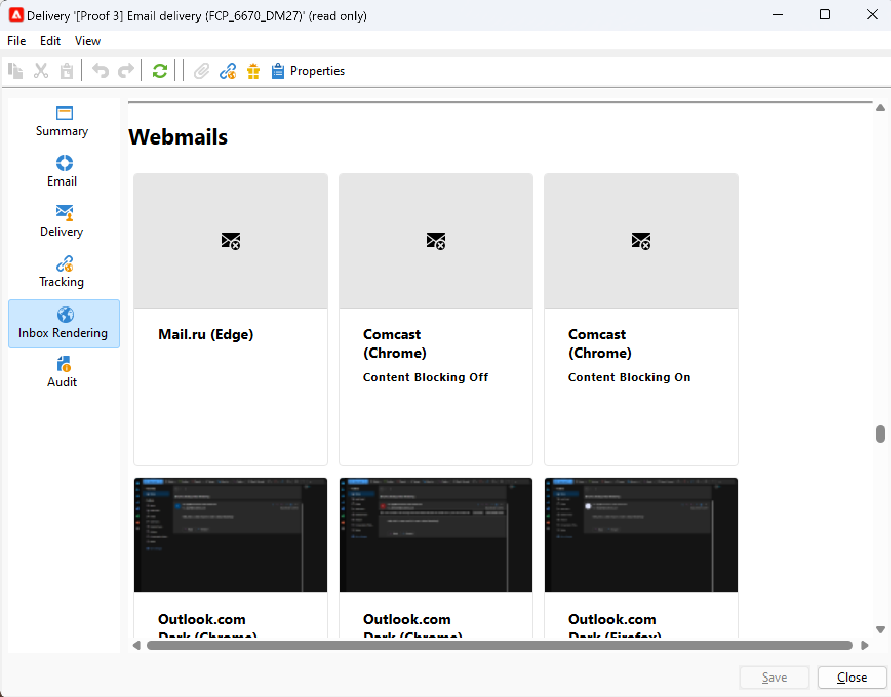

# Renderização da caixa de entrada{#inbox-rendering}

## Sobre renderização da caixa de entrada {#about-inbox-rendering}

Antes de clicar no botão **Enviar**, verifique se a sua mensagem será exibida aos destinatários de forma eficaz em uma variedade de clientes Web, Webmails e dispositivos.

Para permitir isso, o Adobe Campaign aproveita a solução de teste de email baseada na Web [Litmus](https://litmus.com/email-testing){target="_blank"} para capturar a renderização e disponibilizá-la em um relatório específico. Isso permite que você visualize a mensagem enviada nos diferentes contextos em que ela pode ser recebida e verificar a compatibilidade nos principais desktops e aplicativos.

>[!CAUTION]
>A renderização da caixa de entrada não é compatível com [entregas recorrentes](../../automation/workflow/recurring-delivery.md).

O Litmus é um aplicativo de validação e visualização de email com recursos completos. Ele permite que criadores de conteúdo de email visualizem o conteúdo de sua mensagem em mais de 70 renderizadores de email, como a caixa de entrada do Gmail ou o cliente Apple Mail.

Os clientes de dispositivos móveis, mensagens e webmail disponíveis para a **Renderização da caixa de entrada** no Adobe Campaign estão listados no [site do Litmus](https://litmus.com/email-testing){target="_blank"} (clique em **Exibir todos os clientes de email**).

>[!NOTE]
>
>A renderização da caixa de entrada não é necessária para testar a personalização nas entregas. A personalização pode ser verificada com as ferramentas do Adobe Campaign, como **[!UICONTROL Preview]** e [Provas](preview-and-proof.md#send-proofs).

## Sobre tokens Litmus {#about-litmus-tokens}

Como Litmus é um serviço de terceiros, ele funciona em um modelo credit-per-usage. Cada vez que um usuário chamar a funcionalidade Litmus, o crédito será deduzido.

No Adobe Campaign, o crédito corresponde ao número de renderizações disponíveis (conhecidos como tokens).

>[!NOTE]
>
>O número de tokens Litmus disponíveis depende da licença adquirida do Campaign. Verifique o contrato da licença.

Cada vez que você usa o recurso **[!UICONTROL Inbox rendering]** em uma entrega, cada renderização gerada diminui um de seus tokens disponíveis.

>[!IMPORTANT]
>
>Os tokens são contabilizados para cada renderização individual e não para o relatório de renderização da Caixa de Entrada, significando que:
>
>* Cada vez que o relatório de renderização da Caixa de Entrada é gerado, é deduzido um token por cliente da mensagem: um token para a renderização do Outlook 2000, um para a renderização do Outlook 2010, um para a renderização do Apple Mail 9 e assim por diante.
>* Para a mesma entrega, se você gerar a renderização da Caixa de Entrada novamente, o número de tokens disponíveis será reduzido novamente pelo número de renderizações geradas.
>

O número de tokens disponíveis restantes é exibido no [Relatório de renderização da caixa de entrada](#inbox-rendering-report).

Normalmente, o recurso de renderização da Caixa de Entrada é usado para testar a estrutura HTML de um email recém-criado. Cada renderização requer aproximadamente até 70 tokens (dependendo do número de ambientes geralmente testados). No entanto, em alguns casos, podem ser necessários vários relatórios de renderização da caixa de entrada para testar totalmente sua entrega. Portanto, seriam necessários mais tokens para completar várias verificações.

## Acesso ao relatório de renderização da caixa de entrada {#accessing-the-inbox-rendering-report}

Após criar sua entrega de email e definir seu conteúdo, assim como a população alvo, siga as etapas abaixo.

Para obter mais informações sobre como criar, desenvolver e segmentar uma entrega, consulte [esta seção](defining-the-email-content.md).

1. Na barra superior da entrega, clique no botão **[!UICONTROL Inbox rendering]**.

1. Selecione **[!UICONTROL Analyze]** para iniciar o processo de captura.

   

   Uma prova é enviada. Você pode acessar as miniaturas de renderização nessa prova alguns minutos após o envio dos emails. Para obter mais informações sobre o envio de provas, consulte [esta seção](preview-and-proof.md#send-proofs).

1. Após ser enviada, a prova aparece na lista de entregas. Clique duas vezes nela.

   

1. Vá para a guia **Renderização da caixa de entrada** da prova.

   

   O relatório de renderização da caixa de entrada é exibido.

## Relatório de renderização da caixa de entrada {#inbox-rendering-report}

Este relatório exibe as renderizações da caixa de entrada como são exibidas para o destinatário. As renderizações podem ser diferentes com base em como o destinatário abre a entrega de email: em um navegador, em um dispositivo móvel ou por um aplicativo de email.

A seção superior apresenta a repartição do número de mensagens recebidas, indesejadas (spam), não recebidas ou com recebimentos pendentes por meio de uma representação gráfica colorida.

{width="40%" align="left"}

Passe o mouse sobre o gráfico para exibir os detalhes de cada cor. Clique em um item na lista para ocultar ou exibir a categoria correspondente no gráfico.

O conjunto do relatório está dividido em três partes: **[!UICONTROL Mobile]**, **[!UICONTROL Desktop]** e **[!UICONTROL Webmails]**. Role para baixo no relatório para exibir todas as renderizações agrupadas nessas três categorias.

Para obter os detalhes de cada relatório, clique no cartão correspondente. A renderização é exibida para o método de recebimento selecionado.

