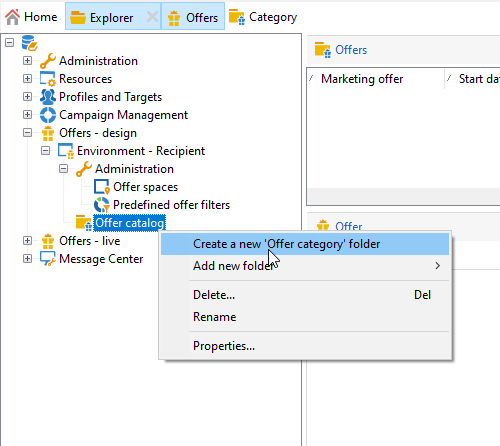

# Criar um catálogo de oferta

Como um **Gerente de ofertas**, você é responsável por criar o catálogo de ofertas.

Um catálogo de ofertas está associado a um único ambiente pré-existente. As ofertas neste catálogo só podem ser associadas aos espaços especificados neste mesmo ambiente.

Antes de criar suas ofertas, primeiro especifique um [ambiente](interaction-env.md) que contém todas as características (qualificação, restrições de target, regras de apresentação) de um conjunto de ofertas, classificadas em categorias, bem como a lista de espaços.

## Criar categorias de ofertas{#creating-offer-categories}

As ofertas são organizadas em categorias/subcategorias. As categorias são criadas na variável **[!UICONTROL Design]** e implantado automaticamente no **[!UICONTROL Live]** ambiente (ou seja, disponibilizado) quando as ofertas que eles contêm são aprovadas. O **[!UICONTROL Design]** O ambiente contém uma categoria padrão para receber todas as ofertas. Subcategorias pode ser criado para adicionar hierarquia às ofertas de catálogo.

Para cada categoria, é possível definir **datas de qualificação**, que é o período durante o qual as ofertas contidas na categoria podem ser apresentadas ao seu target. Também é possível ajustar o peso de uma categoria para priorizar a apresentação de ofertas.

Para criar uma nova categoria, siga as etapas abaixo:

1. Navegue até o **[!UICONTROL Offer catalog]** pasta.

   

1. Clique com o botão direito e selecione **[!UICONTROL Create a new "Offer category" folder]** na lista suspensa.

   

1. Renomeie a categoria. É possível editar o rótulo posteriormente usando a guia **[!UICONTROL General]**.

   

   >[!NOTE]
   >
   >Repita essas etapas para criar quantas categorias forem necessárias.

   Logo, conforme necessário:

   * Atribuir datas de qualificação pela guia **[!UICONTROL Eligibility]**.

      

   * **[!UICONTROL Edit query]** para aplicar filtros ao target da oferta.

   * Um resumo das regras de qualificação.Para exibi-las, clique no link **[!UICONTROL Schedule and eligibility rules of the offer]** link .

## Adicionar uma categoria de fallback

Para garantir que todos os recipients recebam uma apresentação de oferta, é possível adicionar sistematicamente uma ou várias categorias de ofertas nas recomendações.

Essas ofertas de fallback devem ter um peso baixo (mas não nulo), para que sejam levadas em conta somente se nenhuma oferta de peso maior for qualificada.

Além disso, não deve haver uma regra de apresentação aplicada a essas ofertas para garantir que elas estejam sempre incluídas nas recomendações. Isso significa que, durante uma proposta, se nenhuma oferta de peso maior estiver disponível, o recipient receberá pelo menos uma oferta dessa categoria.

Para incluir uma categoria de fallback nas recomendações, siga as etapas abaixo:

1. Navegue até o catálogo de ofertas.
1. Clique no botão **[!UICONTROL Eligibility]** e selecione o **[!UICONTROL Always include this category in the recommendations]** opção.
1. Clique em **[!UICONTROL Save]**.

   
