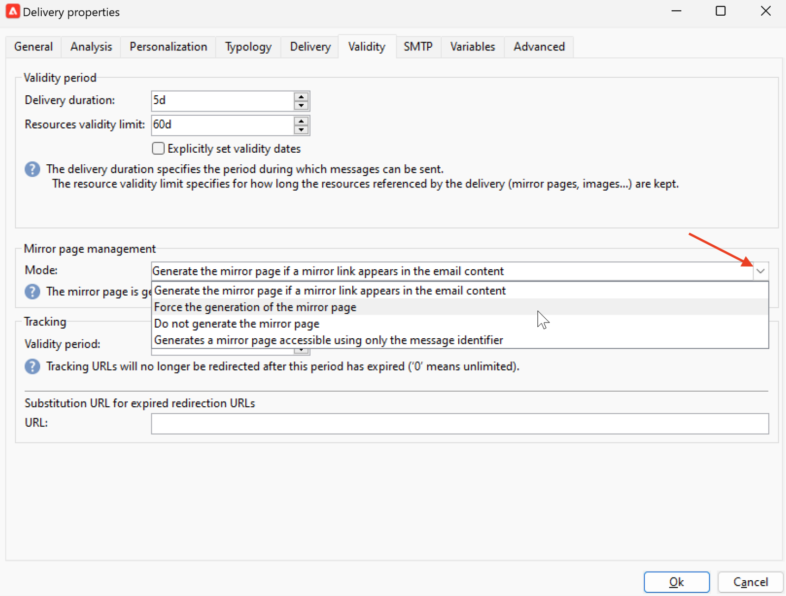

# Sobre a mirror page de email{#mirror-page}

A mirror page é uma versão online do seu email.

Embora a maioria dos clientes de email renderize imagens sem problemas, algumas predefinições podem evitar a exibição de imagens por motivos de segurança. Os usuários podem navegar até a mirror page de um email, por exemplo, se estiverem enfrentando problemas de renderização ou imagens quebradas ao tentar exibi-lo em sua caixa de entrada. Também é recomendável fornecer uma versão online por motivos de acessibilidade ou incentivar o compartilhamento em redes sociais.

A mirror page gerada pelo Adobe Campaign contém todos os dados de personalização.

## Adicionar um link à mirror page{#link-to-mirror-page}

Inserir um link para a mirror page é uma boa prática. Esse link pode ser, por exemplo, &quot;Exibir esse email no navegador&quot; e geralmente está localizado no cabeçalho ou no rodapé de um email.

No Adobe Campaign, você pode inserir um link para a mirror page no conteúdo do email usando o **bloco de personalização**. Por padrão, a mirror page é gerada somente se o link for inserido no conteúdo da mensagem.

<!--For more on personalization blocks insertion, refer to [Personalization blocks](personalization-blocks.md).-->

## Geração de mirror page{#mirror-page-generation}

Por padrão, a mirror page é gerada automaticamente pelo Adobe Campaign se o conteúdo do email não estiver vazio e se contiver um link para a mirror page (também conhecido como Mirror link).

Você pode controlar o modo de geração da mirror page de email. As opções estão disponíveis nas propriedades de delivery. Para acessar essas opções:

1. Navegue até o **[!UICONTROL Validity]** das propriedades de email.
1. No **Gerenciamento de mirror pages** verifique a seção **[!UICONTROL Mode]** lista suspensa.

Além do modo padrão, as seguintes opções estão disponíveis:

* **[!UICONTROL Force the generation of the mirror page]**: use esse modo para gerar a mirror page, mesmo se nenhum link para a mirror page for inserido no delivery.
* **[!UICONTROL Do not generate the mirror page]**: use esse modo para evitar a geração de uma mirror page, mesmo se o link estiver presente no delivery.
* **[!UICONTROL Generates a mirror page accessible using only the message identifier]**: use essa opção para habilitar o acesso ao conteúdo da mirror page, com dados de personalização, na janela de log do delivery. Para acessar essa mirror page: depois que o delivery for enviado, abra-o e navegue até sua **[!UICONTROL Delivery]** guia . Selecione um recipient e clique no botão **[!UICONTROL Display the mirror page for this message...]** link . A mirror page é exibida em uma nova guia.

