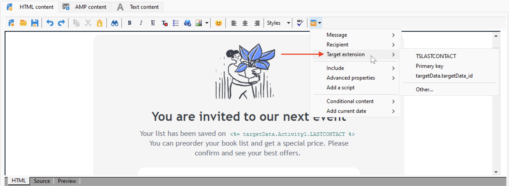

# Fontes de dados de personalização{#personalization-data}

Os dados de personalização podem ser recuperados de vários tipos de fontes: fonte de dados do banco de dados do Campaign, fonte de dados do arquivo externo ou fonte de dados do banco de dados externo.

## Fonte de dados do banco de dados do Campaign

No caso mais comum, os dados de personalização são armazenados no banco de dados. Por exemplo, &quot;campos de personalização de recipient&quot; são todos os campos definidos na tabela de recipients, campos padrão (normalmente: sobrenome, nome, endereço, cidade, data de nascimento etc.) ou campos personalizados.

## Fonte de dados de arquivo externo

Você pode usar um arquivo externo contendo todos os campos definidos em colunas. Esse arquivo é usado como entrada durante uma definição de delivery de mensagem. Você pode optar por inserir esses perfis no banco de dados ou não.

Para selecionar o arquivo a ser usado como fonte de dados, navegue até o link To na janela de criação da mensagem e selecione o **Definido em um arquivo externo** opção. Depois que o arquivo for carregado, acesse os dados do recipient nas opções de personalização, no **Campos do arquivo** entrada.

## Fonte de dados FDA

Os dados de personalização podem ser extraídos de uma tabela externa por meio de [Federated Data Access](../connect/fda.md).  Se você quiser realizar a personalização de deliveries usando dados do banco de dados externo, colete os dados para usar em um workflow para torná-lo disponível em uma tabela temporária.

Para fazer isso, adicione um **Query** atividade no workflow para construção do target e use o **Adicionar dados...** para selecionar o banco de dados externo. O processo detalhado está disponível em [nesta seção](../../automation/workflow/query.md#adding-data).

Em seguida, use os dados da tabela temporária para personalizar seu delivery. Após configurar a atividade de query, acesse os dados externos nas opções de personalização, no **Extensão do Target** entrada.

Ao usar dados externos acessados na FDA, é recomendável pré-processar a personalização da mensagem em um fluxo de trabalho dedicado usando o **Preparar os dados de personalização com um fluxo de trabalho** conforme detalhado abaixo.

### Otimizar personalização {#optimize-personalization}

Você pode otimizar a personalização usando uma opção dedicada: **[!UICONTROL Prepare the personalization data with a workflow]**, disponível no **[!UICONTROL Analysis]** das propriedades de delivery.

Durante a análise de entrega, essa opção cria e executa automaticamente um workflow que armazena todos os dados vinculados ao público-alvo em uma tabela temporária, incluindo dados de tabelas vinculadas na FDA.

Marcar essa opção pode melhorar muito o desempenho da análise de entrega quando muitos dados estão sendo processados, especialmente se os dados de personalização vêm de uma tabela externa por meio do FDA. [Saiba mais](../connect/fda.md).

Para usar essa opção, siga as etapas abaixo:

1. Crie uma campanha.
1. No **[!UICONTROL Targeting and workflows]** da sua campanha, adicione uma **Query** atividade ao seu fluxo de trabalho.
1. Adicionar um **[!UICONTROL Email delivery]** ao workflow e abra-a.
1. Vá até a guia **[!UICONTROL Analysis]** do **[!UICONTROL Delivery properties]** e selecione a opção **[!UICONTROL Prepare the personalization data with a workflow]**.
1. Configure a entrega e comece o workflow para iniciar a análise.

Depois que a análise é feita, os dados da personalização são armazenados em uma tabela temporária por meio de um workflow temporário criado em tempo real durante a análise.

Este workflow não está visível na interface do Adobe Campaign. É para ser apenas um meio técnico para armazenar e manipular rapidamente os dados de personalização.

Após a conclusão da análise, vá para as **[!UICONTROL Properties]** do workflow e selecione a guia **[!UICONTROL Variables]**. Você pode ver o nome da tabela temporária que pode ser usada para fazer uma chamada SQL para exibir as IDs que ela contém.

## Dados de personalização em um workflow

Quando um delivery é criado no contexto de um workflow, você pode usar os dados da tabela de workflow temporário. Os dados armazenados na tabela de trabalho temporária do workflow estão disponíveis para tarefas de personalização. Os dados podem ser usados nos campos de personalização.

Esses dados são agrupados no menu **[!UICONTROL Target extension]**. Para obter mais informações, consulte [esta seção](../../automation/workflow/use-workflow-data.md#target-data).
