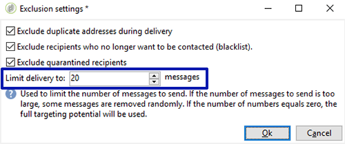

# Cupons personalizados{#personalized-coupons}

A adição de cupons a suas entregas pode oferecer aos destinatários valor aprimorado para produtos e serviços. Você pode usar o módulo de cupom do Campaign para criar um conjunto de cupons que você planeja adicionar às futuras ofertas de marketing. Quando estiver pronto para criar uma entrega, atribua os cupons aplicáveis. Como os cupons são válidos para um período de seleção, um cupom atribuído é vinculado exclusivamente à sua mensagem de entrega. Além disso, o Campaign confirma que há cupons suficientes para o número de mensagens antes do envio da entrega.

>[!AVAILABILITY]
>
>O gerenciamento de cupons não está disponível no Campaign v8 no contexto de uma Implantação corporativa (FFDA). Saiba mais em [documentação do Campaign v8](../architecture/enterprise-deployment.md).

O gerenciamento de cupons depende de um pacote que deve ser instalado. Para confirmar se há um gerenciamento de cupom, verifique **[!UICONTROL Administration > Configuration > Package management > Installed packages.]**

Os dados de cupom podem ser importados e exportados usando formatos CSV e XML. [Saiba mais](../start/import.md).

## Criar um cupom {#creating-a-coupon}

O módulo de gerenciamento de cupons oferece duas opções ao criar cupons:

* **Anônimo**: um cupom genérico para destinatários ou listas de destinatários selecionados.
* **Individual**: um cupom personalizado para destinatários selecionados.

Antes de seguir as etapas abaixo, verifique se você sabe o tipo de cupom que deseja criar.

1. Na árvore do Campaign, acesse **[!UICONTROL Resources > Campaign management > Coupons]**.

   

1. Clique no botão **[!UICONTROL New]**.
1. Insira o nome do cupom no campo **[!UICONTROL Label]**. Um código exclusivo foi inserido automaticamente no **[!UICONTROL Coupon code]**. Você pode manter o código ou inserir um novo.

   

1. Escolha **[!UICONTROL Start date]** e **[!UICONTROL End date]** para definir o período de validade do cupom.
1. Em **[!UICONTROL Coupon type]**, escolha Anônimo ou Individual.

   **[!UICONTROL Anonymous coupons]** : Um cupom anônimo é idêntico para todos os destinatários. Confirme se Anônimo está selecionado no menu **Tipo de cupom** e clique em **Salvar** para gerar o cupom.

   **[!UICONTROL Individual coupons]** : Um cupom individual pode ser personalizado ainda mais com códigos de cupom adicionais. Por exemplo, um cupom individual é criado para uma venda em uma loja de equipamentos esportivos. No entanto, a lista de destinatários é longa e não compartilham a mesma paixão por um único esporte. Você pode adicionar nomes de código para o cupom individual com base em um esporte (por exemplo, futebol, futebol americano, beisebol etc.) e enviar cada código para os destinatários aplicáveis.

   1. Ao escolher Indivíduo, Cupons abre como uma nova guia na parte inferior esquerda. Acesse a guia **[!UICONTROL Coupons]** e clique em **[!UICONTROL Add]**.
   1. Insira um código exclusivo para o cupom individual quando solicitado pela janela pop-up.
   1. Clique em **[!UICONTROL Save]** para gerar o cupom.

   Para obter mais detalhes sobre a guia Cupons, consulte [Configurar cupons individuais](#configuring-individual-coupons).

   >[!NOTE]
   >
   >Os cupons individuais podem ser importados em massa. Para obter detalhes sobre a importação e exportação, consulte [esta seção](../start/import.md).

### Configurar cupons individuais {#configuring-individual-coupons}

A guia Cupons está disponível apenas com cupons individuais. Depois que um cupom é associado a uma entrega, a guia Cupons fornece os seguintes detalhes:

* **[!UICONTROL Status]** : Disponibilidade do cupom.
* **[!UICONTROL Redeemed on]** : A data de resgate do cupom.
* **[!UICONTROL Channel]** : O canal usado para enviar o cupom.
* **[!UICONTROL Address]** : Os endereços de email dos destinatários.

Os valores de **[!UICONTROL status]**, **[!UICONTROL channel]** e **[!UICONTROL address]** são automaticamente preenchidos. No entanto, os valores de **[!UICONTROL redeemed on]** não são recuperados pelo Campaign. Eles podem ser concluídos ao importar um arquivo com os detalhes de resgate do cupom.

## Inserir um cupom em uma entrega por email {#inserting-a-coupon-into-an-email-delivery}

No exemplo abaixo, a entrega é criada a partir da Home page. Para obter instruções detalhadas sobre como criar um delivery, consulte [esta seção](email.md)
1. Acesse **[!UICONTROL Campaigns]** e escolha **[!UICONTROL Deliveries]**.
1. Clique em **[!UICONTROL Create]**.

   

1. Insira um nome em **[!UICONTROL Label]** e clique em **[!UICONTROL Continue]**.
1. Clique em **[!UICONTROL To]** para adicionar destinatários. 
1. Clique em **[!UICONTROL Add]** para escolher os destinatários da entrega Depois de selecionar seus destinatários, clique em **[!UICONTROL Ok]** para retornar para a entrega.

   

1. Insira um assunto e adicione conteúdo à mensagem.

   

1. Na barra de ferramentas, clique em **[!UICONTROL Properties]** e escolha a guia **[!UICONTROL Advanced]**.
1. Clique no ícone de pasta para **[!UICONTROL Coupon management]**.

   

1. Escolha o cupom e clique em **[!UICONTROL Ok]**. Clique novamente em **[!UICONTROL Ok]**.

   

1. Clique na mensagem para escolher onde deseja colocar o cupom.

   

1. Clique no ícone de personalização para fazer a escolha baseada no tipo de cupom:

   * Cupom anônimo: **[!UICONTROL Coupon > Coupon code]**

     

   * Cupom individual: **[!UICONTROL Coupon value > Coupon code]**

     

     O cupom é inserido na mensagem como código em vez do nome que você atribuiu. O código é usado no modelo padrão de dados do Campaign.

   

1. Execute um teste para confirmar o nome atribuído ao cupom. Acesse a guia **[!UICONTROL Preview]** e clique em **[!UICONTROL Test personalization]**. Escolha um destinatário para o teste.

   

   Após o teste, o cupom deve aparecer como o nome atribuído em vez do código.

   

1. Na barra de ferramentas, clique em **[!UICONTROL Send]**, no canto superior esquerdo, e escolha como enviar a entrega.

   

1. Clique em **[!UICONTROL Analyze]**. Se o log de análise confirmar que há cupons suficientes para todos os destinatários, clique em **[!UICONTROL Confirm delivery]** para enviar a mensagem.

   

>[!NOTE]
>
>Para obter instruções sobre como gerenciar os cupons insuficientes de uma entrega, consulte [Gerenciar cupons insuficientes](#managing-insufficient-coupons)

Para confirmar que a entrega foi bem-sucedida:

1. Vá para **[!UICONTROL Explorer > Resources > Campaign management > Coupons]**.
1. Clique na guia **[!UICONTROL Deliveries]**.

   

   O status é lido como **[!UICONTROL Finished]** para uma entrega bem-sucedida.

>[!NOTE]
>
>Por padrão, o módulo de gestão de cupom usa uma tabela **nms:recipient**. [Saiba mais](../dev/datamodel.md#ootb-profiles).
>
>Aprenda como usar uma tabela de destinatário personalizada [nesta página](../dev/custom-recipient.md).

## Gerenciar cupons insuficientes {#managing-insufficient-coupons}

A análise da entrega para se o número de cupons for menor que de mensagens. Nesse caso, você pode importar mais cupons ou restringir o número de mensagens. Siga as instruções abaixo se desejar limitar o número de mensagens.

1. Vá para a janela de entrega do email.
1. Clique em **[!UICONTROL To]**.
1. Em **[!UICONTROL Select target]**, acesse a guia **[!UICONTROL Exclusions]**.

   

1. Na seção de configurações de exclusão, clique em **[!UICONTROL Edit]**.
1. Insira o número de mensagens que deseja enviar em **[!UICONTROL Limit delivery to...messages]** e clique em **[!UICONTROL Ok]**. Você pode enviar a entrega.

   

>[!NOTE]
>
>Ao gerenciar um número limitado de cupons, um fluxo de trabalho de entrega permite dividir a entrega com base em seus critérios. É uma boa opção para enviar cupons para um população selecionada sem restringir o target.
