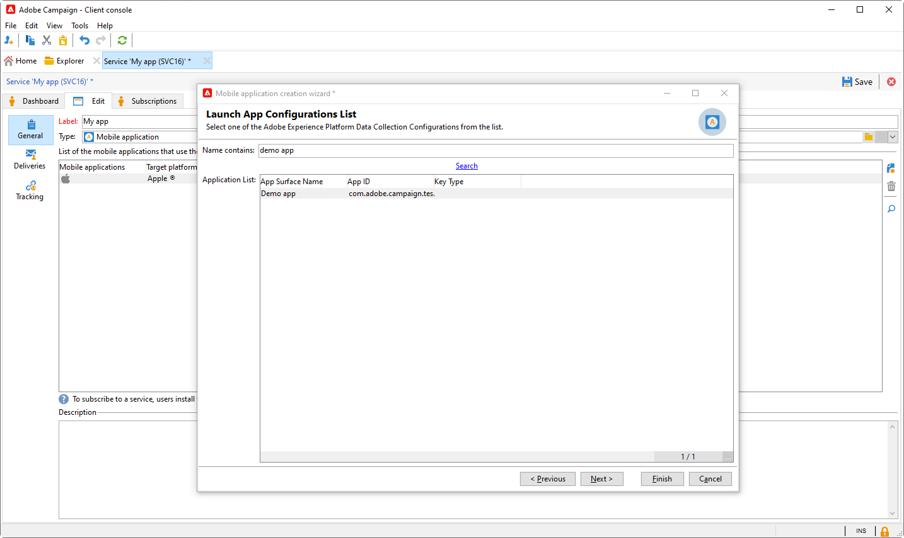

# Configuração de notificação por push revisada {#push-notifications-config}

O Campaign v8.5 está apresentando nosso serviço de notificação por push mais recente, alimentado por uma estrutura robusta criada em uma tecnologia de ponta moderna. Este serviço foi projetado para desbloquear novos níveis de escalabilidade, garantindo que suas notificações possam alcançar um público maior com eficiência contínua. Com nossa infraestrutura aprimorada e nossos processos otimizados, você pode esperar maior escala e confiabilidade, permitindo que você interaja e se conecte com seus usuários de aplicativos móveis como nunca.

>[!AVAILABILITY]
>
> Esse recurso é acessível exclusivamente a novos clientes a partir do Campaign v8.5 e implantado progressivamente em um conjunto de clientes selecionados. Se seu ambiente foi provisionado antes de junho de 2023, esta página não se aplica a você e você deve seguir os procedimentos detalhados [nesta página](push-settings.md).

No contexto desta implementação atualizada, para enviar notificações por push no Adobe Campaign, siga estas etapas:

1. [Criar uma superfície de aplicativo na coleção de dados do Adobe Experience Platform](#create-app-surface)

1. [Definir as configurações do aplicativo no Adobe Campaign](#push-config-campaign)

1. [Criar e configurar uma propriedade móvel na Coleção de dados da Adobe Experience Platform](#create-mobile-property)

1. [Adicionar a extensão Adobe Adobe Experience Platform Assurance](https://developer.adobe.com/client-sdks/documentation/platform-assurance-sdk/){target="_blank"}(recomendado)

1. [Adicionar o Campaign Classic ao seu aplicativo para dispositivos móveis](#campaign-mobile-ap)

1. [Criar um delivery para iOS e Android](##push-create)

>[!NOTE]
>
> O FCM e o APNS p12 herdados não são compatíveis com a Coleção de dados.

## Criar uma superfície de aplicativo na coleção de dados do Adobe Experience Platform {#create-app-surface}

É necessário adicionar suas credenciais de push do aplicativo móvel em [!DNL Adobe Experience Platform Data Collection].

O registro da credencial de push do aplicativo móvel é necessário para autorizar o Adobe a enviar notificações por push em seu nome. Consulte as etapas detalhadas abaixo:

1. De [!DNL Adobe Experience Platform Data Collection], selecione o **[!UICONTROL App Surfaces]** no painel esquerdo.

1. Clique em **[!UICONTROL Create App Surface]** para criar uma nova configuração.

   

1. Insira um **[!UICONTROL Name]** para a configuração.

1. De **[!UICONTROL Mobile Application Configuration]**, selecione o Operational system:

   * **Para iOS**

     

      1. Insira o aplicativo móvel **Id Do Pacote** no **[!UICONTROL App ID (iOS Bundle ID)]** campo.

         A ID do pacote de aplicativos pode ser encontrada no **Geral** guia do público-alvo principal no **XCode** da sua conta de desenvolvedor do Apple.

      1. Ligar **[!UICONTROL Push Credentials]** para adicionar suas credenciais.

      1. Arraste e solte seu arquivo .p8 Apple Push Notification Authentication Key.

         Essa chave pode ser obtida no **Certificados**, **Identificadores** e **Perfis** página da sua conta de desenvolvedor do Apple.

      1. Forneça o **ID da chave**. Esta é uma sequência de 10 caracteres atribuída durante a criação da chave de autenticação p8.

         Ele pode ser encontrado em **Chaves** guia em **Certificados**, **Identificadores** e **Perfis** página da sua conta de desenvolvedor do Apple.

      1. Forneça o **ID da equipe**. Este é um valor de string que pode ser encontrado sob o **Associação** guia.

   * **Para Android**

     

      1. Forneça o **[!UICONTROL App ID (Android package name)]**. Normalmente, o nome do pacote é a ID do aplicativo no `build.gradle` arquivo.

      1. Alternar **[!UICONTROL Push Credentials]** para adicionar suas credenciais.

      1. Arraste e solte as credenciais de push do FCM. Para obter mais detalhes sobre como obter as credenciais de push, consulte [Documentação do Google](https://firebase.google.com/docs/admin/setup#initialize-sdk){target="_blank"}.

1. Clique em **[!UICONTROL Save]** para criar sua configuração de aplicativo.

## Definir as configurações do aplicativo no Adobe Campaign{#push-config-campaign}

### Criar um serviço {#create-service}

Antes de enviar notificações por push, você deve definir as configurações de aplicativos iOS e Android no Adobe Campaign.

As notificações por push são enviadas aos usuários do aplicativo por meio de um serviço dedicado. Quando os usuários instalam seu aplicativo, eles assinam esse serviço: a Adobe Campaign depende desse serviço para direcionar somente os assinantes do seu aplicativo. Neste serviço, é necessário adicionar os aplicativos iOS e Android para enviar em dispositivos iOS e Android.

Para criar um serviço para enviar notificações por push, siga as etapas abaixo:

1. Navegue até **[!UICONTROL Profiles and Targets > Services and Subscriptions]** e clique em **[!UICONTROL Create]**.

   {width="800" align="left"}

1. Insira um **[!UICONTROL Label]** e uma **[!UICONTROL Internal name]** e selecione um **[!UICONTROL Mobile application]** tipo.

   >[!NOTE]
   >
   >O target mapping **[!UICONTROL Subscriber applications (nms:appSubscriptionRcp)]** padrão é vinculado à tabela de destinatários. Para utilizar um mapeamento de alvo diferente, é necessário criar um novo e inseri-lo no campo **[!UICONTROL Target mapping]** do serviço. Saiba mais sobre target mappings em [esta página](../audiences/target-mappings.md).

1. Em seguida, use o **[!UICONTROL Add]** ícone à direita para definir os aplicativos móveis que usam este serviço.

   

### Criar um aplicativo para dispositivos móveis {#create-sapp}

Depois de criar o serviço, é necessário definir os aplicativos móveis que usarão esse serviço.

>[!BEGINTABS]

>[!TAB iOS]

Para criar um aplicativo para dispositivos iOS, siga estas etapas:

1. Em seu Serviço, clique em **[!UICONTROL Add]** e selecione **[!UICONTROL Create an iOS application]**. Clique em **[!UICONTROL Next]**.

   

1. No **[!UICONTROL Launch app configurations list]** selecione a superfície do aplicativo criada anteriormente nesta seção. Clique em **[!UICONTROL Next]**.

   

1. (opcional) Você pode enriquecer um conteúdo de mensagem de push com alguns **[!UICONTROL Application variables]**. Eles são totalmente personalizáveis e uma parte da carga da mensagem é enviada para o dispositivo móvel.

   No exemplo abaixo, a variável **mediaURl** e **mediaExt** as variáveis são adicionadas para criar notificações por push avançadas e, em seguida, fornecem ao aplicativo a imagem que será exibida na notificação.

   

1. Navegue até o **[!UICONTROL Subscription parameters]** para definir o mapeamento com uma extensão do **[!UICONTROL Subscriber applications (nms:appsubscriptionRcp)]** esquema.

1. Navegue até o **[!UICONTROL Sounds]** para definir um som a ser reproduzido. Clique em **[!UICONTROL Add]** e preencha o campo **[!UICONTROL Internal name]** que deve conter o nome do arquivo incorporado no aplicativo ou o nome do som do sistema.

1. Clique em **[!UICONTROL Next]** para configurar o aplicativo de desenvolvimento.

1. A variável **[!UICONTROL Integration key]** é específico para cada aplicativo. Ele vincula o aplicativo móvel ao Adobe Campaign e será usado ao configurar a extensão do Campaign.

   Certifique-se de que o mesmo **[!UICONTROL Integration key]** é definido no Adobe Campaign e no código do aplicativo por meio do SDK.

   Saiba mais em [a Documentação do desenvolvedor](https://developer.adobe.com/client-sdks/documentation/adobe-campaign-classic/#configuration-keys){target="_blank"}

   >[!NOTE]
   >
   > A **[!UICONTROL Integration key]** é totalmente personalizável com o valor da string, mas precisa ser exatamente a mesma especificada no SDK.
   >
   > Não é possível usar o mesmo certificado para a versão de desenvolvimento (sandbox) e a versão de produção do aplicativo.

   

1. Selecione o ícone na lista suspensa **[!UICONTROL Application icon]** para personalizar o aplicativo para dispositivos móveis em seu serviço.

1. Clique em **[!UICONTROL Next]** para configurar o aplicativo de produção e siga as mesmas etapas descritas acima. Observe que você não pode usar o mesmo **[!UICONTROL Integration key]** para a versão de desenvolvimento (sandbox) e a versão de produção do aplicativo.

1. Clique em **[!UICONTROL Finish]**.

Seu aplicativo iOS está pronto para ser usado no Campaign.

>[!TAB Android]

Para criar um aplicativo para dispositivos Android, siga estas etapas:

1. Em seu Serviço, clique em **[!UICONTROL Add]** e selecione **[!UICONTROL Create an Android application]**. Clique em **[!UICONTROL Next]**.

   

1. No **[!UICONTROL Launch app configurations list]** selecione a superfície do aplicativo criada nesta seção e clique em **[!UICONTROL Next]**.

   

1. A chave de integração é específica para cada aplicativo. Ele vincula o aplicativo móvel ao Adobe Campaign e será usado ao configurar a extensão do Campaign.

   Certifique-se de que o mesmo **[!UICONTROL Integration key]** é definido no Adobe Campaign e no código do aplicativo por meio do SDK.

   Saiba mais em [a Documentação do desenvolvedor](https://developer.adobe.com/client-sdks/documentation/adobe-campaign-classic/#configuration-keys){target="_blank"}

   >[!NOTE]
   >
   > A **[!UICONTROL Integration key]** é totalmente personalizável com o valor da string, mas precisa ser exatamente a mesma especificada no SDK.

   

1. Selecione o ícone na lista suspensa **[!UICONTROL Application icon]** para personalizar o aplicativo para dispositivos móveis em seu serviço.

1. (opcional) Você pode enriquecer um conteúdo de mensagem de push com alguns **[!UICONTROL Application variables]** se necessário. Eles são totalmente personalizáveis e uma parte da carga da mensagem é enviada para o dispositivo móvel.

1. Navegue até o **[!UICONTROL Subscription parameters]** para definir o mapeamento com uma extensão do **[!UICONTROL Subscriber applications (nms:appsubscriptionRcp)]** esquema.

1. Clique em **[!UICONTROL Finish]** e em **[!UICONTROL Save]**.

Seu aplicativo Android agora está pronto para ser usado no Campaign.

>[!ENDTABS]

Abaixo estão os nomes de payload do FCM para personalizar ainda mais sua notificação por push:

| Tipo de mensagem | Elemento de mensagem configurável (nome da carga FCM) | Opções configuráveis (nome da carga do FCM) |
|:-:|:-:|:-:|
| mensagem de dados | N/D | validate_only |
| mensagem de notificação | title, body, android_channel_id, icon, sound, tag, color, click_action, image, ticker, sticky, visibility, notification_priority, notification_count   | validate_only |

## Configurar uma propriedade móvel na Coleção de dados do Adobe Experience Platform {#create-mobile-property}

1. Na página inicial da Coleção de dados, acesse o menu Tags.

1. Clique em **[!UICONTROL New Property]**.

   

1. Digite um nome para a propriedade e selecione **[!UICONTROL Mobile]** como a plataforma.

   

1. Clique em **[!UICONTROL Save]** para criar a propriedade móvel.

1. Acesse a propriedade móvel recém-criada.

1. No painel de propriedades móveis, acesse a variável **[!UICONTROL Extensions]** e depois o **[!UICONTROL Catalog]** guia.

   

1. Instale o **[!DNL Adobe Campaign Classic]** extensão. [Saiba mais sobre a extensão do Campaign](https://developer.adobe.com/client-sdks/documentation/adobe-campaign-classic/#configure-campaign-classic-extension)

   

1. Preencha os detalhes da instância:

   * **[!UICONTROL Registration endpoint]** ou **[!UICONTROL Tracking endpoint]** URLs podem ser encontrados no **[!UICONTROL Tools]** > **[!UICONTROL Advanced]** > **[!UICONTROL Deployment wizard]** no Campaign.
   * **[!UICONTROL Integration keys]** podem ser encontrados no aplicativo móvel configurado em [nesta seção](#create-app).

   

1. Clique em **[!UICONTROL Save]**.

1. Agora é necessário publicar a configuração do **[!UICONTROL Publishing flow]** menu. [Saiba mais](https://developer.adobe.com/client-sdks/documentation/getting-started/create-a-mobile-property/#publish-the-configuration)

Sua propriedade móvel agora será sincronizada automaticamente com o **[!UICONTROL Adobe Experience Platform Data Collection]** fluxo de trabalho técnico. [Saiba mais](../../automation/workflow/technical-workflows.md#list-technical-workflows)

## Adicionar o Campaign Classic ao seu aplicativo para dispositivos móveis {#campaign-mobile-app}

O SDK móvel da Adobe Experience Platform ajuda a potencializar as soluções e os serviços da Adobe Experience Cloud em seus aplicativos móveis. A configuração dos SDKs é realizada por meio da interface da coleção de dados para oferecer uma configuração flexível e integrações extensíveis baseadas em regras.

[Saiba mais na documentação do Adobe Developer](https://developer.adobe.com/client-sdks/documentation/adobe-campaign-classic/#add-campaign-classic-to-your-app){target="_blank"}

## Criar sua notificação por push{#push-create}

Depois de configurar com êxito o aplicativo móvel na Coleção de dados, você pode criar e enviar notificações por push no Adobe Campaign.

Consulte [esta página](push.md#push-create) para obter os elementos detalhados específicos para a entrega de notificações do iOS e do Android.
