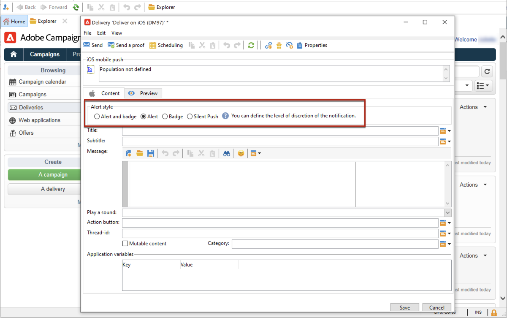

# Criar e enviar notificações por push

Os deliveries de aplicativos móveis permitem enviar notificações para sistemas iOS e Android.

Para enviar notificações por push no Adobe Campaign, é necessário:

1. Configurar o ambiente do Campaign
1. Crie um serviço de informações do tipo aplicativo móvel para seu aplicativo móvel.
1. Adicione as versões iOS e Android do aplicativo a este serviço.
1. Crie um delivery para iOS e Android.

 Saiba como começar a usar o aplicativo móvel no [Documentação do Campaign Classic v7](https://experienceleague.adobe.com/docs/campaign-classic/using/sending-messages/sending-push-notifications/about-mobile-app-channel.html){target=&quot;_blank&quot;}

## Integrar SDK do Campaign

O SDK do Campaign facilita a integração do aplicativo móvel na plataforma Adobe Campaign.

Versões compatíveis do SDK são listadas em [Matriz de compatibilidade de campanha](../start/compatibility-matrix.md#MobileSDK).

 Saiba como integrar SDKs do Campaign Android e iOS ao seu aplicativo em [esta seção](../config/push-config.md)

<!--
### Configure Campaign Extension in Launch

You can integrate Adobe Experience Platorm Launch SDK with Campaign, by leveraging Campaign Classic extension.

 Learn more in [Adobe Mobile SDK documentation](https://aep-sdks.gitbook.io/docs/using-mobile-extensions/adobe-campaignclassic){target="_blank"}

-->

## Definir as configurações do aplicativo no Campaign

Você deve definir as configurações dos aplicativos iOS e Android no Adobe Campaign.

 As diretrizes de configuração do iOS estão detalhadas em [Documentação do Campaign Classic v7](https://experienceleague.adobe.com/docs/campaign-classic/using/sending-messages/sending-push-notifications/configure-the-mobile-app/configuring-the-mobile-application.html?lang=pt-BR#sending-messages){target=&quot;_blank&quot;}

 As diretrizes de configuração do Android estão detalhadas em [Documentação do Campaign Classic v7](https://experienceleague.adobe.com/docs/campaign-classic/using/sending-messages/sending-push-notifications/configure-the-mobile-app/configuring-the-mobile-application-android.html?lang=en#sending-messages){target=&quot;_blank&quot;}

## Criar sua primeira notificação por push

Esta seção detalha os elementos específicos para o delivery de notificações iOS e Android.

>[!CAUTION]
>
>Com o Campaign v8, o registro móvel agora é **assíncrono**. [Saiba mais](../dev/staging.md)

Para criar um novo delivery, navegue até o **[!UICONTROL Campaigns]** clique em **[!UICONTROL Deliveries]** e clique no botão **[!UICONTROL Create]** acima da lista de deliveries existentes.

 Para obter informações globais sobre como criar um delivery, consulte [Documentação do Campaign Classic v7](https://experienceleague.adobe.com/docs/campaign-classic/using/sending-messages/key-steps-when-creating-a-delivery/steps-about-delivery-creation-steps.html?lang=en#sending-messages){target=&quot;_blank&quot;}

### Enviar notificações no iOS {#send-notifications-on-ios}

1. Selecione o **[!UICONTROL Deliver on iOS]** modelo de delivery e clique em **[!UICONTROL Continue]**.

   

1. Para definir o target da notificação, clique no link **[!UICONTROL To]** e, em seguida, clique em **[!UICONTROL Add]**.

   

1. Selecionar **[!UICONTROL Subscribers of an iOS mobile application (iPhone, iPad)]**, selecione o serviço relevante para o aplicativo móvel e selecione a versão iOS do aplicativo.

   

1. Selecione o tipo de notificação: **[!UICONTROL Alert]**, **[!UICONTROL Badge]**, **[!UICONTROL Alert and badge]** ou **[!UICONTROL Silent Push]**.

   

1. No campo **[!UICONTROL Title]**, insira o rótulo do título que deve aparecer na notificação.

1. Insira o **[!UICONTROL Message]** e **[!UICONTROL Value of the badge]** com base no tipo de notificação escolhido.

1. Você também pode definir os seguintes elementos:

   * O **[!UICONTROL Action button]** permite definir um rótulo para o botão de ação que aparece nas notificações de alerta (campo **action_loc_key** da carga).

   * No campo **[!UICONTROL Play a sound]**, selecione o som a ser reproduzido pelo terminal móvel quando a notificação for recebida.

   * No campo **[!UICONTROL Application variables]**, insira o valor de cada variável. Por exemplo, você pode configurar uma tela de aplicativo específica a ser exibida quando o usuário ativar a notificação.

1. Quando a notificação estiver configurada, clique na guia **[!UICONTROL Preview]** para visualizar a notificação.

   

### Enviar notificações no Android {#send-notifications-on-android}

1. Selecione o modelo de delivery **[!UICONTROL Deliver on Android (android)]**.

   

1. Para definir o target da notificação, clique no link **[!UICONTROL To]** e, em seguida, clique em **[!UICONTROL Add]**.

   

1. Selecione **[!UICONTROL Subscribers of an Android mobile application]**, escolha o serviço relevante para seu aplicativo móvel (Neotrips, neste caso) e selecione a versão Android do aplicativo.

   

1. Em seguida, insira o conteúdo da notificação.

   

1. Clique no ícone **[!UICONTROL Insert emoticon]** para inserir emoticons à notificação via push.

1. No campo **[!UICONTROL Application variables]**, insira o valor de cada variável. Por exemplo, você pode configurar uma tela de aplicativo específica a ser exibida quando o usuário ativar a notificação.

1. Quando a notificação estiver configurada, clique na guia **[!UICONTROL Preview]** para visualizar a notificação.

   <!---->

## Teste, envie e monitore suas notificações por push

Para enviar uma prova e o delivery final, use o mesmo processo que os deliveries de email. Saiba mais na documentação do Campaign Classic v7:

* Validar um delivery e enviar provas
    [Saiba mais sobre as principais etapas para validar um delivery](https://experienceleague.adobe.com/docs/campaign-classic/using/sending-messages/key-steps-when-creating-a-delivery/steps-validating-the-delivery.html?lang=pt-BR){target=&quot;_blank&quot;}

* Confirmar e enviar o delivery
    [Saiba mais sobre as principais etapas para enviar um delivery](https://experienceleague.adobe.com/docs/campaign-classic/using/sending-messages/key-steps-when-creating-a-delivery/steps-sending-the-delivery.html?lang=en){target=&quot;_blank&quot;}

Após enviar as mensagens, você pode monitorar e rastrear seus deliveries. Saiba mais na documentação do Campaign Classic v7:

* Quarentenas de notificação por push
    [Saiba mais sobre a quarentena de notificações por push](https://experienceleague.adobe.com/docs/campaign-classic/using/sending-messages/monitoring-deliveries/understanding-quarantine-management.html?lang=en#push-notification-quarantines){target=&quot;_blank&quot;}

* Solução de problemas
    [Saiba como solucionar problemas de notificações por push](https://experienceleague.adobe.com/docs/campaign-classic/using/sending-messages/sending-push-notifications/troubleshooting.html?lang=en){target=&quot;_blank&quot;}
