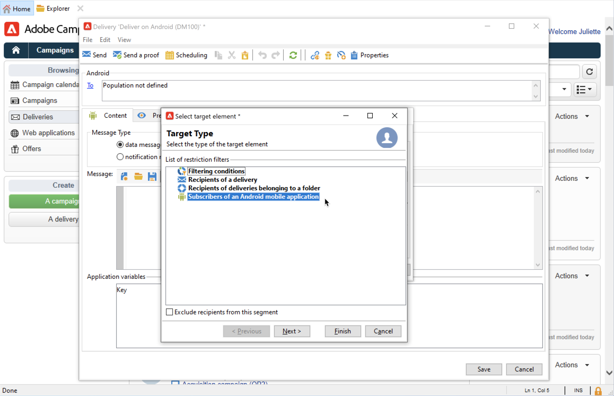

# Criar e enviar notificações por push{#push-notifications-create}

Os deliveries de aplicativos móveis permitem enviar notificações para dispositivos iOS e Android.

Para enviar notificações por push no Adobe Campaign, é necessário:

1. Integre o SDK a seu aplicativo. [Saiba mais](#push-sdk)
1. Crie um serviço de informações do tipo Aplicativo móvel para seu aplicativo móvel e adicione as versões iOS e Android do aplicativo a esse serviço. [Saiba mais](#push-config)
1. Criar um delivery para iOS e Android. [Saiba mais](#push-create)

## Integrar o SDK {#push-sdk}

Para enviar notificações por push com o Adobe Campaign, você deve configurar a extensão Adobe Campaign na interface do usuário da coleta de dados do SDK do Adobe Experience Platform Mobile.

O SDK móvel da Adobe Experience Platform ajuda a potencializar as soluções e os serviços da Adobe Experience Cloud em seus aplicativos móveis. A configuração dos SDKs é realizada por meio da interface da coleção de dados para oferecer uma configuração flexível e integrações extensíveis baseadas em regras.

[Saiba mais na documentação do Adobe Developer](https://developer.adobe.com/client-sdks/documentation/adobe-campaign-classic){target="_blank"}

## Definir as configurações do aplicativo no Campaign{#push-config}

Antes de enviar notificações por push, você deve definir as configurações dos aplicativos iOS e Android no Adobe Campaign.

As notificações por push são enviadas aos usuários do aplicativo por meio de um serviço dedicado. Quando os usuários instalam seu aplicativo, eles assinam este serviço: A Adobe Campaign depende desse serviço para direcionar somente os assinantes do seu aplicativo. Neste serviço, é necessário adicionar os aplicativos iOS e Android para enviar em dispositivos iOS e Android.

Para criar um serviço para enviar notificações por push, siga as etapas abaixo:

1. Navegue até **[!UICONTROL Profiles and Targets > Services and Subscriptions]** e clique em **[!UICONTROL Create]**.

   {width="800" align="left"}

1. Insira um **[!UICONTROL Label]** e um **[!UICONTROL Internal name]** e selecione um **[!UICONTROL Mobile application]** tipo .

   >[!NOTE]
   >
   >O target mapping **[!UICONTROL Subscriber applications (nms:appSubscriptionRcp)]** padrão é vinculado à tabela de destinatários. Para utilizar um mapeamento de alvo diferente, é necessário criar um novo e inseri-lo no campo **[!UICONTROL Target mapping]** do serviço. Saiba mais sobre target mappings no [esta página](../audiences/target-mappings.md).

1. Em seguida, use o **[!UICONTROL Add]** à direita para definir os aplicativos móveis que usam este serviço.

>[!BEGINTABS]

>[!TAB iOS]

Para criar um aplicativo para dispositivos iOS, siga estas etapas:

1. Selecione **[!UICONTROL Create an iOS application]** e clique em **[!UICONTROL Next]**.

   {width="600" align="left"}

1. Insira o nome do seu aplicativo no **[!UICONTROL Label]** campo.
1. (opcional) Você pode enriquecer um conteúdo de mensagem de push com alguns **[!UICONTROL Application variables]**. Eles são totalmente personalizáveis e uma parte da carga da mensagem é enviada para o dispositivo móvel.

   No exemplo abaixo, a variável **mediaURl** e **mediaExt** são adicionadas para criar notificações por push avançadas e, em seguida, fornecem ao aplicativo a imagem a ser exibida na notificação.

   {width="600" align="left"}

1. Navegue até o **[!UICONTROL Subscription parameters]** para definir o mapeamento com uma extensão do **[!UICONTROL Subscriber applications (nms:appsubscriptionRcp)]** esquema.

1. Navegue até o **[!UICONTROL Sounds]** para definir um som para reproduzir. Clique em **[!UICONTROL Add]** e preencha o campo **[!UICONTROL Internal name]** que deve conter o nome do arquivo incorporado no aplicativo ou o nome do som do sistema.

1. Clique em **[!UICONTROL Next]** para configurar o aplicativo de desenvolvimento.

1. A chave de integração é específica para cada aplicativo. Ele vincula o aplicativo móvel ao Adobe Campaign.

   Certifique-se de que o mesmo **[!UICONTROL Integration key]** é definida no Adobe Campaign e no código do aplicativo por meio do SDK.

   Saiba mais em [a documentação do desenvolvedor](https://developer.adobe.com/client-sdks/documentation/adobe-campaign-classic/#configuration-keys){target="_blank"}

   >[!NOTE]
   >
   > A **[!UICONTROL Integration key]** é totalmente personalizável com o valor da sequência de caracteres, mas precisa ser exatamente a mesma especificada no SDK.
   >
   > Você não pode usar o mesmo certificado para a versão de desenvolvimento (sandbox) e a versão de produção do aplicativo.

1. Selecione o ícone na guia **[!UICONTROL Application icon]** para personalizar o aplicativo móvel em seu serviço.

1. Selecione **[!UICONTROL Authentication mode]**. Dois modos estão disponíveis:

   * (Recomendado) **[!UICONTROL Token-based authentication]**: Preencha as configurações de conexão APNs **[!UICONTROL Key Id]**, **[!UICONTROL Team Id]** e **[!UICONTROL Bundle Id]** em seguida, selecione seu certificado p8 clicando em **[!UICONTROL Enter the private key...]**. Para obter mais informações sobre **[!UICONTROL Token-based authentication]**, consulte a [documentação da Apple](https://developer.apple.com/documentation/usernotifications/setting_up_a_remote_notification_server/establishing_a_token-based_connection_to_apns){target="_blank"}.

   * **[!UICONTROL Certificate-based authentication]**: Clique em **[!UICONTROL Enter the certificate...]** e selecione em seguida a chave p12, inserindo a senha fornecida pelo desenvolvedor de aplicativos para dispositivos móveis.
   Você pode alterar o modo de autenticação posteriormente na seção **[!UICONTROL Certificate]** do seu aplicativo móvel.

1. Use o **[!UICONTROL Test the connection]** para validar sua configuração.

1. Clique em **[!UICONTROL Next]** para configurar o aplicativo de produção e siga as mesmas etapas descritas acima.

1. Clique em **[!UICONTROL Finish]**.

Seu aplicativo iOS está pronto para ser usado no Campaign.

>[!TAB Android]

Para criar um aplicativo para dispositivos Android, siga estas etapas:

1. Selecione **[!UICONTROL Create an Android application]** e clique em **[!UICONTROL Next]**.

   {width="600" align="left"}

1. Insira o nome do seu aplicativo no **[!UICONTROL Label]** campo.
1. A chave de integração é específica para cada aplicativo. Ele vincula o aplicativo móvel ao Adobe Campaign.

   Certifique-se de que o mesmo **[!UICONTROL Integration key]** é definida no Adobe Campaign e no código do aplicativo por meio do SDK.

   Saiba mais em [a documentação do desenvolvedor](https://developer.adobe.com/client-sdks/documentation/adobe-campaign-classic/#configuration-keys){target="_blank"}

   >[!NOTE]
   >
   > A **[!UICONTROL Integration key]** é totalmente personalizável com o valor da sequência de caracteres, mas precisa ser exatamente a mesma especificada no SDK.

1. Selecione o ícone na guia **[!UICONTROL Application icon]** para personalizar o aplicativo móvel em seu serviço.
1. Selecionar **HTTP v1** em  **[!UICONTROL API version]** lista suspensa.
1. Clique em **[!UICONTROL Load project json file to extract project details...]** link para carregar seu arquivo de chave JSON. Para obter mais informações sobre como extrair o arquivo JSON, consulte [Documentação do Google Firebase](https://firebase.google.com/docs/admin/setup#initialize-sdk){target="_blank"}.

   Você também pode inserir manualmente os seguintes detalhes:
   * **[!UICONTROL Project Id]**
   * **[!UICONTROL Private Key]**
   * **[!UICONTROL Client Email]**

1. Use o **[!UICONTROL Test the connection]** para validar sua configuração.

   >[!CAUTION]
   >
   >O **[!UICONTROL Test connection]** não verifica se o servidor MID tem acesso ao servidor FCM.

1. (opcional) Você pode enriquecer um conteúdo de mensagem de push com alguns **[!UICONTROL Application variables]** se necessário. Eles são totalmente personalizáveis e uma parte da carga da mensagem é enviada para o dispositivo móvel.

1. Clique em **[!UICONTROL Finish]** e em **[!UICONTROL Save]**. Seu aplicativo Android agora está pronto para ser usado no Campaign.

Abaixo estão os nomes de payload do FCM para personalizar ainda mais sua notificação por push:

| Tipo de mensagem | Elemento de mensagem configurável (nome da carga FCM) | Opções configuráveis (nome da carga do FCM) |
|:-:|:-:|:-:|
| mensagem de dados | N/D | validate_only |
| mensagem de notificação | title, body, android_channel_id, icon, sound, tag, color, click_action, image, ticker, sticky, visibility, notification_priority, notification_count   | validate_only |

>[!ENDTABS]

## Criar sua primeira notificação por push{#push-create}

Esta seção detalha os elementos específicos para o delivery de notificações iOS e Android.

>[!CAUTION]
>
>No contexto de um [Implantação empresarial (FDA)](../architecture/enterprise-deployment.md), o registro móvel agora é **assíncrono**. [Saiba mais](../architecture/staging.md)

Para criar um novo delivery, navegue até o **[!UICONTROL Campaigns]** clique em **[!UICONTROL Deliveries]** e clique no botão **[!UICONTROL Create]** acima da lista de deliveries existentes.

>[!BEGINTABS]

>[!TAB iOS]

Para enviar notificações em dispositivos iOS, siga estas etapas:

1. Selecione o modelo de entrega **[!UICONTROL Deliver on iOS]**.

   

1. Para definir o target da notificação, clique no link **[!UICONTROL To]** e, em seguida, clique em **[!UICONTROL Add]**.

   

1. Selecionar **[!UICONTROL Subscribers of an iOS mobile application (iPhone, iPad)]**, selecione o serviço relevante para o aplicativo móvel e selecione a versão iOS do aplicativo.

   

1. Escolha seu **[!UICONTROL Notification type]**: **[!UICONTROL General notification (Alert, Sound, Badge)]** ou **[!UICONTROL Silent notification]**.

   

   >[!NOTE]
   >
   >O modo **Push silencioso** permite que uma notificação &quot;silenciosa&quot; seja enviada a um aplicativo móvel. O usuário não está ciente da chegada da notificação. Ele é transferido diretamente para o aplicativo.

1. No campo **[!UICONTROL Title]**, insira o rótulo do título que deve aparecer na lista de notificações disponível no centro de notificações.

   Este campo permite a definição do valor do parâmetro **title** do conteúdo de notificação do iOS.

1. Você pode adicionar um **[!UICONTROL Subtitle]**, que é o valor do parâmetro de subtítulo do conteúdo de notificação do iOS.****

1. Insira o conteúdo da mensagem na seção **[!UICONTROL Message content]** do assistente.

1. Na guia **[!UICONTROL Sound and Badge]**, é possível editar as seguintes opções:

   * **[!UICONTROL Clean Badge]**: ative essas opções para atualizar o valor do selo.

   * **[!UICONTROL Value]**: defina um número que será usado para exibir o número de novas informações não lidas diretamente no ícone do aplicativo.

   * **[!UICONTROL Critical alert mode]**: ative essa opção para adicionar som à sua notificação, mesmo que o telefone do usuário esteja configurado no modo de foco ou se o iPhone estiver sem áudio.

   * **[!UICONTROL Name]**: selecione o som a ser reproduzido pelo terminal móvel quando a notificação for recebida.

   * **[!UICONTROL Volume]**: volume do som, de 0 a 100.

      >[!NOTE]
      > 
      >Os sons devem ser incluídos no aplicativo e definidos quando o serviço for criado.
   

1. Na guia **[!UICONTROL Application variables]**, suas **[!UICONTROL Application variables]** são adicionadas automaticamente. Elas permitem definir o comportamento da notificação: por exemplo, é possível configurar uma tela de aplicativo específica para ser exibida quando o usuário ativar a notificação.

1. Na guia **[!UICONTROL Advanced]**, é possível editar as seguintes opções gerais:

   * **[!UICONTROL Mutable content]**: habilite essa opção para permitir que o aplicativo móvel baixe conteúdo de mídia.

   * **[!UICONTROL Thread-id]**: identificador usado para agrupar notificações relacionadas.

   * **[!UICONTROL Category]**: nome da ID da categoria que exibirá botões de ação. Essas notificações fornecem ao usuário uma maneira mais rápida de realizar tarefas diferentes em resposta a uma notificação sem abrir o aplicativo ou navegar até ele.

   

1. Para notificações sensíveis ao tempo, é possível especificar as seguintes opções:

   * **[!UICONTROL Target content ID]**: identificador usado para definir qual janela de aplicativo será apresentada quando a notificação for aberta.

   * **[!UICONTROL Launch image]**: nome do arquivo de imagem que será exibido na inicialização. Se o usuário optar por iniciar seu aplicativo, a imagem selecionada será exibida em vez da tela de inicialização do aplicativo.

   * **[!UICONTROL Interruption level]**:

      * **[!UICONTROL Active]**: selecionado por padrão; o sistema apresenta a notificação imediatamente, ativa a tela e pode reproduzir um som. As notificações não interrompem os modos de foco.

      * **[!UICONTROL Passive]**: o sistema adiciona a notificação à lista de notificações sem ativar a tela ou reproduzir um som. As notificações não interrompem os modos de foco.

      * **[!UICONTROL Time sensitive]** o sistema apresenta a notificação imediatamente, ativa a tela, pode reproduzir um som e interrompe os modos de foco. Esse nível não requer uma permissão especial da Apple.

      * **[!UICONTROL Critical]** o sistema apresenta a notificação imediatamente, ativa a tela e ignora os modos de foco e a opção de mudo. Observe que esse nível requer uma permissão especial da Apple.
   * **[!UICONTROL Relevance score]**: defina uma pontuação de relevância de 0 a 100. O sistema usa essa opção para classificar as notificações no resumo de notificações.

   

1. Quando a notificação estiver configurada, clique na guia **[!UICONTROL Preview]** para visualizar a notificação.

   

>[!TAB Android]

Para enviar notificações em dispositivos Android, siga estas etapas:

1. Selecione o modelo de entrega **[!UICONTROL Deliver on Android (android)]**.

   

1. Para definir o target da notificação, clique no link **[!UICONTROL To]** e, em seguida, clique em **[!UICONTROL Add]**.

   

1. Selecione **[!UICONTROL Subscribers of an Android mobile application]**, escolha o serviço relevante para seu aplicativo móvel (Neotrips, neste caso) e selecione a versão Android do aplicativo.

   

1. Em seguida, insira o conteúdo da notificação.

   

1. Clique no ícone **[!UICONTROL Insert emoticon]** para inserir emoticons à notificação via push.

1. No campo **[!UICONTROL Application variables]**, insira o valor de cada variável. Por exemplo, você pode configurar uma tela de aplicativo específica a ser exibida quando o usuário ativar a notificação.

1. Quando a notificação estiver configurada, clique na guia **[!UICONTROL Preview]** para visualizar a notificação.

   <!---->

>[!ENDTABS]

## Teste, envie e monitore suas notificações por push

Para enviar uma prova e o delivery final, use o mesmo processo que para outros deliveries.

Saiba como validar um delivery em [esta página](preview-and-proof.md).

Saiba como confirmar e enviar o delivery em [esta página](send.md)

Após enviar as mensagens, você pode monitorar e rastrear suas entregas. Saiba mais sobre os motivos de falha de delivery de notificação por push em [esta página](delivery-failures.md#push-error-types).

