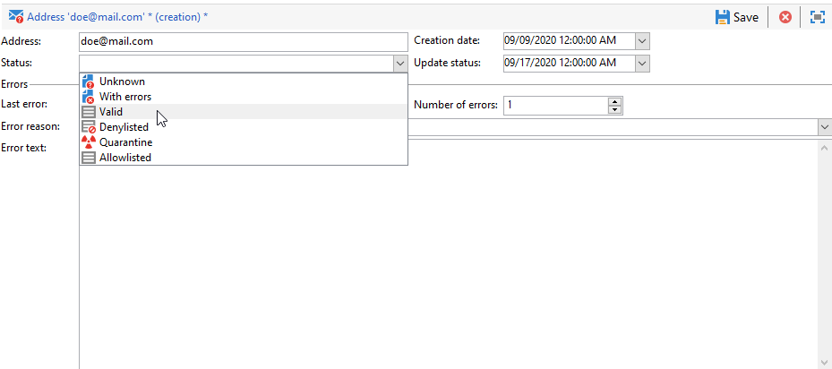

# Quarentenas {#quarantine-management}

O Adobe Campaign gerencia uma lista de endereços em quarentena para canais online (email, SMS, notificação por push). Alguns provedores de acesso à Internet consideram automaticamente emails como spam se a taxa de endereços inválidos for muito alta. A quarentena, portanto, evita que você seja adicionado à lista de bloqueios por esses provedores. Além disso, a quarentena ajuda a reduzir os custos de envio de SMS, excluindo números de telefone incorretos dos deliveries.

Quando o endereço ou número de telefone está em quarentena, os recipients são excluídos do target durante a análise de delivery: não será possível enviar mensagens de marketing, incluindo emails de fluxo de trabalho automatizados, para esses contatos. Se esses endereços em quarentena também estiverem presentes em listas, eles serão excluídos ao enviar para essas listas. Um endereço de email pode ser colocado em quarentena, por exemplo, quando a caixa de entrada estiver cheia, se o endereço não existir ou se o servidor de email não estiver disponível, por exemplo.

<!--For more on best practices to secure and optimize your deliveries, refer to [this page](delivery-best-practices.md).-->

**Quarentena** se aplica somente a um **endereço**, a **número de telefone** ou um **token de dispositivo**, mas não para o próprio perfil. Por exemplo, um perfil cujo endereço de email esteja em quarentena pode atualizar seu perfil e inserir um novo endereço, podendo então ser direcionado em ações de delivery novamente. Da mesma forma, se dois perfis tiverem o mesmo número de telefone, ambos serão afetados se o número estiver em quarentena. Os endereços em quarentena ou os números de telefone são exibidos nos [logs de exclusão](#delivery-quarantines) (para um delivery) ou na [lista de quarentena](#non-deliverable-bounces) (para toda a plataforma).

Por outro lado, os perfis podem estar no **lista de bloqueios** como após um cancelamento de subscrição (opt-out), para um determinado canal: isso implica que eles já não são alvo de nenhuma. Como consequência, se um perfil na  de lista de bloqueios para o canal de email tiver dois endereços de email, ambos os endereços serão excluídos do delivery. Você pode verificar se um perfil está na lista de bloqueios para um ou mais canais na seção **[!UICONTROL No longer contact]** da guia **[!UICONTROL General]** do perfil. [Saiba mais](../audiences/view-profiles.md).

>[!NOTE]
>
>Quando os recipients relatam sua mensagem como spam ou respondem a uma mensagem SMS com uma palavra-chave como &quot;PARAR&quot;, seu endereço ou número de telefone é colocado em quarentena como **[!UICONTROL Denylisted]**. O perfil é atualizado adequadamente.
>
> Para o canal de email, os endereços de email são colocados em quarentena. Para o canal de aplicativo móvel, os tokens do dispositivo são colocados em quarentena. Para o canal SMS, os números de telefone estão em quarentena.

## Por que um email, telefone ou dispositivo é enviado para quarentena {#quarantine-reason}

O Adobe Campaign gerencia a quarentena de acordo com o tipo de falha do delivery e seu motivo. Eles são atribuídos durante a qualificação de mensagens de erro. Saiba mais sobre o gerenciamento de falhas de delivery [nesta página](delivery-failures.md).

Dois tipos ou erros podem ser capturados:

* **Erro grave**: o endereço de email, número de telefone ou dispositivo é enviado imediatamente para quarentena.
* **Erro suave**: erros suaves aumentam um contador de erros e podem colocar em quarentena um email, número de telefone ou token de dispositivo. Desempenho da campanha [tentativas](delivery-failures.md#retries).: quando o contador de erros atinge o limite, o endereço, o número de telefone ou o token do dispositivo é colocado em quarentena. [Saiba mais](delivery-failures.md#retries).

Na lista de endereços em quarentena, o campo **[!UICONTROL Error reason]** indica por que o endereço selecionado foi colocado em quarentena. [Saiba mais](#identifying-quarantined-addresses-for-the-entire-platform).

Se um usuário qualificar um email como spam, a mensagem será automaticamente redirecionada para uma caixa de entrada técnica gerenciada pelo Adobe. Em seguida, o endereço de email do usuário será enviado automaticamente para quarentena com o status **[!UICONTROL Denylisted]**. Esse status se refere apenas ao endereço. O perfil não é incluído na lista de bloqueio para que o usuário continue recebendo mensagens SMS e notificações por push. Saiba mais sobre os loops de comentários no [Guia de práticas recomendadas do delivery](https://experienceleague.adobe.com/docs/deliverability-learn/deliverability-best-practice-guide/transition-process/infrastructure.html?lang=pt-BR#feedback-loops).

>[!NOTE]
>
>A quarentena no Adobe Campaign diferencia maiúsculas de minúsculas. Certifique-se de importar endereços de email em letras minúsculas, para que não sejam redirecionados posteriormente.

## Acessar endereços em quarentena {#access-quarantined-addresses}

Os endereços em quarentena podem ser exibidos para um delivery específico ou para toda a plataforma.

### Quarentenas de um delivery{#delivery-quarantines}

Os endereços de quarentena são listados durante a fase de preparação do delivery, nos logs do delivery do painel de delivery.

Para cada delivery, você também pode verificar a variável **[!UICONTROL Delivery summary]** relatório: ele mostra o número de endereços em quarentena no target do delivery e exibe:

* O número de endereços colocados em quarentena durante a análise de delivery,
* O número de endereços colocados em quarentena após a ação de delivery.

### Endereços de devolução e não entregues{#non-deliverable-bounces}

Para exibir a lista de endereços em quarentena **para toda a plataforma**, os administradores do Campaign podem navegar até  **[!UICONTROL Administration > Campaign Management > Non deliverables Management > Non deliverables and addresses]**. Esta seção lista os elementos em quarentena para **email**, **SMS** e **Notificação por push** canais.

>[!NOTE]
>
>O número de quarentenas aumenta com o tempo. Por exemplo, se o tempo de vida de um endereço de email for considerado três anos e a tabela de recipients aumentar em 50% todo ano, o aumento da quarentena poderá ser calculado da seguinte maneira:
>
>Fim do Ano 1: (1)&#42;0,33)/(1+0,5)=22%.
>
>Fim do Ano 2: (1.22)&#42;0,33)+0,33)/(1,5+0,75)=32,5%.

Além disso, a variável **[!UICONTROL Non-deliverables and bounces]** relatório integrado, disponível na **Relatórios** nesta página inicial, o exibe informações sobre os endereços em quarentena, os tipos de erro encontrados e um detalhamento de falha por domínio. Você pode filtrar dados para um delivery específico ou personalizar esse relatório conforme necessário.

Saiba mais sobre endereços de devolução no [Guia de práticas recomendadas de entrega](https://experienceleague.adobe.com/docs/deliverability-learn/deliverability-best-practice-guide/metrics-for-deliverability/bounces.html?lang=pt-BR)

### Endereço de email na quarentena {#quarantined-recipient}

Você pode consultar o status do endereço de email de qualquer recipient.

Para fazer isso, selecione o perfil do recipient e clique na guia **[!UICONTROL Deliveries]**. Para todos os deliveries a esse recipient, você pode descobrir se o endereço falhou, estava em quarentena durante a análise, etc.

Para cada pasta, você pode exibir apenas os recipients cujo endereço de email está em quarentena, com a variável **[!UICONTROL Quarantined email address]** filtro integrado, conforme abaixo:

## Remover um endereço em quarentena {#remove-a-quarantined-address}

Os endereços que correspondem a condições específicas são automaticamente excluídos da lista de quarentena pelo **Limpeza do banco de dados** fluxo de trabalho integrado.

Os endereços são removidos automaticamente da lista de quarentena nos seguintes casos:

* Os endereços em um status **[!UICONTROL With errors]** serão removidos da lista de quarentena após um delivery bem-sucedido.
* Os endereços em um status **[!UICONTROL With errors]** serão removidos da lista de quarentena se o último retorno de erro tiver ocorrido há mais de 10 dias. Para obter mais informações sobre o gerenciamento de erros de software, consulte [esta seção](#soft-error-management).
* Os endereços em um status **[!UICONTROL With errors]** que tiverem retornado com o erro **[!UICONTROL Mailbox full]** serão removidos da lista de quarentena após 30 dias.

O status muda então para **[!UICONTROL Valid]**.

>[!CAUTION]
>
>Os recipients com um endereço em um status **[!UICONTROL Quarantine]** ou **[!UICONTROL Denylisted]** nunca serão removidos, mesmo se receberem um email.

Você também pode remover manualmente um endereço da lista da quarentena. Para remover um endereço da quarentena, você pode:

* Alterar o status para **[!UICONTROL Valid]** do **[!UICONTROL Administration > Campaign Management > Non deliverables Management > Non deliverables and addresses]** nó .

   

* Alterar o status para **[!UICONTROL Allowlisted]**: nesse caso, o endereço permanece na lista da quarentena, mas será direcionado sistematicamente, mesmo que um erro seja encontrado.

>[!CAUTION]
>
>Se remover um endereço da lista de quarentena, você começará novamente a enviar para esse endereço novamente. Isso pode ter graves impactos na capacidade de entrega e reputação do IP, o que pode eventualmente levar ao bloqueio do endereço IP ou do domínio de envio. Continue com muito cuidado ao considerar a remoção de qualquer endereço da quarentena. Se precisar de assistência, entre em contato com o Suporte do Adobe.
