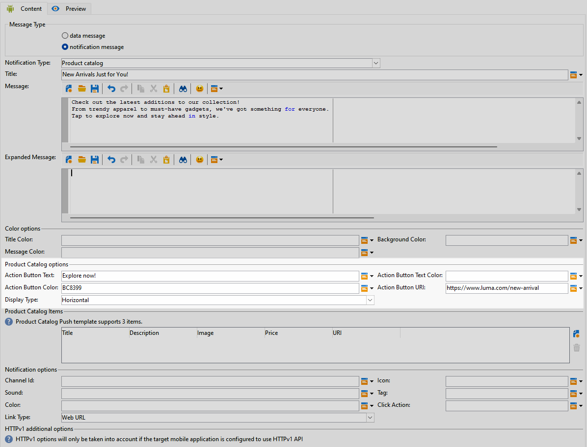
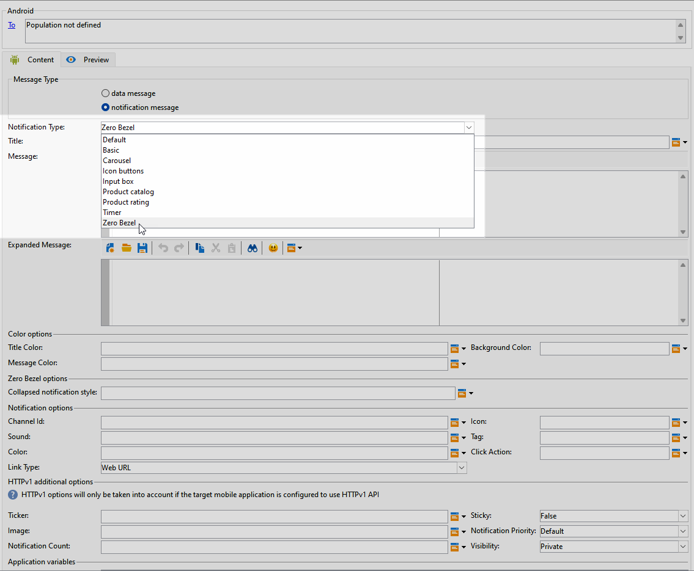

# Criar uma entrega de push avançada do Android {#rich-push}

>[!IMPORTANT]
>
>Antes de criar uma Notificação por push avançada, primeiro é necessário configurar o conector V2. Consulte [esta página](https://experienceleague.adobe.com/en/docs/campaign-classic/using/sending-messages/sending-push-notifications/configure-the-mobile-app/configuring-the-mobile-application-android#configuring-external-account-android) para obter o procedimento detalhado.

Com o Firebase Cloud Messaging, você pode escolher entre dois tipos de mensagens:

* O **[!UICONTROL Data message]** é manipulado pelo aplicativo cliente. Essas mensagens são enviadas diretamente para o aplicativo móvel, que gera e exibe uma notificação do Android no dispositivo. As mensagens de dados contêm somente as variáveis personalizadas do aplicativo.

* O **[!UICONTROL Notification message]**, manipulado automaticamente pelo SDK do FCM. O FCM exibe automaticamente a mensagem nos dispositivos dos usuários em nome do aplicativo do cliente. As mensagens de notificação contêm um conjunto predefinido de parâmetros e opções, mas ainda podem ser personalizadas com variáveis de aplicativo personalizadas.

Se a barra de rolagem estiver desabilitada na interface, acesse **[!UICONTROL Administration]** `>` **[!UICONTROL Platform]** `>` **[!UICONTROL Options]** e defina a opção **[!UICONTROL XtkUseScrollBar]** como 1.

## Definir o conteúdo de uma notificação do Android {#push-message}

Depois que o delivery de push é criado, é possível definir seu conteúdo usando um dos seguintes templates:

* **Padrão** permite enviar notificações com um ícone simples e uma imagem que o acompanha.

* **Básico** pode incluir texto, imagens e botões em suas notificações.

* O **Carrossel** permite enviar notificações com texto e várias imagens pelas quais os usuários podem passar.

* **Botões de ícone** permitem enviar notificações com um ícone e uma imagem correspondente.

* A **caixa de entrada** reúne os comentários e as entradas de usuário diretamente por meio da notificação.

* O **Catálogo de produtos** exibe uma variedade de imagens de produtos.

* **A classificação de produto** permite que os usuários forneçam comentários e classifiquem os produtos.

* **Timer** inclui um timer de contagem regressiva ativo em suas notificações.

* O **Painel sem Formatação** usa a superfície de plano de fundo inteira para uma imagem, com o texto sobreposto perfeitamente.

Navegue pelas guias abaixo para saber mais sobre como personalizar esses modelos.

>[!BEGINTABS]

>[!TAB Padrão]

1. No menu suspenso **[!UICONTROL Notification type]**, selecione **[!UICONTROL Default]**.

   

1. Para redigir a mensagem, insira o texto nos campos **[!UICONTROL Title]** e **[!UICONTROL Message]**.

   

1. Use campos de personalização dinâmicos para definir conteúdo, personalizar dados e adicionar conteúdo dinâmico. [Saiba mais](../send/personalize.md)

1. Para personalizar ainda mais sua notificação por push, configure o **[!UICONTROL Notification options]** e o **[!UICONTROL HTTPv1 additional options]** de sua notificação por push. [Saiba mais](#push-advanced)

   

Depois de definir o conteúdo da mensagem, você pode usar assinantes de teste para pré-visualizar e testar a mensagem.

>[!TAB Básico]

1. No menu suspenso **[!UICONTROL Notification Type]**, selecione **[!UICONTROL Basic]**.

   

1. Para redigir a mensagem, insira o texto nos campos **[!UICONTROL Title]**, **[!UICONTROL Message]** e **[!UICONTROL Expanded message]**.

   O texto **[!UICONTROL Message]** aparece no modo de exibição recolhido enquanto **[!UICONTROL Expanded message]** é exibido quando a notificação é expandida.

   

1. Use campos de personalização dinâmicos para definir conteúdo, personalizar dados e adicionar conteúdo dinâmico. [Saiba mais](../send/personalize.md)

1. No menu **[!UICONTROL Color options]**, insira os códigos de cor hexadecimais para **[!UICONTROL Title]**, **[!UICONTROL Message]** e **[!UICONTROL Background]**.

1. Adicione um **[!UICONTROL Remind later button]**, se necessário. Digite sua **[!UICONTROL Reminder Text]** e **Data** nos campos correspondentes.

   O campo **[!UICONTROL Reminder Date]** espera um valor que representa uma época em segundos.

1. Clique em **[!UICONTROL Add button]** e preencha os seguintes campos:

   * **[!UICONTROL Label]**: Texto exibido no botão.
   * **[!UICONTROL Link URI]**: especifique o URI a ser executado ao clicar no botão.

   Você tem a opção de incluir até três botões na sua notificação por push. Se você optar por **[!UICONTROL Remind later button]**, poderá incluir apenas um máximo de dois botões.

1. Selecione o **[!UICONTROL Link type]** da URL vinculada do seu botão:

   * **[!UICONTROL Web URL]**: as URLs da Web direcionam os usuários para o conteúdo online. Ao clicar em, eles solicitam que o navegador da Web padrão do dispositivo abra e navegue até o URL designado.

   * **[!UICONTROL Deeplink]**: deep links são URLs que direcionam os usuários para seções específicas em um aplicativo, mesmo que ele esteja fechado. Quando clicada, uma caixa de diálogo pode ser exibida, permitindo que os usuários escolham entre vários aplicativos capazes de manipular o link.

   * **[!UICONTROL Open App]**: as URLs de aplicativos abertos permitem que você se conecte diretamente ao conteúdo em um aplicativo. Ela permite que o aplicativo se estabeleça como o manipulador padrão para um tipo específico de link, ignorando a caixa de diálogo de desambiguação.

   Para obter mais informações sobre como lidar com Links de aplicativos da Android, consulte a [documentação de Desenvolvedores da Android](https://developer.android.com/training/app-links).

   

1. Para personalizar ainda mais sua notificação por push, configure o **[!UICONTROL Notification options]** e o **[!UICONTROL HTTPv1 additional options]** de sua notificação por push. [Saiba mais](#push-advanced)

   

Depois de definir o conteúdo da mensagem, você pode usar assinantes de teste para pré-visualizar e testar a mensagem.

>[!TAB Carrossel]

1. No menu suspenso **[!UICONTROL Notification Type]**, selecione **[!UICONTROL Carousel]**.

   

1. Para redigir a mensagem, insira o texto nos campos **[!UICONTROL Title]**, **[!UICONTROL Message]** e **[!UICONTROL Expanded message]**.

   O texto **[!UICONTROL Message]** aparece no modo de exibição recolhido enquanto **[!UICONTROL Expanded message]** é exibido quando a notificação é expandida.

   

1. Use o Editor de expressão para definir o conteúdo, personalizar os dados e adicionar conteúdo dinâmico. [Saiba mais](../send/personalize.md)

1. No menu **[!UICONTROL Color options]**, insira os códigos de cor hexadecimais para **[!UICONTROL Title]**, **[!UICONTROL Message]** e **[!UICONTROL Background]**.

1. Escolha como o **[!UICONTROL Carousel]** é operado:

   * **[!UICONTROL Auto]**: percorre automaticamente imagens como slides, fazendo a transição em intervalos predefinidos.
   * **[!UICONTROL Manual]**: permite que os usuários deslizem manualmente entre slides para navegar pelas imagens.

1. No menu suspenso **[!UICONTROL Layout]**, selecione a opção **[!UICONTROL Filmstrip]** para incluir visualizações das imagens anteriores e seguintes ao lado do slide principal.

1. Clique em **[!UICONTROL Add image]** e insira a URL da imagem, a URL do Texto e da Ação.

   Certifique-se de incluir no mínimo três imagens e no máximo cinco imagens.

   

1. Para personalizar ainda mais sua notificação por push, configure o **[!UICONTROL Notification options]** e o **[!UICONTROL HTTPv1 additional options]** de sua notificação por push. [Saiba mais](#push-advanced)

   

Depois de definir o conteúdo da mensagem, você pode usar assinantes de teste para pré-visualizar e testar a mensagem.

>[!TAB Botões de ícone]

1. No menu suspenso **[!UICONTROL Notification Type]**, selecione **[!UICONTROL Icon buttons]**.

   

1. No menu **[!UICONTROL Color options]**, insira os códigos de cor hexadecimais para o seu **[!UICONTROL Background]**.

   

1. Forneça a URL para o **[!UICONTROL Cancel button image]**.

1. Em **[!UICONTROL Icon image buttons]**, clique em **[!UICONTROL Add image]**. Em seguida, insira o **URL da imagem**, **Tipo de link** e **URI do link**.

   Certifique-se de incluir um mínimo de três imagens e um máximo de cinco botões.

   

1. Para personalizar ainda mais sua notificação por push, configure o **[!UICONTROL Notification options]** e o **[!UICONTROL HTTPv1 additional options]** de sua notificação por push. [Saiba mais](#push-advanced)

   

Depois de definir o conteúdo da mensagem, você pode usar assinantes de teste para pré-visualizar e testar a mensagem.

>[!TAB Caixa de entrada]

1. No menu suspenso **[!UICONTROL Notification Type]**, selecione **[!UICONTROL Input box]**.

   

1. Para redigir a mensagem, insira o texto nos campos **[!UICONTROL Title]**, **[!UICONTROL Message]** e **[!UICONTROL Expanded message]**.

   O texto **[!UICONTROL Message]** aparece no modo de exibição recolhido enquanto **[!UICONTROL Expanded message]** é exibido quando a notificação é expandida.

   

1. No menu **[!UICONTROL Color options]**, insira os códigos de cor hexadecimal para **[!UICONTROL Title]**, **[!UICONTROL Message]** e **[!UICONTROL Background]**.

1. No menu **[!UICONTROL Input box options]**, preencha a seguinte opção:

   * **[!UICONTROL Input receiver name]**: insira o nome ou identificador do receptor da entrada.
   * **[!UICONTROL Input text]**: Digite o texto para a **Caixa de entrada**.
   * **[!UICONTROL Feedback text]**: insira o texto a ser exibido após uma resposta.
   * **[!UICONTROL Feedback image]**: Adicionar a URL para a imagem exibida após uma resposta.

   

1. Para personalizar ainda mais sua notificação por push, configure o **[!UICONTROL Notification options]** e o **[!UICONTROL HTTPv1 additional options]** de sua notificação por push. [Saiba mais](#push-advanced)

   

Depois de definir o conteúdo da mensagem, você pode usar assinantes de teste para pré-visualizar e testar a mensagem.

>[!TAB Catálogo de Produtos]

1. No menu suspenso **[!UICONTROL Notification Type]**, selecione **[!UICONTROL Product catalog]**.

   

1. Para redigir a mensagem, insira o texto nos campos **[!UICONTROL Title]**, **[!UICONTROL Message]** e **[!UICONTROL Expanded message]**.

   O texto **[!UICONTROL Message]** aparece no modo de exibição recolhido enquanto **[!UICONTROL Expanded message]** é exibido quando a notificação é expandida.

   

1. No menu **[!UICONTROL Color options]**, insira os códigos de cor hexadecimais para **[!UICONTROL Title]**, **[!UICONTROL Message]** e **[!UICONTROL Background]**.

1. No menu **[!UICONTROL Product catalog options]**, preencha as seguintes opções:

   * **[!UICONTROL Action button text]**: Texto exibido no botão.
   * **[!UICONTROL Action button text color]**: Cor do texto do botão de Ação.
   * **[!UICONTROL Action button color]**: Cor do botão de Ação.
   * **[!UICONTROL Action button URI]**: especifique o URI a ser executado ao clicar no botão.
   * **[!UICONTROL Display type]**: escolha entre exibição vertical ou horizontal.

   

1. No menu **[!UICONTROL Product catalog items]**, clique em **[!UICONTROL Add]** e insira os seguintes detalhes para cada item:

   * **[!UICONTROL Title]**
   * **[!UICONTROL Description]**
   * **[!UICONTROL Image URL]**
   * **[!UICONTROL Price]**
   * **[!UICONTROL URI]**

   Certifique-se de incluir no máximo três itens.

   

1. Para personalizar ainda mais sua notificação por push, configure o **[!UICONTROL Notification options]** e o **[!UICONTROL HTTPv1 additional options]** de sua notificação por push. [Saiba mais](#push-advanced)

Depois de definir o conteúdo da mensagem, você pode usar assinantes de teste para pré-visualizar e testar a mensagem.

>[!TAB Classificação do produto]

1. No menu suspenso **[!UICONTROL Notification Type]**, selecione **[!UICONTROL Product rating]**.

   

1. Para redigir a mensagem, insira o texto nos campos **[!UICONTROL Title]**, **[!UICONTROL Message]** e **[!UICONTROL Expanded message]**.

   O texto **[!UICONTROL Message]** aparece no modo de exibição recolhido enquanto **[!UICONTROL Expanded message]** é exibido quando a notificação é expandida.

   

1. No menu **[!UICONTROL Color options]**, insira os códigos de cor hexadecimais para **[!UICONTROL Title]**, **[!UICONTROL Message]** e **[!UICONTROL Background]**.

1. No menu **[!UICONTROL Product rating options]**, insira as URLs de **[!UICONTROL Rating icon in unselected state]** e **[!UICONTROL Rating icon in selected state]**.

   

1. No menu **[!UICONTROL Product rating items]**, clique em **[!UICONTROL Add]**, insira **[!UICONTROL Link URI]** e escolha **[!UICONTROL Link type]**.

   * **[!UICONTROL Web URL]**: as URLs da Web direcionam os usuários para o conteúdo online. Ao clicar em, eles solicitam que o navegador da Web padrão do dispositivo abra e navegue até o URL designado.

   * **[!UICONTROL Deeplink]**: deep links são URLs que direcionam os usuários para seções específicas em um aplicativo, mesmo que ele esteja fechado. Quando clicada, uma caixa de diálogo pode ser exibida, permitindo que os usuários escolham entre vários aplicativos capazes de manipular o link.

   * **[!UICONTROL Open App]**: as URLs de aplicativos abertos permitem que você se conecte diretamente ao conteúdo em um aplicativo. Ela permite que o aplicativo se estabeleça como o manipulador padrão para um tipo específico de link, ignorando a caixa de diálogo de desambiguação.

   * **[!UICONTROL Dismiss]**: Nenhuma URL está associada ao botão; clicar simplesmente fecha a caixa de diálogo ou interface.

   Certifique-se de incluir no mínimo três valores e no máximo cinco valores.

   

1. Para personalizar ainda mais sua notificação por push, configure o **[!UICONTROL Notification options]** e o **[!UICONTROL HTTPv1 additional options]** de sua notificação por push. [Saiba mais](#push-advanced)

   

Depois de definir o conteúdo da mensagem, você pode usar assinantes de teste para pré-visualizar e testar a mensagem.

>[!TAB Temporizador]

1. No menu suspenso **[!UICONTROL Notification Type]**, selecione **[!UICONTROL Timer]**.

   

1. Para redigir a mensagem, insira o texto nos campos **[!UICONTROL Title]**, **[!UICONTROL Message]** e **[!UICONTROL Expanded message]**.

   O texto **[!UICONTROL Message]** aparece no modo de exibição recolhido enquanto **[!UICONTROL Expanded message]** é exibido quando a notificação é expandida.

   

1. Insira o texto a ser exibido depois que o timer expirar nos campos **[!UICONTROL Alternate title]**, **[!UICONTROL Alternate message]** e **[!UICONTROL Alternate expanded message]**.

1. No menu **[!UICONTROL Color options]**, insira os códigos de cor hexadecimais para seus **[!UICONTROL Title]**, **[!UICONTROL Message]**, **[!UICONTROL Background]** e **[!UICONTROL Timer]**.

   

1. Defina o **[!UICONTROL Timer duration]** em segundos ou o **[!UICONTROL Timer end timestamp]** com um carimbo de data/hora de época específico e adicione a URL **[!UICONTROL Alternate image]** que será exibida após a expiração do cronômetro.

   

1. Para personalizar ainda mais sua notificação por push, configure o **[!UICONTROL Notification options]** e o **[!UICONTROL HTTPv1 additional options]** de sua notificação por push. [Saiba mais](#push-advanced)

Depois de definir o conteúdo da mensagem, você pode usar assinantes de teste para pré-visualizar e testar a mensagem.

>[!TAB Sem painel]

1. No menu suspenso **[!UICONTROL Notification Type]**, selecione **[!UICONTROL Zero bezel]**.

   

1. Para redigir a mensagem, insira o texto nos campos **[!UICONTROL Title]**, **[!UICONTROL Message]** e **[!UICONTROL Expanded message]**.

   O texto **[!UICONTROL Message]** aparece no modo de exibição recolhido enquanto **[!UICONTROL Expanded message]** é exibido quando a notificação é expandida.

   

1. No menu **[!UICONTROL Color options]**, insira os códigos de cor hexadecimais para **[!UICONTROL Title]**, **[!UICONTROL Message]** e **[!UICONTROL Background]**.

1. No menu **[!UICONTROL Zero bezel options]**, adicione a URL da imagem no campo **[!UICONTROL Collapsed notification style]**.

   

1. Para personalizar ainda mais sua notificação por push, configure o **[!UICONTROL Notification options]** e o **[!UICONTROL HTTPv1 additional options]** de sua notificação por push. [Saiba mais](#push-advanced)

Depois de definir o conteúdo da mensagem, você pode usar assinantes de teste para pré-visualizar e testar a mensagem.

>[!ENDTABS]

## Configurações avançadas de notificações por push {#push-advanced}

### Opções de notificação {#notification-options}

| Parâmetro | Descrição |
|---------|---------|
| **[!UICONTROL Channel ID]** | Defina a ID do canal da sua notificação. O aplicativo deve criar um canal com essa ID de canal antes que qualquer notificação com essa ID de canal seja recebida. |
| **[!UICONTROL Icon]** | Defina o ícone da notificação que será exibido em seus dispositivos de perfis. |
| **[!UICONTROL Sound]** | Defina o som que será reproduzido quando o dispositivo receber sua notificação. |
| **[!UICONTROL Tag]** | Defina um identificador usado para substituir notificações existentes na gaveta de notificações. Isso ajuda a evitar o acúmulo de várias notificações e garante que somente a notificação relevante mais recente seja exibida. |
| **[!UICONTROL Color]** | Defina a cor do ícone da sua notificação com código de cor hexadecimal. |
| **[!UICONTROL Click action]** | Defina a ação associada a um clique do usuário em sua notificação. |
| **[!UICONTROL Notification background color]** | Defina a cor do plano de fundo da Notificação com os códigos de cor hexadecimal. |
| **[!UICONTROL Link type]** | <ul><li>URL da Web: os URLs da Web direcionam os usuários para conteúdo online. Ao clicar em, eles solicitam que o navegador da Web padrão do dispositivo abra e navegue até o URL designado.</li><li>Deeplink: deep links são URLs que orientam os usuários para seções específicas em um aplicativo, mesmo que ele esteja fechado. Quando clicada, uma caixa de diálogo pode ser exibida, permitindo que os usuários escolham entre vários aplicativos capazes de manipular o link.</li><li> Abrir aplicativo: as URLs abertas do aplicativo permitem que você se conecte diretamente ao conteúdo em um aplicativo. Ela permite que o aplicativo se estabeleça como o manipulador padrão para um tipo específico de link, ignorando a caixa de diálogo de desambiguação.</li></ul> |

### Opções adicionais do HTTPv1 {#additional-options}

| Parâmetro | Descrição |
|---------|---------|
| **[!UICONTROL Ticker]** | Defina o texto do ticker da sua notificação. Disponível somente para dispositivos definidos como Android 5.0 Lollipop. |
| **[!UICONTROL Sticky]** | Quando ativada, a notificação permanece visível mesmo depois que o usuário clica nela.  Se desativada, a notificação é automaticamente descartada quando o usuário interage com ela. O comportamento fixo permite que notificações importantes persistam na tela por períodos mais longos. |
| **[!UICONTROL Image]** | Defina o URL da imagem que será exibido na sua notificação. |
| **[!UICONTROL Notification Priority]** | Defina o nível de prioridade da sua notificação, que pode ser padrão, mínimo, baixo ou alto. O nível de prioridade determina a importância e a urgência da notificação, influenciando como ela é exibida e se pode ignorar determinadas configurações do sistema. Para obter mais informações, consulte a [documentação do FCM](https://firebase.google.com/docs/reference/fcm/rest/v1/projects.messages#notificationpriority). |
| **[!UICONTROL Notification Count]** | Defina o número de novas informações não lidas a serem exibidas diretamente no ícone do aplicativo. Isso permite que o usuário veja rapidamente o número de notificações pendentes. |
| **[!UICONTROL Visibility]** | Defina o nível de visibilidade de sua notificação, que pode ser público, privado ou secreto. O nível de visibilidade determina quanto do conteúdo da notificação é exibido na tela de bloqueio e em outras áreas confidenciais. Para obter mais informações, consulte a [documentação do FCM](https://firebase.google.com/docs/reference/fcm/rest/v1/projects.messages#visibility). |
| **[!UICONTROL Application variables]** | Permite definir o comportamento da notificação. Essas variáveis são totalmente personalizáveis e incluídas com parte do conteúdo da mensagem enviada para o dispositivo móvel. |
