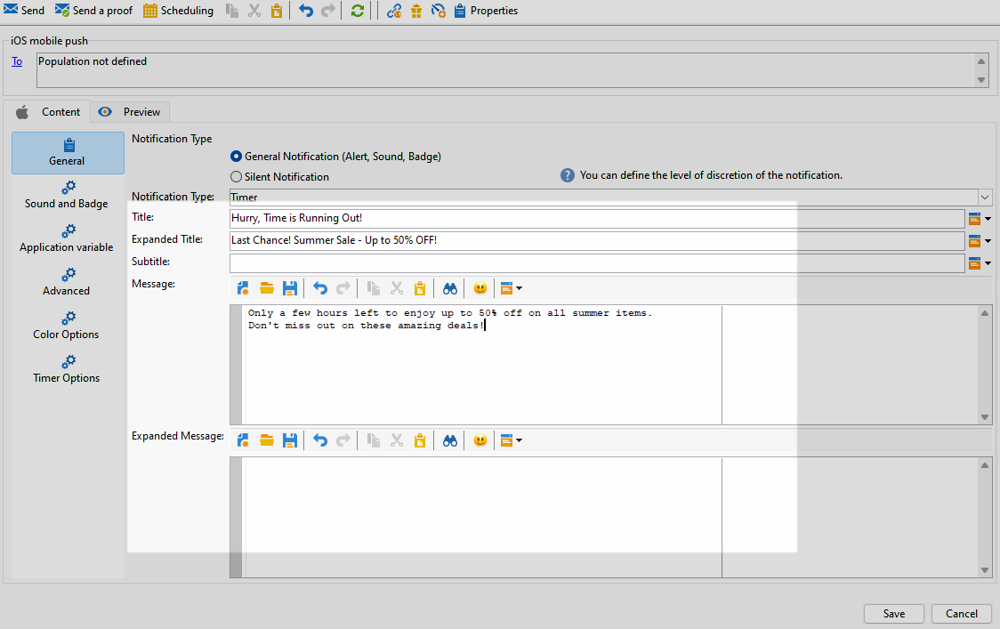

# Criar uma entrega de push avançada do iOS {#rich-push}

>[!IMPORTANT]
>
>Antes de criar uma Notificação por push avançada, primeiro é necessário configurar o conector V2. Consulte [esta página](https://experienceleague.adobe.com/en/docs/campaign-classic/using/sending-messages/sending-push-notifications/configure-the-mobile-app/configuring-the-mobile-application) para obter o procedimento detalhado.

## Definir o conteúdo de uma notificação do iOS {#push-message}

Depois que o delivery de push é criado, é possível definir seu conteúdo usando um dos seguintes templates:

* **Padrão** permite enviar notificações com um ícone simples e uma imagem que o acompanha.

* **Básico** pode incluir texto, imagens e botões em suas notificações.

* O **Carrossel** permite enviar notificações com texto e várias imagens pelas quais os usuários podem passar.

Navegue pelas guias abaixo para saber mais sobre como personalizar esses modelos.

>[!BEGINTABS]

>[!TAB Padrão]

1. Escolha **[!UICONTROL General notification (Alert, Sound, Badge)]** como **[!UICONTROL Notification type]**.

1. No menu suspenso **[!UICONTROL Notification Type]**, selecione **[!UICONTROL Default]**.

   

1. No campo **[!UICONTROL Title]**, insira o rótulo do título que deve aparecer na lista de notificações disponível no centro de notificações.

   Este campo permite a definição do valor do parâmetro **title** do conteúdo de notificação do iOS.

1. Opcionalmente, adicione um **[!UICONTROL Subtitle]**, que corresponda ao parâmetro **subtitle** da carga de notificação do iOS.

1. Insira o conteúdo da mensagem na seção **[!UICONTROL Message content]** do assistente.

   

1. Navegue até a guia **[!UICONTROL Sound and Badge]** para personalizar configurações adicionais, como opções de som e selo, para suas notificações. [Saiba mais](#sound-badge)

   

1. Na guia **[!UICONTROL Application variables]**, suas **[!UICONTROL Application variables]** são adicionadas automaticamente. Elas permitem definir o comportamento da notificação: por exemplo, é possível configurar uma tela de aplicativo específica para ser exibida quando o usuário ativar a notificação.

1. Para mais personalizações, explore o **[!UICONTROL Advanced options]** disponível para suas notificações por push. [Saiba mais](#push-advanced)

   

1. Quando a notificação estiver configurada, clique na guia **[!UICONTROL Preview]** para visualizar a notificação.

>[!TAB Básico]

1. Escolha **[!UICONTROL General notification (Alert, Sound, Badge)]** como **[!UICONTROL Notification type]**.

1. No menu suspenso **[!UICONTROL Notification Type]**, selecione **[!UICONTROL Basic]**.

   

1. Para redigir a mensagem, digite o texto nos campos **[!UICONTROL Title]**,**[!UICONTROL Expanded message]**, **[!UICONTROL Message]** e **[!UICONTROL Expanded message]**.

   O texto **[!UICONTROL Message]** aparece no modo de exibição recolhido enquanto **[!UICONTROL Expanded message]** é exibido quando a notificação é expandida.

   

1. Opcionalmente, adicione um **[!UICONTROL Subtitle]**, que corresponda ao parâmetro **subtitle** da carga de notificação do iOS.

1. Navegue até a guia **[!UICONTROL Sound and Badge]** para personalizar configurações adicionais, como opções de som e selo, para suas notificações. [Saiba mais](#sound-badge)

1. Na guia **[!UICONTROL Application variables]**, suas **[!UICONTROL Application variables]** são adicionadas automaticamente. Elas permitem definir o comportamento da notificação: por exemplo, é possível configurar uma tela de aplicativo específica para ser exibida quando o usuário ativar a notificação.

1. Para mais personalizações, explore o **[!UICONTROL Advanced options]** disponível para suas notificações por push. [Saiba mais](#push-advanced)

   

1. No menu **[!UICONTROL Color options]**, insira códigos de cor hexadecimais para **[!UICONTROL Title]**, **[!UICONTROL Message]** e **[!UICONTROL Background]**.

   

Depois de definir o conteúdo da mensagem, você pode usar assinantes de teste para pré-visualizar e testar a mensagem.

>[!TAB Carrossel]

1. Escolha **[!UICONTROL General notification (Alert, Sound, Badge)]** como **[!UICONTROL Notification type]**.

1. No menu suspenso **[!UICONTROL Notification Type]**, selecione **[!UICONTROL Carousel]**.

   

1. Para redigir a mensagem, insira o texto nos campos **[!UICONTROL Title]**, **[!UICONTROL Expanded Title]** e **[!UICONTROL Message]**.

   

1. Navegue até a guia **[!UICONTROL Sound and Badge]** para personalizar configurações adicionais, como opções de som e selo, para suas notificações. [Saiba mais](#sound-badge)

1. Na guia **[!UICONTROL Application variables]**, suas **[!UICONTROL Application variables]** são adicionadas automaticamente. Elas permitem definir o comportamento da notificação: por exemplo, é possível configurar uma tela de aplicativo específica para ser exibida quando o usuário ativar a notificação.

   

1. Para mais personalizações, explore o **[!UICONTROL Advanced options]** disponível para suas notificações por push. [Saiba mais](#push-advanced)

1. No menu **[!UICONTROL Color options]**, insira códigos de cor hexadecimais para **[!UICONTROL Title]**, **[!UICONTROL Message]** e **[!UICONTROL Background]**.

1. Escolha como o **[!UICONTROL Carousel]** opera na guia **[!UICONTROL Carousel options]**:

   * **[!UICONTROL Auto]**: percorre automaticamente imagens como slides, fazendo a transição em intervalos predefinidos.
   * **[!UICONTROL Manual]**: permite que os usuários deslizem manualmente entre slides para navegar pelas imagens.

1. Clique em **[!UICONTROL Add image]** e insira seu **[!UICONTROL Image URL]**, **[!UICONTROL Text]** e **[!UICONTROL Action URL]**.

   Certifique-se de incluir no mínimo três imagens e no máximo cinco imagens.

   

Depois de definir o conteúdo da mensagem, você pode usar assinantes de teste para pré-visualizar e testar a mensagem.

>[!TAB Temporizador]

1. Escolha **[!UICONTROL General notification (Alert, Sound, Badge)]** como **[!UICONTROL Notification type]**.

1. No menu suspenso **[!UICONTROL Notification Type]**, selecione **[!UICONTROL Timer]**.

   

1. Para redigir a mensagem, digite o texto nos campos **[!UICONTROL Title]**,**[!UICONTROL Expanded title]**, **[!UICONTROL Message]** e **[!UICONTROL Expanded message]**.

   O texto **[!UICONTROL Message]** aparece no modo de exibição recolhido enquanto **[!UICONTROL Expanded message]** é exibido quando a notificação é expandida.

   

1. Opcionalmente, adicione um **[!UICONTROL Subtitle]**, que corresponda ao parâmetro **subtitle** da carga de notificação do iOS.

1. Navegue até a guia **[!UICONTROL Sound and Badge]** para personalizar configurações adicionais, como opções de som e selo, para suas notificações. [Saiba mais](#sound-badge)

1. Na guia **[!UICONTROL Application variables]**, suas **[!UICONTROL Application variables]** são adicionadas automaticamente. Elas permitem definir o comportamento da notificação: por exemplo, é possível configurar uma tela de aplicativo específica para ser exibida quando o usuário ativar a notificação.

1. Para mais personalizações, explore o **[!UICONTROL Advanced options]** disponível para suas notificações por push. [Saiba mais](#push-advanced)

1. No menu **[!UICONTROL Color options]**, insira códigos de cor hexadecimais para **[!UICONTROL Title]**, **[!UICONTROL Message]** e **[!UICONTROL Background]**.

   

1. Na guia **[!UICONTROL Timer]**, defina seu **[!UICONTROL Timer duration]** em segundos ou o **[!UICONTROL Timer end timestamp]** como um carimbo de data e hora de época específico.

1. Insira o texto e a imagem que serão exibidos depois que o timer expirar nos campos **[!UICONTROL Alternate title]**, **[!UICONTROL Alternate message]** e **[!UICONTROL Alternate image]**.

   

Depois de definir o conteúdo da mensagem, você pode usar assinantes de teste para pré-visualizar e testar a mensagem.

>[!ENDTABS]

## Configurações avançadas de notificações por push {#push-advanced}

### Opções de som e selo {#sound-badge}

| Parâmetro | Descrição |
|---------|---------|
| **[!UICONTROL Clean Badge]** | Ative essas opções para atualizar o valor do selo. |
| **[!UICONTROL Value]** | Defina um número que será usado para exibir o número de novas informações não lidas diretamente no ícone do aplicativo. |
| **[!UICONTROL Critical alert mode]** | Ative essa opção para adicionar som à sua notificação, mesmo que o telefone do usuário esteja configurado no modo de foco ou se o iPhone estiver sem áudio. |
| **[!UICONTROL Name]** | Selecione o som a ser reproduzido pelo terminal móvel quando a notificação for recebida. |
| **[!UICONTROL Volume]** | Defina o volume do seu som de 0 a 100. Os sons devem ser incluídos no aplicativo e definidos quando o serviço é criado. |

### Opções avançadas {#notification-options}

| Parâmetro | Descrição |
|---------|---------|
| **[!UICONTROL Mutable content]** | Habilite esta opção para permitir que o aplicativo móvel baixe conteúdo de mídia. |
| **[!UICONTROL Thread-id]** | Defina o identificador usado para agrupar notificações relacionadas. |
| **[!UICONTROL Category]** | Defina o nome da ID da categoria que exibirá botões de ação. Essas notificações fornecem ao usuário uma maneira mais rápida de realizar tarefas diferentes em resposta a uma notificação sem abrir o aplicativo ou navegar até ele. |
| **[!UICONTROL Target content ID]** | Defina um identificador usado para definir qual janela de aplicativo será apresentada quando a notificação for aberta. |
| **[!UICONTROL Launch image]** | Defina o nome do arquivo de imagem a ser exibido na inicialização. Se o usuário optar por iniciar seu aplicativo, a imagem selecionada será exibida em vez da tela de inicialização do aplicativo. |
| **[!UICONTROL Click action]** | Defina a ação associada a um clique do usuário em sua notificação. |
| **[!UICONTROL Interruption level]** | <ul><li>Ativo: definido por padrão, o sistema apresenta a notificação imediatamente, ativa a tela e pode reproduzir um som. As notificações não interrompem os modos de foco.</li><li>Passivo: o sistema adiciona a notificação à lista de notificações sem ativar a tela ou reproduzir um som. As notificações não interrompem os modos de foco.</li><li> Sensível ao tempo: o sistema apresenta a notificação imediatamente, ativa a tela, pode reproduzir um som e interrompe os modos de foco. Esse nível não requer uma permissão especial da Apple.</li><li>Crítico: o sistema apresenta a notificação imediatamente, ativa a tela e ignora os modos de foco e a opção de mudo. Observe que esse nível requer uma permissão especial da Apple.</li></ul> |
| **[!UICONTROL Relevance score]** | Defina uma pontuação de relevância de 0 a 100. O sistema usa essa opção para classificar as notificações no resumo de notificações. |

