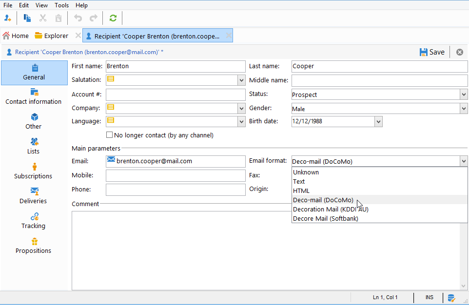

# Enviar emails em dispositivos móveis japoneses {#sending-emails-on-japanese-mobiles}

## Formatos de email para celulares japoneses {#email-formats-for-japanese-mobiles}

O Adobe Campaign gerencia três formatos específicos em japonês para email em dispositivos móveis: **Deco-mail** (celulares DoCoMo), **Decore Mail** (celulares Softbank) e **Decoration Mail** (celulares KDDI AU). Esses formatos impõem restrições específicas de codificação, estrutura e tamanho. Saiba mais sobre limitações e recomendações [nesta seção](#limitations-and-recommendations).

Para que o destinatário receba corretamente mensagens em um desses formatos, recomendamos selecionar **[!UICONTROL Deco-mail (DoCoMo)]**, **[!UICONTROL Decore Mail (Softbank)]** ou **[!UICONTROL Decoration Mail (KDDI AU)]** no perfil correspondente:

No entanto, se você deixar a opção **[!UICONTROL Email format]** como **[!UICONTROL Unknown]**, **[!UICONTROL HTML]** ou **[!UICONTROL Text]**, o Adobe Campaign detectará automaticamente (ao enviar o email) o formato japonês a ser usado para que a mensagem seja exibida corretamente.

Esse sistema de detecção automática baseia-se na lista de domínios predefinidos no conjunto de regras de email **[!UICONTROL Management of Email Formats]**. Para obter mais informações sobre gerenciamento de formatos de email, consulte a [documentação do Campaign Classic](https://experienceleague.adobe.com/docs/campaign-classic/using/installing-campaign-classic/additional-configurations/email-deliverability.html#managing-email-formats).

## Limitações e recomendações {#limitations-and-recommendations}

Determinado número de restrições se aplica no envio de emails que serão lidos em um dispositivo móvel operado por um provedor japonês (Softbank, DoCoMo, KDDI AU).

Portanto, você deve:

* Usar somente imagens no formato JPEG ou GIF
* Criar uma entrega com seções de texto e HTML que são estritamente inferiores a 10.000 bytes (para KDDI AU e DoCoMo)
* Usar imagens com tamanho total (antes de codificar) abaixo de 100 KB
* Usar até 20 imagens por mensagem
* Usar um formato HTML de tamanho reduzido (um número limitado de tags está disponível para cada operador)

>[!NOTE]
>
>Limitações específicas a cada operador devem ser consideradas ao criar sua mensagem. Consulte a documentação do produto.

## Testar o conteúdo do email {#testing-the-email-content}

### Pré-visualizar a mensagem {#previewing-the-message}

O Adobe Campaign permite verificar se o formato da mensagem é compatível com um celular japonês.

Após definir seu conteúdo e inserir o assunto do email, você poderá verificar a exibição e a formatação quando a mensagem for criada.

Na guia **[!UICONTROL Preview]** da janela de edição de conteúdo, ao clicar em **[!UICONTROL More... > Deco-mail diagnostic]** você poderá:

* Verifique se as tags de conteúdo HTML estão em conformidade com as restrições do formato japonês
* Verifique se o número de imagens na mensagem não excede o limite imposto pelo formato (20 imagens)
* Verifique o tamanho total da mensagem (até 100kB)

  

### Executar regra de tipologia {#running-typology-rule}

Além do diagnóstico de pré-visualização, uma segunda verificação é realizada ao enviar uma prova ou uma entrega: uma regra de tipologia específica, **[!UICONTROL Deco-mail check]**, é iniciada durante a análise.

>[!IMPORTANT]
>
>Essa regra de tipologia só será executada se pelo menos um dos destinatários estiver configurado para receber emails no formato **[!UICONTROL Deco-mail (DoCoMo)]**, **[!UICONTROL Decore Mail (Softbank)]** ou **[!UICONTROL Decoration Mail (KDDI AU)]**.

Essa regra de tipologia permite verificar se a entrega respeita as [restrições de formato](#limitations-and-recommendations) definidas pelos operadores japoneses, especialmente em relação ao tamanho total do email, ao tamanho das seções HTML e de texto, ao número de imagens nas mensagens e às tags no conteúdo HTML.

### Enviar provas {#sending-proofs}

Você pode enviar provas para testar sua entrega. Quando você envia a prova, se estiver usando endereços de substituição, digite os endereços que correspondem ao formato do email do perfil usado.

Por exemplo, você pode substituir o endereço de um perfil por test@softbank.ne.jp, se o formato do email desse perfil tiver sido definido antecipadamente no **[!UICONTROL Decore Mail (Softbank)]**.

## Enviar mensagens {#sending-messages}

Para enviar um email para destinatários com formatos de email japoneses com o Campaign, há duas opções:

* Criar duas entregas: uma somente para destinatários japoneses e outra para outros destinatários. Consulte [esta seção](#designing-a-specific-delivery-for-japanese-formats).
* Criar uma única entrega e o Adobe Campaign detectará automaticamente o formato a ser usado. Consulte [esta seção](#designing-a-delivery-for-all-formats).

### Criar uma entrega específica para formatos japoneses {#designing-a-specific-delivery-for-japanese-formats}

Você pode criar um workflow que contenha duas entregas: uma para ser lida em um celular japonês e outra para destinatários com formato do email padrão.

Para fazer isso, use a atividade **[!UICONTROL Split]** no workflow e defina os formatos de email japonês (Deco-mail, Decoration Mail e Decore Mail) como condições de filtragem.

### Criar uma entrega para todos os formatos {#designing-a-delivery-for-all-formats}

Quando o Adobe Campaign gerencia dinamicamente os formatos de acordo com o domínio (perfis com formatos de email definidos como **[!UICONTROL Unknown]**, **[!UICONTROL HTML]** ou **[!UICONTROL Text]**), você pode enviar a mesma entrega a todos os destinatários.

O contato da mensagem será exibido corretamente para os usuários em celulares japoneses, assim como para os destinatários padrão.

>[!IMPORTANT]
>
>Respeite os recursos especiais associados a cada formato do email japonês (Deco-mail, Decoration Mail e Decore Mail). Para obter mais informações sobre as limitações, consulte [esta seção](#limitations-and-recommendations).
