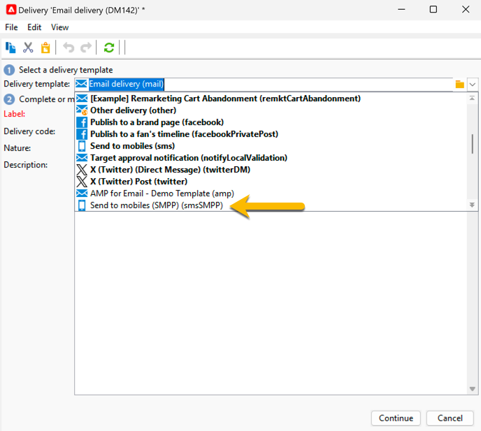

# Criar sua primeira entrega de SMS {#sms-delivery}

Para criar uma nova entrega de SMS, siga as etapas abaixo:

1. Crie uma nova entrega e selecione o [modelo de entrega de SMS](sms-mid-sourcing.md#sms-delivery-template) criado para seus envios de SMS.

   {zoomable="yes"}

   As etapas de criação de entrega estão detalhadas em [esta página](../../start/create-message.md).

<!-- * For standalone instance,  [learn more here](sms-standalone-instance.md#sms-delivery-template).
* For mid-sourcing infrastructure, -->

1. Renomeie sua entrega no campo **[!UICONTROL Label]** e adicione informações no campo **[!UICONTROL Delivery code]** e na lista **[!UICONTROL Nature]**, se necessário, para o rastreamento. Você também pode adicionar um **[!UICONTROL Description]** à sua entrega.

1. Clique no botão **[!UICONTROL Continue]**. Agora, você tem todas as configurações do modelo no seu delivery.

1. Você pode verificar no botão **[!UICONTROL Properties]** se tudo está configurado conforme necessário. [Saiba mais sobre a guia SMS](sms-delivery-settings.md#sms-tab)

   {zoomable="yes"}

1. [Defina o conteúdo](sms-content.md) da sua entrega.

1. [Selecione a audiência](sms-audience.md).

As etapas para definir um público estão detalhadas em [esta página](../../audiences/create-audiences.md).

## Validar e enviar SMS {#sms-validate}

Após a criação do delivery, você poderá:

1. [Enviar provas](sms-proofs.md) para validar a renderização e o conteúdo,

1. Em seguida, [envie para o público final](sms-send.md).

## Monitorar e rastrear SMS {#sms-monitor}

Após o envio, [saiba como monitorar e rastrear o SMS](sms-monitor.md).
