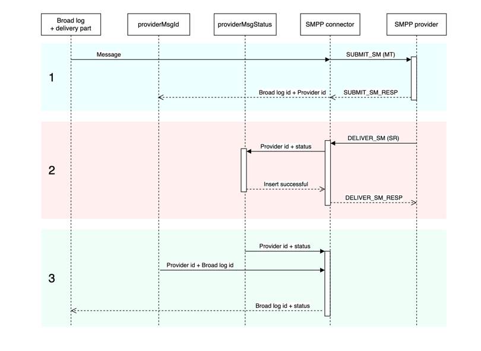

# Descrição do conector SMPP {#smpp-connector-desc}

>[!IMPORTANT]
>
>Isso se aplica ao Adobe Campaign v8.7.2 e posteriores.
>
>Para versões mais antigas, consulte a [documentação do Campaign Classic v7](https://experienceleague.adobe.com/pt-br/docs/campaign-classic/using/sending-messages/sending-messages-on-mobiles/sms-set-up/sms-set-up){target="_blank"}.

## Fluxo de dados do conector SMS {#sms-data-flow}

Esta seção descreve como o processo SMS lida com dados.

Este é um diagrama de bloco de alto nível que resume como o processo de SMS interage com seu ambiente.

{zoomable="yes"}

O processo SMS hospeda 2 componentes importantes: o próprio conector SMPP que lida com a comunicação com o provedor SMPP e uma tarefa em segundo plano para reconciliação de SR.

### Fluxo de dados para contas SMPP {#sms-data-flow-smpp-accounts}

O processo SMS pesquisa nms:extAccount e cria novas conexões em seu conector SMPP, transmitindo as configurações de cada conta. A frequência de sondagem pode ser ajustada em serverConf, na configuração *configRefreshMillis*.

Para cada conta SMPP ativa, o conector SMPP tenta manter as conexões ativas o tempo todo. Ele se reconecta caso a conexão seja perdida.

### Fluxo de dados ao enviar mensagens {#sms-data-flow-sending-msg}

* O processo SMS seleciona deliveries ativos digitalizando nms:delivery. Um delivery fica ativo quando:
   * Seu estado implica que as mensagens podem ser enviadas
   * Seu período de validade não expirou
   * Na verdade, é um delivery (por exemplo, não é um template, não é excluído)
   * O conector SMPP pode abrir pelo menos uma conexão para a conta externa vinculada à entrega
* Para cada delivery, o processo SMS carrega partes do delivery. Se a parte da entrega foi parcialmente enviada, o processo SMS verifica quais mensagens já foram enviadas, verificando o log amplo.
* O processo SMS expande o modelo com dados de personalização da parte de entrega.
* O conector SMPP gera um MT (SUBMIT_SM PDU) correspondente ao conteúdo e outras configurações.
* O conector SMPP envia o MT por uma conexão de transmissor (ou transceptor).
* O provedor retorna uma ID para este MT. Ele é inserido em nms:providerMsgId.
* O processo SMS atualiza o log amplo para o status enviado.
* No caso de erro final, o processo SMS atualiza o log amplo de acordo e pode criar um novo tipo de erro em nms:broadLogMsg.

### Fluxo de dados ao receber SR {#sms-data-flow-sr}

* O conector SMPP recebe e decodifica o SR (DELIVER_SM PDU). Ele usa regexes definidos na conta externa para obter a ID e o status da mensagem.
* A ID e o status da mensagem são inseridos em nms:providerMsgStatus
* Depois de inserido, o conector SMPP responde com uma PDU DELIVER_SM_RESP.
* Se algo deu errado durante o processo, o conector SMPP envia uma PDU DELIVER_SM_RESP negativa e registra uma mensagem.

### Fluxo de dados ao receber um MO {#sms-data-flow-mo}

* O conector SMPP recebe e decodifica o MO (DELIVER_SM PDU).
* A palavra-chave é extraída da mensagem. Se ele corresponder a qualquer palavra-chave declarada, as ações correspondentes serão executadas. Ele pode gravar em nms:address para atualizar a quarentena.
* Se os TLV personalizados forem declarados, eles serão decodificados de acordo com suas respectivas configurações.
* O MO totalmente decodificado e processado é inserido na tabela nms:inSms.
* O conector SMPP responde com uma PDU DELIVER_SM_RESP. Se algum erro for detectado, um código de erro será retornado ao provedor.

### Fluxo de dados ao reconciliar MT e SR {#sms-reconciling-mt-sr}

* O componente de reconciliação SR lê periodicamente nms:providerMsgId e nms:providerMsgStatus. Os dados de ambas as tabelas são unidos.
* Para todas as mensagens que tenham uma entrada em ambas as tabelas, a entrada nms:broadLog correspondente é atualizada.
* A tabela nms:broadLogMsg pode ser atualizada no processo se um novo tipo de erro for detectado ou para atualizar contadores de erros que não foram qualificados manualmente.

## Correspondência de MT, SR e entradas de broadlog {#sms-matching-entries}

Este é um diagrama descrevendo todo o processo:

{zoomable="yes"}

**Fase 1**

* A mensagem é digitalizada, formatada e transmitida para o conector SMPP.
* O conector SMPP o formata como uma PDU MT SUBMIT_SM.
* O MT é enviado para o provedor SMPP.
* O provedor responde com SUBMIT_SM_RESP. SUBMIT_SM e SUBMIT_SM_RESP são combinados por seu sequence_number.
* SUBMIT_SM_RESP fornece uma ID proveniente do provedor. Essa ID é inserida junto com a ID de log ampla na tabela nms:providerMsgId.

**Fase 2**

* O provedor envia um PDU SR DELIVER_SM.
* O SR é analisado para extrair a ID do provedor, o status e o código de erro. Esta etapa usa regex de extração.
* A ID do provedor e seu status correspondente são inseridos em nms:providerMsgStatus.
* Quando todos os dados forem inseridos com segurança no banco de dados, o conector SMPP responderá com DELIVER_SM_RESP. DELIVER_SM e DELIVER_SM_RESP são correspondidos por seu sequence_number.

**Fase 3**

* O componente de reconciliação SR do processo SMS verifica periodicamente as tabelas nms:providerMsgId e nms:providerMsgStatus.
* Se qualquer linha tiver IDs de provedor correspondentes em ambas as tabelas, as 2 entradas serão unidas. Isso permite a correspondência da ID de log ampla (armazenada em providerMsgId) com o status (armazenado em providerMsgStatus)
* O log amplo é atualizado com o status correspondente.

## Afinidades e o conector de processo dedicado {#sms-affinities}

As afinidades são ignoradas pelo conector de processo dedicado; ele apenas é executado dentro do processo SMS.

## opções serverConf {#sms-serverconf-options}

Algumas configurações podem ser ajustadas em serverConf.xml. Como qualquer outra configuração nesse arquivo, ele deve ser especificado no arquivo config-instance.xml. Todas as configurações estão no elemento &lt; mta2 >.

Esta tabela resume todas as configurações. Os valores de sensibilidade mín./máx. dão uma ideia aproximada do intervalo que deve ser considerado na maioria dos casos. O valor de depuração é o valor a ser escolhido ao tentar encontrar problemas que não estão relacionados ao desempenho.

| Configuração | Descrição | Padrão | Valor mínimo sensível | Valor máximo sensível | Valor de depuração |
|:-:|:-:|:-:|:-:|:-:|:-:|
| batchUpdateSize | Tamanho dos microlotes de atualização | 5000 | 100: Latência muito baixa | maxWaitingMessages/updateThreads: Ultrapassar este valor é inútil porque maxWaitingMessages limitará o buffer mesmo assim | 1: Desativar microbatching, atualizar mensagens uma por uma |
| configRefreshMillis | Período de recarregamento da configuração em milissegundos | 10000 | pollPeriodMillis: baixa latência | 600000: Não recarregue muito rápido para salvar recursos | 500: baixa latência permite testar novas configurações mais rapidamente |
| deliveryPartRetryCount | Número máximo de vezes que um deliveryPart é repetido ou adiado. Cuidado: a reinicialização do processo de envio conta como uma tentativa, as falhas também podem contar como uma tentativa. | 20 | 1: Desativar tentativas | 50: Tornar as mensagens mais persistentes para contornar provedores instáveis | 1: Desativar tentativas. 1000: Evitar a liberação de mensagens com falha. |
| deliveryPartRetryDelaySeconds | Atraso mínimo antes de tentar novamente uma deliveryPart. Isso ocorre entre processos e entre containers. O atraso está em segundos. | 60 | 0: Tentativas imediatas | 3600: tentativas muito lentas (1 hora entre cada tentativa) | 1: Facilita o acompanhamento de tentativas em logs ocupados. |
| logOutput | Enviar dados de monitoramento e criação de perfil na saída do log principal. | verdadeiro | false: pode aumentar um pouco a taxa de transferência. Desencorajado. | true: ativar o registro em log. | verdadeiro |
| maxWaitingMessages | Número máximo de mensagens processadas a qualquer momento | 50000 | 256: Suficiente para uma única deliveryPart | 200000: Limitado pela duração da consulta SQL (64k) | 1: Processar mensagens uma por uma |
| pollPeriodMillis | Frequência de sondagem do banco de dados (em milissegundos) para verificar se há novas mensagens | 2000 | 500: latência muito baixa | 10000: Lotes maiores | 500: A baixa latência facilita a depuração. |
| prepareThreads | Número de threads para preparação de mensagem | 3 | 1: Segmento único | Número de CPUs. Tenha cuidado com o uso de RAM. Aumentar acima de 6 pode exigir o aumento de maxSMSMemoryMb, maxProcessMemoryAlertMb e maxProcessMemoryWarningMb | 1: Um único thread gera logs mais simples. |
| profDeliveryStat | Registra várias estatísticas agregadas sobre internos do processo de SMS | verdadeiro | false: pode aumentar um pouco a taxa de transferência. Desencorajado. | true: log de baixa verbosidade | verdadeiro |
| profLogPerMessage | Registrar cada etapa de processamento de cada mensagem | falso | false: reduz o detalhamento do log. | true: log de verbosidade muito alta. **Use apenas quando for absolutamente necessário**. Grande impacto no desempenho. **Desabilite esta configuração assim que dados suficientes forem coletados**. | verdadeiro |
| providerIdScanPeriod | Período em segundos entre as verificações de novas ids de provedor para reconciliar | 10 | 1: Baixa latência | 60: lotes maiores para maior taxa de transferência | 1: Baixa latência ajuda a depurar o processamento de mensagens. |
| providerIdThreads | Quantidade de threads para a reconciliação do ID do provedor. Um thread por instância é suficiente. Defina como 0 para desabilitar neste container. | 1 | 0: Desabilitar neste contêiner | 1 | 1 |
| sendingThreads | Número de threads de envio | 1 | 1: Segmento único | Número de CPUs. Muitas threads geralmente prejudicam o desempenho. | 1: Um único thread gera logs mais simples. |
| updateThreads | Número de threads para atualização do banco de dados | 1 | 1: Segmento único | Número de CPUs. Cada thread cria sua própria conexão DB. | 1: Um único thread gera logs mais simples. |
| verifyMode | Simular o envio de mensagens. As mensagens não são enviadas de fato. Útil para depuração | falso | falso | verdadeiro | false: executa o sistema normalmente. true: testar somente o acesso ao BD e a preparação de mensagens. |
