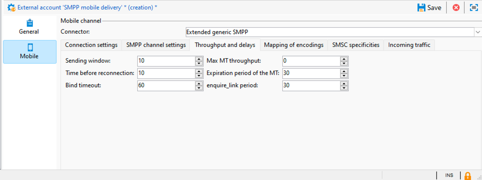

# Configurações de conta externa SMPP {#smpp-external-account}

O Adobe Campaign usa o protocolo SMPP para enviar SMS a um provedor de serviço.

O conector SMS no Adobe Campaign fornece muitas opções para adaptar seu comportamento a fim de ser compatível com a maioria dos provedores SMPP, que tendem a se desviar um pouco da especificação oficial.

>[!IMPORTANT]
>
>* O Adobe Campaign oferece suporte ao protocolo SMPP versão 3.4.
>
>* A configuração de uma conexão com um novo provedor pode exigir algumas habilidades técnicas, conhecimentos de TCP, representação binária e hexadecimal e codificações de texto. Exigirá também a cooperação ativa com o provedor.

O equipamento de rede do lado do provedor de serviço SMS é frequentemente chamado de SMSC.

## Configurações de conexão {#smpp-connection-settings}

{zoomable="yes"}

Estes são os parâmetros e suas funções necessárias para configurar a conexão:

* **Nome da implementação SMSC**: define o nome da implementação SMSC. Ele deve ser definido com o nome do seu provedor. A função desse campo é descrita na seção Gerenciamento de erros SMPP.
* **Servidor**: o nome DNS ou o endereço IP do servidor ao qual se conectar.
* **Porta**: a porta TCP à qual se conectar.
* **Conta**: o logon da conexão. Passado no campo system_id da PDU BIND.
* **Senha**: senha da conexão SMPP. Passado no campo de senha da PDU BIND.
* **Tipo de sistema**: valor passado no campo system_type da PDU BIND. Alguns provedores precisam de um valor específico aqui.
* **Número de conexões filho do MTA**: isso define quantas conexões estão abertas por thread de envio.
O número total de conexões pode ser calculado usando esta fórmula:
  *Total de conexões = Número de processos de SMS * número de threads de envio * número de conexões filho do MTA*

   * O número de processos de SMS normalmente é 1. Em algumas instâncias de desempenho muito alto, vários processos de SMS podem ser iniciados em paralelo.
   * O número de threads de envio está definido em serverConf (configuração sendingThreads ). O padrão é 1.
   * Número de conexões filho do MTA é esta configuração na conta externa.

  Com valores padrão, essa configuração define diretamente o número de conexões.

Em **modo transceptor**, esse é o número total de conexões.

No **modo transmissor+receptor**, isso define o número de pares transmissor+receptor (um par = um transmissor + um receptor).
Não há como alterar o equilíbrio entre transmissores e receptores.

* **Enviar mensagens por um processo dedicado**:
Para o Adobe Campaign v8.7.2 e versões posteriores, essa opção deve estar sempre ativada. Ela tem muitos impactos em como as mensagens são processadas.
* **Modo de conexão SMPP**:
Defina a conexão no modo transceptor ou no modo separado de transmissor+receptor.
   * Transmissor+receptor (ou TX+RX): duas conexões TCP separadas são usadas para transmitir e receber mensagens.
   * Transceptor (ou TRX): uma única conexão TCP é usada para transmitir e receber mensagens.
* **Usar parâmetros diferentes para o receptor**:
Disponível somente no modo transmissor+receptor.
Quando a caixa está desmarcada, as mesmas configurações são usadas para transmissor e receptor. Quando a caixa estiver marcada, as configurações padrão serão aplicadas somente ao transmissor, enquanto as configurações do receptor serão aplicadas somente ao receptor.
* **Servidor do receptor, porta, conta, senha, tipo de sistema**
Essas configurações se aplicam ao receptor quando no modo transmissor+receptor. Elas funcionam como a parte transmissora. Veja acima para [mais detalhes](#smpp-connection-settings).
* **Habilitar rastreamentos SMPP detalhados no arquivo de log**
Quando ativado, os logs adicionais serão enviados para o arquivo de log. Isso é muito útil para solução de problemas, mas deve ser mantido desativado em instâncias de alta taxa de transferência se nenhuma solução de problemas for necessária.

## Configurações de canal de SMPP {#smpp-channel-settings}

{zoomable="yes"}

### Autorizar transliteração de caracteres

A transliteração é o processo de encontrar caracteres equivalentes aos que faltam. Por exemplo, o caractere francês &quot;ê&quot; (e com acento circunflexo) está ausente da codificação GSM, mas pode ser substituído por &quot;e&quot; sem prejudicar muito a leitura.

Quando essa caixa estiver desmarcada, a codificação de texto falhará se não conseguir codificar a string exatamente como está.

Quando essa caixa estiver marcada, a codificação de texto tentará converter a string em uma versão aproximada em vez de falhar. Se alguns caracteres não tiverem equivalente na codificação de destino, a codificação do texto falhará.

Consulte [Definir um mapeamento específico das configurações de codificações](#mapping-encodings) para obter uma explicação mais geral do processo de codificação.

### Número de origem

Define o endereço de origem padrão das mensagens. Essa configuração só será aplicada se o número de origem for deixado vazio no delivery. Por padrão, o campo de número de origem não é transmitido. Portanto, o provedor o substituirá pelo código curto.

Isso habilita o recurso de substituição de endereço/oADC do remetente.

### TON/NPI de origem, TON/NPI de destino

TON (Tipo de Número) e NPI (Indicador do Plano de Numeração) (descrito na seção 5.2.5 da especificação SMPP 3.4). Esses valores devem ser definidos para o que for necessário ao provedor.

Eles são transmitidos como estão nos campos source_addr_ton, source_addr_npi, dest_addr_ton e dest_addr_npi do PDU SUBMIT_SM.

### Tipo de serviço

Esse campo é transmitido como está no campo service_type da PDU SUBMIT_SM. Defina isso de acordo com o que for necessário ao provedor.

## Taxa de transferência e atrasos {#smpp-delays}

{zoomable="yes"}

Essas configurações controlam todos os aspectos de tempo do canal SMPP. Alguns provedores exigem controle muito preciso da taxa de mensagens, da janela e dos tempos de novas tentativas, portanto, essas configurações devem ser definidas com valores que correspondam à capacidade do provedor e às condições indicadas no contrato.

### Janela de envio

A janela é o número de PDUs SUBMIT_SM que podem ser enviados sem esperar por um SUBMIT_SM_RESP correspondente.

Exemplo de uma transmissão com uma janela máxima de 4:

{zoomable="yes"}

A janela ajuda a aumentar a taxa de transferência quando o link da rede tem uma latência alta. O valor da janela deve ser pelo menos o número de SMS/s multiplicado pela latência do link (em segundos) para que o conector nunca aguarde um SUBMIT_SM_RESP antes de enviar a próxima mensagem.

Se a janela for muito grande, você poderá enviar mais mensagens duplicadas em caso de problemas de conexão (caso raro). Além disso, a maioria dos provedores tem um limite muito restrito para a janela e recusa mensagens que ultrapassam o limite.

Como calcular a fórmula ideal da janela de envio:

Meça a latência máxima entre SUBMIT_SM e SUBMIT_SM_RESP.
Multiplique esse valor (em segundos) para o rendimento máximo do MT: isso fornecerá o valor ideal da janela de envio.
Exemplo: se você tiver 300 SMS/s definidos com rendimento máximo de MT e houver uma latência de 100 ms entre SUBMIT_SM e SUBMIT_SM_RESP em média, o valor ideal será 300×0.1 = 30.

Na dúvida, prefira uma janela maior para evitar problemas de desempenho.

### Taxa de transferência máxima de MT

Número máximo de MT por segundo e por conexão. Essa configuração é estritamente imposta. O MTA nunca encaminhará mensagens mais rapidamente do que esse limite. É útil para provedores que exigem limitação precisa.

Para saber o limite de rendimento total, multiplique esse número pelo número total de conexões (consulte a fórmula acima).

0 significa sem limite. O MTA enviará o MT o mais rápido possível.

É recomendável manter essa configuração abaixo de 1000, pois é impossível garantir rendimento preciso acima desse número, a menos que seja feito o benchmark adequado na arquitetura final e especificamente solicitado pelo provedor de SMPP. Talvez seja melhor aumentar o número de conexões para um valor acima de 1000 MT/s.

### Tempo antes da reconexão

Quando a conexão TCP for perdida, o conector aguardará esse número de segundos antes de tentar fazer uma conexão.

### Período de vigência do MT

Este é o tempo limite entre SUBMIT_SM e o SUBMIT_SM_RESP correspondente. Se o RESP não for recebido a tempo, a mensagem será considerada como tendo sofrido falha, e a política global de novas tentativas do MTA será aplicada.

### Tempo limite da associação

Tempo limite entre a tentativa de conexão TCP e a resposta BIND_*_RESP. Quando o tempo limite for atingido, a conexão será fechada pelo conector do Campaign e aguardará pelo tempo antes da reconexão antes de tentar novamente.

### período enquire_link

inquire_link é um tipo especial de PDU enviada para manter a conexão ativa. Esse período é em segundos. O conector do Campaign envia somente inquire_link quando a conexão está ociosa, para conservar a largura de banda. Se não for recebido nenhum RESP após o dobro desse período, a conexão será considerada inoperante, e um processo de reconexão será acionado.

## Mapeamento de codificações {#mapping-encodings}

Consulte a [seção codificação de texto SMS](sms-channel.md#sms-text-encoding) para obter detalhes sobre codificação de texto.

Essa configuração permite definir um mapeamento de codificação personalizado, diferente da especificação. Você pode declarar uma lista de codificações, juntamente com o valor data_coding. O MTA tentará codificar usando a primeira codificação na lista; se falhar, tentará usar a próxima codificação na lista etc... Se nenhuma codificação puder ser usada para codificar a mensagem, ocorrerá um erro. Quando a codificação for encontrada, o MTA criará o PDU SUBMIT_SM com o texto codificado e o campo data_coding definido com o valor especificado na tabela.

A ordem dos itens na tabela é importante: as codificações são tentadas de cima para baixo. Você deve colocar a codificação mais barata ou mais recomendada no topo da lista, seguida de codificações cada vez mais caras (ou menos desejáveis).

Observe que o UCS-2 nunca falhará, pois pode codificar todos os caracteres compatíveis com o Campaign. Observe que o comprimento máximo de um SMS UCS-2 é muito menor (somente 70 caracteres).

Você também pode usar essa configuração para forçar uma codificação específica a ser sempre usada declarando apenas uma linha na tabela de mapeamento.

O mapeamento padrão usado quando a caixa de seleção não está marcada é equivalente à seguinte tabela:

| data_coding | Codificação |
|:-:|:-:|
| 0 | GSM |
| 8 | UCS-2 |

Isso significa que o MTA tentará codificar a mensagem no GSM, se for bem-sucedido, ela será enviada com data_coding definido como 0.

Se a mensagem não puder ser codificada no GSM, será codificada em UCS-2 e definirá data_coding como 8.

## Especificidades do SMSC {#smsc-specificities}

{zoomable="yes"}

### Ativar message_payload

Quando desmarcada, o SMS longo será dividido pelo MTA e enviado em várias PDUs SUBMIT_SM com UDH. A mensagem será recomposta pelo telefone celular, seguindo os dados UDH.

Quando marcado, o SMS longo será enviado em uma PDU SUBMIT_SM, colocando o texto no campo opcional message_payload (consulte a especificação SMPP para obter detalhes sobre isso).

Se esse recurso estiver habilitado, o Campaign não poderá contar as partes do SMS individualmente: todas as mensagens serão contadas como enviadas em uma parte.

### Enviar o número de telefone completo

Quando essa caixa de seleção não está marcada, somente os dígitos do número de telefone são enviados para o provedor (campo destination_addr do campo SUBMIT_SM). Esse é o comportamento padrão porque o indicador de número internacional (geralmente um prefixo +) é substituído pelos campos TON e NPI no SMPP.

Quando a caixa de seleção é marcada, o número de telefone é enviado como está, sem pré-processamento (e espaços em potencial, prefixo + ou sinais de libra/cerquilha/asterisco).

Esse recurso também afeta o comportamento do recurso de quarentena de resposta automática: quando a caixa de seleção não estiver marcada, um prefixo + será adicionado aos números de telefone inseridos na tabela de quarentena para compensar a remoção do prefixo + do número de telefone pelo próprio protocolo SMPP.

### Vincular TON/NPI

TON (Tipo de Número) e NPI (Indicador do Plano de Numeração) (descrito na seção 5.2.5 da especificação SMPP 3.4). Esses valores devem ser definidos para o que for necessário ao provedor.

Eles são transmitidos como estão nos campos addr_ton e addr_npi da PDU BIND.

### Intervalo de endereços

Enviado como está no campo address_range da PDU BIND. Esse valor deverá ser definido de acordo com o que for necessário ao provedor.

### Contagem de confirmação de ID inválida

Limita o número de &quot;ID da Mensagem inválida&quot; DELIVER_SM_RESP que pode ser enviado para um único SR. **Deve ser usado apenas para fins de solução de problemas temporária** e definido como 0 em condições normais.

Explicação detalhada: digamos que você defina essa configuração como 2:

* O provedor envia um SR (DELIVER_SM) com a ID &quot;1234&quot;
* A ID &quot;1234&quot; não foi encontrada no banco de dados
* O conector conta 1 erro &quot;ID inválido&quot; para essa ID. Portanto, envia DELIVER_SM_RESP com o código de erro &quot;ID de mensagem inválida&quot; (comportamento normal).
* O provedor tenta novamente o mesmo SR com a ID &quot;1234&quot;
* A ID &quot;1234&quot; ainda não foi encontrada no banco de dados
* O conector conta o erro 2 &quot;ID inválido&quot; para essa ID. Portanto, envia DELIVER_SM_RESP &quot;OK&quot;, mesmo que não tenha sido processado corretamente.

Esse recurso destina-se a liberar buffers SR no provedor quando o SR inválido bloqueia mensagens legítimas que não podem ser processadas.

Definir esse campo como 0 desativa o mecanismo para que &quot;ID da mensagem inválida&quot; seja sempre retornado, esse é um comportamento normal.

Definir esse campo como 1 faz com que o conector sempre responda &quot;OK&quot;, mesmo que a ID seja inválida. Deve ser definido como 1, usado somente sob supervisão para solução de problemas e pelo período mínimo, por exemplo, para se recuperar de um problema do provedor.

### Regex de extração da ID no SR

O formato SR não é estritamente aplicado pela especificação do protocolo SMPP. É apenas uma recomendação descrita no apêndice B da especificação. Por causa disso, alguns implementadores de SMPP formatam esse campo de forma diferente, portanto, o Campaign precisa de uma maneira de extrair o campo correto.

Por padrão, captura até 10 caracteres alfanuméricos após &quot;id:&quot;.

O regex deve ter exatamente um grupo de captura (uma parte contida entre parênteses). A parte correspondente à ID deve estar entre parênteses. O formato do regex é PCRE.

Ao ajustar essa configuração, inclua o máximo de contexto possível para evitar acionadores falsos. Se houver prefixos específicos (como &quot;id:&quot; no padrão), inclua-os no regex. Também use o máximo possível de delimitadores de palavras (\b) para evitar a captura de texto no meio de uma palavra.

Não incluir contexto suficiente no regex pode gerar uma pequena falha de segurança: o conteúdo real da mensagem pode ser incluído no SR, portanto, se você apenas corresponder a um formato de ID específico sem contexto (por exemplo, um UUID), ele poderá analisar o conteúdo de texto real (por exemplo, um UUID incorporado no campo de texto) em vez da ID.

### Regex de extração do status na SR

Este regex captura o status do campo de texto das mensagens SR.

Por padrão, captura entre 5 e 15 caracteres após &quot;stat:&quot;.

O regex deve ter **exatamente um grupo de captura** (uma parte contida entre parênteses). A parte correspondente ao status deve estar entre parênteses. O formato do regex é PCRE.

### Regex aplicado para determinar o status de sucesso

Esse regex é aplicado ao resultado do regex anterior (&quot;Regex de extração do status&quot;). Se o regex for correspondente, a mensagem será considerada bem-sucedida.

Por padrão, ele corresponde a tudo que começa com &quot;DELIV&quot;. Ele corresponde ao valor padrão &quot;DELIVRD&quot;.

### Regex aplicado para determinar o status do erro

Esse regex é aplicado ao resultado do regex anterior (&quot;Regex de extração do status&quot;). Se o regex corresponder, a mensagem será considerada com erro.

Por padrão, ele corresponde a todos os vários status de erro descritos na especificação.

### Regex de extração do código de erro no SR

Este regex captura o código de erro do campo de texto das mensagens SR.

Os códigos de erro podem ser qualificados na qualificação do log de entrega.

Por padrão, captura 3 caracteres após &quot;err:&quot;.

### Formato de ID na confirmação MT

Isso indica o formato da ID retornada no campo message_id da PDU SUBMIT_SM_RESP.

* **Não modificar**: a ID é armazenada como está no banco de dados, como texto codificado em ASCII. Não ocorre pré-processamento nem filtragem.
* **Número decimal**: espera-se que a ID seja um número decimal no formato ASCII. Espaços à esquerda e à direita e zeros à esquerda são removidos quando essa configuração é usada.
* **Número hexadecimal**: espera-se que a ID seja um número hexadecimal no formato ASCII, sem 0x à esquerda nem h à direita. A ID é convertida em um número decimal antes de ser armazenada no banco de dados.
* **String hexadecimal**: espera-se que a ID seja um texto codificado em ASCII que seja uma string de bytes codificada como hexadecimal. Por exemplo, na PDU, você encontrará 0x34 0x31 0x34 0x32 0x34 0x33, o que significa ASCII &quot;414243&quot;; em seguida, essa string é decodificada como uma string hexadecimal de bytes, e você obtém &quot;ABC&quot; como resultado: você armazenará a ID &quot;ABC&quot; no banco de dados.

### Formato de ID na SR

Isso indica o formato da ID capturada pelo regex de Extração da ID no SR. Os valores têm o mesmo significado e o mesmo comportamento que o formato no MT acima.

### ID de SR ou código de erro no campo opcional

Se marcado, o conteúdo dos campos opcionais será anexado ao texto processado pelos regex acima. O texto terá o formato &quot; 0xTAG:VALUE&quot;, 0xTAG sendo o valor hexadecimal de quatro dígitos da tag em maiúsculas (por exemplo, 0x002E).

Por exemplo, convém capturar a ID no campo receipted_message_id. Para isso, ative essa caixa de seleção. O seguinte texto será adicionado ao status:

0x001E:05e3299e-8d37-49d0-97c6-8e4fe60c7739

Neste exemplo, 0x001E é a tag do campo opcional, e o UUID é o valor do campo.

Para capturar esse valor, agora é possível definir o seguinte regex no regex de Extração da ID no campo SR:

\b0x001E:([0-9a-f]{8}-[0-9a-f]{4}-[0-9a-f]{4}-[0-9a-f]{4}-[0-9a-f]{12})\b

>[!IMPORTANT]
>
>Você só pode capturar campos opcionais que tenham valores de texto de 8 bits (ASCII/UTF-8). Especificamente, os campos binários não podem ser capturados de forma confiável pelo sistema de regex atual.

### ID da SR ou código de erro no campo de texto

Se marcado, o campo Texto: será mantido durante o processamento do texto de status do SR. Isso será útil se o provedor colocar dados importantes nesse campo, como a ID ou o status. Normalmente, esse campo pode ser descartado com segurança, pois pode conter texto com uma codificação não ASCII e prejudicar o processamento de regex.

Se essa opção for ativada, poderá ocorrer uma falha de segurança muito pequena se o regex de Extração da ID no campo SR não for suficientemente específico: o conteúdo do campo Texto pode ser analisado como uma ID, e um invasor pode usá-lo para injetar IDs forjadas, o que pode levar a uma situação de negação de serviço parcial.

### Tag da ID de serviço

Permite adicionar um TLV personalizado. Este campo define a marca, passada como um valor hexadecimal no formato **0x1234**.

O valor do TLV personalizado deve ser definido no delivery no campo &quot;ID de serviço ou programa&quot; nos parâmetros avançados do delivery. O valor é enviado como texto codificado em UTF-8.

Essa configuração permite adicionar apenas uma opção TLV por mensagem.

>[!NOTE]
>
>Esta opção é substituída pela configuração muito mais poderosa **Parâmetros SMPP opcionais (TLV)** nos parâmetros de entrega. Esses recursos são mutuamente exclusivos e não podem ser usados ao mesmo tempo.

### Habilitar TLS em SMPP

Se habilitado, todas as conexões com o SMSC serão criptografadas usando TLS.

### Verificação de certificado

* **Verificação de certificado completa**: verifique o certificado TLS e o nome do host remoto ao conectar. Esse valor oferece o mais alto nível de segurança.
* **Ignorar a verificação do nome do host**: verifique o certificado TLS remoto, mas não verifique se o nome do host remoto corresponde. Diminui um pouco a segurança.
* **Ignorar a verificação de certificado**: não verificar o certificado TLS. A conexão ainda é criptografada, mas é vulnerável a ataques intermediários. Diminui muito a segurança.

## Tráfego recebido {#incoming-traffic}

{zoomable="yes"}

### Parâmetros SMPP opcionais (TLV) no MO

O Campaign permite receber 3 campos extras no MO (tabela nms:inSms): SMS vinculado, alias e conta grande. Com o conector SMPP, esses campos podem ser preenchidos com dados provenientes de qualquer parâmetro SMPP opcional (TLV), com qualquer formato comum.

Para cada campo, é possível definir a tag associada, bem como seu formato. Solicite ao provedor de serviços SMPP que tenha essas informações.

* Tag: o valor da tag, em formato decimal (por exemplo, 12345) ou hexadecimal com o prefixo 0x (por exemplo, 0x12ab). As tags podem ficar entre 0 e 65535.
* Format: formato usado para o valor. Os valores binários são todos valores binários com sinal big-endian. Para campos de texto, escolha a codificação usada pelo provedor SMPP.

### Resposta automática enviada ao MO

Esse recurso permite responder rapidamente ao texto para o MO e lidar com blacklists por código curto.

As colunas *Palavra-chave* e *Código curto* definem condições para acionar a resposta automática: se ambos os campos forem correspondentes, o MO será enviado e a ação adicional será acionada. Para especificar um curinga, deixe o campo vazio. A palavra-chave corresponde à primeira palavra alfanumérica no texto MO, ignorando a pontuação e os espaços à esquerda. Isso significa que o campo Palavra-chave não pode conter espaços e deve ser uma única palavra.

Além disso, a configuração *Palavra-chave* é um prefixo. Por exemplo, se você especificar &quot;AD&quot;, ele corresponderá a &quot;AD&quot;, &quot;ADAPT&quot; e &quot;ADOBE&quot;. Se você tiver várias palavras-chave com um prefixo comum, preste atenção à ordem, as palavras-chave serão processadas de cima para baixo.

A coluna *Responder* é o texto a ser respondido. Nenhuma personalização está disponível nesse campo. O texto de resposta é sempre o mesmo. Se você deixar esse campo vazio, nenhuma mensagem será respondida, mas a ação adicional será acionada mesmo assim.

A coluna de ação *Adicional* fornece uma ação extra a ser executada quando a palavra-chave e o código curto coincidirem (um código curto vazio corresponde a todos os códigos curtos). Atualmente, você pode enviar para a quarentena ou remover da quarentena. Se você especificar uma ação adicional, mas deixar o campo de resposta vazio, a ação será executada, mas nenhuma resposta será enviada. A quarentena é aplicada somente ao código curto especificado, ou a todos os códigos curtos, se o campo está vazio.

Todas as entradas na tabela são processadas na ordem especificada, até que uma regra seja correspondente. Se várias regras corresponderem a um MO, somente a regra mais alta será aplicada.

>[!NOTE]
>
>A configuração **enviar número de telefone completo** afeta o comportamento do mecanismo de quarentena de resposta automática: se o número de telefone completo não estiver marcado, o número de telefone colocado em quarentena receberá um sinal de adição (&quot;+&quot;) para torná-lo compatível com o formato de número de telefone internacional.

>[!NOTE]
>
>Em uma arquitetura mid-sourcing, a aplicação da resposta automática ao conector SMPP estendido requer a adição de acesso de gravação para o operador mid na pasta de conta externa.

>[!IMPORTANT]
>
>Tenha cuidado com codificações em respostas automáticas, especialmente ao copiar e colar. O software de processamento de texto tende a adicionar formatação extra, como adicionar espaços não separáveis ou alterar aspas para apóstrofos.
