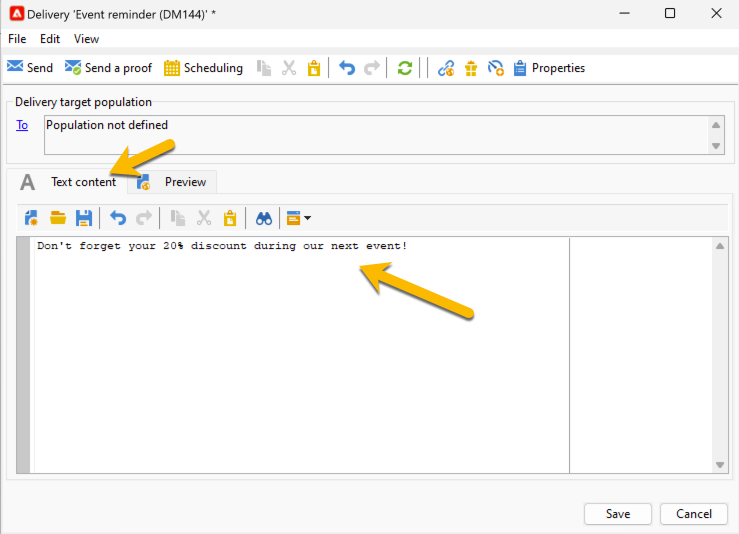

# Definir o conteúdo do SMS {#sms-content}

Para configurar o conteúdo do delivery de SMS:

1. Insira o conteúdo da mensagem na guia **[!UICONTROL Text content]**.

   {zoomable="yes"}

1. Você pode personalizar a mensagem inserindo campos de personalização (por exemplo, adicionando o nome) ou inserindo um bloco de personalização predefinido (por exemplo, adicionando saudações). Clique no botão de personalização para adicionar estes:

   {zoomable="yes"}

   Por exemplo, depois de clicar em **[!UICONTROL Recipient]** > **[!UICONTROL First name]**, o conteúdo do SMS é atualizado com o campo de personalização, conforme abaixo:

   {zoomable="yes"}

   Saiba mais sobre a personalização no Adobe Campaign em [esta seção](../personalize.md).

1. Você pode visualizar o conteúdo da entrega na guia **[!UICONTROL Preview]**. Para verificar suas configurações de personalização, clique na lista suspensa **[!UICONTROL Test personalization]** e selecione um recipient.

   {zoomable="yes"}

   Você pode verificar a pré-visualização do SMS com a personalização:

   {zoomable="yes"}

>[!NOTE]
>
>* As mensagens SMS são limitadas a um comprimento de 160 caracteres, se a página de código Latin-1 (ISO-8859-1) for usada. Se a mensagem for gravada em Unicode, não deverá exceder 70 caracteres. Alguns caracteres especiais podem afetar o comprimento da mensagem. Para obter mais informações sobre comprimento de mensagem, consulte a seção [Transliteração de caracteres SMS](smpp-external-account.md#smpp-channel-settings).
>
>* Quando campos de personalização ou campos de conteúdo condicional estão presentes, o tamanho da mensagem varia de um destinatário para outro. O comprimento da mensagem deve ser avaliado quando a personalização for realizada.
>
>*Quando você inicia a análise, o comprimento das mensagens é verificado e um aviso é exibido no caso de excedente.

Depois de criar o conteúdo da sua entrega, você pode [selecionar seu público-alvo](sms-audience.md).
