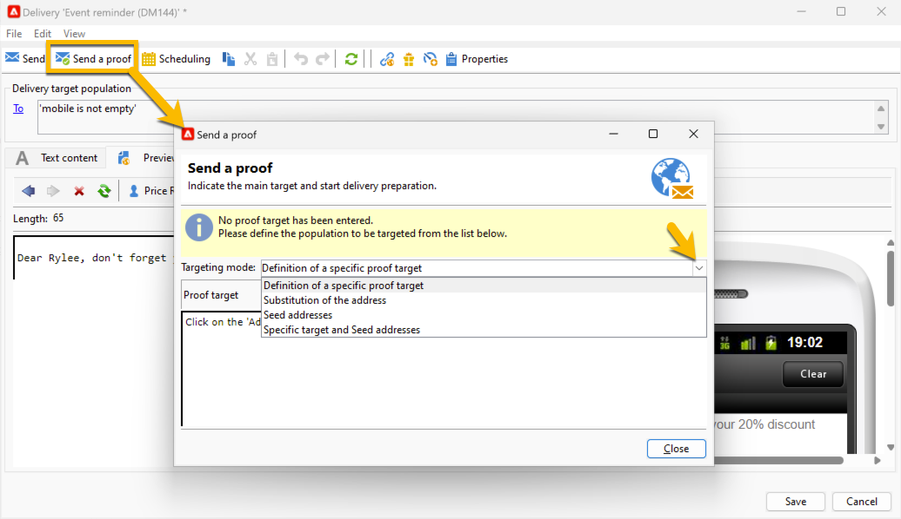

# Enviar uma prova de entrega de SMS {#sms-proof}

A Adobe recomenda configurar um ciclo de validação de delivery. Verifique se o conteúdo está aprovado antes de enviá-lo para o público.

Você pode enviar uma prova para o delivery de SMS para validá-lo:

1. Clique no botão **[!UICONTROL Send a proof]**. Uma janela será aberta

   {zoomable="yes"}

   Há vários modos para enviar uma prova:

   * **[!UICONTROL Definition of a specific proof target]**: permite consultar com filtros os endereços no banco de dados como o destino da prova
   * **[!UICONTROL Substitution of the address]**: permite inserir seus endereços de teste e usar os dados do destinatário de destino para validar o conteúdo. Os endereços de substituição podem ser inseridos manualmente ou selecionados na lista suspensa. A enumeração associada é **[!UICONTROL Substitution address (rcpAddress)]**.
Por padrão, a substituição é executada aleatoriamente, mas você pode selecionar um recipient específico do público-alvo principal, por meio do ícone **[!UICONTROL Detail]**.
   * **[!UICONTROL Seed addresses]**: permite acesso a seed addresses para ser o destino da prova. Esses endereços podem ser importados de um arquivo ou inseridos manualmente.
   * **[!UICONTROL Specific target and Seed addresses]**: permite combinar seed addresses e endereços de recipients.

1. Depois de escolher o **[!UICONTROL Targeting mode]**, adicione seus endereços de prova de acordo com ele

   No exemplo abaixo, escolhemos **[!UICONTROL Definition of a specific proof target]** e adicionamos um recipient:

   {zoomable="yes"}

1. Clique no botão **[!UICONTROL Analyze]**.
O Adobe Campaign realizará todo o controle antes de validar o envio da prova. No final da análise, o botão **[!UICONTROL Confirm delivery]** será clicável.

   {zoomable="yes"}

1. Para enviar a prova da entrega do SMS, clique no botão **[!UICONTROL Confirm delivery]**.

Se tudo estiver certo neste estágio, você pode avançar e [enviar sua entrega de SMS para o público-alvo](sms-audience.md).
