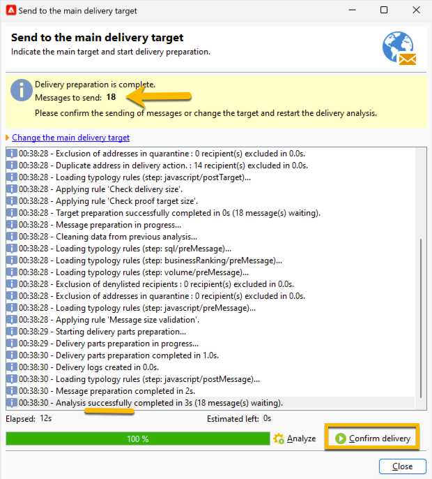

# Enviar a entrega de SMS para o público-alvo {#sms-send-audience}

Quando o SMS for validado, você poderá enviá-lo para o público-alvo.

1. Clique no botão **[!UICONTROL Send]**.
Na janela aberta, escolha a ação correta que se ajuste a você.

   No exemplo abaixo, escolhemos **[!UICONTROL Deliver it as soon as possible]**, o botão **[!UICONTROL Analyze]** foi exibido. Clicamos nesse botão **[!UICONTROL Analyze]**.

   {zoomable="yes"}

   O Adobe Campaign realizará todo o controle antes de validar o envio da prova. Você verá o volume real de público-alvo. No final da análise, o botão **[!UICONTROL Confirm delivery]** será clicável.

   {zoomable="yes"}

1. Para enviar a entrega de SMS ao público, clique no botão **[!UICONTROL Confirm delivery]**.
