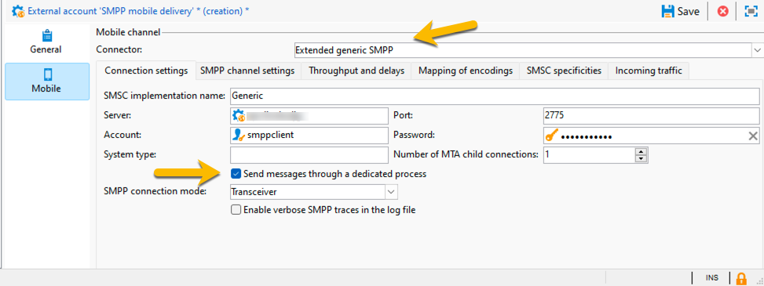
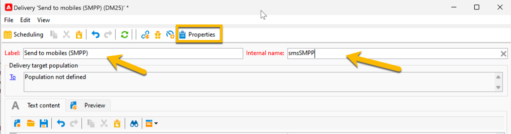

# SMS em uma instância independente {#sms-standalone}

>[!IMPORTANT]
>
>Esta documentação é para o Adobe Campaign v8.7.2 e posteriores.
>
>Para versões mais antigas, leia a [documentação do Campaign Classic v7](https://experienceleague.adobe.com/pt-br/docs/campaign-classic/using/sending-messages/sending-messages-on-mobiles/sms-set-up/sms-set-up).

Em uma instância independente, o envio de um delivery de SMS requer:

1. Uma **conta externa** especificando um conector e o tipo de mensagem, [saiba mais aqui](#external-account)

1. Um **modelo de entrega** no qual esta conta externa é referenciada, [saiba mais aqui](#sms-delivery-template)

## Criar uma conta externa {#external-account}

>[!IMPORTANT]
>
>Usar a mesma conta e senha para várias contas externas de SMS pode resultar em conflitos e sobreposição entre as contas. Saiba mais na [página de solução de problemas de SMS](smpp-connection.md#sms-troubleshooting).

Estas são as etapas para criar sua conta externa SMPP:

1. Em **[!UICONTROL Administration]** > **[!UICONTROL Platform]** > **[!UICONTROL External Accounts]**, clique no ícone **[!UICONTROL New]**

   {zoomable="yes"}

1. Configure o **[!UICONTROL Label]** e o **[!UICONTROL Internal name]** da sua conta externa. Defina o tipo de conta como **[!UICONTROL Routing]**, marque a caixa **[!UICONTROL Enabled]**, selecione **[!UICONTROL Mobile (SMS)]** para o canal e **[!UICONTROL Bulk delivery]** para o modo de entrega.

   {zoomable="yes"}

1. Na guia **[!UICONTROL Mobile]**, mantenha **[!UICONTROL Extended generic SMPP]** na lista suspensa **[!UICONTROL Connector]**.
A caixa **[!UICONTROL Send messages through a dedicated process]** está marcada por padrão.

   {zoomable="yes"}

   Para configurar a conexão, você precisa preencher as guias deste formulário. Para obter detalhes, [saiba mais sobre a conta externa SMPP](smpp-external-account.md#smpp-connection-settings).

## Configurar o template do delivery {#sms-delivery-template}

Para facilitar a criação do delivery de SMS, crie um template do delivery de SMS no qual sua conta externa SMPP é referenciada.

Em **[!UICONTROL Resources]** > **[!UICONTROL Templates]** > **[!UICONTROL Delivery templates]**, clique com o botão direito do mouse no modelo de entrega do Mobile existente e escolha **[!UICONTROL Duplicate]**.

{zoomable="yes"}

Altere o **[!UICONTROL Label]** e o **[!UICONTROL Internal name]** do seu modelo para reconhecê-lo facilmente, e clique no botão **[!UICONTROL Properties]**.

{zoomable="yes"}

Na guia **[!UICONTROL General]**, em **[!UICONTROL Routing]**, selecione a conta externa SMPP.

{zoomable="yes"}

Na guia **[!UICONTROL SMS]**, é possível adicionar parâmetros opcionais ao modelo.

{zoomable="yes"}

[Saiba mais sobre esta configuração da guia SMS](sms-delivery-settings.md).
