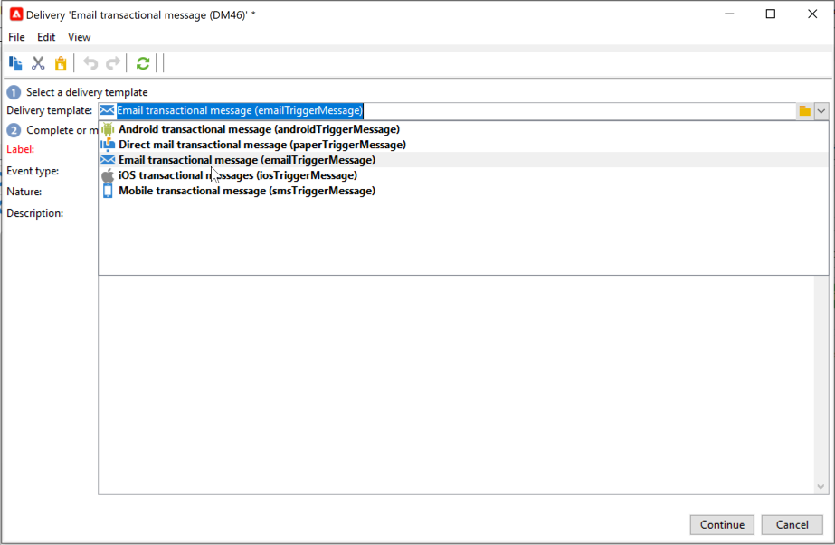
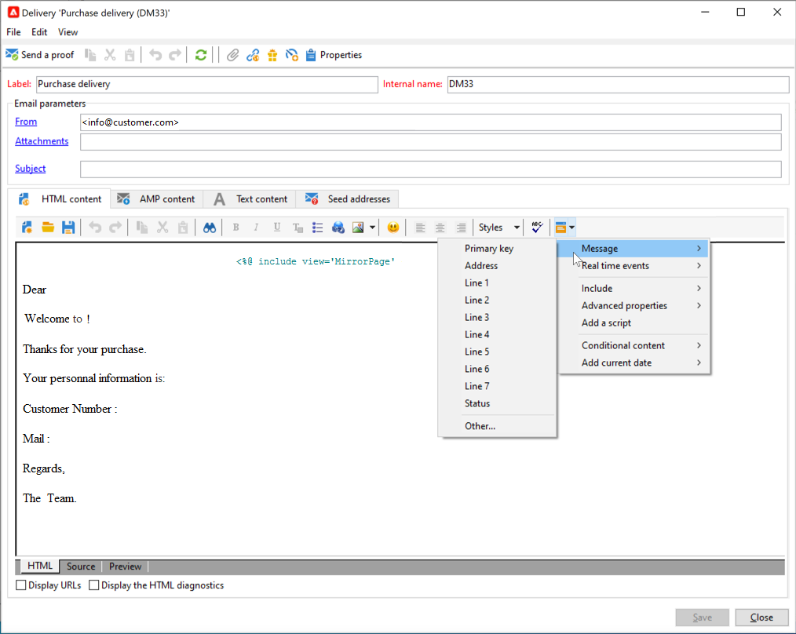
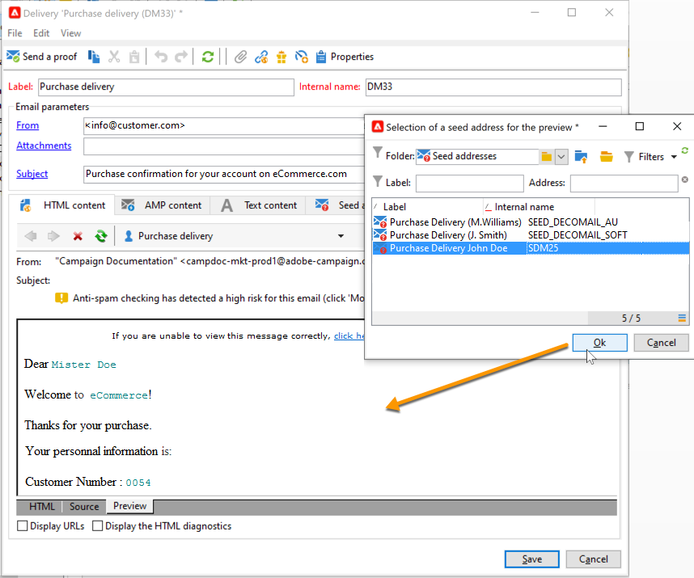

# Criar e publicar seu modelo para mensagens transacionais{#template-transactional-messages}

Cada evento pode acionar uma mensagem personalizada. Para que isso aconteça, é necessário criar um template de mensagem para corresponder a cada tipo de evento. Os templates contêm as informações necessárias para personalizar a mensagem transacional. Você também pode usar templates para testar a pré-visualização da mensagem e enviar provas usando seed addresses antes de entregar ao target final.

## Criar o modelo{#create-message-template}

Para criar um template de mensagem, siga as etapas abaixo:

1. Acesse a pasta **[!UICONTROL Message Center >Transactional message templates]** da árvore do Adobe Campaign.
1. Clique com o botão direito do mouse na lista de templates de mensagem transacional e selecione **[!UICONTROL New]** no menu suspenso ou clique no botão **[!UICONTROL New]** acima da lista de templates de mensagem transacional.

   

1. Na janela do delivery, selecione o template do delivery apropriado para o canal que deseja usar.

   

1. Altere seu rótulo se necessário.
1. Selecione o tipo de evento que corresponda à mensagem a ser enviada. Os tipos de eventos destinados a serem processados pelo Adobe Campaign devem ser criados antes. [Saiba mais](#create-event-types)

   

   >[!CAUTION]
   >
   >Um tipo de evento nunca deve estar vinculado a mais de um template.

1. Insira uma natureza e uma descrição, em seguida, clique em **[!UICONTROL Continue]** para criar o corpo da mensagem.

## Criar o conteúdo{#create-message-content}

A definição do conteúdo da mensagem transacional é a mesma para todos os deliveries no Adobe Campaign. Por exemplo, para um delivery de email, você pode criar conteúdo em formato HTML ou texto, adicionar anexos ou personalizar o objeto do delivery. [Saiba mais](../start/create-message.md).

>[!CAUTION]
>
>As imagens incluídas na mensagem devem ser acessíveis publicamente. O Adobe Campaign não fornece nenhum mecanismo de carregamento de imagem para mensagens transacionais.\
>Ao contrário do JSSP ou webApp, `<%=`não tem nenhum escape padrão.
>
>Você precisa escapar cada dado que vem do evento corretamente. Este escape depende da forma como esse campo é usado. Por exemplo, dentro de uma URL, use encodeURIComponent. Para ser exibido no HTML, você pode usar escapeXMLString.

Após definir o conteúdo da mensagem, você pode integrar as informações do evento no corpo da mensagem e personalizá-lo. As informações do evento são inseridas no corpo do texto graças às tags de personalização.

* Todos os campos de personalização vêm da carga.
* É possível referenciar um ou vários blocos de personalização em uma mensagem transacional. <!--The block content will be added to the delivery content during the publication to the execution instance.-->

Para inserir tags de personalização no corpo de uma mensagem de email, siga as etapas abaixo:

1. No template de mensagem, clique na guia que corresponde ao formato do email (HTML ou texto).
1. Insira o corpo da mensagem.
1. No corpo do texto, insira a tag usando os menus **[!UICONTROL Real time events>Event XML]**.

   

1. Preencha a tag usando a seguinte sintaxe: **element name**.@**attribute name** como mostrado abaixo.

   

## Testar o template de mensagem transacional {#test-message-template}

### Adicionar seed addresses{#add-seeds}

Um seed address permite exibir uma pré-visualização da mensagem, enviar uma prova e testar a personalização da mensagem antes de enviar a mensagem. Os seed addresses estão vinculados ao delivery e não podem ser usados para outros deliveries.

1. No modelo de mensagem transacional, clique no botão **[!UICONTROL Seed addresses]** e clique no botão **[!UICONTROL Add]** botão.

   

1. Atribua um rótulo a ele para facilitar a seleção posteriormente e insira o seed address (email ou celular dependendo do canal de comunicação).

1. Digite o identificador externo: esse campo opcional permite inserir uma chave de negócios (ID exclusiva, nome + email, etc.) que é comum a todos os aplicativos em seu site, usado para identificar seus perfis. Se esse campo também estiver presente no banco de dados de marketing do Adobe Campaign, você poderá reconciliar um evento com um perfil no banco de dados.

   

1. Inserir dados de teste. Consulte [esta seção](#personalization-data).

   

1. Clique em **[!UICONTROL Ok]** para confirmar a criação do seed address.

1. Repita o processo para criar quantos endereços forem necessários.

   

Depois que os endereços forem criados, você poderá acessar a visualização e personalização.

<!--

### Add personalization data{#personalization-data}

You can add data in the message template to test transactional message personalization. This will allow you to generate a preview or send a proof. If you install the **Deliverability** module, this data allows you to display a rendering of the messages for various desktop, web or mobile clients.

The purpose of this data is to test your messages before their final delivery. These messages do not coincide with actual data to be processed by Message Center.

However, the XML structure must be identical to that of the event stored in the execution instance, as shown below. 

This information enables you to personalize message content using personalization tags.

1. In the message template, click the **[!UICONTROL Seed addresses]** tab.
1. In the event content, enter the test information in XML format.

   
-->

### Pré-visualizar mensagem transacional{#transactional-message-preview}

Após criar um ou mais seed addresses e o corpo da mensagem, é possível pré-visualizar a mensagem e verificar sua personalização.

1. No modelo de mensagem, clique no botão **[!UICONTROL Preview]** e selecione **[!UICONTROL A seed address]** na lista suspensa.

   

1. Selecione o seed address criado anteriormente para exibir a mensagem personalizada.

   

### Enviar uma prova

Você pode testar a entrega de mensagens enviando uma prova para um seed address criado anteriormente.

O envio de uma prova envolve o mesmo processo de qualquer delivery.

 Saiba mais sobre provas em [Documentação do Campaign Classic v7](https://experienceleague.adobe.com/docs/campaign-classic/using/sending-messages/key-steps-when-creating-a-delivery/steps-validating-the-delivery.html#sending-a-proof){target="_blank"}

No entanto, para enviar uma prova de uma mensagem transacional, você precisa realizar as seguintes operações:

* Criar um ou mais [seed addresses](#add-seeds) com dados de teste de personalização
* Criar o conteúdo da mensagem

Para enviar a prova:

1. Clique no botão **[!UICONTROL Send a proof]** na janela do delivery.
1. Analise o delivery.
1. Corrija qualquer erro e confirme o delivery.

   

1. Verifique se a mensagem foi entregue ao seed address e se seu conteúdo está em conformidade com sua configuração.

   

É possível acessar as provas em cada template através da guia **[!UICONTROL Audit]**.

## Publicar o modelo {#publish-message-template}

Quando o template de mensagem foi criado<!-- on the control instance--> estiver concluído, você poderá publicá-lo, o que permitirá enviar mensagens vinculadas a eventos em tempo real e em lote.

<!--This process will also publish it on all execution instances.

NOTE: When publishing transactional message templates, typology rules are also automatically published on the execution instances.

Publication lets you automatically create two message templates on the execution instances, which will allow you to send messages linked to real-time and batch events.-->

>[!CAUTION]
>
>Sempre que fizer alterações em um modelo, publique-o novamente para que essas alterações estejam em vigor durante a entrega da mensagem transacional.

1. Vá até a pasta **[!UICONTROL Message Center > Transactional message templates]** da árvore.
1. Selecione o modelo que deseja publicar<!--on your execution instances-->.
1. Clique em **[!UICONTROL Publish]**.

   

Quando a publicação estiver concluída, ambos os templates de mensagem que serão aplicados em eventos batch e em tempo real são criados na variável **[!UICONTROL Administration > Production > Message Center Execution> Default > Transactional message templates]** pasta.

Depois que um modelo é publicado, se o evento correspondente for acionado, o Adobe Campaign<!--execution instance--> O receberá o evento, o vinculará ao template transacional e enviará a mensagem transacional correspondente para cada recipient.

<!--
>[!NOTE]
>
>If you replace an existing field of the transactional message template, such as the sender address, with an empty value, the corresponding field on the execution instance(s) will not be updated once the transactional message is published again. It will still contain the previous value.
>
>However, if you add a non-empty value, the corresponding field will be updated as usual after the next publication.
-->

## Cancelar a publicação de um modelo

Depois que um template de mensagem é publicado <!--on the execution instances-->, pode ter a publicação cancelada.

* Na verdade, um modelo publicado ainda poderá ser chamado se o evento correspondente for acionado: se você não estiver mais usando um modelo de mensagem, será recomendável desfazer a publicação. Dessa forma, você pode evitar o envio de uma mensagem transacional indesejada por engano.

   Por exemplo, você publicou um template de mensagem que só usa para campanhas de Natal. Talvez você queira desfazer a publicação depois que o período de Natal acabar e publicá-lo novamente no próximo ano.

* Além disso, não é possível excluir um template de mensagem transacional que tenha o status **[!UICONTROL Published]**. Você deve desfazer a publicação primeiro.

Para desfazer a publicação de um template de mensagem transacional, siga as etapas abaixo.

1. Navegue até a pasta **[!UICONTROL Message Center > Transactional message templates]**.
1. Selecione o template para desfazer a publicação.
1. Clique em **[!UICONTROL Unpublish]**.
1. Clique em **[!UICONTROL Start]**.

O status do template de mensagem transacional muda de **[!UICONTROL Published]** para **[!UICONTROL Being edited]**.

Depois de desfazer a publicação:

* Ambos os modelos de mensagem (aplicados a eventos de tipo em lote e em tempo real) são excluídos<!-- from each execution instance-->.

   Eles não aparecem mais na pasta **[!UICONTROL Administration > Production > Message Center Execution > Default > Transactional message templates]**.

* Depois que a publicação de um modelo for cancelada, você poderá excluí-lo<!-- from the control instance-->.

   Para fazer isso, selecione-o na lista e clique no botão **[!UICONTROL Delete]** na parte superior direita da tela.
