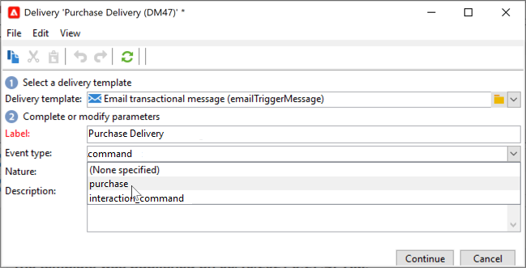

# Introdução a mensagens transacionais{#send-transactional-messages}

O envio de mensagens transacionais (Centro de mensagens) é um módulo do Campaign criado para gerenciar mensagens por disparo. Essas mensagens são geradas por eventos disparados dos sistemas de informações e podem ser: fatura, confirmação de pedidos, confirmação de remessa, alteração de senha, notificação de indisponibilidade de produto, extrato de conta ou criação de conta de site, por exemplo.

  Como um usuário do Managed Cloud Services, [Adobe de contato](../start/campaign-faq.md#support) para instalar e configurar mensagens transacionais do Campaign no seu ambiente.

As mensagens transacionais são usadas para enviar:

* notificações, como confirmações de pedido ou redefinições de senha, por exemplo
* uma resposta individual em tempo real a uma ação do cliente
* conteúdo não promocional

 As configurações de mensagens transacionais são detalhadas em [esta seção](../config/transactional-msg-settings.md).

 Entenda a arquitetura de mensagens transacionais no [esta página](../dev/architecture.md).

>[!CAUTION]
>
>As mensagens transacionais exigem uma licença específica. Verifique o contrato de licença.

## Definir templates de mensagem transacional

Cada evento pode acionar uma mensagem personalizada. Para que isso aconteça, é necessário criar um template de mensagem para corresponder a cada tipo de evento. Os templates contêm as informações necessárias para personalizar a mensagem transacional. Você também pode usar templates para testar a pré-visualização da mensagem e enviar provas usando seed addresses antes de entregar ao target final.

### Criar o modelo

Para criar um template de mensagem, siga as etapas abaixo:

1. Acesse a pasta **[!UICONTROL Message Center >Transactional message templates]** da árvore do Adobe Campaign.
1. Clique com o botão direito do mouse na lista de templates de mensagem transacional e selecione **[!UICONTROL New]** no menu suspenso ou clique no botão **[!UICONTROL New]** acima da lista de templates de mensagem transacional.

   

1. Na janela do delivery, selecione o template do delivery apropriado para o canal que deseja usar.

   

1. Altere seu rótulo se necessário.
1. Selecione o tipo de evento que corresponda à mensagem a ser enviada.

   

   Os tipos de eventos destinados a serem processados pelo Adobe Campaign devem ser criados na instância de controle pelo Adobe.

   >[!NOTE]
   >
   >Um tipo de evento nunca deve estar vinculado a mais de um template.

1. Insira uma natureza e uma descrição, em seguida, clique em **[!UICONTROL Continue]** para criar o corpo da mensagem. Consulte [Criar o conteúdo da mensagem](#create-message-content).

### Criar o conteúdo{#create-message-content}

A definição do conteúdo da mensagem transacional é a mesma para todos os deliveries no Adobe Campaign. Por exemplo, para um delivery de email, você pode criar conteúdo em formato HTML ou texto, adicionar anexos ou personalizar o objeto do delivery. Para obter mais informações, consulte [esta seção](../start/create-message.md).

>[!CAUTION]
>
>As imagens incluídas na mensagem devem ser acessíveis publicamente. O Adobe Campaign não fornece nenhum mecanismo de carregamento de imagem para mensagens transacionais.\
>Ao contrário do JSSP ou webApp, `<%=`não tem nenhum escape padrão.
>
>Você precisa escapar cada dado que vem do evento corretamente. Este escape depende da forma como esse campo é usado. Por exemplo, dentro de uma URL, use encodeURIComponent. Para ser exibido no HTML, você pode usar escapeXMLString.

Após definir o conteúdo da mensagem, você pode integrar as informações do evento no corpo da mensagem e personalizá-lo. As informações do evento são inseridas no corpo do texto graças às tags de personalização.

* Todos os campos de personalização vêm da carga.
* É possível referenciar um ou vários blocos de personalização em uma mensagem transacional. O conteúdo do bloco será adicionado ao conteúdo de delivery durante a publicação para a instância de execução.

Para inserir tags de personalização no corpo de uma mensagem de email, siga as etapas abaixo:

1. No template de mensagem, clique na guia que corresponde ao formato do email (HTML ou texto).
1. Insira o corpo da mensagem.
1. No corpo do texto, insira a tag usando os menus **[!UICONTROL Real time events>Event XML]**.

   

1. Preencha a tag usando a seguinte sintaxe: **element name**.@**attribute name** como mostrado abaixo.

   

### Adicionar seed addresses{#add-seeds}

Um seed address permite exibir uma pré-visualização da mensagem, enviar uma prova e testar a personalização da mensagem antes de enviar a mensagem. Os seed addresses estão vinculados ao delivery e não podem ser usados para outros deliveries.

1. No modelo de mensagem transacional, clique no botão **[!UICONTROL Seed addresses]** e clique no botão **[!UICONTROL Add]** botão.

   

1. Atribua um rótulo a ele para facilitar a seleção posteriormente e insira o seed address (email ou celular dependendo do canal de comunicação).

1. Digite o identificador externo: esse campo opcional permite inserir uma chave de negócios (ID exclusiva, nome + email, etc.) que é comum a todos os aplicativos em seu site, usado para identificar seus perfis. Se esse campo também estiver presente no banco de dados de marketing do Adobe Campaign, você poderá reconciliar um evento com um perfil no banco de dados.

   

1. Inserir dados de teste. Consulte [esta seção](#personalization-data).

   

1. Clique em **[!UICONTROL Ok]** para confirmar a criação do seed address.

1. Repita o processo para criar quantos endereços forem necessários.

   

Depois que os endereços forem criados, você poderá acessar a visualização e personalização.

### Adicionar dados de personalização{#personalization-data}

Você pode adicionar dados no template de mensagem para testar a personalização da mensagem transacional. Isso permitirá gerar uma pré-visualização ou enviar uma prova. Se você instalar o **Capacidade de entrega** , esses dados permitem exibir uma renderização das mensagens para vários clientes de desktop, Web ou dispositivos móveis.

O objetivo desses dados é testar suas mensagens antes do delivery final. Essas mensagens não coincidem com os dados reais para serem processados pelo Centro de Mensagens. Entretanto, a estrutura XML deve ser idêntica à do evento armazenado na instância de execução, conforme mostrado abaixo.

Essas informações permitem personalizar o conteúdo da mensagem usando tags de personalização.

1. No modelo de mensagem, clique na guia **[!UICONTROL Seed addresses]**.
1. No conteúdo do evento, insira as informações de teste no formato XML.

   

### Pré-visualizar mensagem transacional{#transactional-message-preview}

Após criar um ou mais seed addresses e o corpo da mensagem, é possível pré-visualizar a mensagem e verificar sua personalização.

1. No modelo de mensagem, clique no botão **[!UICONTROL Preview]** e selecione **[!UICONTROL A seed address]** na lista suspensa.

   

1. Selecione o seed address criado anteriormente para exibir a mensagem personalizada.

   

### Enviar uma prova

Você pode testar a entrega de mensagens enviando uma prova para um seed address criado anteriormente.

O envio de uma prova envolve o mesmo processo de qualquer delivery.

 Saiba mais sobre provas em [Documentação do Campaign Classic v7](https://experienceleague.adobe.com/docs/campaign-classic/using/sending-messages/key-steps-when-creating-a-delivery/steps-validating-the-delivery.html?lang=pt-BR){target=&quot;_blank&quot;}

No entanto, para enviar uma prova de uma mensagem transacional, você precisa realizar as seguintes operações:

* Criar um ou mais [seed addresses](#add-seeds) com dados de teste de personalização
* Criar o conteúdo da mensagem

Para enviar a prova:

1. Clique no botão **[!UICONTROL Send a proof]** na janela do delivery.
1. Analise o delivery.
1. Corrija qualquer erro e confirme o delivery.

   

1. Verifique se a mensagem foi entregue ao seed address e se seu conteúdo está em conformidade com sua configuração.

   

É possível acessar as provas em cada template através da guia **[!UICONTROL Audit]**.

### Publicar o modelo

Quando o modelo de mensagem criado na instância de controle estiver concluído, você poderá publicá-lo. Esse processo também o publicará em todas as instâncias de execução.

>[!NOTE]
>
>Ao publicar modelos de mensagem transacional, as regras de tipologia são publicadas automaticamente nas instâncias de execução.

A publicação permite criar automaticamente dois modelos de mensagem nas instâncias de execução, o que permitirá enviar mensagens vinculadas a eventos em lote e em tempo real.

>[!CAUTION]
>
>Sempre que fizer alterações em um modelo, publique-o novamente para que essas alterações estejam em vigor durante a entrega da mensagem transacional.

1. Na instância de controle, vá para a pasta **[!UICONTROL Message Center > Transactional message templates]** da árvore.
1. Selecione o template que deseja publicar em suas instâncias de execução.
1. Clique em **[!UICONTROL Publish]**.

   

Quando a publicação estiver concluída, ambos os templates de mensagem que serão aplicados em eventos batch e em tempo real são criados na árvore da instância de produção na pasta **[!UICONTROL Administration > Production > Message Center Execution> Default > Transactional message templates]**.

Depois que um modelo for publicado, se o evento correspondente for acionado, a instância de execução receberá o evento, o vinculará ao modelo transacional e enviará a mensagem transacional correspondente a cada recipient.

>[!NOTE]
>
>Se você substituir um campo existente do template de mensagem transacional, como o endereço do remetente, com um valor vazio, o campo correspondente na instância de execução não será atualizado uma vez que a mensagem transacional seja publicada novamente. Ele ainda conterá o valor anterior.
>
>No entanto, se você adicionar um valor não vazio, o campo correspondente será atualizado como normal após a próxima publicação.

### Cancelar a publicação de um modelo

Depois que um template de mensagem é publicado nas instâncias de execução, você pode desfazer a publicação.

* Na verdade, um modelo publicado ainda poderá ser chamado se o evento correspondente for acionado: se você não estiver mais usando um modelo de mensagem, será recomendável desfazer a publicação. Dessa forma, você pode evitar o envio de uma mensagem transacional indesejada por engano.

   Por exemplo, você publicou um template de mensagem que só usa para campanhas de Natal. Talvez você queira desfazer a publicação depois que o período de Natal acabar e publicá-lo novamente no próximo ano.

* Além disso, não é possível excluir um template de mensagem transacional que tenha o status **[!UICONTROL Published]**. Você deve desfazer a publicação primeiro.

Para desfazer a publicação de um template de mensagem transacional, siga as etapas abaixo.

1. Na instância de controle, navegue até o **[!UICONTROL Message Center > Transactional message templates]** pasta.
1. Selecione o template para desfazer a publicação.
1. Clique em **[!UICONTROL Unpublish]**.
1. Clique em **[!UICONTROL Start]**.

O status do template de mensagem transacional muda de **[!UICONTROL Published]** para **[!UICONTROL Being edited]**.

Depois de desfazer a publicação:

* Ambos os modelos de mensagem (aplicados a eventos de tipo em lote e em tempo real) são excluídos de cada instância de execução.

   Eles não aparecem mais na pasta **[!UICONTROL Administration > Production > Message Center Execution > Default > Transactional message templates]**.

* Quando a publicação de um modelo for desfeita, você poderá excluí-lo da instância de controle.

   Para fazer isso, selecione-o na lista e clique no botão **[!UICONTROL Delete]** na parte superior direita da tela.
