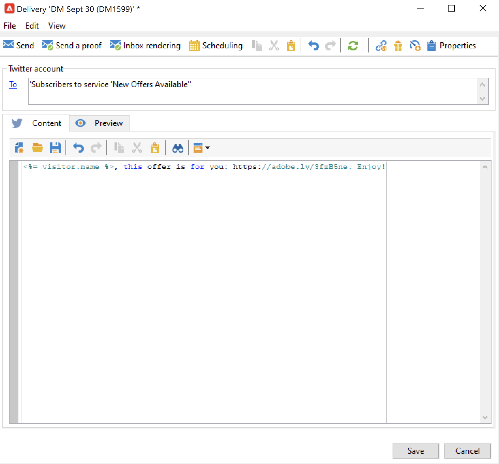

# Postar mensagens no X (Twitter) com o Adobe Campaign {#post-tw-messages}

O Adobe Campaign vem com uma **Marketing social** módulo que permite interagir com seus clientes e clientes potenciais via X (anteriormente conhecido como Twitter).

Após configurar a integração, é possível:

* Enviar mensagens diretas aos seus seguidores
* Publicar em sua conta do X
* Colete novos contatos recuperando os dados do perfil, o que permite realizar campanhas de direcionamento e, quando possível, implementar estratégias entre canais. Esta ação requer o consentimento do usuário.

As etapas de configuração para integrar sua conta X ao Adobe Campaign estão descritas em [esta página](../connect/ac-tw.md).

## Criar e publicar uma publicação no X {#publish-on-tw}

Siga as etapas abaixo para postar uma mensagem em sua conta X:

1. Criar um delivery X

   Crie uma nova entrega com base no template de entrega **[!UICONTROL Tweet (twitter)]**.

   

1. Seleção do público alvo principal

   Selecione as contas para as quais deseja enviar publicações.

   

   1. Clique no link **[!UICONTROL To]**.
   1. Clique no botão **[!UICONTROL Add]**.
   1. Selecione **[!UICONTROL A Twitter account]**.
   1. No **[!UICONTROL Folder]** selecione a pasta de serviço que contém a conta X. Em seguida, selecione a conta X para a qual deseja enviar o tweet.

1. Selecionar o público alvo da prova

   A variável **[!UICONTROL Target of the proofs]** permite definir a conta X a ser usada para deliveries de teste antes do delivery final.

   Conforme detalhado no [etapas de configuração](../connect/ac-tw.md#tw-test-account), você deve criar uma conta X de teste privada dedicada ao envio de provas.

   >[!NOTE]
   >
   >Se estiver usando a mesma conta de teste X para todos os deliveries, você pode salvar o target de prova no **[!UICONTROL Tweet]** template do delivery, acessado pelo **[!UICONTROL Resources > Templates > Delivery templates]** nó. O target de prova será preenchido por padrão para cada nova entrega.

1. Definir o conteúdo da publicação

   Insira o conteúdo da sua publicação no **[!UICONTROL Content]** guia.

   

   >[!CAUTION]
   >
   >Ao fazer uma postagem em X, as limitações se aplicam:
   >
   >* A mensagem não pode exceder 140 caracteres.
   >* Formato HTML não suportado.
   >

1. Visualizar sua publicação

   Navegue pelo **[!UICONTROL Preview]** para verificar a renderização da publicação.

   

   1. Clique na guia **[!UICONTROL Preview]**.
   1. Clique no menu suspenso **[!UICONTROL Test personalization]** e selecione **[!UICONTROL Service]**.
   1. No **[!UICONTROL Folder]** selecione a pasta de serviço que contém a conta X.

1. Enviar uma prova

   Antes de publicar seu tweet, valide-o enviando uma prova de sua publicação: você pode obter uma renderização exata da publicação em uma página de teste X privada.

1. Postar a mensagem

   1. Depois que o conteúdo for aprovado, clique no botão **[!UICONTROL Send]**.
   1. Selecione **[!UICONTROL Deliver as soon as possible]** e clique no botão **[!UICONTROL Analyze]**.
   1. Quando a análise for concluída, verifique o resultado.
   1. Clique em **[!UICONTROL Confirm delivery]** e depois em **[!UICONTROL Yes]**.

## Enviar mensagens diretas aos seguidores {#direct-tw-messages}

A variável **[!UICONTROL Synchronize Twitter accounts]** workflow técnico recupera a lista de seguidores X para que você possa enviar mensagens diretas a eles. [Saiba mais](../connect/ac-tw.md#synchro-tw-accounts)

Para enviar mensagens diretas aos seus seguidores, siga as etapas abaixo:

1. Crie um delivery X com base no **[!UICONTROL Tweet (Direct Message)]** modelo de entrega integrado.

1. Seleção do público alvo principal

   

   1. Selecione o **[!UICONTROL To]** e o link **[!UICONTROL Add]** botão.

   1. Escolha um tipo de direcionamento

      * Selecionar **[!UICONTROL Twitter subscribers]** para enviar uma mensagem direta a todos os seus seguidores.

      * Selecione **[!UICONTROL Filter conditions]** para definir uma consulta e visualizar seu resultado. Saiba como criar um filtro no [nesta seção](../audiences/create-filters.md#advanced-filters).

1. Selecione o público alvo da prova na **[!UICONTROL Target of the proofs]** guia: essa conta receberá a prova da mensagem direta.

   Conforme detalhado no [etapas de configuração](../connect/ac-tw.md#tw-test-account), você deve criar uma conta X de teste privada dedicada ao envio de provas.

   >[!NOTE]
   >
   >Se desejar enviar todas as provas de mensagem direta para a mesma conta X, você pode salvar o target de prova no **[!UICONTROL Tweet (Direct Message)]** template do delivery, acessado pelo **[!UICONTROL Resources > Templates > Delivery templates]** nó.

1. Insira o conteúdo da mensagem nas **[!UICONTROL Content]** guia.

   

   Campos de personalização podem ser usados da mesma forma que para entregas por email, por exemplo, para adicionar o nome do seguidor no corpo da mensagem. Saiba mais [nesta seção](../send/personalize.md).

1. Visualizar sua mensagem

   Navegue pelo **[!UICONTROL Preview]** para verificar a renderização da publicação.

   

   1. Clique na guia **[!UICONTROL Preview]**.
   1. Clique no menu suspenso **[!UICONTROL Test personalization]** e selecione **[!UICONTROL Visitor Subscription]**.
   1. Escolha uma conta X com a qual deseja testar a visualização.

1. Enviar uma prova

   Antes de enviar a mensagem, valide-a enviando [envio de uma prova para uma conta de teste](../send/preview-and-proof.md): você pode obter uma renderização exata da mensagem em uma conta X privada e verificar o conteúdo e a personalização.

1. Enviar a mensagem direta

   1. Depois que o conteúdo for aprovado, clique no botão **[!UICONTROL Send]**.
   1. Selecione **[!UICONTROL Deliver as soon as possible]** e clique no botão **[!UICONTROL Analyze]**.
   1. Quando a análise for concluída, verifique o resultado.
   1. Clique em **[!UICONTROL Confirm delivery]** e depois em **[!UICONTROL Yes]**.

>[!CAUTION]
>
>Não é possível enviar mais de 250 mensagens diretas por dia. Para não exceder esse limite, é possível entregar em ondas. Para obter mais informações, consulte a [documentação do Campaign Classic v7](https://experienceleague.adobe.com/docs/campaign-classic/using/sending-messages/key-steps-when-creating-a-delivery/steps-sending-the-delivery.html#sending-using-multiple-waves){target="_blank"}.

## Acessar dados de rastreamento {#tw-tracking}

No incorporado **[!UICONTROL Tweet]** template do delivery, o rastreamento é ativado por padrão.

Os dados de rastreamento podem ser exibidos nos relatórios do delivery e na **[!UICONTROL Edit > Tracking]** do delivery e do serviço.

A configuração de rastreamento é a mesma de uma entrega de email. Saiba mais na [documentação do Campaign Classic v7](https://experienceleague.adobe.com/docs/campaign-classic/using/sending-messages/monitoring-deliveries/about-delivery-monitoring.html?lang=pt-BR){target="_blank"}.

