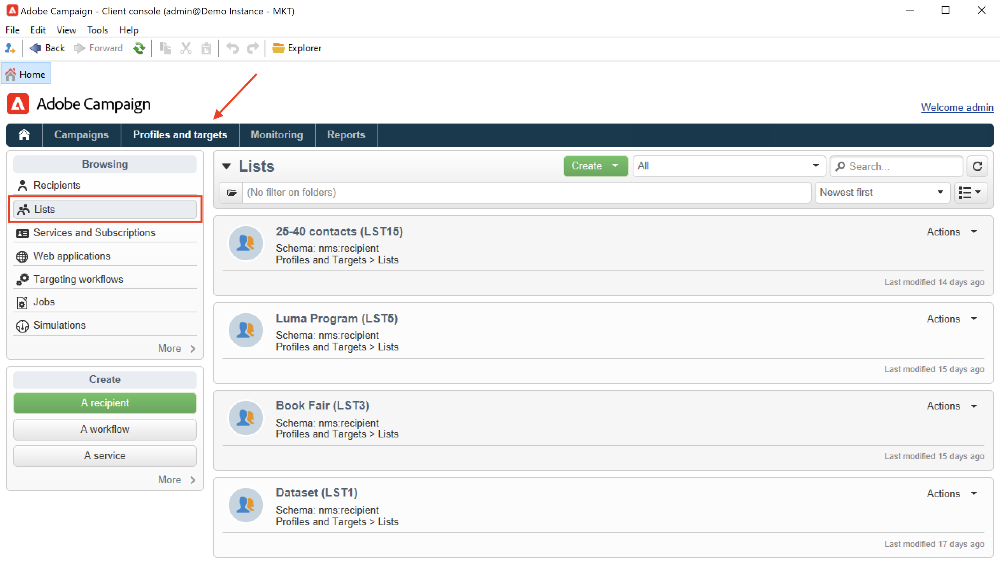

# Interface do usuário do Discover Campaign

## Acessar a interface do usuário do Campaign

O espaço de trabalho do Campaign está disponível por meio do [Console do cliente](../dev/general-architecture.md).

Saiba como instalar e configurar o Console do cliente do Campaign em [esta seção](../start/connect.md).

Você também pode usar um navegador da Web para acessar o Campaign. Nesse contexto, somente um subconjunto de recursos do Campaign está disponível. [Saiba mais](#web-browser)

## Procurar a interface do usuário

Depois de se conectar ao Campaign, você acessa a página inicial. Navegue pelos links para acessar os recursos. O conjunto de recursos disponíveis na interface do usuário depende de suas opções e permissões.

Na seção central da página inicial, use links para acessar os materiais de ajuda do Campaign, a comunidade e o site de suporte.

Use as guias na seção superior para navegar pelos principais recursos do Campaign:

>[!NOTE]
>
>A lista de recursos principais que você pode acessar depende de suas permissões e da implementação.

Para cada recurso, você pode acessar o conjunto de recursos principais na variável **[!UICONTROL Browsing]** seção. O **[!UICONTROL More]** permite acessar todos os outros componentes.

Por exemplo, ao navegar para a variável **[!UICONTROL Profiles and targets]** , é possível acessar as listas de recipients, os serviços de assinatura, os workflows para construção do target existentes e os atalhos para criar todos esses componentes.

Ao selecionar um elemento na tela, ele é carregado em uma nova guia, para que você possa navegar facilmente pelo conteúdo.

## Criar um elemento {#create-an-element}

Use atalhos no **[!UICONTROL Create]** à esquerda da tela para adicionar novos elementos. Também é possível usar a variável **[!UICONTROL Create]** acima da lista para adicionar novos elementos a ela.

Por exemplo, na página de delivery, use o botão **[!UICONTROL Create]** para criar um novo delivery.

## Usar um navegador da Web {#web-browser}

Você também pode acessar um subconjunto de recursos do Campaign por meio de um navegador da Web.

A interface de acesso da web é semelhante à interface do console. Em um navegador, você pode usar os mesmos recursos de navegação e exibição do console, mas é possível executar apenas um conjunto reduzido de ações em campanhas. Por exemplo, é possível visualizar e cancelar campanhas, mas não modificar campanhas.

 [Saiba mais sobre o acesso à Web do Campaign](../start/connect.md#web-access).

## Acessar o explorador da campanha {#ac-explorer-ui}

Navegue pelo explorador do Campaign para acessar todos os recursos e configurações do Adobe Campaign.

Este espaço de trabalho permite acessar a árvore do Explorer para procurar todos os recursos e opções.

A seção à esquerda mostra a árvore do explorador do Campaign e permite navegar em todos os componentes e configurações da sua instância, com base em suas permissões.

A seção superior mostra a lista de registros na pasta atual. Essas listas são totalmente personalizáveis. [Saiba mais](customize-ui.md)

A seção inferior mostra os detalhes do registro selecionado.

## Idiomas

A interface do usuário do Campaign v8 está disponível nos seguintes idiomas:

* Inglês (Reino Unido)
* Inglês (EUA)
* Francês
* Alemão
* Japonês

O idioma é selecionado durante o processo de instalação.

>[!CAUTION]
>
>O idioma não pode ser alterado após a criação da instância.

O idioma afeta os formatos de data e hora.

As principais diferenças entre inglês americano e inglês do Reino Unido são:

<table> 
 <thead> 
  <tr> 
   <th> Formatos  </th> 
   <th> Inglês (US)  </th> 
   <th> Inglês (EN)  </th> 
  </tr> 
 </thead> 
 <tbody> 
  <tr> 
   <td> Data  </td> 
   <td> A semana começa no domingo  </td> 
   <td> A semana começa na segunda-feira  </td> 
  </tr> 
  <tr> 
   <td> Data abreviada  </td> 
   <td> 
%2M/%2D/%4Y

<strong>ex: 09/25/2018</strong>
 </td> 
   <td> 
%2D/%2M/%4Y

<strong>ex: 25/09/2018</strong>
 </td> 
  </tr> 
  <tr> 
   <td> Data abreviada com hora  </td> 
   <td> 
%2M/%2D/%4Y %I:%2N:%2S %P

<strong>ex: 25/09/2018 22:47:25</strong>
 </td> 
   <td> 
%2D/%2M/%4Y %2H:%2N:%2S

<strong>ex: 25/09/2018 22:47:25</strong>
 </td> 
  </tr> 
 </tbody> 
</table>
