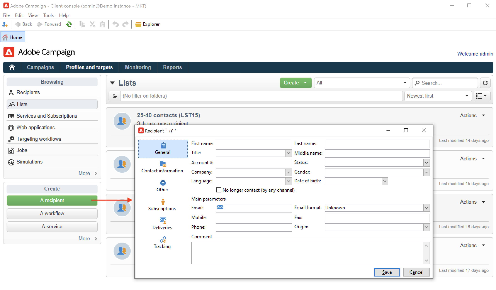

# Conheça a interface {#ui-client-console}

Você pode acessar o Adobe Campaign por meio do console do cliente ou da interface da web. Você também pode usar APIs para gerenciar dados e executar tarefas na plataforma do Campaign.

* **Console do cliente**: o Console do cliente do Campaign é um aplicativo nativo que se comunica com o servidor de aplicativos do Adobe Campaign por meio de protocolos padrão de Internet, como SOAP e HTTP. O Console do cliente do Campaign centraliza todos os recursos e configurações e requer largura de banda mínima, pois depende de um cache local. Projetado para fácil implantação, o Console do cliente do Campaign pode ser implantado a partir de um navegador da Internet, atualizado automaticamente e não requer nenhuma configuração de rede específica, pois gera apenas tráfego HTTP(S). [Saiba mais](#ui-access)

  Aprenda como instalar e configurar o Console do cliente do Campaign [nesta seção](../start/connect.md).

* **Acesso à web**: os recursos de acesso ao Adobe Campaign Web permitem acessar um subconjunto de recursos do Campaign com um navegador da web, por meio de uma interface em HTML. Use essa interface da web para acessar relatórios, controlar e validar mensagens, acessar painéis de monitoramento e muito mais.  Saiba mais sobre o acesso ao Campaign Web [nesta seção](../start/connect.md#web-access).

* **APIs**: para atender a mais casos de uso, o sistema pode ser chamado a partir de aplicativos externos usando as APIs de serviços web expostas por meio do protocolo SOAP. Saiba mais sobre APIs do Campaign [nesta página](../dev/api.md).

* **Interface da web**: como usuário do Campaign v8, a partir da versão v8.6.1, agora você terá acesso a um ambiente da web, disponível por meio da interface central da Adobe Experience Cloud. Em seguida, você pode se conectar ao Adobe Campaign por meio de um navegador da web. Essa nova interface permite criar, gerenciar e executar as principais ações de marketing. No entanto, nem todos os recursos do Campaign estão disponíveis. [Saiba mais](#ac-web-ui).

  >[!AVAILABILITY]
  >
  >A interface da Web do Campaign só está disponível para usuários do Campaign v8 que se conectam ao Campaign com sua Adobe ID. Saiba mais sobre o [Sistema de gerenciamento de identidades (IMS) da Adobe](https://helpx.adobe.com/br/enterprise/using/identity.html){target="_blank"}.
  >

>[!CAUTION]
>
>Esta documentação se concentra no uso do Console do cliente do Campaign. Como usuário do Campaign v8, se estiver usando a interface da Web do Campaign, consulte [esta documentação](https://experienceleague.adobe.com/docs/campaign-web/v8/campaign-web-home.html?lang=pt-BR){target="_blank"}.

## Trabalhar com o console do cliente {#ui-access}

O Console do cliente do Campaign é um aplicativo nativo que se comunica com o servidor de aplicativos do Adobe Campaign por meio de protocolos padrão de Internet, como SOAP e HTTP. O Console do cliente do Campaign centraliza todos os recursos e configurações e requer largura de banda mínima, pois depende de um cache local. Projetado para fácil implantação, o Console do cliente do Campaign pode ser implantado a partir de um navegador da Internet, atualizado automaticamente e não requer nenhuma configuração de rede específica, pois gera apenas tráfego HTTP(S).  [Saiba mais sobre o Console do cliente do Campaign](../start/connect.md).

>[!BEGINTABS]

>[!TAB Campaign v8]

Depois de se conectar ao Campaign, você acessa a página inicial do Adobe Campaign. No Campaign v8, use os cartões centrais para navegar na nova interface da Web do Campaign e o Painel de controle do Campaign.

>[!NOTE]
>
>Se o cartão da interface do usuário da Web não for exibido, verifique se os campos a seguir não estão vazios na sua conta externa do A[Adobe Experience Cloud](../config/external-accounts.md): **Servidor**, **Locatário**, **Servidor de retorno de chamada** e **Marca de associação**.

Você também pode acessar o [Painel de Controle do Campaign](../config/self-service.md) na home page.

>[!TAB Campaign Classic v7]

Depois de se conectar ao Campaign, você acessa a página inicial do Adobe Campaign com links e atalhos para acessar recursos, documentação, site de suporte e comunidade do Campaign.

>[!ENDTABS]

Você também pode usar um navegador da web para acessar o Campaign. Nesse contexto, há apenas um subconjunto de recursos do Campaign disponível. [Saiba mais](#web-browser)

### Navegar pela interface {#ui-browse}

Depois de se conectar ao console do cliente do Campaign, navegue pelas guias na seção superior para acessar os recursos da chave do Campaign:

>[!NOTE]
>
>A lista de recursos principais que você pode acessar depende de suas permissões e da sua implementação.

Cada recurso concede acesso a um conjunto de ferramentas essenciais na seção **[!UICONTROL Browsing]**. O link **[!UICONTROL More]** permite acessar todos os outros componentes.

Por exemplo, ao navegar até a guia **[!UICONTROL Profiles and targets]**, é possível acessar listas de destinatários, serviços de assinatura, fluxos de trabalho de direcionamento existentes e atalhos para criar todos esses componentes.

Ao selecionar um elemento na tela, ele é carregado em uma nova guia para que você possa navegar facilmente pelo conteúdo.

### Criar um elemento {#create-an-element}

Use atalhos na seção **[!UICONTROL Create]** à esquerda da tela para adicionar novos elementos. Você também pode usar o botão **[!UICONTROL Create]** acima da lista para adicionar novos elementos à lista atual.

Por exemplo, na página de entrega, use o botão **[!UICONTROL Create]** para criar uma nova entrega.

<!--
## Use a web browser {#web-browser}

You can also access a subset of Campaign capabilities through the a web browser.

The web access interface is similar to the console interface. From a browser, you can use the same navigation and display features as in the console, but you can perform only a reduced set of actions on campaigns. For example, you can view and cancel campaigns, but you cannot modify campaigns. 

[Learn more about Campaign web access](../start/connect.md#web-access).-->

### Acessar o Explorer do Campaign {#ac-explorer-ui}

Navegue pelo Explorer do Campaign para acessar todos os recursos e configurações do Adobe Campaign.

Este espaço de trabalho permite acessar a árvore do Explorer para navegar por todos os recursos e opções.

* A seção esquerda mostra a árvore do Explorer do Campaign e permite navegar por todos os componentes e configurações da sua instância, com base nas suas permissões. Você pode adicionar e personalizar pastas conforme explicado [nesta página](../audiences/folders-and-views.md).

* A seção superior mostra a lista de registros na pasta atual. Essas listas são totalmente personalizáveis. [Saiba mais](../config/ui-settings.md)

* A seção inferior mostra os detalhes do registro selecionado.

## Interface do Campaign Web {#ac-web-ui}

Como usuário do Campaign v8, a partir da versão v8.6.1, você tem acesso a um ambiente da Web, disponível por meio da interface de usuário central do Adobe Experience Cloud. A Experience Cloud é a família integrada de aplicativos, produtos e serviços de marketing digital da Adobe. Com sua interface intuitiva, você pode acessar rapidamente os aplicativos em nuvem, recursos do produto e serviços. 

>[!AVAILABILITY]
>
>A interface da Web do Campaign só está disponível para usuários do Campaign v8 que se conectam ao Campaign com sua Adobe ID. Saiba mais sobre o [Sistema de gerenciamento de identidades (IMS) da Adobe](https://helpx.adobe.com/br/enterprise/using/identity.html){target="_blank"}.
>

Saiba mais sobre a nova interface do Campaign Web [nesta documentação](https://experienceleague.adobe.com/docs/campaign-web/v8/campaign-web-home.html?lang=pt-BR){target="_blank"}. Você também pode visitar a [página de Perguntas frequentes](https://experienceleague.adobe.com/pt-br/docs/campaign-web/v8/start/faq){target="_blank"} dedicada na documentação da Interface do Campaign Web.

Recursos, configurações e definições adicionais e avançados estão disponíveis somente no console do cliente. Saiba mais sobre os recursos disponíveis em ambas as interfaces [na documentação da interface do Campaign Web](https://experienceleague.adobe.com/docs/campaign-web/v8/start/capability-matrix.html?lang=pt-BR){target="_blank"}.

## Idiomas compatíveis {#languages}

Os idiomas compatíveis dependem da interface.

* Para a interface do console do cliente do Campaign, os idiomas compatíveis são:

   * Inglês (Reino Unido)
   * Inglês (EUA)
   * Francês
   * Alemão
   * Japonês

  >[!CAUTION]
  >
  >O idioma é selecionado durante o processo de instalação e **não pode ser alterado** posteriormente.

* Para conhecer os idiomas compatíveis com a interface do Campaign Web, [consulte esta página](https://experienceleague.adobe.com/docs/campaign-web/v8/start/connect-to-campaign.html?lang=pt-BR#language-pref){target="_blank"}.

## Formatos

O idioma afeta os formatos de data e hora. 

As principais diferenças entre inglês americano e inglês do Reino Unido são:

<table> 
 <thead> 
  <tr> 
   <th> Formatos  </th> 
   <th> Inglês (US)  </th> 
   <th> Inglês (EN)  </th> 
  </tr> 
 </thead> 
 <tbody> 
  <tr> 
   <td> Data  </td> 
   <td> A semana começa no domingo  </td> 
   <td> A semana começa na segunda-feira  </td> 
  </tr> 
  <tr> 
   <td> Data abreviada  </td> 
   <td> 
%2M/%2D/%4Y

<strong>ex: 25/09/2025</strong>
 </td> 
   <td> 
%2D/%2M/%4Y

<strong>ex: 25/09/2025</strong>
 </td> 
  </tr> 
  <tr> 
   <td> Data abreviada com hora  </td> 
   <td> 
%2M/%2D/%4Y %I:%2N:%2S %P

<strong>ex: 25/9/2025 22:47:25</strong>
 </td> 
   <td> 
%2D/%2M/%4Y %2H:%2N:%2S

<strong>ex: 25/09/2025 22:47:25</strong>
 </td> 
  </tr> 
 </tbody> 
</table>

## Unidades padrão {#default-units}

Nos campos que expressam uma duração (por exemplo, período de validade dos recursos de uma entrega, prazo de aprovação para uma tarefa, etc.), o valor pode ser expresso nas seguintes **unidades**:

* **[!UICONTROL s]** para segundos,
* **[!UICONTROL mn]** para minutos,
* **[!UICONTROL h]** para horas,
* **[!UICONTROL d]** para dias.

## Enumeração {#enumeration}

Usando os campos de entrada com uma lista suspensa, você pode inserir um valor de enumeração, que pode ser armazenado e proposto como uma opção na lista.

Por exemplo, no campo **[!UICONTROL City]** da guia **[!UICONTROL General]** de um perfil de destinatário, você pode inserir Londres. Ao pressionar Enter para confirmar esse valor, uma mensagem pergunta se você deseja salvar esse valor para a enumeração associada ao campo.  Se você clicar em **[!UICONTROL Yes]**, esse valor estará disponível na lista suspensa do campo relevante.

As enumerações (também conhecidas como &quot;listas detalhadas&quot;) são gerenciadas pelo administrador através da seção **[!UICONTROL Administration > Platform > Enumerations]**.

Saiba como [Trabalhar com enumerações](../dev/enumerations.md)

Saiba mais sobre [Enumerações em esquemas](../dev/schema-structure.md#enumerations)