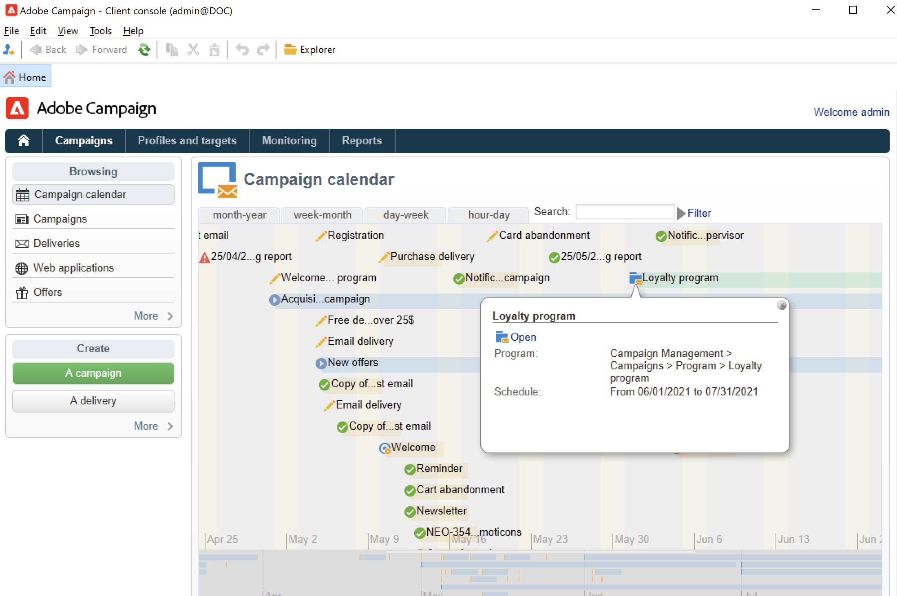

# Introdução a campanhas de marketing{#gs-ac-campaigns}

O Adobe Campaign oferece um conjunto de soluções que ajudam você a personalizar e entregar campanhas em todos os seus canais online e offline. Você pode criar, configurar, executar e analisar campanhas de marketing. Todas as campanhas de marketing podem ser gerenciadas em um centro de controle unificado. Descubra como navegar e criar campanhas de marketing nesta seção.

As campanhas incluem ações (deliveries) e processos (importação ou extração de arquivos), além de recursos (documentos de marketing e delivery outlines). Eles são usados em campanhas de marketing. As campanhas são parte de um programa, e os programas estão incluídos em um plano de campanha.

## Organização de campanha entre canais{#cross-channel-orchestration}

O Adobe Campaign permite criar e organizar campanhas direcionadas e personalizadas em vários canais: email, correspondência direta, SMS e notificação por push. Uma única interface fornece todas as funções necessárias para agendar, organizar, configurar, personalizar, automatizar, executar e medir todas as suas campanhas e comunicações.

### Conceitos principais{#ac-core-concepts}

Antes de começar a implementar campanhas de marketing, você precisa conhecer os seguintes conceitos:

* **Campanha de marketing**: uma campanha centraliza todos os elementos relacionados a uma campanha de marketing: entregas, regras de direcionamento, custos, arquivos de exportação, documentos relacionados etc. Cada campanha é anexada a um programa.

* **Programa**: um programa permite definir ações de marketing para um período de calendário: inicialização, prospecção, fidelização etc. Cada programa contém campanhas vinculadas a um calendário, que fornece uma visualização geral.

* **Plano**: o plano de marketing pode conter vários programas. Ele está vinculado a um período de calendário, tem um orçamento alocado e também pode ser vinculado a documentos e objetivos.

* **Fluxo de trabalho de campanha**: um fluxo de trabalho de campanha contém atividades para criar a lógica da campanha. Use workflows da campanha para definir públicos e criar entregas para todos os canais disponíveis.

* **Campanhas recorrentes**: campanhas recorrentes são criadas a partir de um modelo específico que define o modelo de fluxo de trabalho que será executado e a programação de execução.

* **Campanhas periódicas**: uma campanha periódica é uma campanha criada automaticamente de acordo com a programação de execução de seu modelo.

## Área de trabalho da campanha de marketing{#ac-workspace}

O Adobe Campaign permite criar, configurar, executar e analisar todas as campanhas de marketing de um centro de controle unificado.

 Saiba como acessar e implementar campanhas de marketing na [documentação do Campaign Classic v7](https://experienceleague.adobe.com/docs/campaign-classic/using/orchestrating-campaigns/about-marketing-campaigns/accessing-marketing-campaigns.html?lang=pt-BR#orchestrating-campaigns){target=&quot;_blank&quot;}

## Etapas principais para iniciar{#gs-ac-start}

As principais etapas para criar uma campanha de marketing entre canais são:

1. **Planejar e projetar programas e campanhas de marketing**

   Defina a hierarquia e a programação, defina o orçamento, adicione recursos e selecione operadores.

    Saiba como criar um plano de marketing e configurar campanhas na [documentação do Campaign Classic v7](https://experienceleague.adobe.com/docs/campaign-classic/using/orchestrating-campaigns/orchestrate-campaigns/setting-up-marketing-campaigns.html?lang=pt-BR#orchestrating-campaigns){target=&quot;_blank&quot;}

   Todas as campanhas de marketing se baseiam em um modelo, que armazena as principais configurações e recursos. Um modelo integrado é fornecido para criar uma campanha para a qual nenhuma configuração específica foi definida. Você pode criar e configurar seus modelos de campanha e, em seguida, criar campanhas com base nesses modelos.

    Saiba como trabalhar com modelos de campanha na [documentação do Campaign Classic v7](https://experienceleague.adobe.com/docs/campaign-classic/using/orchestrating-campaigns/orchestrate-campaigns/marketing-campaign-templates.html?lang=pt-BR#orchestrating-campaigns){target=&quot;_blank&quot;}

    Descubra campanhas recorrentes e como configurá-las na [documentação do Campaign Classic v7](https://experienceleague.adobe.com/docs/campaign-classic/using/orchestrating-campaigns/orchestrate-campaigns/setting-up-marketing-campaigns.html?lang=pt-BR#recurring-and-periodic-campaigns){target=&quot;_blank&quot;}

1. **Definir públicos**

   Você pode criar o público em um fluxo de trabalho ou selecionar um grupo existente, como uma lista de recipients, assinantes de um boletim informativo, recipients de uma entrega anterior ou qualquer condição de filtragem.

   

    Saiba como definir o público de suas mensagens na [documentação do Campaign Classic v7](https://experienceleague.adobe.com/docs/campaign-classic/using/orchestrating-campaigns/orchestrate-campaigns/marketing-campaign-target.html?lang=pt-BR#orchestrating-campaigns){target=&quot;_blank&quot;}

1. **Criar entregas**

   Selecione os canais, defina o conteúdo da mensagem e inicie as entregas.

   

    Aprenda a criar e iniciar entregas de campanha de marketing na [documentação do Campaign Classic v7](https://experienceleague.adobe.com/docs/campaign-classic/using/orchestrating-campaigns/orchestrate-campaigns/marketing-campaign-deliveries.html?lang=pt-BR#creating-deliveries){target=&quot;_blank&quot;}

   Você pode associar vários documentos a uma campanha: relatório, foto, página da Web, diagrama etc.

    Saiba mais sobre documentos associados na [documentação do Campaign Classic v7](https://experienceleague.adobe.com/docs/campaign-classic/using/orchestrating-campaigns/orchestrate-campaigns/marketing-campaign-assets.html?lang=pt-BR#adding-documents){target=&quot;_blank&quot;}

1. **Configurar o processo de aprovação**

   O Adobe Campaign permite configurar processos de aprovação colaborativos para as principais etapas da campanha de marketing. Para cada campanha você pode aprovar o target, o conteúdo e os custos da entrega. Os operadores do Adobe Campaign responsáveis pela aprovação podem ser notificados por email, podendo aceitar ou rejeitar a aprovação por meio do console ou por meio de uma conexão com a web.

    Saiba como configurar e gerenciar aprovações na [documentação do Campaign Classic v7](https://experienceleague.adobe.com/docs/campaign-classic/using/orchestrating-campaigns/orchestrate-campaigns/marketing-campaign-approval.html?lang=pt-BR#orchestrating-campaigns){target=&quot;_blank&quot;}

## Complemento de marketing distribuído{#distributed-marketing-add-on}

O Adobe Campaign oferece um complemento de **Marketing distribuído** para a implementação de campanhas cooperativas entre entidades centrais (sede, departamentos de marketing etc.) e entidades locais (lojas, agências regionais etc.). Essa cooperação é baseada em um espaço de trabalho compartilhado, conhecido como **[!UICONTROL List of campaign packages]**, no qual modelos de campanha criados centralmente são oferecidos a entidades locais.

>[!NOTE]
>
>Esse recurso está disponível a partir do Campaign v8.3. Para verificar sua versão, consulte [esta seção](compatibility-matrix.md#how-to-check-your-campaign-version-and-buildversion)

 Saiba como configurar e usar os recursos de marketing distribuído do Campaign na [documentação do Campaign Classic v7](https://experienceleague.adobe.com/docs/campaign-classic/using/distributed-marketing/about-distributed-marketing.html?lang=pt-BR){target=&quot;_blank&quot;}

## Complemento de gerenciamento de resposta{#response-manager-add-on}

O Adobe Campaign oferece um complemento de **Gerenciamento de resposta** que permite medir o sucesso e a lucratividade de campanhas de marketing ou propostas de oferta em canais de comunicação: email, celular, correspondência direta etc.

>[!NOTE]
>
>Esse recurso está disponível a partir do Campaign v8.3. Para verificar sua versão, consulte [esta seção](compatibility-matrix.md#how-to-check-your-campaign-version-and-buildversion)

 Saiba como configurar e usar o Gestor de resposta do Campaign na [documentação do Campaign Classic v7](https://experienceleague.adobe.com/docs/campaign-classic/using/response-manager/about-response-manager.html?lang=pt-BR){target=&quot;_blank&quot;}

