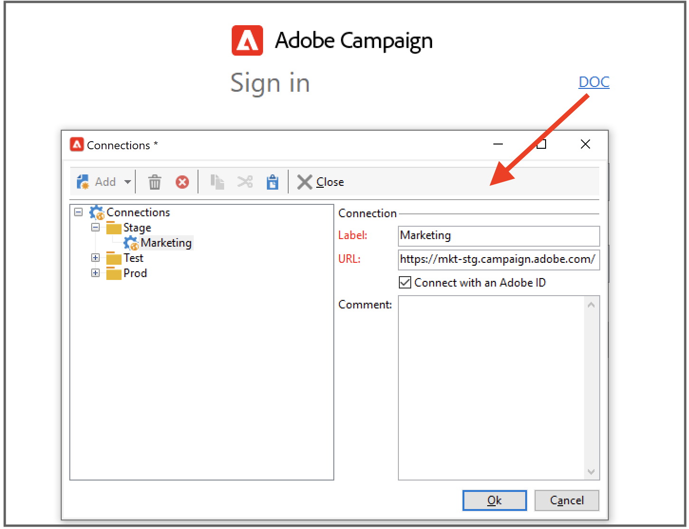

# Conectar-se ao Adobe Campaign v8{#gs-ac-connect}

Para começar a trabalhar com o Campaign, você deve instalar e configurar o Console do cliente.

O console do cliente é um aplicativo nativo que se comunica com o servidor de aplicativos Adobe Campaign, por meio de protocolos padrão de Internet, como SOAP e HTTP. O console do Campaign Client centraliza todos os recursos e configurações, e requer largura de banda mínima, pois depende de um cache local. Projetado para fácil implantação, o console do Campaign Client pode ser implantado a partir de um navegador da Internet, atualizado automaticamente e não requer nenhuma configuração de rede específica, pois gera apenas tráfego HTTP(S).

Antes de começar, é necessário:

* Verifique a compatibilidade do sistema e das ferramentas com o Adobe Campaign no [Matriz de compatibilidade](compatibility-matrix.md)
* Obter o URL do servidor do Campaign
* Crie sua Adobe ID ou obtenha suas credenciais de usuário de sua empresa
* Instale o tempo de execução do Microsoft Edge Webview2 em seu sistema. [Saiba mais](#webview)

## Instale o Console do cliente{#download-ac-console}

### Tempo de execução do Microsoft Edge Webview2 {#webview}

A partir da versão de build do Campaign Classic 8.4, a instalação do tempo de execução do Microsoft Edge Webview 2 é necessária para qualquer instalação do Console do cliente.

O Web View é instalado por padrão como parte do sistema operacional Windows 11. Se ele ainda não estiver presente em seu sistema, o programa de instalação do Console do Cliente do Campaign solicitará que você o baixe de [Site do desenvolvedor do Microsoft](http://www.adobe.com/go/acc-ms-webview2-runtime-download_br){target="_blank"}. Observe que o link de download não funciona no navegador Internet Explorer 11, pois o Microsoft substituiu o suporte. Use um navegador diferente para acessar o link.

### Baixar o Console{#install-ac-console}

Ao usar o Campaign pela primeira vez, é necessário baixar o Console do cliente e instalá-lo.

Duas opções estão disponíveis para baixar o Console do cliente:

1. Como administrador do Campaign, conecte-se ao Adobe [Distribuição de software](https://experience.adobe.com/#/downloads/content/software-distribution/br/campaign.html){target="_blank"}.

1. Como usuário final, o administrador do Campaign implanta o Console do cliente para você e o disponibiliza por meio de um URL dedicado.

Depois que o programa de instalação do Console do cliente for baixado, instale-o no computador local.

Observe que não é possível alterar o idioma do Console do cliente depois que ele for instalado.

## Criar a conexão{#create-your-connection}

Depois que o Console do cliente estiver instalado, siga as etapas abaixo para criar a conexão com o servidor de aplicativos:

1. Inicie o Console e navegue pelo link no canto direito para acessar a tela de configuração da conexão.

1. Clique em **[!UICONTROL Add > Connection]** e insira o rótulo e o URL do servidor de aplicativos do Adobe Campaign.

1. Especifique uma conexão com o servidor de aplicativos do Adobe Campaign por meio de um URL. Use um DNS ou um alias da máquina ou seu endereço IP.

   Por exemplo, você pode usar a variável [`https://<machine>.<domain>.com`](https://myserver.adobe.com) digite URL.

1. Marque a opção **[!UICONTROL Connect with an Adobe ID]**.

1. Clique em **[!UICONTROL Ok]** para salvar suas configurações.

Você pode adicionar quantas conexões forem necessárias para se conectar aos ambientes de teste, estágio e produção, por exemplo.

>[!NOTE]
>
>O **[!UICONTROL Add]** permite criar **[!UICONTROL folders]** para organizar todas as suas conexões. Basta arrastar e soltar cada conexão em uma pasta.

## Faça logon no Adobe Campaign {#logon-to-ac}

Os usuários do Campaign se conectam ao console do Adobe Campaign usando a Adobe ID, por meio do Adobe Identity Management System (IMS). Eles podem usar a mesma ID para todas as soluções do Adobe. A conexão é salva ao usar o Adobe Campaign com outras soluções. Saiba mais sobre o Adobe IMS na [esta página](https://helpx.adobe.com/br/enterprise/using/identity.html){target="_blank"}.

Para fazer logon em uma instância, siga as etapas abaixo:

1. Inicie o Console e navegue pelo link no canto direito para acessar a tela de configuração da conexão.

   

1. Selecione a instância do Campaign na qual você precisa fazer logon.

1. Clique em **[!UICONTROL Ok]**.

Em seguida, você pode fazer logon no Campaign com sua Adobe ID.

>[!NOTE]
>
>Como o Microsoft Edge Webview2 não salva as credenciais de proxy, o Console pode solicitar a autenticação duas vezes na primeira conexão.

## Atualizar seu console do cliente{#upgrade-ac-console}

Quando seu sistema é atualizado para uma versão mais recente, você deve atualizar seu Console do cliente para essa mesma versão. Essa é uma prática recomendada e, para algumas versões, essa atualização é obrigatória. Nesse caso, é mencionado no [Notas de versão](release-notes.md).

Como usuário do Managed Cloud Services, o Adobe implanta o Console do cliente para você. Ao se conectar ao ambiente atualizado, você será solicitado a baixar a versão mais recente do Console do cliente em uma janela pop-up. Você deve aceitar esta atualização e atualizar o Console do Cliente, conforme solicitado.

>[!CAUTION]
>
>O Adobe recomenda deixar a opção **[!UICONTROL No longer ask this question]** não selecionado para garantir que você seja alertado quando uma nova versão do Console estiver disponível. Se essa opção estiver selecionada, o usuário não será informado de que é necessária uma atualização do Console.

## Conceder acesso aos usuários{#grant-access}

O Adobe Campaign permite definir e gerenciar os direitos atribuídos aos diversos operadores.

Como administrador do Campaign, você é responsável por criar os operadores e compartilhar suas credenciais com os usuários.

Saiba mais sobre os usuários e como definir suas permissões em [esta seção](gs-permissions.md).

## Acesso à Web{#web-access}

Certas partes do aplicativo podem ser acessadas por um navegador da Web usando uma interface de usuário do HTML: relatórios, aprovação de delivery, monitoramento de instância e muito mais.

O acesso via Web fornece uma interface semelhante ao console, mas com um conjunto reduzido de funcionalidades.

Por exemplo, para um determinado operador, uma campanha será exibida com as seguintes opções no console:

Considerando o acesso via Web, as opções permitirão principalmente a visualização dos seguintes elementos:

O acesso à Web também é usado para no processo de validação: Os operadores podem clicar no email de solicitação de aprovação e se conectar ao Campaign por meio de seu navegador da Web para validar ou rejeitar um conteúdo ou orçamento de delivery.

Para acessar a instância do Campaign a partir da Web, o URL é:  `https://<your adobe campaign server>:<port number>/view/home`.
